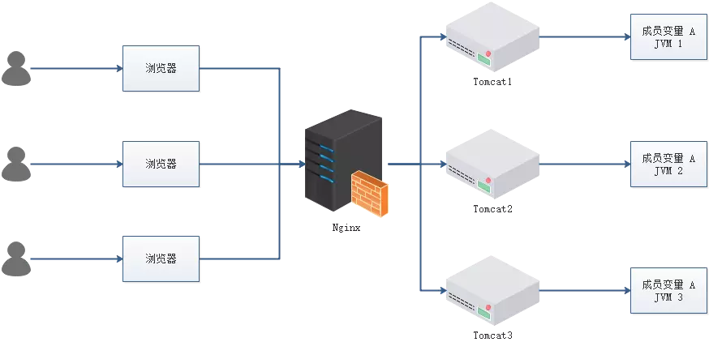
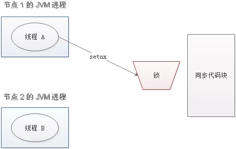
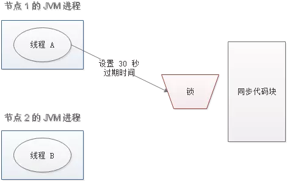

# 分布式锁

### 概述

	为了防止分布式系统中的多个进程之间相互干扰，我们需要一种分布式协调技术来对这些进程进行调度。而这个分布式协调技术的核心就是来实现这个分布式锁。

### 为什么要使用分布式锁



- 成员变量A存在JVM1、JVM2、JVM3三个JVM内存中
- 成员变量A同时都会在JVM分配一块内存，三个请求发过来同时对这个变量操作是不对的
- 不是同时发过来，三个请求分别操作三个不同JVM内存区域，变量A之间不能存在共享，也不具有可见性，处理的结果也是不对的

注：该成员变量A是一个有状态的对象

如果我们业务中确实存在这个场景的话，我们就需要一种方法解决这个问题，这就是分布式锁要解决的问题。

### 分布式锁应该具备哪些条件

- 在分布式系统环境下，一个方法在同一时间只能被一个机器的一个线程执行
- 高可用的获取锁与释放锁
- 高性能的获取锁与释放锁
- 具备可重入特性(可理解为重写进入，由多于一个任务并发使用，而不必担心数据错误)
- 具备锁失效机制，防止死锁
- 具备非阻塞锁特性，即没有获取到锁将直接返回获取锁失败

### 分布式锁的实现有哪些

- 数据库：利用主键唯一的特性，如果有多个请求同时提交到数据库的话，数据库会保证只有一个操作可以成功，那么我们就可以认为操作成功的那个县城获得了该方法的锁，当方法执行完毕之后，想要释放锁的话，删除这条数据库记录即可。
- Memcached：利用Memcached的add命令。此命令是原子性操作，只有在key不存在的情况下，才能add成功。也就意味着线程得到了锁。
- Redis：和Memcached方法类似，利用Redis的setnx命令。此命令同样是原子性操作，只有在key不存在的情况下，才能set成功。
- Zookeeper：利用Zookeeper的顺序临时节点，来实现分布式锁和等待队列。Zookeeper设计的初衷，就是为了实现分布式锁服务的。
- Chubby：Google公司试下你的粗粒度分布式锁服务，底层利用了Paxos一致性算法。

### 通过Redis分布式锁的实现理解基本概念

分布式锁实现的三个核心要素：

##### 加锁

最简单的方法是使用 setnx 命令。key是锁的唯一标识，按业务来决定命令。比如想要给一种商品的秒杀活动加锁，可以给key命令为"lock_sale_商品ID"。而value设置成什么呢？我们可以姑且设置成1.加锁的伪代码如下：

```
setnx(lock_sale_商品ID, 1)
```

当一个线程执行setnx返回1，说明key原本不存在，该线程成功得到了锁；当一个线程执行setnx返回0，说明key已经存在，该线程抢锁失败。

##### 解锁

有加锁就有解锁。当得到锁的线程执行完任务，需要释放锁，以便其他线程可以进入。释放锁的最简单方式是执行del命令，伪代码如下：

```
del(lock_sale_商品ID)
```

释放锁之后，其他线程就可以继续执行setnx命令来获得锁。

##### 锁超时

如果一个得到锁的线程在执行任务的过程中挂掉，来不及显示地释放锁，这块资源将会被永久锁住(死锁)，别的线程再也别想进来。所有，setnx的key必须设置一个超时时间，以保证即使没有被显式释放，这把锁也要在一定时间后自动释放。setnx不支持超时参数，所以需要设置额外指令，伪代码如下：

```
expire(lock_sale_商品ID, 30)
```

综合伪代码如下：

```
if(setnx(lock_sale_商品ID, 1) == 1) {
	expire(lock_sale_商品, 30)
	try {
		do something...
	} finally {
		del(lock_sale_商品ID)
	}
}
```

### 存在什么问题

以上伪代码中存在三个致命问题

##### setnx和expire的非原子性

设想一个极端场景，当某线程执行 setnx，成功得到了锁：



setnx刚执行成功，还未来得及执行expire指令，节点1挂掉了。


这样一来，这把锁就没有设置过期时间，变成死锁，别的线程再也无法获得锁了。
怎么解决呢？setnx指令本身是不支持传入超时时间的，set指令增加了可选参数，伪代码如下：

```
set(lock_sale_商品ID, 1, 30, NX)
```

这样就可以取代 setnx 指令。

##### del导致误删

又是一个极端场景，加入某线程成功得到了锁，并且设置的超时时间是30秒。



