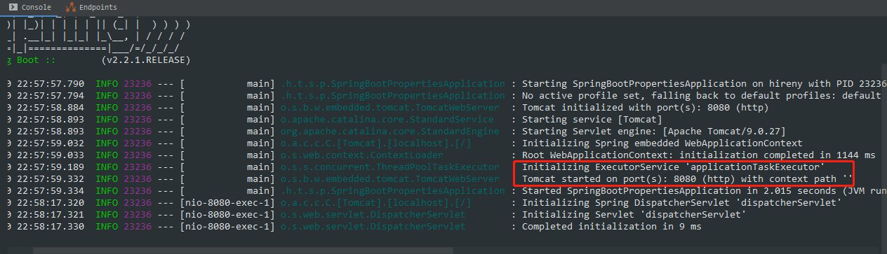
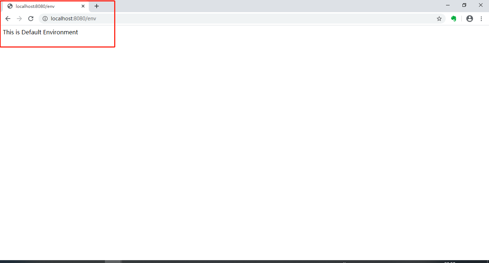
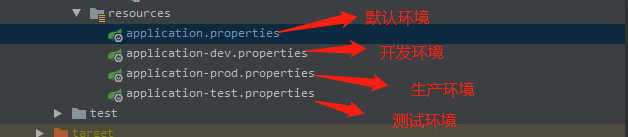
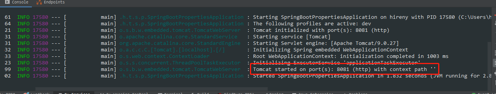
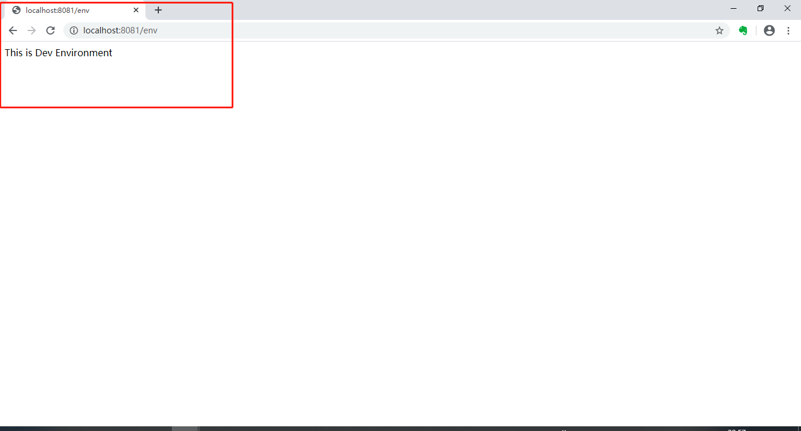
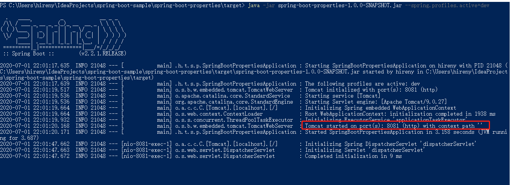
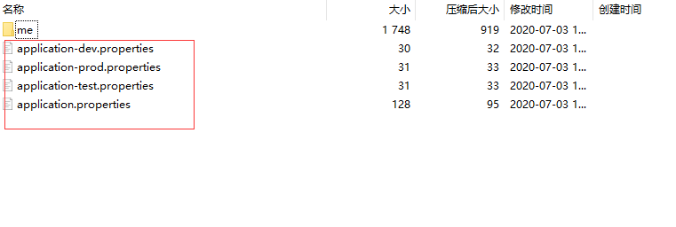
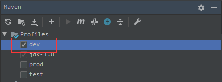

# 前言

一般，在我们创建的 Spring Boot 项目会在 `resources` 目录中创建 `application.properties` 配置文件，我们一般会在该文件中配置一些项目的参数信息。

```properties
server.port=8080
app.name="Default"
```

我们需要在项目中读取上述信息内容：

```java
@RestController
@SpringBootApplication
public class SpringBootPropertiesApplication {
    public static void main(String[] args) {
        SpringApplication.run(SpringBootPropertiesApplication.class, args);
    }
	// @Value()注解用来读取配置文件中对应的的参数
    @Value("${app.name}")
    private String envName;
    @RequestMapping("/env")
    public String env() {
        return "This is " + this.envName + " Environment";
    }
}
```

运行该项目后，我们在控制台中可以看到如下信息：



在如上图中可以看到项目已经启动成功；我们可以在浏览器中访问路径 `http://localhost:8080/env` 看到如下信息，说明我们已经成功获取配置文件中的参数信息。



但是在开发团队中部署多个环境，例如开发环境、生产环境、测试环境等。不同的环境中，配置的参数信息也不同，Spring Boot 提供了以下命名约定来定义多环境的配置文件。

# Spring Boot 配置

接下来，我们会在 `resources` 资源文件夹中创建几个环境配置文件：

- `application-dev.properties`：开发环境
- `application-prod.properties`：生产环境
- `application-test.properties`：测试环境



在每个配置文件中配置不同的服务端口与自定义的参数信息：

`application-dev.properties`的信息如下：

```properties
server.port=8081
app.name=Dev
```

`application-prod.properties`的信息如下：

```properties
server.port=8082
app.name=Prod
```

`application-test.properties`的信息如下：

```properties
server.port=8083
app.name=Test
```

但是在图片中的 `application.properties` 默认环境是干什么的呢？

看一下我们在该文件中配置的信息：

```properties
spring.profiles.active=dev
```

该配置文件中的参数信息是为了决定加载对应环境的配置。上述属性设置为 `dev` 是为了激活 `application-dev.properties` 环境的的配置信息。

确定当前使用的是哪个环境，左边环境的值与 `application-dev.properties` 中 `-` 后面的值对应，这是`spring boot`约定好的。

启动项目：



会发现启动了 `application-dev.properties` 配置下的 8081 端口，因为我们设置了当前的环境是 `dev`，所以 `application-dev.properties` 生效了。

在浏览器中输入http://localhost:8081/env可以看到：



获取到了正确的端口和值，可以依次测试各个环境。

基本的多环境如上述。

如果项目要部署到服务器的话，我们就会将`spring boot` 项目打包，然后使用 `java -jar xxx.jar` 命令来启动。我们可以在该命令后添加 `--spring.profiles.active=dev` 等来控制 `jar` 包运行哪个环境的配置信息，步骤如下：

```shell
mvn clean package
```


在 `target` 目录下我们可以使用 `java` 命令来运行该jar包：

```shell
java -jar spring-boot-properties-1.0.0-SNAPSHOT.jar --spring.profiles.active=dev
```

成功之后：



我们在浏览器上访问路径就可以看到该环境的信息：


如果我们不添加 `--spring.profiles.active=dev`来运行 `jar` 包，它就会运行 `application.properties` 中指定的环境配置来运行项目。

我们可以看一下 `jar` 包中的配置信息：



可以知道为什么我们可以使用 `--spring.profiles.active` 来指定环境的配置信息了。

如果Spring Boot打包后，使用上述运行`jar`包提示没有主清单属性。你就检查一下你的 `pom.xml` 文件中是否缺少Spring Boot的插件：

```xml
<build>
	<plugins>
		<plugin>
			<groupId>org.springframework.boot</groupId>
			<artifactId>spring-boot-maven-plugin</artifactId>
			<executions>
				<execution>
					<goals>
						<goal>repackage</goal>
					</goals>
				</execution>
			</executions>
		</plugin>
	</plugins>
</build>
```

为什么在Spring Boot的插件中要加入 `<goal>`？

这是因为项目不是继承自 `spring-boot-starter-parent`，而是使用 `spring-boot-dependencies` 来替代`parent POM`。从而导致  `spring-boot-maven-plugin` 的配置项丢失，使得打包后的 `jar` 包中的 `MANIFEST.MF` 文件缺少 `Main-Class`。

# Maven配置

在上述的解决方案中，打包后的配置文件全部在`jar`包中，因此，我们可以使用`Maven`提供的`Profile`来指定一些配置来缩减`jar`包中的配置文件数量。

在 `pom.xml` 中配置`Profile`如下：

```xml
<profiles>
	<profile>
		<!--生产环境-->
		<id>prod</id>
		<properties>
			<profiles.active>prod</profiles.active>
		</properties>
	</profile>
	<profile>
		<!--开发环境-->
		<id>dev</id>
		<properties>
			<profiles.active>dev</profiles.active>
		</properties>
		<activation>
			<!--默认-->
			<activeByDefault>true</activeByDefault>
		</activation>
	</profile>
	<profile>
		<!--测试环境-->
		<id>test</id>
		<properties>
			<profiles.active>test</profiles.active>
		</properties>
	</profile>
</profiles>
```

我们在 `pom.xml` 文件中定义了三种配置并且默认选择是 `dev`。

我们还需要定义资源过滤，用于在构建时候将不需要的环境剔除出去：

```xml
<build>
	<resources>
		<resource>
			<!--directory资源文件所在目录-->
			<directory>src/main/resources</directory>
			<!--excludes需要排除的文件列表-->
			<excludes>
				<!--先排除application开头的配置文件-->
				<exclude>application*.properties</exclude>
			</excludes>
		</resource>
		<resource>
			<directory>src/main/resources</directory>
			<!--filtering需要设置为true，这样在include的时候，才会把配置文件中的 @profiles.active@ 这个 maven `变量` 替换成当前环境的对应值-->
			<filtering>true</filtering>
			<!--需要包含的文件列表-->
			<includes>
				<!--引入所需环境的配置文件-->
				<include>application.properties</include>
				
<!--suppress UnresolvedMavenProperty -->				<include>application-${profiles.active}.properties</include>
			</includes>
		</resource>
	</resources>
</build>
```

配置完后，我们可以看到如下信息：



这还没完，我们还需要在 `application.properties` 文件中加入下面这行：

```properties
spring.profiles.active = @profile.active@	# 此处由 Maven 中 Profile 来指定。
```

这样，指定配置文件就可以交给Maven。

我们就可以在使用Maven命令来构建环境不同的`Jar`包。

```shell
mvn clean package -P ${profile}
```

`profile` 名字可以使用环境替换。例如：`dev/prod/test`。

# 总结

如上所述， `profile` 可以使我们根据不同的环境来进行配置不同的文件与`Jar`包来满足我们的需求。