# 互联网

`Internet`中文译名有两种：

1. **因特网**，全国科学技术名词审定委员会推荐的译名。
2. **互联网**，目前流行最广、事实上的标准译名。

互联网具有两个重要基本特点：

1. **连通性(connectivity)**，互联网使上网用户之间，无视距离地交换各种信息，好像这些用户终端都彼此直接连通一样。
2. **资源共享**，信息共享、软件共享，也可以硬件共享。

**网络**由若干**结点(node)**和连接结点的**链路(link)**组成。结点可以是计算机、集线器、交换机或路由器等。

网络把许多主机连接在一起，而互联网则把许多网络通过路由器连接在一起。这样构成更大的网络称为**互联网(internetwork或internet)**，因此互联网是**"网络的网络"(network of networks)**。

**主机/端系统**——与网络相连的设备常称为**主机(host)**或**端系统(end system)**。

## 三个阶段

1. 从单个网络ARPANET向互联网发展的过程。
2. 建成三级结构的互联网，分为主干网，地区网和校园网（或企业网）。
3. 逐渐形成多层级ISP结构的互联网。

> internet泛指由多个计算机网络互连而成的计算机网络。  
> Internet则是专用名词，指当前全球最大的、开放的、由众多网络相互连接而成的特定互联网，采用TCP/IP协议族作为通信规则，其前身是美国的ARPANET。
> 

## ISP

**因特网服务提供商(Internet Service Provider, ISP)**——提供互联网接入服务的公司，中国电信、中国联通和中国移动等公司都是ISP。

ISP可以从互联网管理机构申请很多IP地址，同时拥有通信线路以及路由器等连网设备，机构或个人向ISP交纳费用，从ISP获取IP地址使用权，并可通过该ISP接入到互联网。

IPS根据服务的覆盖面积大小以及所拥有的IP地址数目的不同分为不同层次：主干ISP、地区ISP和本地ISP。

- 主干ISP，有几个专门公司创建和维持，服务面积最大，并拥有高速主干网（例如10Gbit/s或更高）。
- 地区ISP，比较小。地区ISP通过一个或多个主干ISP连接起来。
- 本地ISP给用户提供直接服务（也称为端用户）。本地ISP可连接到地区ISP，也可连接到主干ISP。

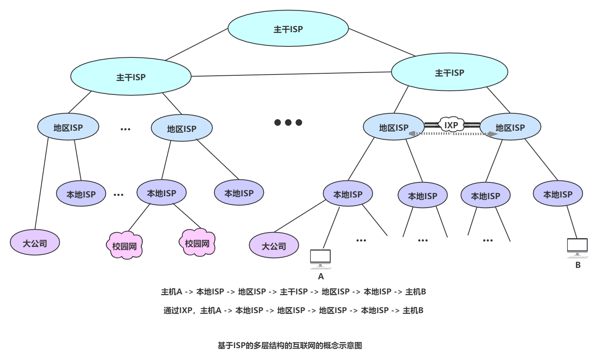

互联网数据流量急剧增长，使得相互连接的ISP完成所有分组转发任务相对较慢。因此，**互联网交换点IXP（Internet eXchange Point）**就是研究快速转发分组，有效利用资源的产物。

IXP主要作用是允许两个网络直连并交换分组，不需要通过第三个网络来转发分组。

典型的IXP由一个或多个网络交换机组成，许多ISP再连接到这些网络交换机的相关端口上。IXP常采用工作在数据链路层的网络交换机，这些网络交换机都用局域网互连。

# 互联网组成

从组成部分上看，完整的网络主要由硬件、软件、协议三部分组成，缺一不可。硬件主要有主机(或端系统)、通信链路、交换设备(如双绞线、光纤)和通信处理机(如网卡)等组成。软件包括各种事先资源共享的软件、方便用户使用的各种工具软件，如操作系统、邮件收发程序、FTP程序、聊天程序等。软件部分多属于应用层、协议是计算机网络的核心，如同交通规则制约汽车驾驶一样；协议规定了网络传输数据时所遵循的规范。

从工作方式上看，划分两块：

1. **边缘部分** 由所有连接在互联网上的主机组成。这部分是用户直接使用的，用来进行通信（传送数据、音频或视频）和资源共享。
2. **核心部分** 有大量网络和连接这些网络的路由器组成。这部分是为边缘部分提供服务的（提供连通性和交换）。

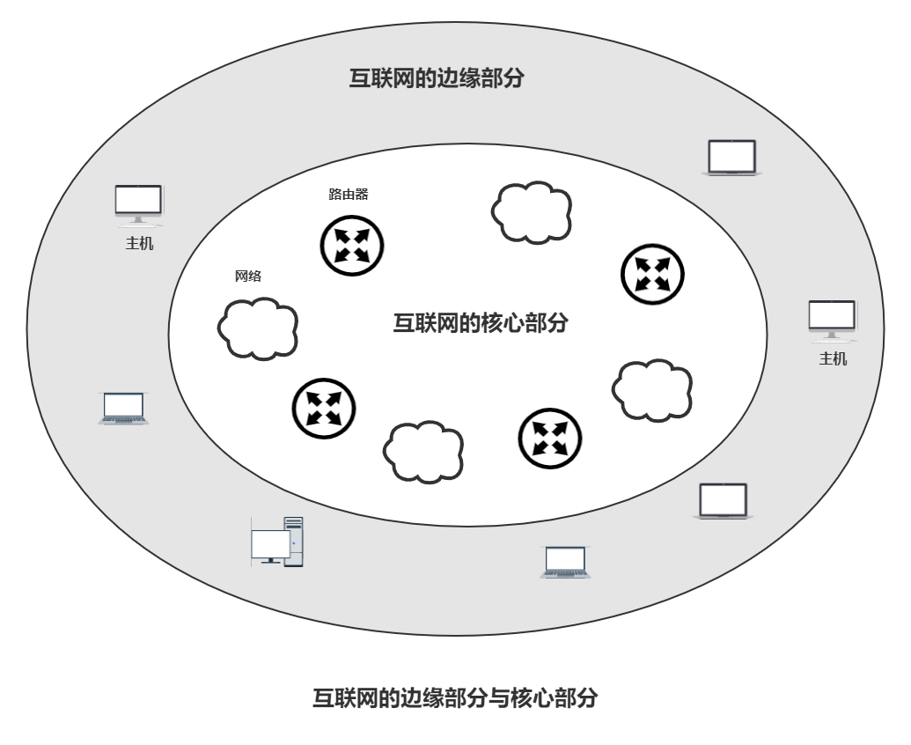

## 网络边缘

处在互联网边缘的部分就是连接在互联网上的所有**主机/端系统**。边缘部分利用核心部分所提供的服务，使众多主机之间能够互相通信并交换或共享信息。

主机进一步划分为两类：客户(client)和服务器(server)。

### 主机之间的通信

**"主机A的某个进程和主机B上的另一个进程进行通信"，统称为"计算机之间通信"。**

#### 客户-服务器方式

客户(client)和服务器(server)指通信中涉及的两个应用进程。该方式描述的是进程之间服务和被服务的关系。主要特征是：

**客户是服务请求方，服务器是服务提供方。**

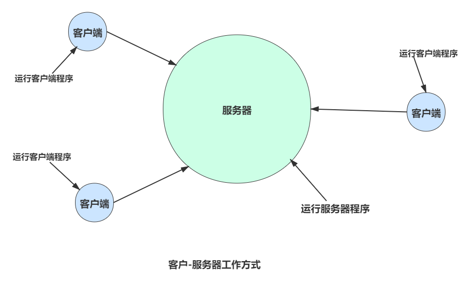

#### 对等连接方式

对等连接(peer-to-peer，简写P2P)是指两台主机在通信时并不区分哪一个是服务请求方哪一个是服务提供方。只要两台主机都运行了对等连接软件，它们就可以进行平等的、对等连接通信。这种工作方式也称为P2P方式。

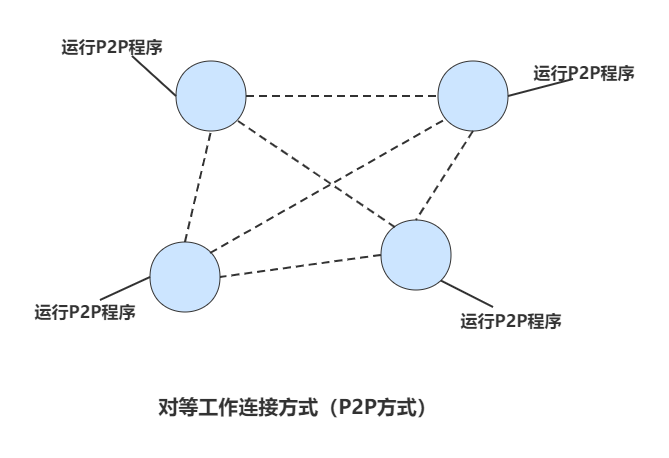

## 网络核心

网络核心，即由互联网端系统的分组交换机和链路构成的网状网络。

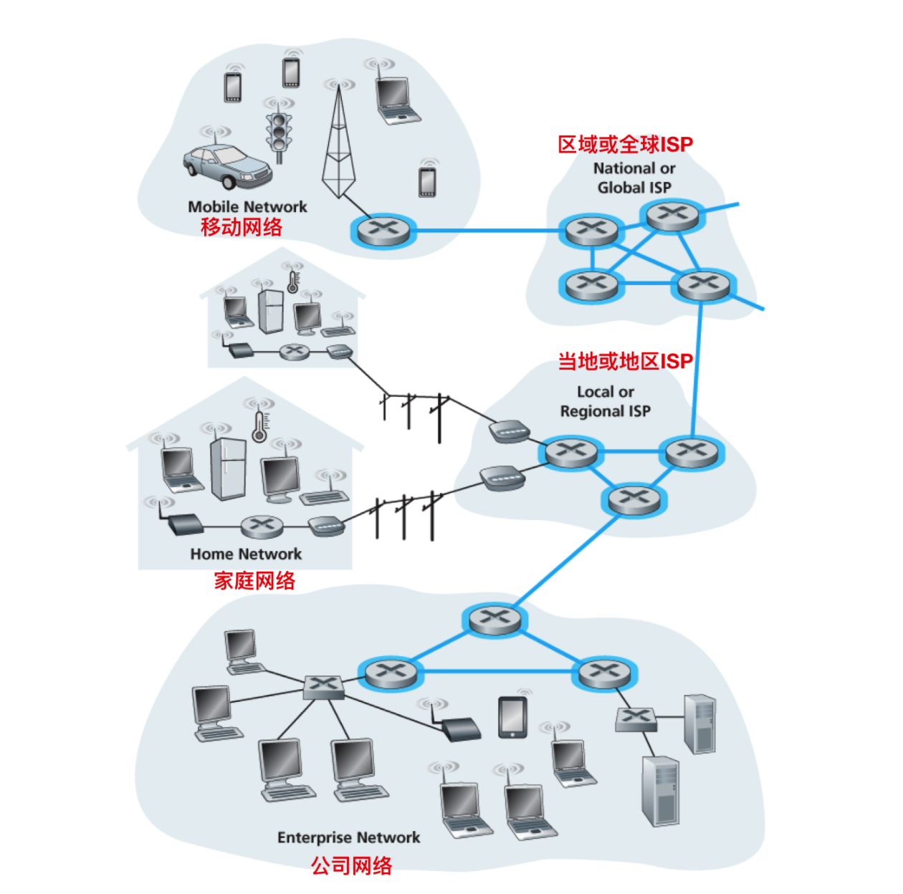

网络边缘中的主机是为用户进行信息处理的，核心网络中的**路由器(router)**是用来转发分组，即进行**分组交换(packet switching)**。

交换技术是指主机之间、通信设备之间或主机与通信设备之间为交换信息所采用的数据格式和交换装置的方式。按交换技术可分为：电路交换、报文交换和分组交换。

### 电路交换

**交换(switching)**，就是按照某种方式动态地分配传输线路的资源。

**电路交换**是在源结点和目的结点之间建立一条专用的通路用于传送数据，包括建立连接、传输数据和断开连接三个阶段。最典型的电路交换网是传统电话网络。

电路交换的优点是数据直连、延迟小。缺点是线路传输效率低，不到10%甚至1%，不能充分利用线路容量、不便于进行差错控制。

### 报文交换

**报文(message)**，要发送的整块数据称为报文。

**存储-转发**，将途径的数据流按传输单元（可以是报文或报文分组）接收并存储下来（同检验该数据单元的效验和），一个数据单元接收完后根据相关路由算法选择一条合适的路由路径将数据转发出去，在逻辑（不是物理线路）上为数据流提供传输通道。

**报文交换**，就是将用户数据加源地址、目的地址、校验码等辅助信息封装成报文。以报文为单位，使用存储-转发方式将报文传输到终点。

报文交换的优点：

1. 充分利用线路容量。
2. 可以实现不同链路之间不同数据率的转换。
3. 可以实现格式转换。
4. 可以实现一对多、多对一的访问。
5. 可以实现差错控制。

报文交换的缺点：

1. 增加资源开销，例如为辅助信息导致处理时间和存储资源的开销。
2. 增加缓冲延迟。
3. 额外的控制机制来保证多个报文的顺序不会乱序。
4. 缓冲区难以管理，因为报文大小不确定。
5. 接收方在接收到报文之前不能预知报文大小。

### 分组交换

**分组(packet)**，将报文分成较短的等长数据块，并在数据块中加入首部（header，又称包）。首部包含源地址和目的地址等控制信息。

**主机(host)**，为用户进行信息处理，并可与其他主机通过网络交换信息。

**路由器(router)**，用来转发分组，即进行分组交换。

**分组交换**，就是将分组独立地选择传输路径，以**存储-转发**方式将分组传输到终点。

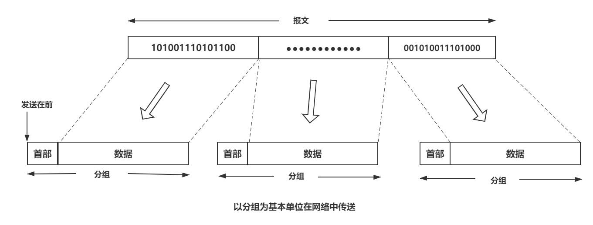

分组交换自身具有的优点：

1. 高效：在分组传输过程中，动态分配传输带宽，对通信链路逐段占用。
2. 灵活：为每一个分组独立地选择最适合的转发路由。
3. 迅速：以分组作为传送单位，可以不先建立连接就能向其它主机发送分组。
4. 可靠：保证可靠性的网络协议；分布式多路由的分组交换网，使网络由很好的生存性。

分组交换的缺点：

1. 时延：分组在各路由器存储转发时需要排队，会造成一定的时延。
2. 实时：分组交换不像电路交换通过建立连接保证通信时所需的各种资源，无法保证通信时端到端所需的带宽。
3. 开销：各分组必须携带控制信息造成一定的开销(overhead)。
4. 管控：分组交换网需要专门的管理和控制机制。

### 交换方式的对比

三种交换方式在数据传送阶段主要特点：

- **电路交换**，整个报文的比特流连续地从源点直达终点，好像在一个管道中传送。
- **报文交换**，整个报文先传送到相邻结点，全部存储下来后查找转发表，转发到下一个结点。
- **分组交换**，单个分组（这只是整个报文的一部分）传送到相邻结点，存储下来后查找转发表，转发到下一个结点。

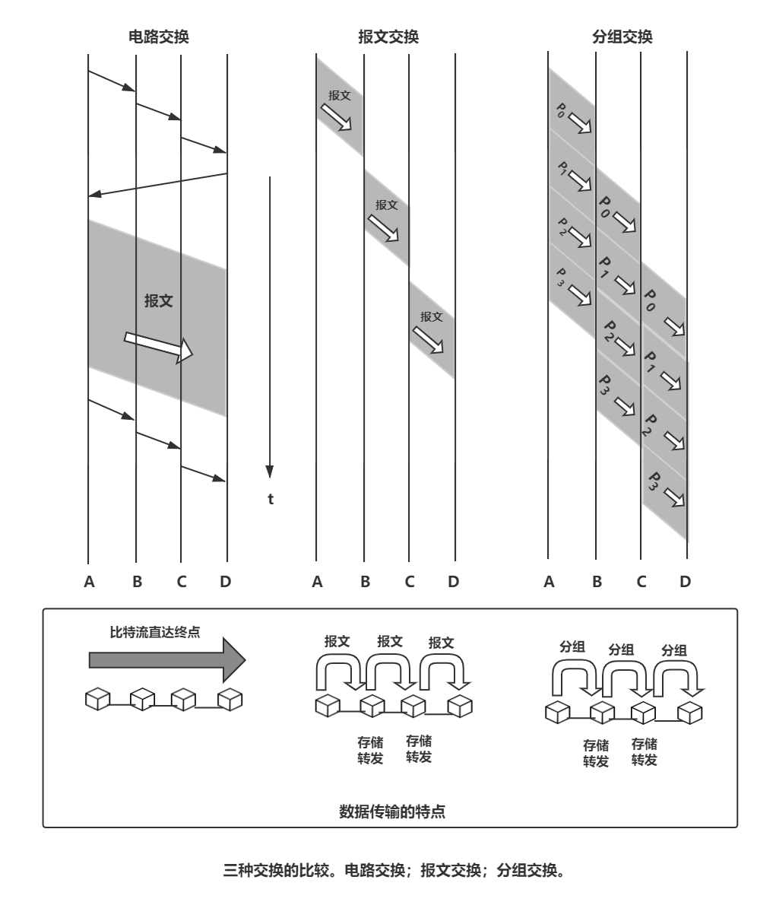

连续传送大量的数据，且其传送时间远大于连续建立时间，则电路交换的传输速率较快。报文交换和分组交换不需要预先分配传输带宽，在传送突发数据时刻提高整个网络的信道利用率。由于一个分组的长度往往远小于整个报文的长度，因此分组交换比报文交换的时延小，同时也具有更好的灵活性。

# 网络类别

计算机网络有多种类别，按下面几种进行分类。

## 按作用范围分类

1. **广域网WAN**(Wide Area Network)——其任务是通过长距离，运送主机所发送的数据，作用范围为几十到几千公里，有时也称远程网，是互联网的核心部分。连接广域网各结点交换机的链路一般都是高速链路，具有较大的通信容量。
2. **城域网MAN**(Metropolitan Area Network)——城域网作用范围一般可跨越几个街区甚至整个城市，其作用距离约为5~50km。可为一个或几个单位所拥有，也可以是公共设施，可将多个局域网互连。目前城域网采用以太网技术，有时也常并入局域网的范围进行讨论。
3. **局域网LAN**(Local Area Network)——局域网一般用微型计算机或工作站通过高速通信线路相连，作用范围小，一千米左右。对计算机配置的数量上没有限制，几台到几百台都可以。校园和企业的多个局域网互连可称为校园网或企业网。
4. **个人区域网PAN**(Personal Area Network)——个人区域网是在个人工作的地方把属于个人使用的电子设备（如平板、智能手机等）用无线技术连接起来的网络，因此也常称为无线个人区域网WPAN(Wireless PAN)，作用范围小，大约十米作用。

>若中央处理机之间的距离非常近（如仅1m的数量级或甚至更小些），则一般就称之为多处理机系统而不称它为计算机网络。
>

## 按使用者分类

1. **公共网(public network)**——指电信公司出资建造的大型网络。“公用”的意思就是所有愿意按电信公司的规定交纳费用的人都可以使用这种网络。因此公用网也称为公众网。
2. **专用网(private network)**——这是某个部门为满足本单位的特殊业务工作的需要而建造的网络。这种网络不向本单位以外的人提供服务。例如，军队、铁路、银行、电力等系统均有本系统的专用网。

## 接入网

**接入网AN(Access Network)** 又称本地接入网或居民接入网，是从某个用户端系统到互联网中第一个路由器（也称边缘路由器）之间的一种网络。本身不属于核心部分，也不属于边缘部分。

覆盖范围看，接入网很多属于局域网；作用上看，只起到让用户与互联网连接的"桥梁"作用。

# 性能指标

七个常用的性能指标从不同方面度量网络的性能。

## 速率

速率(Speed)是数据的传输速率，也称数据率(data rate)或比特率(bit rate)。单位是bit/s(比特每秒，也可写成b/s、bps)。网络速率不是网络实际运行的速率，而是额定速率/标称速率。

**bit(比特)** 来源于binary digit，是一个"二进制数字"。它的量级关系为 $K(Kilo) = 10^3 = 千$，$M(Mega) = 10^6 = 兆$，$G(Giga) = 10^9 = 吉$，$T(Tera) = 10^{12} = 太$，$P(Peta) = 10^{15} = 拍$，$E(Exa) = 10^{18} = 艾$，$Z(Zetta) = 10^{21} = 泽$，$Y(Yotta) = 10^{24} = 尧$。

## 带宽

带宽有两种定义：

1. 本意指信号具有的频带宽度。信号带宽指信号包含的频率占据的频率范围。单位赫兹(Hz)。
2. 网络中通道传送数据的能力，单位时间内信道能通过的"最高数据率"。单位是bit/s。

前者频域称谓，后者时域称谓，本质相同。带宽越宽，"最高数据率"越高。

## 吞吐量

**吞吐量(throughput)** 表示在单位时间内通过某个网络(或信道、接口)的实际数据量，也称瞬时吞吐量。受带宽/额定速率限制。吞吐量用于对网络的测量，知道通过网络的实际数据量。单位为 bit/s(或byte/s、帧每秒)。平均吞吐量为主机接收`F`比特大小的文件用去`T`秒的平均值，即$F/T bps$。

## 时延

**时延(delay)**，指数据（报文、分组或比特）从网络（或链路）的一段传送到另一端所需时间。也称延迟或迟延。

它由发送时延、传播时延、处理时延和排队时延四个部分组成，而总时延是四个时延之和。计算公式：

$$
总时延 = 发送时延 + 传播时延 + 处理时延 + 排队时延
$$

一般小时延网络优于大时延网络。

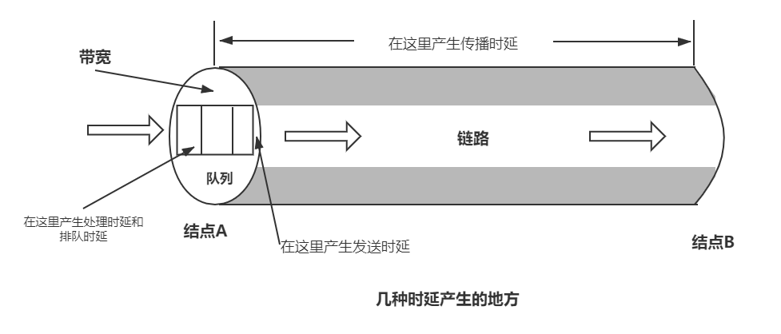

上图可看出几种时延产生的地方，下面详细介绍一下四种时延。

### 发送时延

**发送时延(transmission delay)**是主机/路由器发送数据帧所需要的时间，也称**传输时延**。计算公式是：

$$
发送时延 = \frac{数据帧长度（单位：bit）}{发送速率（单位：bit/s）}
$$

与数据帧长度成正比，与发送速率成反比。

发生在机器内部的发送器中（一般为网络适配器中），与传输信道的长度（或信号传送的距离）没有关系。

### 传播时延

**传播时延(propagation delay)** 是电磁波在信道中传播一定的距离需要花费的时间。计算公式是：
$$
传播时延 = \frac{信道长度（单位：m）}{电磁波在信道上的传播速率（单位：m/s）}
$$

在自由空间的传播速率是$3.0×10^5km/s$，铜线电缆中约为$2.3×10^5km/s$，光纤中约为$2.0×10^5km/s$。

发生在机器外部的传输信道媒体上，与信号发送速率无关。信号传送距离越远，传播时延越大。

### 处理时延

**处理时延**，主机或路由器在收到分组时要花费一定的时间进行处理。例如，分析分组的首部、从分组中提取数据部分、进行差错检验或查找适当的路由等。

### 排队时延

**排队时延**，分组在进入路由器后在输入队列中排队等待处理。路由器确定了转发接口后，还要在输出队列中排队等待转发。长度取决于网络当时通信量。排队容量有限，网络通信量大时发生队列溢出，会使分组丢失，相当于排队时延无穷大。

## 时延带宽积

**时延带宽积**又称以比特为单位的链路长度，公式如下：
$$
时延带宽积 = 传播时延 × 带宽
$$

时延带宽积表示管道的体积，表示这样的链路容纳的比特数量。带宽在其中为管道的截面积，传播时延为管道的长度。

## 往返时间

**往返时间(Round-Trip Time, RTT)**，表示从发送端发送数据开始，到发送端收到来自接收端的确认(接收端收到数据后立即发送确认)，总共经历的时延。在互联网中，往返时间还包括各中间结点的处理时延、排队时延以及转发数据时的发送时延。

## 利用率

两种利用率，分为：

1. 信道利用率：某信道有百分之几的时间是被利用的（有数据通过）。
2. 网络利用率：全网络的信道利用率的加权平均值。

时延随着信道利用率增大而增加。网络通信量增大，分组在网络结点处理时需排队，因此时延就会增大。

令 $D_0$ 表示网络空闲的时延，D表示网络当前的时延，适当的假定条件下，利用公式表示D，$D_0$和利用率U三者关系：

$$
D = \frac{D_0}{1-U}
$$

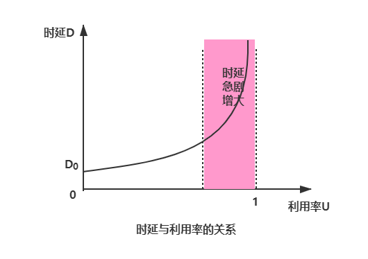

利用率达到容量的1/2时，时延就加倍。因此较大的主干网的ISP信道利用率超过50%时，要准备扩容，增大线路带宽。

# 网络分层结构

计算机网络的各层及其协议的集合就是**网络的体系结构(architecture)**。换言之，计算机网络的体系结构就是这个计算机网络及其构件所应完成的功能的精确定义。总之，体系结构是抽象的，而实现则是具体的，是真正在运行的计算机硬件和软件。

网络的体系结构是可分层的。分层的好处是：

- **各层之间是独立的**。每一层只实现一种相对独立的功能，降低大系统的复杂度。
- **灵活性好**。任何一层发生变化时，只要层次接口关系保持不变，与此有关的上下层均不受影响。
- **结构上可分隔**。各层都可采用最合适的技术来实现。
- **易于实现和维护**。整个系统被分解成若干相对独立的子系统，使得实现和维护非常容易。
- **能促进标准化工作**。每一层功能和服务已有精确说明，促进标准化。

分层太少，每一层协议就会很复杂；分层太多，功能难免会重复，产生额外开销，运行效率会降低。

各层实现的功能可以有以下的一种或多种：

1. **差错控制**。使相应层次对等方的通信更加可靠。
2. **流量控制**。发送端的发送速率必须使接收端来得及接收，不要太快。
3. **分段和重装**。发送端将要发送的数据块划分为更小的单位，在接收端将其还原。
4. **复用和分用**。发送端几个高层会话复用一条底层的连接，在接收端再进行分用。
5. **连接建立和释放**。交换数据前先建立一条逻辑连接，数据传送结束后释放连接。

# 协议、接口、服务的概念

## 实体

**实体(entity)**，指任何可发送或接受信息的硬件或软件进程。通常是一个特定的软件模块。第n层中活动元素通常称为**n层实体**。不同机器上的同一层称为**对等层**，同一层的实体叫**对等实体**。

## 协议

**协议**，是控制两个对等实体（或多个实体）进行通信的规则的集合。要在网络中有条不紊地交换数据，就要遵循一些事先约定好的规则。协议的语法明确规定了交换的信息格式，协议的语义明确规定了发送者与接收者要完成的操作。这些为进行网络中的数据交换而建立的规则、标准或约定称为**网络协议(network protocol)**，简称为**协议**。

由以下三要素组成：

1. 语法，即数据与控制信息的结构或格式。
2. 语义，即需要发出何种控制信息，完成何种动作以及做出何种响应。
3. 同步，即事件实现顺序的详细说明。

一个完整的协议通常应具有线路管理（建立、释放连接）、差错控制、数据转换等功能。

协议通常有两种不同的形式，一种是人能读懂的文字描述，一种是计算机理解的程序代码。

## 服务

**服务**，指下层向上层通过层间接口提供功能调用，在协议的控制下，两个对等实体间的通信使得本层能够向上一层提供服务。但要实现本层协议，还需要使用下一层所提供的的服务。

上层使用下层所提供的服务必须通过与下层交换一些命令，这些命令在OSI中称为**服务源语**。

协议和服务是不一样的。本层协议的实现保证向上一层提供服务。本层服务的实体只能看见服务而无法看见下面的协议，即下面的协议对上层的实体是透明的。

**协议是"水平的"**，**服务是"垂直的"**。

## 接口

**接口**，指同一个结点紧相邻两层间交换信息的连接点。每一层只能为紧邻的层次之间定义接口，不能跨层定义接口。同一系统相邻两层的实体通过 **服务访问点SAP(Service Access Point)** 进行交互。

协议必须把所有不利的条件事先都估计到，不能假定一切都是正常的和非常理想的。必须非常仔细地检查这个协议能否应付各种异常情况。

## 其它

**协议数据单元PDU(Protocol Data Unit)**，是对等层次之间传送的数据单位。包括控制信息，地址信息。OSI模型系统里，每层的PDU都有一个名称，如物理层的PDU指数据位(bit)，数据链路层的PDU指数据帧(frame)，网络层的PDU指数据分组(packet)，传输层的PDU指数据段(segment)。

**协议控制信息PCI(Protocol Control Information)**，是控制协议操作的信息。

**服务数据单元SDU(Service Data Unit)**，是层与层之间交换的数据的单位。。

# 体系结构

为了给网络的设计提供一个结构，网络设计者以分层(layer)的方式组织协议以及这些协议的网络硬件和软件。每一层都向它的上一层提供服务(service)，即所谓的服务模型(service moel)。各层的所有协议被称为协议栈(protocol stack)。

## 五层协议的体系结构

互联网的协议栈由5个层次组成：物理层、数据链路层、网络层、运输层和应用层。综合了OSI和TCP/IP的优点。

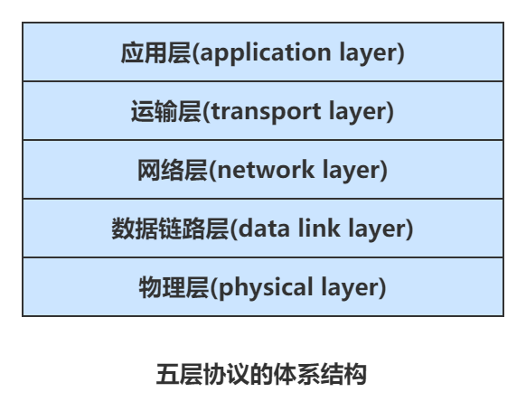

下面采用自顶向下的方式介绍各层主要功能。

### 应用层

**应用层(application layer)**的任务是通过应用进程间的交互来完成特定网络应用。应用层协议定义的是应用进程间通信和交互的规则。进程指主机中正在运行的程序。应用层包括许多协议，如域名解析协议DNS，支持万维网应用的HTTP协议，支持电子邮件的SMTP协议，端系统文件上传协议FTP。把应用层交互的数据单元称为**报文(message)**。

### 运输层

**运输层(transport layer)**的任务就是负责向两台主机中进程之间的通信提供通用的数据传输服务。应用进程利用该服务传送应用层报文。

一台主机可同时运行多个进程，因此运输层有复用和分用的功能。

- **复用**，是多个应用层进程同时使用下面运输层的服务。
- **分用**，是运输层把收到的信息分别交付上面应用层中的相应进程。

主要协议：

- **传输控制协议TCP(Transmission Control Protocol)**。提供面向连接的、可靠的数据传输服务，其数据传输的单位是报文段(segment)。
- **用户数据报协议UDP(User Datagram Protocol)**。提供无连接的、尽最大努力(best-effort)的数据传输服务，没有可靠性，没有流量控制，也没有拥塞控制，其数据传输的单位是用户数据报。

### 网络层

**网络层(network layer)**具有两种任务：

- 为分组交换网上的不同主机提供通信服务。发送数据时，网络层把运输层产生的报文段或用户数据包封装成分组或包进行传送。
- 选择合适的路由，使源主机运输层所传下来的分组，能够通过网络中的路由器找到目的主机。

网络层协议使用无连接的**网际协议IP(Internet Protocol)**，该协议定义了在数据报中的各个字段以及端系统和路由器如何作用于这些字段。仅有一个IP协议，所有具有网络层的互联网组件必须运行IP协议，网络层还包括许多路由选择协议。一般网络层也叫网际层或IP层。

### 数据链路层

**数据链路层(data link layer)**简称**链路层**。两台主机传输分组，网络层必须依靠链路层，这需要专门的链路层协议。在两个相邻结点之间传送数据时，数据链路层将网络层叫下来的IP数据报组装成帧(framing)，在两个相邻结点间的链路上传送帧(frame)。每一帧包括数据和必要的控制信息（如同步信息、地址信息、差错控制等）。

数据链路层协议包括点对点协议(Point-to-Point，简称PPP)、以太网协议(Ethernet)等。

### 物理层

**物理层(physical layer)**的任务是考虑用多大电压代表`"1"`或`"0"`，接收方如何识别出发送方所发送的比特。确定连接电缆的插头有多少根引脚以及各引脚应如何连接。

物理层协议包括数字用户线路(DSL)、综合业务数字网(ISDN)等。

> 注意：传递信息所利用的一些物理媒体，如双绞线、同轴电缆、光缆、无线信道等，并不在物理层协议之内而是在物理层协议的下面。因此可将物理媒体当作第0层。
> 

下图可以比较明显的展示数据在各层之间传递过程所经历的变化。

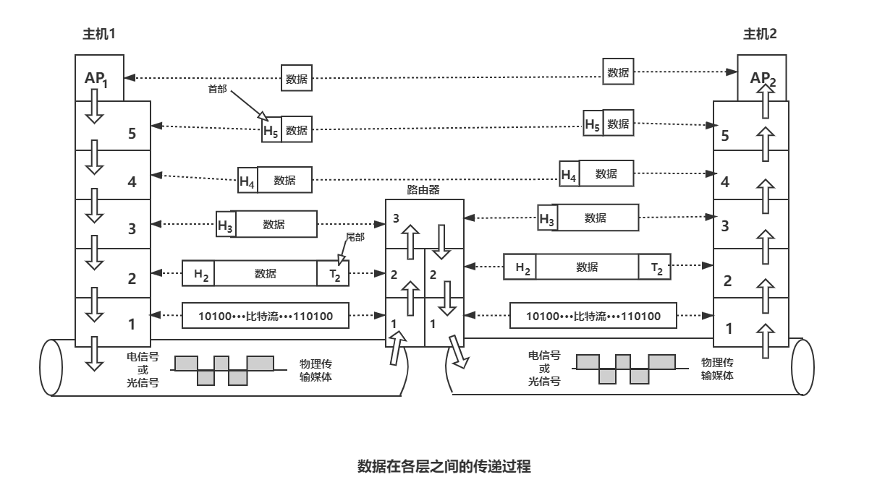

## OSI参考模型

国际化标准组织(ISO)提出了**开放系统互连基本参考模型OSI/RM**(Open Systems Interconnection Reference Model)，简称OSI。OSI参考模型的七层，自顶向下依次是应用层、表示层、会话层、运输层、网络层、数据链路层和物理层。高三层统称为资源子网，完成数据的处理等功能；低三层统称为通信子网，是为了联网而附加上去的通信设备，完成数据的传输功能。运输层承上启下。OSI层次结构如下所示。其中五层与上面介绍的五层协议的体系结构大体一致，下面介绍一下上面没有的表示层与会话层。

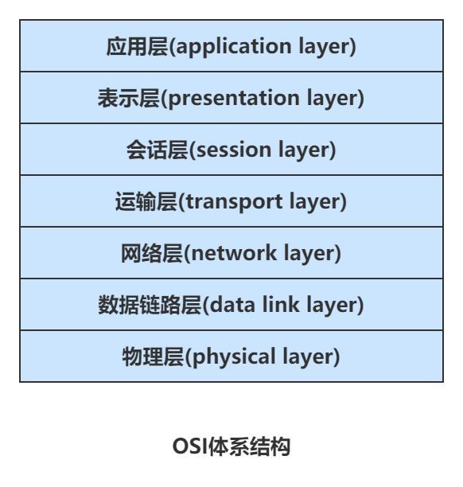

### 表示层

**表示层(presentation layer)**的作用是使通信的应用程序能够解释交换数据的含义。这些服务包括数据压缩和数据加密以及数据描述。表示层采用抽象的标准方法定义数据结构，并采用标准的编码形式，使得不同机器上的编码和数据结构相互进行转换。

### 会话层

**会话层(session layer)**允许不同主机上各进程之间的会话。会话层利用传输层提供的端到端的服务，向表示层提供它的服务。这种服务主要是向表示层实体或用户进程提供建立连接并在连接上有序地传输数据，这就是会话，也称为建立同步(SYN)。

会话层负责管理主机间的会话进程，包括建立、管理以及终止进程间的会话。会话层使用校验点可使通信会话在通信失效时从校验点继续恢复通信，实现数据同步。

## TCP/IP模型

ARPA研究ARPANET提出了TCP/IP模型，该模型只有四层，从高到低依次为：应用层、传输层、网际层和网络接口层。如下图所示。

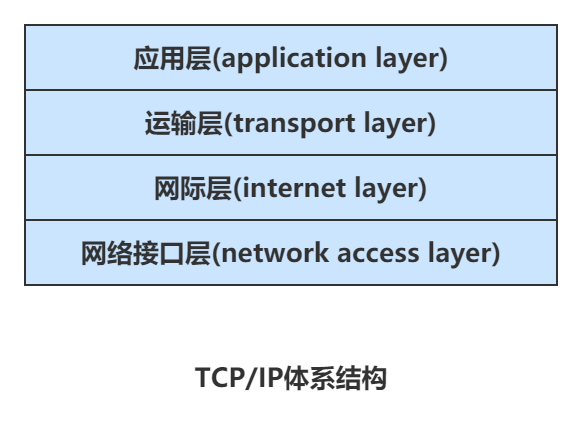

也可以使用具体协议来表示TCP/IP协议族，特点比较像沙漏计时器的形状，表明：TCP/IP协议**可以为各式各样的应用提供服务**（所谓的everything over IP），同时TCP/IP协议也**允许IP协议在各式各样的网络构成的互联网上运行**（所谓的IP over everything）。

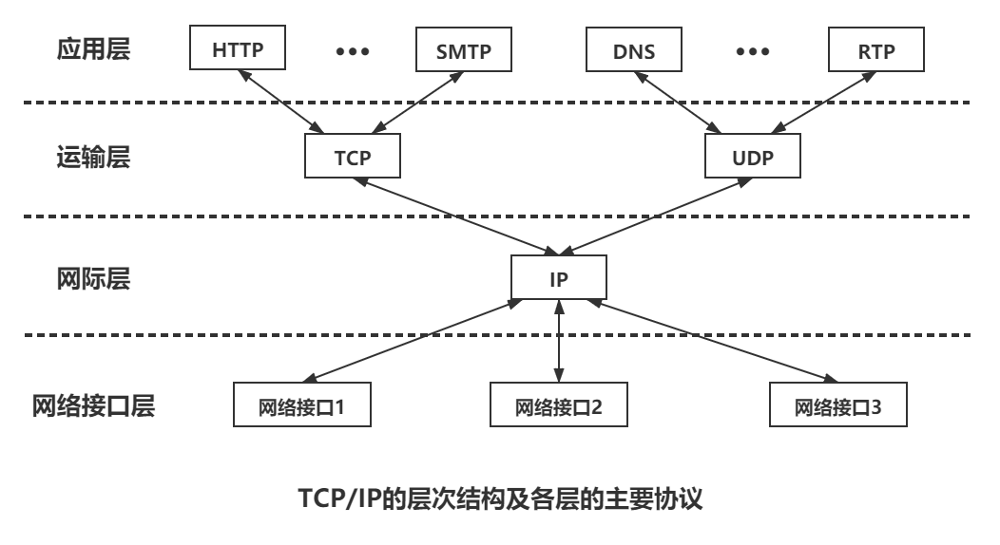

### 应用层

应用层对应OSI模型中的会话层、表示层和应用层。包含所有高层协议。如虚拟终端协议(Telnet)、文件传输协议(FTP)、域名解析服务(DNS)、电子邮件协议(SMTP)和超文本传输协议(HTTP)。

### 传输层

传输层的功能和OSI中传输层类似，是使发送端和目的端主机上的对等实体可以进行会话。

### 网际层

网际层是TCP/IP体系结构的关键部分。他和OSI网络层在功能上非常相似。网际层将分组发往任何网络，并为之独立地选择合适的路由，但它不保证各个分组有序的到达，各个分组的有序交付由高层负责。网际层定义了标准的分组格式和协议，即IP协议。当前采用的IP协议是第4版，即IPv4，它的下一个版本是IPv6。

### 网络接口层

网络接口层对应OSI模型中的物理层和数据链路层。表示与物理网络的接口，但实际上TCP/IP本身并没有真正描述这一部分，只是指出主机必须使用某种协议与网络连接，以便能在其上传递IP分组。具体的物理网络可以是各种类型的局域网，如以太网、令牌环网、令牌总线网等，也可以是诸如电话网、SDH、X.25、帧中继和ATM等公共数据网络。网络接口层的责任是从主机或结点接收IP分组，并把它们发送到指定的物理网络上。

## 模型比较

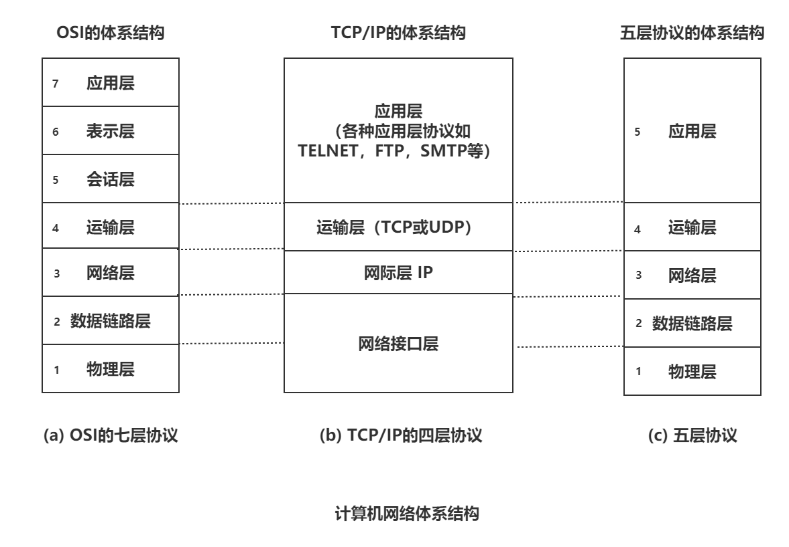

OSI模型与TCP/IP模型有许多相似之处。

1. OSI参考模型与TCP/IP模型都采取分层结构的概念，将庞大复杂的问题划分若干个较容易处理的、范围较小的问题，而且分层的功能大体相似。
2. 都是基于独立的协议栈的概念。
3. 都可以解决异构网络的互联，实现世界上不同厂家生产的计算机之间的通信。

除了这些基本功能较相似外，也有很多差别。

1. OSI参考模型最大贡献就是精确地定义了三个主要概念：服务、协议和接口，这与现代的面向对象程序设计思想较吻合。而TCP/IP模型在这三个概念上却没有明确区分，不符合软件工程的思想。
2. OSI参考模型在协议发明之前，不偏向任何特定协议，通用性良好。但设计者缺乏实际经验，较为理想化。TCP/IP模型正好相反，是先出现协议，在对已有协议进行描述，不会出现协议不匹配模型的情况，但不适合非TCP/IP的协议栈。
3. TCP/IP模型考虑到多种异构网的互联问题，给网际协议IP单独划分一个层次。OSI参考模型最初只考虑到用一种标准的公用数据网将各种不同的系统互联。后来，OSI参考模型认识到网际协议IP的重要性，因此只好在网络层中划分出一个自层来完成类似于TCP/IP模型中IP的功能。
4. OSI参考模型在网络层支持无连接和面向连接的通信，但在传输层仅有面向连接的通信。而TCP/IP模型认为可靠性是端到端的问题，因此它在网际层仅有一种无连接的通信模式，但在传输层支持无连接和面向连接两种模式。

这两种模型都不是完美的，OSI参考模型视图建立一个全世界的计算机网络都要遵循的统一标准，但过于追求理想化，导致基于OSI参考模型过于复杂，运行效率很低。并且缺乏商业驱动力，制定周期太长，无法及时进入市场，导致了OSI的失败。事实上，市场上还是TCP/IP模型得到了非常广泛的应用。TCP/IP是四层体系结构，实际上是一组协议，提到TCP/IP，往往表示的是TCP/IP协议族。而学习计算机网络时往往采取折中办法，综合OSI和TCP/IP的优点采用五层协议的体系结构来学习，实际应用还是TCP/IP模型，而OSI参考模型只是一种理想的模型。

# 网络攻击

互联网已经成为现今社会不可分割的一部分，在互联网给我们带来的便利的情况下，也要提防来自网络方面的攻击，它会对我们在互联网上的生活进行破坏。下面列举一些网络中常用的攻击手段。

## 植入有害程序

因为要从/向互联网接收/发送数据，所以要将设备与互联网相连。它们会在我们浏览互联网应用(如Web浏览、搜索引擎结果等)时感染我们的主机并做不正当的事情，包括删除文件、安装间谍软件来收集隐私信息。我们的受害主机也也可能成为众多的类似受害设备网络中的一员，它们统称为僵尸网络(botnet)，利用僵尸网络控制并有效地对目标主机展开垃圾邮件分发或分布式拒绝服务攻击。

大多恶意程序具有**自我复制(self-replicating)**功能，一旦感染一台主机，就会进入因特网寻找更多主机。以病毒或蠕虫的形式成指数式快速扩散。

**病毒(virus)**是一种需要某种形式的用户交互来感染用户设备的恶意程序。

**蠕虫(worm)**是一种无需任何明显用户交互就能进入设备的恶意程序。

## 攻击服务器和网络基础设施

**拒绝服务攻击(Denial-of-Service (Dos) attack)**简称Dos攻击，它会使网络、主机或基础设施部分不能由合法用户所使用。Web服务器、电子邮件服务器、DNS服务器和机构网络都能够成为DoS攻击的目标。

DoS攻击可分为三种类型：

- **弱点攻击**。这涉及向一台目标主机上运行的易受攻击的应用程序或操作系统发送制作精细的报文。如果适当顺序的多个分组发送给一个易受攻击的应用程序或操作系统，该服务器可能停止运行，或者崩溃。
- **带宽洪泛**。攻击者通过网络向目标主机发送大量的分组，太多的分组数量会使目标的接入链路变得拥塞，使得合法分组无法到达服务器。
- **连接洪泛**。攻击者在目标主机中创建大量的半开或全开TCP连接。TCP连接数量太多导致服务器无法接收到有效的TCP连接。

详细研究一下带宽洪泛攻击。回顾上面讨论的时延和丢包问题，如果某服务器的接入速率为$R \quad bps$，则攻击者将需要以大约$R \quad bps$的速率来产生危害。如果$R$非常大的话，单一攻击源可能无法产生足够大的流量来伤害该服务器并且上游路由器就能检测出并在服务器前进行阻挡。而**分布式DoS(Distributed DoS，DDoS)**，是攻击者控制多个源并让每个源向目标猛烈发送流量。使用这种方法，为了削弱或损坏服务器，遍及所有受控源的聚合流量速率需要大约$R$的能力。这种DDoS攻击很难检测和防范。

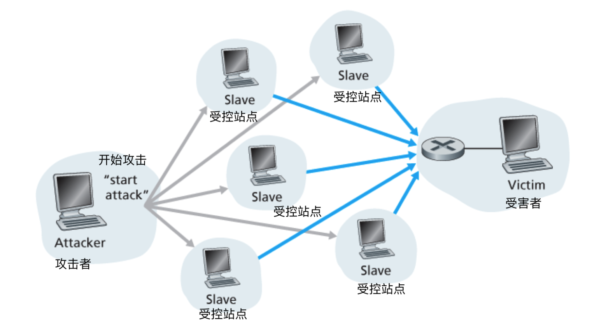

## 嗅探分组

无线设备接入互联网会产生重大的安全弱点——被动的接收机放在无线传输设备附近会获得无线设备传输的每个分组的副本。分组中会包含各种敏感信息，包括商业机密和隐秘的个人信息等。这种记录每个流经的分组副本的被动接收机被称为**分组嗅探器(packet sniffer)**。也可以应用于有线环境中。分组嗅探器是被动的，因此难以检测它们的存在。防御嗅探器的方法基本上都与密码学有关。

## 伪装

生成具有任意源地址、分组内容和目的地址的分组，然后将该分组传输到互联网中并转发到目的地。我们将具有虚假源地址的分组注入互联网的能力称为**IP哄骗(IP spoofing)**，想要防备这种攻击，需要采用**端点鉴别**，可以使我们确信报文源真正目的地的机制。

# 总结

本章主要是对互联网的简单概述，了解互联网的组成，边缘与核心的部分，对网络核心深入的研究，知道网络传输数据的基本方法：电路交换、报文交换与分组交换，并探讨它们之间的优缺点。也研究了互联网的体系结构与参考模型，参考模型中分层的结构和各层的功能以及OSI与TCP/IP模型之间的不同。还有互联网面临的网络攻击的简单介绍。对于计算机网路的总体进行简单的了解，以方便我们接下来对此进行更深入的学习。

# 文章参考

- 《计算机网络（第七版）》- 谢希仁
- 《计算机网络  自顶向下方法》 - James F. Kurose & Keith W. Ross