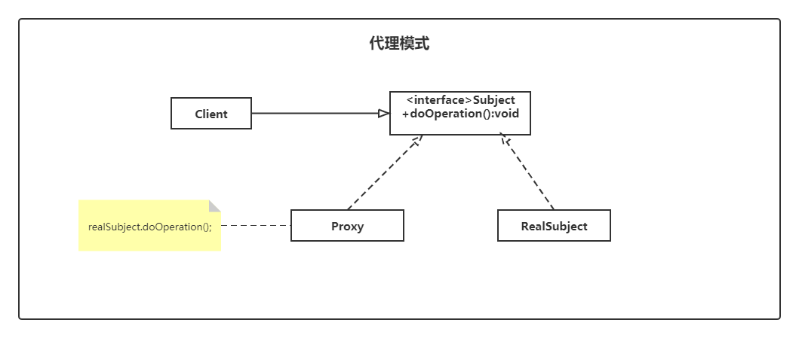

# 代理模式（Proxy）

> 设计模式是一种思想，适用于任何一门面向对象的语言
> 

## 定义

代理模式：又叫委托模式，是为某个对象提供一个代理对象，并且由代理对象控制对原对象的访问。代理模式通俗来讲就是我们生活中常见的中介。

代理模式可以提供非常好的访问控制，应用比较广泛。

### 类图



- Subject：抽象角色，为真实对象和代理对象提供一个共同的接口，一般是抽象类或者接口。
- RealSubject：具体角色，也叫做被委托角色或被代理角色，是业务逻辑的具体执行者。
- Proxy：代理角色，也叫做委托类或代理类。内部含有对真实对象的引用，从而操作真实对象，同时代理对象提供与真实对象相同的接口以便在任何时刻都能够代替真实对象。同时，代理对象可以在执行真实对象的操作时，附加其它操作，相当于对真实对象的功能进行拓展。

## 实例

代理模式分为：静态代理、动态代理。

要实现代理之前，我们需要实现主要的抽象角色与真实角色。

定义抽象角色

```java
public interface Subject {
    /**
     * 接口方法
     */
    void request();
}
```

定义真实角色

```java
public class ConcreteSubject implements Subject {
    /**
     * 具体的业务逻辑实现
     */
    @Override
    public void request() {
        // 业务处理逻辑
        System.out.println("具体的业务处理逻辑");
    }
}
```

### 静态代理

代理类在程序运行前就已经存在，这种代理方式被称为静态代理

定义一个代理类

```java
public class Proxy implements Subject {
    /**
     * 要代理的实现类
     */
    private Subject subject = null;
    public Proxy(Subject subject) {
        this.subject = subject;
    }
    /**
     * 要实现的接口方法
     */
    @Override
    public void request() {
        this.before();
        this.subject.request();
        this.after();
    }

    /**
     * 预处理
     */
    private void before() {
        // do something
        System.out.println("预处理");
    }

    /**
     * 后处理
     */
    private void after() {
        // do something
        System.out.println("后处理");
    }
}
```

定义测试类

```java
public class Test {
    public static void main(String[] args) {
        Subject subject = new ConcreteSubject();
        Proxy proxy = new Proxy(subject);
        proxy.request();
    }
}
```

输出结果：

```shell
预处理
具体的业务处理逻辑
后处理
```

### 动态代理

代理类在程序运行时创建的代理方式被称为动态代理，如果目标对象实现了接口，采用 JDK 的动态代理。

实现代理

```java
public class ProxyHandler implements InvocationHandler {
    /**
     * 目标对象
     */
    private Object target;

    /**
     * 给目标对象生成的代理对象
     * 绑定关系，也就是关联到哪个接口（与具体的实现类绑定）的哪些方法将被调用时，执行 invoke 方法。
     * @param target    绑定具体的代理实例
     * @return  动态代理类实例
     */
    public Object newProxyInstance(Object target) {
        this.target = target;
        /*
         该方法用于为指定类装载器、一组接口及调用处理器生成动态代理类实例。
         第一个参数指定产生代理对象的类加载器，需要将其指定为和目标对象同一个类加载器。
         第二个参数要实现和目标对象一样的接口，所以只需要拿到目标对象的实现接口。
         第三个参数表明这些被拦截的方法在被拦截时需要执行哪个 InvocationHandler 的 invoke 方法
         根据传入的目标返回一个代理对象
         */
        return Proxy.newProxyInstance(
                target.getClass().getClassLoader(),
                target.getClass().getInterfaces(),
                this);
    }

    /**
     * 关联的这个实现类的方法被调用时将被执行。InvocationHandler接口的方法。
     *
     * @param proxy     代理
     * @param method    原对象被调用的方法
     * @param args      方法的参数
     * @return
     * @throws Throwable
     */
    @Override
    public Object invoke(Object proxy, Method method, Object[] args) throws Throwable {
        // TODO 原对象方法调用前添加的预处理逻辑
        beforeMethod();
        Object result = null;
        try {
            // 调用目标方法
            result = method.invoke(target, args);
        } catch (Exception e) {
            throw e;
        }
        // TODO 原对象方法调用后添加的后处理逻辑
        afterMethod();
        return result;
    }

    private void beforeMethod() {
        System.out.println("预处理");
    }

    private void afterMethod() {
        System.out.println("后处理");
    }
}
```

实现测试类

```java
public class Test {
    public static void main(String[] args) {
        ProxyHandler handler = new ProxyHandler();
        Subject subject = (Subject) handler.newProxyInstance(new ConcreteSubject());
        subject.request();
    }
}
```

或者 

```java
public class Test {
    public static void main(String[] args) {
        Subject subject = new ConcreteSubject();
        Subject result = (Subject) Proxy.newProxyInstance(
                subject.getClass().getClassLoader(),
                subject.getClass().getInterfaces(), new InvocationHandler() {
                    @Override
                    public Object invoke(Object proxy, Method method, Object[] args) throws Throwable {
                        beforeMethod();
                        // 执行目标对象
                        Object target = method.invoke(subject, args);
                        afterMethod();
                        return target;
                    }
                });
        result.request();
    }

    private static void beforeMethod() {
        System.out.println("预处理");
    }
    private static void afterMethod() {
        System.out.println("后处理");
    }
}
```

输出结果：

```shell
预处理
具体的业务处理逻辑
后处理
```

### CGLib代理

在动态代理中，如果目标没有实现接口，必须采用 CGLib 动态代理

在 CGLib 动态代理中，目标类不能为 `final` ，目标对象的方法如果为 `final/static`，那么就不会被拦截，即不会执行目标对象额外的业务方法

引入依赖

```xml
<dependency>
	<groupId>cglib</groupId>
	<artifactId>cglib</artifactId>
	<version>3.3.0</version>
</dependency>
```

创建一个目标类

```java
public class ConcreteSubject {
    /**
     * 具体的业务逻辑实现
     */
    public void request() {
        // 业务处理逻辑
        System.out.println("具体的业务处理逻辑");
    }
}
```

创建 CGLib 代理

```java
public class CglibProxy implements MethodInterceptor {

    private ConcreteSubject subject;

    CglibProxy(ConcreteSubject subject) {
        this.subject = subject;
    }

    ConcreteSubject getProxy() {
        // 创建 Enhancer 对象
        Enhancer enhancer = new Enhancer();
        // 设置代理的目标类
        enhancer.setSuperclass(ConcreteSubject.class);
        // 设置回调方法，this代表当前类，因为当前类实现了CallBack
        enhancer.setCallback(this);
        return (ConcreteSubject) enhancer.create();
    }

    /**
     * 这个方法就是回调方法
     * @param o
     * @param method
     * @param objects
     * @param methodProxy
     * @return
     * @throws Throwable
     */
    @Override
    public Object intercept(Object o, Method method, Object[] objects, MethodProxy methodProxy) throws Throwable {
        beforeMethod();
        Object invoke = method.invoke(subject, objects);
        afterMethod();
        return invoke;
    }

    private void beforeMethod() {
        System.out.println("预处理");
    }

    private void afterMethod() {
        System.out.println("后处理");
    }
}
```

测试类

```java
public class Test {
    public static void main(String[] args) {
        ConcreteSubject subject = new ConcreteSubject();
        ConcreteSubject proxy = new CglibProxy(subject).getProxy();
        proxy.request();
    }
}
```

输出结果：

```shell
预处理
具体的业务处理逻辑
后处理
```

## 优缺点

**优点**  

- 扩展性好：动态代理，不需要更改原有的代码，能在运行过程中根据接口的类型动态的调用真实角色，符合开闭原则。
- 解耦：代理角色，可以说是一个中介，隔离了客户端和真实角色

**缺点**  

- 代码量大：静态大力，需要接口和类，有比较多的重复代码，降低了维护性。
- 编译效率：动态代理，使用的是反射机制相对效率会降低。
- 代码可读性：都是对于接口实现进行代理，因此代码可读性不是很好

### 1.静态代理

可以做到在不修改目标对象的功能前提下，对目标功能扩展

缺点：代理对象需要与目标对象实现一样的接口，所以会有很多代理类，类太多，同时，一旦接口增加方法，目标对象与代理对象都要维护

### 2.JDK动态代理

代理对象不需要实现接口，利用 JDK 的 API，动态的在内存中构建代理对象（需要我们指定创建代理对象/目标对象实现的接口类型）

缺点：目标对象一定要实现接口，否则不能用动态代理

### 3.CGLib代理

静态代理和动态代理模式都是要求目标对象是实现一个接口的目标对象,但是有时候目标对象只是一个单独的对象,并没有实现任何的接口,这个时候就可以使用以目标对象类实现代理

## 使用场景

当我们需要使用的对象很复杂或者需要很长时间去构造，这时就可以使用代理模式(Proxy)。例如：如果构建一个对象很耗费时间和计算机资源，代理模式(Proxy)允许我们控制这种情况，直到我们需要使用实际的对象。一个代理(Proxy)通常包含和将要使用的对象同样的方法，一旦开始使用这个对象，这些方法将通过代理(Proxy)传递给实际的对象。 一些可以使用代理模式(Proxy)的情况：

- 一个对象，比如一幅很大的图像，需要载入的时间很长。　　　　
- 一个需要很长时间才可以完成的计算结果，并且需要在它计算过程中显示中间结果
- 一个存在于远程计算机上的对象，需要通过网络载入这个远程对象则需要很长时间，特别是在网络传输高峰期。
- 一个对象只有有限的访问权限，代理模式(Proxy)可以验证用户的权限

代理模式(Proxy)也可以被用来区别一个对象实例的请求和实际的访问，例如：在程序初始化过程中可能建立多个对象，但并不都是马上使用，代理模式(Proxy)可以载入需要的真正的对象。这是一个需要载入和显示一幅很大的图像的程序，当程序启动时，就必须确定要显示的图像，但是实际的图像只能在完全载入后才可以显示！这时我们就可以使用代理模式(Proxy)。

使用代理模式来将由一系列无关逻辑组合在一起的代码进行解耦合，比如业务代码中的日志代码就可以在代理中进行。spring的AOP就是典型的动态代理应用。

## JDK代理和CGLib代理的区别

JDK动态代理使用Java的反射技术生成代理类，只能代理实现了接口的类，没有实现接口的类不能实现动态代理，CGLib会在运行时动态的生成一个被代理类的子类，子类重写了被代理类中所有非final的方法，在子类中采用方法拦截的技术拦截所有父类方法的调用，不需要被代理类对象实现接口，从而CGLIB动态代理效率比Jdk动态代理反射技术效率要高