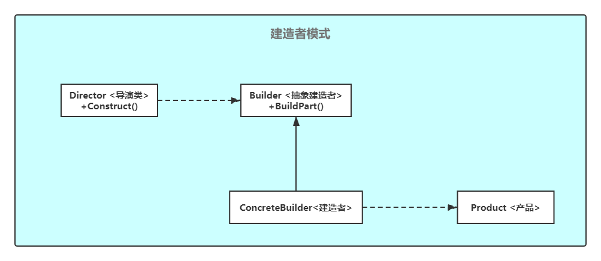

# 建造者模式（Builder）


> 设计模式是一种思想，适用于任何一门面向对象的语言

## 定义

建造者模式是设计模式的一种，将一个复杂对象与它的表示分离，使得同样的构建过程可以创建不同的表示。

建造者模式用来逐步创建复杂的对象。使用建造者模式可以使用相同的构造代码生成不同类型、不同表示的对象。

想象一个复杂的对象，它需要大量字段和嵌套对象进行初始化。这种的初始化代码一般会隐藏在包含大量参数的庞大构造函数中。

但是，在大多数情况下，大部分的参数是不被使用的。这样调用构造函数时会显得代码十分难看。

建造者模式建议您从自己的类中提取对象构造代码，将其移动到被称为生成器的独立对象中。

### 类图



- `Builder`：抽象建造类，声明了对所有类型的生成器都通用的产品构造步骤。
- `ConcreteBuilder`：具体建造类，实现抽象建造类定义的方法并返回一个建造好的对象。
- `Product`：产品类，不同构造器构建的产品可以属于不同的类层次结构（继承）或者接口。
- `Director`：导演类，也就是指挥者，定义了调用构造步骤的顺序，因此您可以创建和重用产品的特定构造方式，`Director`类不是绝对必要的，我们可以按照特定的顺序直接调用`Builder`。但是，`Director`是放置各种可重用构造方案的好方法，另外，`Director`类完全隐藏了产品构造细节。客户端只需要将一个`Builder`和一个`Director`关联起来就可以得到构建结果。

## 实例

这里距离一个手机的组装过程，手机具有属性（屏幕、电池、话筒、听筒、机身等...），但是根据手机具体的产品，我们可以制造IPhone，Huawei等不同型号

```java
/**
 * 建造的实体对象
 */
public class MobilePhone {

    //手机屏幕
    private String screen;
    //电池
    private String battery;
    //话筒
    private String microphone;
    //听筒
    private String phoneReceiver;
    //机身
    private String phoneBody;

    public String getScreen() {
        return screen;
    }

    public void setScreen(String screen) {
        this.screen = screen;
    }

    public String getBattery() {
        return battery;
    }

    public void setBattery(String battery) {
        this.battery = battery;
    }

    public String getMicrophone() {
        return microphone;
    }

    public void setMicrophone(String microphone) {
        this.microphone = microphone;
    }

    public String getPhoneReceiver() {
        return phoneReceiver;
    }

    public void setPhoneReceiver(String phoneReceiver) {
        this.phoneReceiver = phoneReceiver;
    }

    public String getPhoneBody() {
        return phoneBody;
    }

    public void setPhoneBody(String phoneBody) {
        this.phoneBody = phoneBody;
    }

    @Override
    public String toString() {
        return new StringJoiner(", ", MobilePhone.class.getSimpleName() + "[", "]")
                .add("screen='" + screen + "'")
                .add("battery='" + battery + "'")
                .add("microphone='" + microphone + "'")
                .add("phoneReceiver='" + phoneReceiver + "'")
                .add("phoneBody='" + phoneBody + "'")
                .toString();
    }
}
```

```java
/**
 * 定义对象创建规范
 */
public interface PhoneBuilder {
    /**
     * 建造手机屏幕
     */
    void buildScreen();
    /**
     * 建造手机电池
     */
    void buildBattery();

    /**
     * 建造手机听筒
     */
    void buildMicrophone();

    /**
     * 建造手机话筒
     */
    void buildPhoneReceiver();

    /**
     * 建造手机机身
     */
    void buildPhoneBody();

    MobilePhone build();
}
```

```java
/**
 * IPhoneX创建实现
 */
public class IPhoneX implements PhoneBuilder {

    private MobilePhone mobilePhone;

    public IPhoneX() {
        mobilePhone = new MobilePhone();
    }

    /**
     * 建造手机屏幕
     */
    @Override
    public void buildScreen() {
        mobilePhone.setScreen("这是IPhone屏幕");
    }

    /**
     * 建造手机电池
     */
    @Override
    public void buildBattery() {
        mobilePhone.setBattery("这是IPhone电池");
    }

    /**
     * 建造手机听筒
     */
    @Override
    public void buildMicrophone() {
        mobilePhone.setMicrophone("这是IPhone听筒");
    }

    /**
     * 建造手机话筒
     */
    @Override
    public void buildPhoneReceiver() {
        mobilePhone.setPhoneReceiver("这是IPhone话筒");
    }

    /**
     * 建造手机机身
     */
    @Override
    public void buildPhoneBody() {
        mobilePhone.setPhoneBody("这是IPhone机身");
    }

    /**
     * 创建手机
     * @return
     */
    @Override
    public MobilePhone build() {
        return mobilePhone;
    }
}
```

```java
/**
 * Huawei创建实现
 */
public class HuaweiPhone implements PhoneBuilder {

    private MobilePhone mobilePhone;

    public HuaweiPhone() {
        mobilePhone = new MobilePhone();
    }

    /**
     * 建造手机屏幕
     */
    @Override
    public void buildScreen() {
        mobilePhone.setScreen("这是Huawei屏幕");
    }

    /**
     * 建造手机电池
     */
    @Override
    public void buildBattery() {
        mobilePhone.setBattery("这是Huawei电池");
    }

    /**
     * 建造手机听筒
     */
    @Override
    public void buildMicrophone() {
        mobilePhone.setMicrophone("这是Huawei听筒");
    }

    /**
     * 建造手机话筒
     */
    @Override
    public void buildPhoneReceiver() {
        mobilePhone.setPhoneReceiver("这是Huawei话筒");
    }

    /**
     * 建造手机机身
     */
    @Override
    public void buildPhoneBody() {
        mobilePhone.setPhoneBody("这是Huawei机身");
    }

    /**
     * 创建手机
     * @return
     */
    @Override
    public MobilePhone build() {
        return mobilePhone;
    }
}
```

```java
/**
 * 指挥者，负责对象的创建过程
 */
public class Director {
    /**
     * 创建手机
     * @param builder
     * @return
     */
    public MobilePhone createMobilePhone(PhoneBuilder builder) {
        builder.buildScreen();
        builder.buildBattery();
        builder.buildMicrophone();
        builder.buildPhoneReceiver();
        builder.buildPhoneBody();
        return builder.build();
    }

}
```

自此，我们的建造者模式已经完成。如果需要IPhoneX，我们只需要调用创建该对象的方法即可。

测试代码如下：

```java
public class Test {
    public static void main(String[] args) {
        Director director = new Director();
        MobilePhone phone1 = director.createMobilePhone(new IPhoneX());
        System.out.println(phone1);
        MobilePhone phone2 = director.createMobilePhone(new HuaweiPhone());
        System.out.println(phone2);
    }
}
```

运行结果：

```shell
MobilePhone[screen='这是IPhone屏幕', battery='这是IPhone电池', microphone='这是IPhone听筒', phoneReceiver='这是IPhone话筒', phoneBody='这是IPhone机身']
MobilePhone[screen='这是Huawei屏幕', battery='这是Huawei电池', microphone='这是Huawei听筒', phoneReceiver='这是Huawei话筒', phoneBody='这是Huawei机身']
```

## 优缺点

**优点**  

- 封装性。客户端不必知道产品内部组成的细节。
- 建造者独立，易扩展。
- 便于控制细节风险。可以对建造过程逐步细化，而不对其它模块产生任何影响。

**缺点**  

- 产品必须有共同点，范围有限制。
- 内部变化复杂，会有很多的建造类
- 一定的使用范围限制。建造者模式的产品的组件基本相同，如果产品的差异性较大，建造者模式就不适用了。

## 使用场景

- 建造者模式用来摆脱过长的构造函数。
- 创建某些产品的不同表示形式，比如石房和木房。
- 构造复杂对象，将构造代码和业务代码分离。

## 建造者模式与工厂模式的区别

这两种模式很相似，建造者模式更注重于方法的调用顺序，而工厂模式注重于创建产品。

## JDK中建造者模式的应用

JDK中建造者模式的应用：

`StringBuilder`和`StringBuffer` 的 `append()` 方法使用了建造者模式。
`StringBuilder` 把构建者的角色交给了其的父类 `AbstractStringBuilder`

```java
public class AbstractStringBuilder {
    protected char[] value;

    protected int count;

    public AbstractStringBuilder(int capacity) {
        count = 0;
        value = new char[capacity];
    }

    public AbstractStringBuilder append(char c) {
        ensureCapacityInternal(count + 1);
        value[count++] = c;
        return this;
    }

    private void ensureCapacityInternal(int minimumCapacity) {
        // overflow-conscious code
        if (minimumCapacity - value.length > 0)
            expandCapacity(minimumCapacity);
    }

    void expandCapacity(int minimumCapacity) {
        int newCapacity = value.length * 2 + 2;
        if (newCapacity - minimumCapacity < 0)
            newCapacity = minimumCapacity;
        if (newCapacity < 0) {
            if (minimumCapacity < 0) // overflow
                throw new OutOfMemoryError();
            newCapacity = Integer.MAX_VALUE;
        }
        value = Arrays.copyOf(value, newCapacity);
    }
    public AbstractStringBuilder append(String str) {
        if (str == null) {
            return appendNull();
        }
        int len = str.length();
        ensureCapacityInternal(count + len);
        putStringAt(count, str);
        count += len;
        return this;
    }
}
```

```java
public class StringBuilder extends AbstractStringBuilder {
    public StringBuilder() {
        super(16);
    }
	@Override
    @HotSpotIntrinsicCandidate
    public StringBuilder append(String str) {
    	// 最终调用的父类的 append()
        super.append(str);
        return this;
    }
    @Override
    public String toString() {
        // Create a copy, don't share the array
        return new String(value, 0, count);
    }
}public class Client {
    public static void main(String[] args) {
        StringBuilder sb = new StringBuilder();
        final int count = 26;
        for (int i = 0; i < count; i++) {
            sb.append((char) ('a' + i));
        }
        System.out.println(sb.toString());
    }
}
```

```java
public class Test {
    public static void main(String[] args) {
        StringBuilder sb = new StringBuilder();
        final int count = 26;
        for (int i = 0; i < count; i++) {
            sb.append((char) ('a' + i));
        }
        System.out.println(sb.toString());
    }
}
```

输出结果：

```shell
abcdefghijklmnopqrstuvwxyz
```
