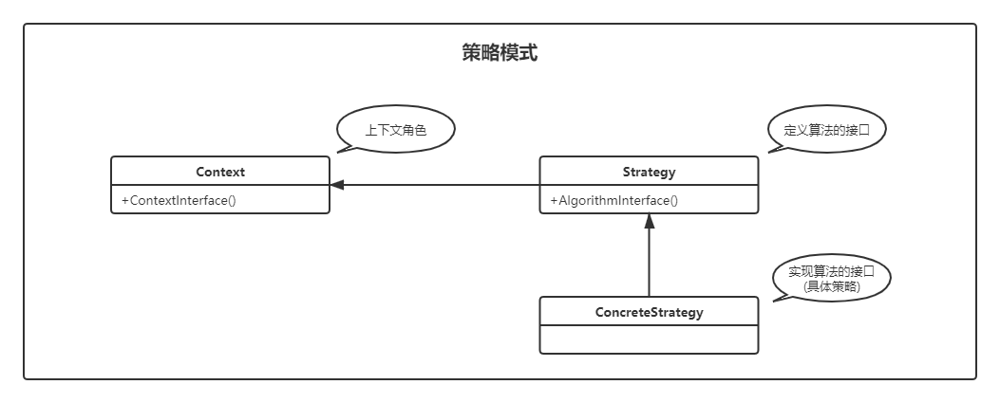

# 策略模式（Strategy）

> 设计模式是一种思想，适用于任何一门面向对象的语言
> 

## 定义

定义一系列的算法，封装每个算法，并使它们可以互相转换。

策略模式可以让算法独立于使用它的客户端。

### UML



- `Strategy`：接口定义了一个算法族，它们都实现了 `behavior()` 方法。
- `Context`：使用到该算法族的类，其中的 `doSomething()` 方法会调用 `behavior()`，`setStrategy(Strategy)` 方法可以动态地改变 `strategy` 对象，也就是说能动态地改变 `Context` 所使用的算法。

## 实例

**抽象策略**  

策略、算法家族的抽象，通常为接口，也可以是抽象类，定义每个策略或算法必须具有的方法和属性。

```java
public interface Calculator {
    /**
     * 策略模式的运算法则
     */
    double calculate(double n1, double n2);
}
```

**具体策略**  

实现抽象策略中的操作，该类含有具体的算法

```java
public class OptionAdd implements Calculator {

    @Override
    public double calculate(double n1, double n2) {
        return n1 + n2;
    }
}
```

```java
public class OptionSubstract implements Calculator {

    @Override
    public double calculate(double n1, double n2) {
        return n1 - n2;
    }
}
```

```java
public class OptionMultiply implements Calculator {
    @Override
    public double calculate(double n1, double n2) {
        return n1 * n2;
    }
}
```

```java
public class OptionDivide implements Calculator {
    @Override
    public double calculate(double n1, double n2) {
        return n1 / n2;
    }
}
```

**封装类**  

也叫上下文类或环境类，起承上启下封装作用，屏蔽高层模块对策略、算法的直接访问，封装可能存在的变化。

*策略模式的重点就是封装角色，它是借用了代理模式的思路，和代理模式的差别就是策略模式的封装角色和被代理封装的策略类不用是同一个接口，如果是同一个接口那就成为了代理模式。*

```java
public class Context {
    /**
     * 抽象策略
     */
    private Calculator calculator;

    /**
     * 构造函数设置具体策略
     * @param calculator
     */
    public Context(Calculator calculator) {
        this.calculator = calculator;
    }

    /**
     * 封装后的策略方法
     */
    public double execute(double n1, double n2) {
        return this.calculator.calculate(n1, n2);
    }
}
```

测试代码

```java
public class Test {
    public static void main(String[] args) {
        // 声明一个具体的策略
        Calculator calculatorA = new OptionAdd();
        // 声明上下文对象
        Context contextA = new Context(calculatorA);
        // 执行封装后的方法
        double result = contextA.execute(1.2, 3.2);
        System.out.println("add:" + result);

        Calculator calculatorB = new OptionSubstract();
        Context contextB = new Context(calculatorB);
        result = contextB.execute(6.1, 2.2);
        System.out.println("substract:" + result);

        Calculator calculatorC = new OptionMultiply();
        Context contextC = new Context(calculatorC);
        result = contextC.execute(9.43, 3.1314);
        System.out.println("multiply:" + result);


        Calculator calculatorD = new OptionDivide();
        Context contextD = new Context(calculatorD);
        result = contextD.execute(4.21, 2.1);
        System.out.println("divide:" + result);
    }
}
```

输出结果：

```shell
add:4.4
substract:3.8999999999999995
multiply:29.529102
divide:2.0047619047619047
```


## 优缺点

**优点**  

- 算法可以自由切换：只要实现抽象策略，它就是策略家族中的一员，通过封装角色对其进行封装，保证对外提供“可自由切换”的策略。
- 避免使用多重条件判断：使用策略模式，可以由其它模块决定采用何种策略，策略家族对外提供的访问接口就是封装类，简化操作，同时避免了条件语句判断。
- 扩展性良好：在现有系统中增加一个策略较容易，只要实现接口即可，其它不用修改，类似于一个可反复拆卸的插件，这符合 OCP 原则。

**缺点**  

- 策略类数量增多：每个策略都是一个类，复用的可能性很小，类数量增多。
- 所有的策略类都需要对外暴露：上层模块必须知道有哪些策略，然后才能决定使用哪种策略。可以使用其它模式才修正这个缺陷，如工厂方法模式、代理模式或享元模式。

## 使用场景

- 多个类只有在算法或行为上稍有不同的场景。
- 算法需要自由切换的场景。
- 需要屏蔽算法规则的场景。

## 生活中的策略模式

去往某一个目的地，短距离可以选择步行、共享单车，中等距离可选择打车、地铁，长距离可选择高铁、飞机。不是一成不变的，可以自由切换。上班距离很短，平时可能步行，共享单车，如果哪一天起床晚了，赶时间，可以切换到打车模式。

## 扩展（策略枚举）

### 定义

- 它是一个枚举。
- 它是一个浓缩了的策略模式的枚举。

### 实例

```java
public enum Calculator {
    ADD("+") {
        @Override
        public int exec(int n1, int n2) {
            return n1 + n2;
        }
    },
    SUBSTRACT("-") {
        @Override
        public int exec(int n1, int n2) {
            return n1 - n2;
        }
    },
    MULTIPLY("*") {
        @Override
        public int exec(int n1, int n2) {
            return n1 * n2;
        }
    },
    DIVIDE("/") {
        @Override
        public int exec(int n1, int n2) {
            return n1 / n2;
        }
    };

    private final String symbol;

    Calculator(String symbol) {
        this.symbol = symbol;
    }

    public String getSymbol() {
        return this.symbol;
    }

    /**
     * 声明一个抽象方法
     * 枚举类型中的抽象方法必须被它的所有常量中的具体方法所覆盖（被称为特定于常量的方法实现）
     * @param n1
     * @param n2
     * @return
     */
    public abstract int exec(int n1, int n2);
}
```

把原有定义在抽象策略中的方法移植到枚举中，每个枚举成员就成为了一个具体策略。

测试代码

```java
public class Test {
    public static void main(String[] args) {
        int x = 100;
        int y = 25;
        System.out.println(x + " + " + y + " = " + Calculator.ADD.exec(x, y));
        System.out.println(x + " - " + y + " = " + Calculator.SUBSTRACT.exec(x, y));
        System.out.println(x + " * " + y + " = " + Calculator.MULTIPLY.exec(x, y));
        System.out.println(x + " / " + y + " = " + Calculator.DIVIDE.exec(x, y));
    }
}
```

代码量非常少，而且还有一个显著的优点：真实地面向对象

策略枚举是一个非常优秀和方便的模式（《Effective Java》中枚举相关条目也有详细介绍该模式），但是它受枚举类型的限制，每个枚举项都是public、final、static的，扩展性受到了一定的约束，因此在系统开发中，策略枚举一般担当不经常发生变化的角色。
