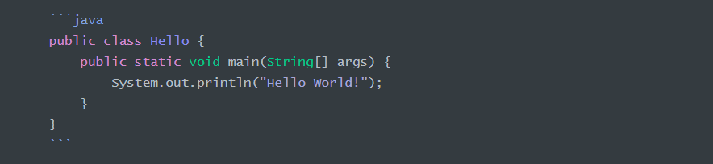
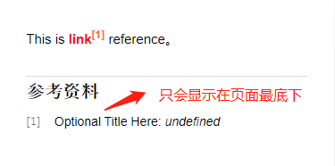

# 前言

Markdown是一种纯文本格式的标记语言。通过简单的标记语言，它可以使普通文本内容具有一定的格式。致力于使阅读和创作文档变得容易。

# 标题

Markdown标题有两种形式，Setext 和 atx

Setext样式使用 `=` 和 `-` 表示一级标题和二级标题。例如：

```markdown
一级标题
==========
二级标题
----------
```

> 任意长度的 `=` 或 `-` 都行。

效果如下：

一级标题
==========
二级标题
----------

Atx样式使用 # 符号可表示 1-6 及标题，例如：

```markdown
# 一级标题
## 二级标题
### 三级标题
#### 四级标题
##### 五级标题
###### 六级标题
```

效果如下：

# 一级标题
## 二级标题
### 三级标题
#### 四级标题
##### 五级标题
###### 六级标题

<br/>

# 段落

段落是由一行或多行连续文本组成的。它的前后要有空行。如果想要换行，我们有两个方法：

1. 连续两个以上空格 + 回车
2. 使用 HTML 语言换行标签 `<br/>`

<br/>

# 块引用

Markdown使用 `>` 字符作为块引用，还可以使用多个`>`进行嵌套并且包含Markdown元素。例如：

```markdown
> 区块引用
>> 嵌套引用
> 1. 列表1
> 2. 列表2
>>>>>>>>> 更多嵌套
>>> return shell_exec("echo $input | $markdown_script");
```

效果如下：

> 区块引用
>> 嵌套引用
>
> 1. 列表1
> 2. 列表2
>
>>> 更多嵌套
>
>>> `return shell_exec("echo $input | $markdown_script");`

# 列表

Markdown支持有序列表和无序列表。

无序列表使用`*`、`+`和`-` 字符来表示，它们可以互换。

```markdown
* 无序列表1
* 无序列表2
* 无序列表3
```

等价于：

```markdown
+ 无序列表1
+ 无序列表2
+ 无序列表3
```

等价于：

```markdown
- 无序列表1
- 无序列表2
- 无序列表3
```

效果如下：

- 无序列表1
- 无序列表2
- 无序列表3

有序列表使用数字加句号：

```markdown
1. 有序列表1
2. 有序列表2
3. 有序列表3
```

效果如下：

1. 有序列表1
2. 有序列表2
3. 有序列表3

列表还有一种形式：定义星列表，它是由名词和解释组成。一行写上定义，紧跟着一行写上解释。解释的写法 :紧跟着一个缩进（Tab）。例如：

```markdown
列表1
:	对列表1进行解释

列表2
:	对列表2进行解释
```

效果如下：

列表1
:	对列表1进行解释

列表2
:	对列表2进行解释


列表可以加上前缀列表项 `[ ]`，为任务列表。要将任务标记为完整，使用 `[x]`。例如：

```markdown
- [ ]跑步
- [ ]睡觉
- [x]吃饭
- [ ]骑车
```

效果如下：

- [ ] 跑步
- [ ] 睡觉
- [x] 吃饭
- [ ] 骑车

<br/>

# 表格

使用`|`与`_`实现简单的表格。例如：

```markdown
|学号|姓名|总分|
|:---|:---:|---:|
|2011|小赵|100|
|2012|小钱|150|
|2013|小孙|200|
```

表格对齐方式：在`-`符号两边添加冒号`:`可以实现对齐；冒号在左边为左对齐，右边为右对齐，两边都有为居中对齐。例如：

效果如下：

|学号|姓名|总分|
|:---|:---:|---:|
|2011|小赵|100|
|2012|小钱|150|
|2013|小孙|200|

我们可以使用 HTML的标签来实现复杂的表格。例如：

```markdown
<table>
    <tr>
    	<!--纵向合并-->
        <td rowspan="3">纵向合并</td>
        <td>行1列2</td>
        <td>行1列3</td>
        <td>行1列4</td>
    </tr>
    <tr>
        <td>行2列2</td>
        <td colspan="2">横向合并</td>
    </tr>
    <tr>
        <td>行3列2</td>
        <td>行3列3</td>
        <td>行3列4</td>
    </tr>
</table>
```

效果如下：

<table>
    <tr>
    	<!--纵向合并-->
        <td rowspan="3">纵向合并</td>
        <td>行1列2</td>
        <td>行1列3</td>
        <td>行1列4</td>
    </tr>
    <tr>
        <td>行2列2</td>
        <td colspan="2">横向合并</td>
    </tr>
    <tr>
        <td>行3列2</td>
        <td>行3列3</td>
        <td>行3列4</td>
    </tr>
</table>

<br/>

# 代码块

代码块用于输出编程语言和标记语言，要在Markdown中插入代码块，只需要用 <span>```</span> 包裹一段代码，并指定语言。例如：




效果如下：

```java
public class Hello {
	public static void main(String[] args) {
		System.out.println("Hello World!");
	}
}
```

# 水平线

一行有三个以上的 `-` 或者 `*` 或者`_`都会生成水平线。例如：

```markdown
---
***
* * *
___
```

效果如下：

---
***
* * *
___

<br/>


# 链接

Markdown支持内联和引用两种链接形式。界定符都是 [中括号]。

内联链接在链接文本的右括号后面跟着一对圆括号。例如：

```markdown
[超链接名](超链接地址)
```

将会在HTML生成：

```markdown
<a href='超链接地址'>超链接名</a>
```

效果如下：

<a href='超链接地址'>超链接名</a>

注：Markdown本身语法不支持链接在新页面中打开。如果想要在新页面中打开的话可以用 HTML 语言的 a 标签代替。

```html
<a href="https://google.com" target="_blank">Google</a>
```

如果引用本地资源，可以使用相对路径：

```markdown
[超链接名](./路径/资源名)
```

引用链接放在第二个中括号里，括号里面放链接标签：

```markdown
[超链接名][id]
```

然后在文档中的任意位置，可以定义链接标签：

```markdown
[id]: 链接地址
```

> 引用链接的链接标签会显示在页面最下面。

效果如下：



Markdown还可以使用尖括号`<>`包裹 URL，这被称为自动链接。

```markdown
<http://link.com/>
```

Markdown将它转化为：

```markdown
<a href="http://link.com/">http://link.com/</a>
```

效果如下：

<a href="http://link.com/">http://link.com/</a>

锚点就是页内超链接，跳转到本页指定位置。例如：

```markdown
- [锚点](#标题)

# 标题
```

或者可以使用 HTML 的 `<a>` 标签：

```markdown
<a href="标题">锚点</a>
```

在需要添加注脚的文字后面加上注脚名字 [^注脚名字]，称为加注。然后在文本的任意位置（一般在最后）添加注脚，注脚前必须有对应的注脚名字。例如：

```markdown
这是一段要添加注脚[^1]的文字内容

[^1]:添加注脚
```

效果如下：

这是一段要添加注脚[^1]的文字内容

[^1]:添加注脚

在文章开头填写 `[TOC]` ，目录树会根据文档中的 h1~h6 标题自动生成，并且支持点击跳转。`[TOC]` 需要独占一行才能生效。

# 强调

Markdown使用 `*` 和 `_` 作为强调标记。用 `*` 或者 `_` 包裹的文本将会用 HTML 的 `<em>` 标签包裹；双 `*` 或者 `_` 将会用 HTML `<strong>` 标签包裹。三 `*` 或者 `_` 将会用 上述两个标签包裹。两个 `~` 将会用例如：

```markdown
*斜体文字*
_斜体文字_
**加粗文字**
__加粗文字__
***斜体加粗文字***
___斜体加粗文字___
~~删除文字~~
```

会输出：

```markdown
<em>斜体文字</em>
<em>斜体文字</em>
<strong>加粗文字</strong>
<strong>加粗文字</strong>
<em><strong>斜体加粗文字</strong></em>
<em><strong>斜体加粗文字</strong></em>
<del>删除文字</del>
```

两者形式可以任意选择。

效果如下：

<em>斜体文字</em>

<em>斜体文字</em>

<strong>加粗文字</strong>

<strong>加粗文字</strong>

<em><strong>斜体加粗文字</strong></em>

<em><strong>斜体加粗文字</strong></em>

<del>删除文字</del>

但是如果 `*` 或者 `_` 两边都有空格，则会被视为字面量。

要使用星号和下划线字面量，需要进行转义，以区别于强调：

```markdown
\*星号字面量\*
```

<br/>

# 代码

使用 <span>`</span> 包裹代码片段，不同于预格式的代码块，代码片段只是在普通段落中标识出代码。例如：

```markdown
`代码片段`
```

会生成：

```markdown
<code>代码片段</code>
```

效果如下：

<code>代码片段</code>

# 图片

Markdown使用了类似链接的语法来插入图片，包含两种形式：内联和引用。

内联图片语法如下：

```markdown

```

效果如下：


引用图片语法如下：

```markdown
![图片alt][id]
```

"id" 是图片引用的名称，图片引用使用链接定义的相同语法：

```markdown
id: url/to/img	"Optional title attribute"
```

Markdown没有语法指定图片尺寸，如果需要指定图片尺寸，可以使用 HTML `` 标签。

# 转义

Markdown可以使用反斜杠转义Markdown语法符号为字面量。例如：

```markdown
\*反斜杠转义\*
```

效果如下：

\*反斜杠转义\*


Markdown为下面字符提供反斜杠转义：

```markdown
\ 反斜杠
` 撇号
* 星号
_ 下划线
{} 花括号
[] 方括号
() 圆括号
# 哈希标记
+ 加号
- 负号
. 点
! 感叹号
```

<br/>

# 支持HTML

Markdown核心是Web发布所需的HTML代码的简写，那么Markdown自然也支持HTML语言。