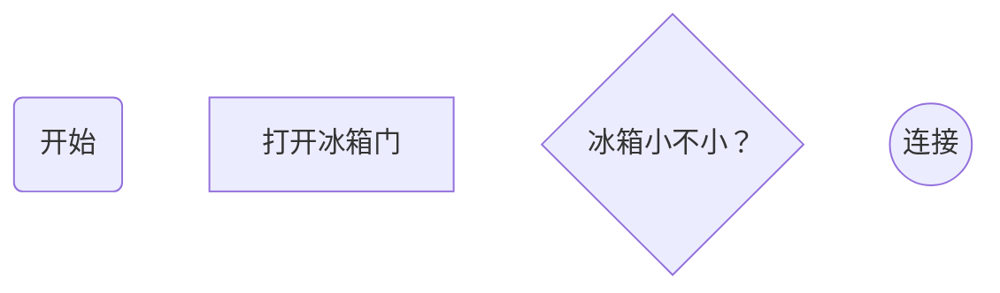

# 前言

在Markdown中，我们可以指定代码块的解析语言并使用代码来绘制图形。

Markdown中可以绘制流程图、时序图与甘特图：

- 流程图——指定 `mermaid`（样式流程图）或 `flow`（标准流程图）解析语言
- 时序图——指定 `sequence`（标准时序图）或`mermaid`（样式时序图）解析语言
- 甘特图——指定 `mermaid` 解析语言

# 流程图

## 样式流程图

基本语法：

- `graph` 指定流程图方向：`graph LR` 横向，`graph TD` 纵向
- 

