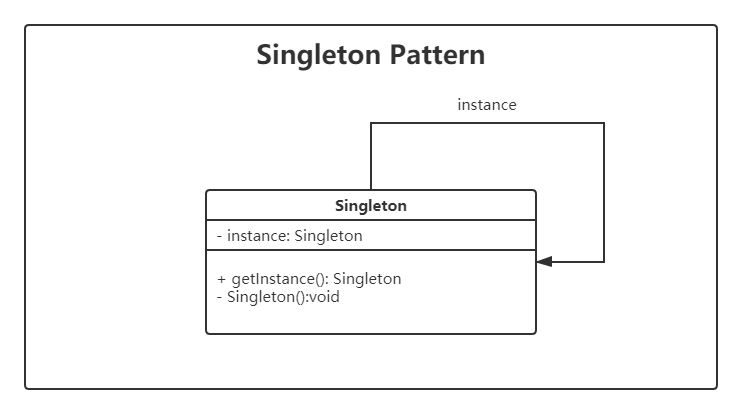

# 设计模式 - 单例(Singleton)

> 设计模式是一种思想，适用于任何一门面向对象的语言

## 单例模式的定义

单例模式在程序设计中非常的常见, 一般来说,某些类,我们希望在程序运行期间有且只有一个实例,原因可能是该类的创建需要消耗资源。

单例设计模式解决的问题就是：保证类的对象在内存中唯一。

## 单例模式的特点

- 单例类只能有一个实例
- 单例类必须自行创建单例对象
- 单例类对外提供一个访问该单例的全局访问点

## 类图

使用一个私有构造函数、一个私有静态变量以及一个公有静态函数来实现。

私有构造函数保证了不能通过构造函数来创建对象实例，只能通过公有静态函数返回唯一的私有静态变量。



## 单例模式常见写法：

###  1、懒汉式-线程不安全

以下实现中，私有静态变量 `INSTANCE` 被延迟实例化，这样做的好处是，如果没有用到该类，那么就不会实例化 `INSTANCE`，从而节约资源。

```java
public class Singleton {
    public static Singleton INSTANCE;
    public static Singleton getInstance() {
        if (INSTANCE == null) {
            INSTANCE = new Singleton();
        }
        return INSTANCE;
    }
    private Singleton() {}
}
```

这个实现在多线程环境下是不安全的，如果多个线程能够同时进入 `if (INSTANCE == null)` ，并且此时 `INSTANCE` 为 `null`，那么会有多个线程执行 `INSTANCE = new Singleton();` 语句，这将导致实例化多次 `INSTANCE`。

### 2、饿汉式-线程安全

上述懒汉式的实现是线程不安全的，问题在于 `INSTANCE` 在多线程且为`null`时，可能被实例化多次，采取类加载是就去实例化就不会产生线程不安全问题。

但是直接实例化的方式也丢失了延迟实例化带来的节约资源的好处，这样对内存是中浪费。

```java
public class Singleton {
    public static Singleton INSTANCE = new Singleton();
    public static Singleton getInstance() {
        return INSTANCE;
    }
    private Singleton() {}
}
```

### 3、懒汉式-线程安全

以下实现中，对获取单例的方法 `getInstance()` 加 `synchronized` 关键字，进行上锁，那么在一个时间点只能有一个线程能够进入该方法，从而避免了实例化多次 `INSTANCE`。

```java
public class Singleton {
    public static Singleton INSTANCE;

    public static synchronized Singleton getInstance() {
        if (INSTANCE == null) {
            INSTANCE = new Singleton();
        }
        return INSTANCE;
    }
    private Singleton() {}
}
```

上述实现，在多线程中，当一个线程进入该方法之后，其它试图进入该方法的线程都必须等待，即使 `INSTANCE` 已经被实例化了。这会让线程阻塞时间过长，因此该方法有性能问题，且消耗更多的资源，不推荐使用。

### 4、双重校验锁-线程安全

`INSTANCE` 只需要被实例化一次，之后就可以直接使用了。加锁操作只需要对实例化那部分的代码进行，只有当`INSTANCE` 没有被实例化时，才需要进行加锁。

双重校验锁先判断 `INSTANCE` 是否已经被实例化，如果没有被实例化，那么才对实例化语句进行加锁。

```java
public class Singleton {
    public volatile static Singleton INSTANCE;
    public static Singleton getInstance() {
    	// 先检查视力是否存在，如果不存在才进入下面的同步块
        if (INSTANCE == null) {
        	// 同步块，线程安全的创建实例
            synchronized (Singleton.class) {
            	// 再次检查实例是否存在，如果不存在才真正的创建实例
                if (INSTANCE == null) {
                    INSTANCE = new Singleton();
                }
            }
        }
        return INSTANCE;
    }
    private Singleton() {}
}
```

考虑下面的实现，也就是只使用了一个 `if` 语句。在 `INSTANCE == null` 的情况下，如果两个线程都执行了 `if` 语句，那么两个线程都会进入 if 语句块内。虽然在 if 语句块内有加锁操作，但是两个线程都会执行 `INSTANCE = new Singleton();` 这条语句，只是先后的问题，那么就会进行两次实例化。因此必须使用双重校验锁，也就是需要使用两个 `if` 语句：第一个 `if` 语句用来避免 `INSTANCE` 已经被实例化之后的加锁操作，而第二个 `if` 语句进行了加锁，所以只能有一个线程进入，就不会出现 `INSTANCE == null` 时两个线程同时进行实例化操作。

```java
if (INSTANCE == null) {
    synchronized (Singleton.class) {
        INSTANCE = new Singleton();
    }
}
```

`INSTANCE` 采用 `volatile` 关键字修饰也是很有必要的， `INSTANCE = new Singleton();` 这段代码其实是分为三步执行：

1. 为 `INSTANCE` 分配内存空间
2. 初始化 `INSTANCE`
3. 将 `INSTANCE` 指向分配的内存地址

但是由于 JVM 具有指令重排的特性，执行顺序有可能变成 1>3>2。指令重排在单线程环境下不会出现问题，但是在多线程环境下会导致一个线程获得还没有初始化的实例。例如，线程 T<sub>1</sub> 执行了 1 和 3，此时 T<sub>2</sub> 调用 `getInstance()` 后发现 `INSTANCE` 不为空，因此返回 `INSTANCE`，但此时 `INSTANCE` 还未被初始化。

使用 `volatile` 可以禁止 JVM 的指令重排，保证在多线程环境下也能正常运行。

### 5、静态内部类实现

当 `Singleton` 类被加载时，静态内部类 `SingletonHolder` 没有被加载进内存。只有当调用 `getInstance()` 方法从而触发 `SingletonHolder.INSTANCE` 时 `SingletonHolder` 才会被加载，此时初始化 `INSTANCE` 实例，并且 JVM 能确保 `INSTANCE` 只被实例化一次。

这种方式不仅具有延迟初始化的好处，而且由 JVM 提供了对线程安全的支持。

```java
public class Singleton {
    private static class SingletonHolder {
        private static final Singleton INSTANCE = new Singleton();
    }

    public static Singleton getInstance() {
        return SingletonHolder.INSTANCE;
    }
    private Singleton() {}
}
```

### 6、枚举实现

```java
public enum Singleton {
    /**
     * 定义一个枚举的元素，它代表了Singleton的一个实例
     */
    INSTANCE;

    private String name;

    public Object getName() {
        return name;
    }

    public void setName(String name) {
        this.name = name;
    }

    public static void main(String[] args) {
        // 单例测试
        Singleton firstSingleton = Singleton.INSTANCE;
        firstSingleton.setName("first");
        System.out.println(firstSingleton.getName());
        Singleton secondSingleton = Singleton.INSTANCE;
        secondSingleton.setName("second");
        System.out.println(firstSingleton.getName());
        System.out.println(secondSingleton.getName());


        // 反射获取实例测试
        try {
            Singleton[] enumConstants = Singleton.class.getEnumConstants();
            for (Singleton enumConstant : enumConstants) {
                System.out.println(enumConstant.getName());
            }
        } catch (Exception e) {
            e.printStackTrace();
        }
    }
}
```

```html
first
second
second
second
```

该实现可以防止反射攻击。在其它实现中，通过 `setAccessible()` 方法可以将私有构造函数的访问级别设置为 `public`，然后调用构造函数从而实例化对象，如果要防止这种攻击，需要在构造函数中添加防止多次实例化的代码。该实现是由 JVM 保证只会实例化一次，因此不会出现上述的反射攻击。

该实现在多次序列化和序列化之后，不会得到多个实例。而其它实现需要使用 `transient` 修饰所有字段，并且实现序列化和反序列化的方法。

## 反射和序列化破坏单例的解决办法

反射和序列化是破坏单例的两种常见方式，我们在静态内部类的基础上添加解决方案。

### 反射机制破坏单例的解决办法

**通过反射机制创建单例对象**  

```java
public static void main(String[] args) {
	try {
		Class<?> clazz = StaticInnerClassSingleton.class;
		Constructor<?> constructor = clazz.getDeclaredConstructor(null);
		constructor.setAccessible(true);
		Object o1 = constructor.newInstance();
		Object o2 = constructor.newInstance();
		System.out.println(o1);
		System.out.println(o2);
	} catch (NoSuchMethodException | IllegalAccessException | InstantiationException | InvocationTargetException e) {
		e.printStackTrace();
	}
}
```

运行结果，创建出了两个不同地址的实例。

```html
me.hireny.tutorial.design.creational.singleton.Singleton@30c7da1e
me.hireny.tutorial.design.creational.singleton.Singleton@5b464ce8
```

**分析：**  

I 首先，可以很明显的看出来是创建了两个不同的实例，打印的地址不同
II 解决方式，暴力解决，在构造方法中判断实例是否为`null`，如果不为`null`，直接抛出异常。

```java
public class Singleton {
    private static class SingletonHolder {
        private static final Singleton INSTANCE = new Singleton();
    }
    public static Singleton getInstance() {
        return SingletonHolder.INSTANCE;
    }

    private Singleton() {
        if (SingletonHolder.INSTANCE != null) {
            throw new RuntimeException("此类为单例模式，不允许创建多个实例，请使用静态方法getInstance()获取实例对象。");
        }
    }
}
```

III 再次运行反射创建对象结果：

```html
java.lang.reflect.InvocationTargetException
	at java.base/jdk.internal.reflect.NativeConstructorAccessorImpl.newInstance0(Native Method)
	at java.base/jdk.internal.reflect.NativeConstructorAccessorImpl.newInstance(NativeConstructorAccessorImpl.java:62)
	at java.base/jdk.internal.reflect.DelegatingConstructorAccessorImpl.newInstance(DelegatingConstructorAccessorImpl.java:45)
	at java.base/java.lang.reflect.Constructor.newInstance(Constructor.java:490)
	at me.hireny.tutorial.design.creational.singleton.DefenseStaticInnerClassSingleton.main(DefenseStaticInnerClassSingleton.java:42)
Caused by: java.lang.RuntimeException: 不允许创建多个实例
	at me.hireny.tutorial.design.creational.singleton.DefenseStaticInnerClassSingleton.<init>(DefenseStaticInnerClassSingleton.java:25)
	... 5 more
	
Process finished with exit code 0
```

IV 反射创建对象也是通过构造方法，虽然反射可以执行私有的构造方法，但是我们也可以在私有的构造方法中加上逻辑判断提示通过反射创建对象的使用者，这个类被设计成单例模式，不允许创建多个对象，并给出获取对象的正确姿势。

### 序列化和反序列化破坏单例的解决办法

**通过反序列化创建单例**  

```java
public static void main(String[] args) {
	try {
		Singleton singleton = Singleton.getInstance();
		System.out.println(singleton);
		// 将得到的实例序列化到磁盘
		FileOutputStream fos = new FileOutputStream("staticinnerclass.obj");
		ObjectOutputStream oos = new ObjectOutputStream(fos);
		oos.writeObject(singleton);
		oos.flush();
		oos.close();
		
		// 从磁盘反序列化得到实例
		FileInputStream fis = new FileInputStream("staticinnerclass.obj");
		ObjectInputStream ois = new ObjectInputStream(fis);
		DefenseStaticInnerClassSingleton hs = (DefenseStaticInnerClassSingleton) ois.readObject();
		System.out.println(hs);
	} catch (ClassNotFoundException | IOException e) {
		e.printStackTrace();
	}
}
```

运行结果：

```html
me.hireny.tutorial.design.creational.singleton.Singleton@5b464ce8
me.hireny.tutorial.design.creational.singleton.Singleton@7f560810
```

**分析**  

I 两次打印实例地址不同，重新创建了对象（任何一个`readObject`方法，不管是显式的还是默认的，它都会返回一个新键的实例，这个新键的实例不同于该类初始化时创建的实例）
II 解决方法，单例类中新增 `readResolve()` 方法，可以避免实例重复

```java
public class Singleton implements Serializable {
    private static class SingletonHolder {
        private static final Singleton INSTANCE = new Singleton();
    }
    public static Singleton getInstance() {
        return SingletonHolder.INSTANCE;
    }

    private Singleton() {
        if (SingletonHolder.INSTANCE != null) {
            throw new RuntimeException("此类为单例模式，不允许创建多个实例，请使用静态方法getInstance()获取实例对象。");
        }
    }
	/**
     * 防止反序列化获取多个对象的漏洞
     * 无论是实现Serializable接口，或是Externalizable接口，当从I/O流中读取对象时，readResolve()方法都会被调用到。
     * 实际上就是用readResolve()中返回的对象直接替换在反序列化过程中创建的对象。
     * @return
     */
    private Object readResolve() {
        return DefenseStaticInnerClassSingletonHolder.INSTANCE;
    }
}
```

III 再次运行结果：

```html
me.hireny.tutorial.design.creational.singleton.Singleton@5b464ce8
me.hireny.tutorial.design.creational.singleton.Singleton@5b464ce8
```

IV 原因：可以通过查看readObject()源码，看看是如何反序列化创建对象的，这个方法创建完对象之后会通过反射机制判断类中是否有readResolve()方法，如果有readResolve()方法，会通过反射机制调用这个方法。所以当你在单例类中写上readResolve()方法，是能够保证得到的同一个单例的，能够保证单例的全局唯一性。

补充：但是避免不了序列化重复创建对象，实际上我们这种写法只是将反序列化创建的对象覆盖掉了，在执行过程中JVM还是创建了新的对象。


## 总结

我们也看到了，六种单例各有优缺点，以及单例模式中可能存在的问题。
下面我们总结了一下这六种实现方式的优缺点和它们是否存在反射和反序列化攻击的情况。

||懒加载|线程安全|防止反射|防止反序列化|
|:---:|:---:|:---:|:---:|:---:|
|饿汉式|否|是|否|否|
|懒汉式（线程不安全）|是|否|否|否|
|懒汉式（线程安全）|是|是|否|否|
|双重效验锁|是|是|否|否|
|静态内部类|是|是|否|否|
|枚举|否|是|是|是|