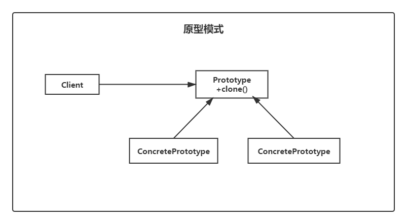

# 原型模式（Prototype）

> 设计模式是一种思想，适用于任何一门面向对象的语言

## 定义

原型模式（Prototype Pattern）用于创建重复的对象，同时又能保证性能。他属于创建型设计模式，它提供了一种创建对象的最佳方法。

这种模式是实现了一个原型接口，该接口用于创建当前对象的克隆。当直接创建对象的代价比较大时，则采用这种模式。

### 类图



- 抽象原型（`Prototype`）：这是一个抽象角色，通常由一个 Java 接口或 Java 抽象类实现。此角色给出所有的具体原型类锁需要的接口。
- 具体原型（`ConcretePrototype`）：被复制的对象。此角色需要实现抽象的原型角色所需要的接口。
- 客户（`Client`）：客户类提出创建对象的请求。

## 实例

```java
public abstract class Prototype {

    abstract Prototype clones();
}
```

```java
public class ConcretePrototype extends Prototype {

    private String name;

    public ConcretePrototype(String name) {
        this.name = name;
    }

    @Override
    Prototype clones() {
        return new ConcretePrototype(name);
    }

    @Override
    public String toString() {
        return new StringJoiner(", ", ConcretePrototype.class.getSimpleName() + "[", "]")
                .add("name='" + name + "'")
                .toString();
    }
}
```

```java
public class Test {
    public static void main(String[] args) {
        Prototype p1 = new ConcretePrototype("小明");
        Prototype p2 = p1.clones();
        System.out.println(p1 == p2);
    }
}
```

```shell
ConcretePrototype[name='小明']
false
```

因为这个模式使用频繁，所以 Java 已经封装好了，我们只需要掌握使用即可。

我们需要在使用原型模式的类上实现 `Cloneable` 接口，并重写 `clone` 方法即可

```java
public class ConcretePrototype implements Clone {
	...
    @Override
    public Prototype clone() throws CloneNotSupportedException {
        return super.clone();
    }
    ...
}
```

此时的客户端代码如下：

```java
public class Test {
    public static void main(String[] args) throws CloneNotSupportedException {
        ConcretePrototype p1 = new ConcretePrototype("小明");
        ConcretePrototype p2 = p1.clone();
        System.out.println(p1 == p2);
    }
}
```

输出结果如下：

```shell
ConcretePrototype[name='小明']
false
```

## 优缺点

**优点**  

提高性能。

**缺点**  

已有类没有写相应的 `clone` 方法，较为麻烦。

## 使用场景

- 资源优化场景。
- 类初始化需要消耗非常多的资源，这个资源包括数据、硬件资源等。
- 性能和安全要求的场景。
- 通过 `new` 产生一个对象需要非常频繁的数据准备或访问权限，则可以使用原型模式。
- 一个对象多个修改者的场景。
- 一个对象需要提供给其它对象访问，而且各个调用者可能都需要修改其值时，可以考虑使用原型模式拷贝多个对象供调用者使用。
- 在实际项目中，原型模式很少单独出现，一般是和工厂模式一起出现，通过 `clone` 方法创建一个对象，然后由工厂方法提供给调用者。