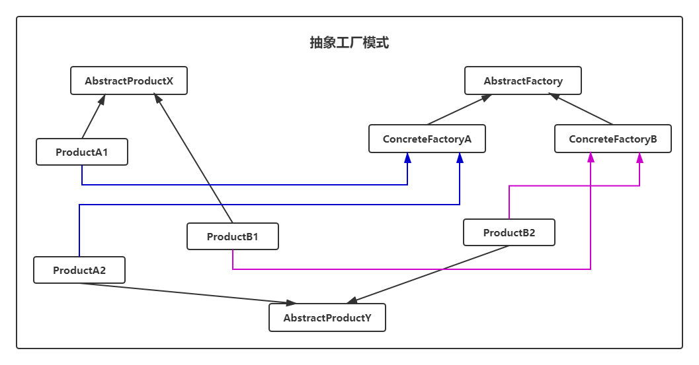

# 抽象工厂模式（Abstract Factory）

> 设计模式是一种思想，适用于任何一门面向对象的语言


## 定义

抽象工厂模式：为创建一组相关或相互依赖的对象提供一个接口，而且无需指定它们的具体类。

抽象工厂模式是工厂方法模式的升级版本。

抽象工厂模式创建的是对象家族，也就是很多对象而不是一个对象，并且这些对象是相关的，也就是说必须一起创建出来。而工厂模式只是用于创建一个对象，这和抽象工厂模式有很大不同。

### 类图



- 抽象产品X（`AbstractProductX`）：提供抽象方法供具体产品类实现生产产品x
- 抽象产品Y（`AbstractProductY`）：提供抽象方法供具体产品类实现生产产品y
- 具体产品A1（`ProductA1`）：继承`AbstractProductX`，A1类生产产品x
- 具体产品B1（`ProductB1`）：继承 `AbstractProductX`，B1类生产产品x
- 具体产品A2（`ProductA2`）：继承 `AbstractProductY`，A2类生产产品y
- 具体产品B2（`ProductB2`）：继承 `AbstractProductY`，B2类生产产品y
- 抽象工厂（`AbstractFactory`）：用于声明抽象产品的方法
- 具体工厂A（`ConcreteFactoryA`）：用于生成A1类产品x与A2类产品y
- 具体工厂B（`ConcreteFactoryB`）：用于生成B1类产品x与B2类产品y


## 实例

```java
public abstract class Noodles {

    /**
     * 生产面条
     */
    public abstract void start();
}
```

```java
public class LanzhouNoodles extends Noodles {
    @Override
    public void start() {
        System.out.println("生产兰州面条");
    }
}
```

```java
public class RiceNoodles extends Noodles {
    @Override
    public void start() {
        System.out.println("生产米线面条");
    }
}
```

```java
public abstract class Soup {
    /**
     * 生产汤
     */
    public abstract void start();
}
```

```java
public class LanzhouSoup extends Soup {
    @Override
    public void start() {
        System.out.println("生产兰州拉面汤");
    }
}
```

```java
public class RiceSoup extends Soup {
    @Override
    public void start() {
        System.out.println("生产米线汤");
    }
}
```

```java
public abstract class AbstractFactory {

    /**
     * 创建面条产品
     * @return
     */
    protected abstract Noodles createNoodles();

    /**
     * 创建汤类产品
     * @return
     */
    protected abstract Soup createSoup();
}
```

```java
public class LanzhouNoodlesFactory extends AbstractFactory {
    @Override
    protected Noodles createNoodles() {
        // 生产兰州面条
        return new LanzhouNoodles();
    }

    @Override
    protected Soup createSoup() {
        // 生产兰州汤
        return new LanzhouSoup();
    }
}
```

```java
public class RiceNoodlesFactory extends AbstractFactory {
    @Override
    protected Noodles createNoodles() {
        // 生产米线面条
        return new RiceNoodles();
    }

    @Override
    protected Soup createSoup() {
        // 生产米线汤类
        return new RiceSoup();
    }
}
```

```java
public class Test {
    public static void main(String[] args) {
        LanzhouNoodlesFactory f1 = new LanzhouNoodlesFactory();
        RiceNoodlesFactory f2 = new RiceNoodlesFactory();

        // 生产兰州面条
        Noodles lanzhouNoodles = f1.createNoodles();
        lanzhouNoodles.start();
        // 生产米线面条
        Noodles riceNoodles = f2.createNoodles();
        riceNoodles.start();

        // 生产兰州拉面汤
        Soup lanzhouSoup = f1.createSoup();
        lanzhouSoup.start();
        // 生产米线汤
        Soup riceSoup = f2.createSoup();
        riceSoup.start();
    }
}
```

输出结果：

```shell
生产兰州面条
生产米线面条
生产兰州拉面汤
生产米线汤
```

## 工厂方法模式和抽象工厂模式比较

工厂方法模式中的每一个形态都是针对一定的问题的解决方案，真多的是多个产品系列结构；而抽象工厂模式针对的是多个产品族结构，一个产品族内有多个产品系列。

## 优缺点

### 优点

- 具体产品在应用层代码隔离，无需关心创建细节
- 将一系列的产品族统一到一起创建

### 缺点

- 规定了所有可能被创建的产品集合，产品族中扩展新的产品困难，需要修改抽象工厂的接口
- 增加了系统的抽象性和理解难度

## 使用场景

适合于产品之间相互关联、相互依赖且相互约束的地方需要动态切换产品族的地方
