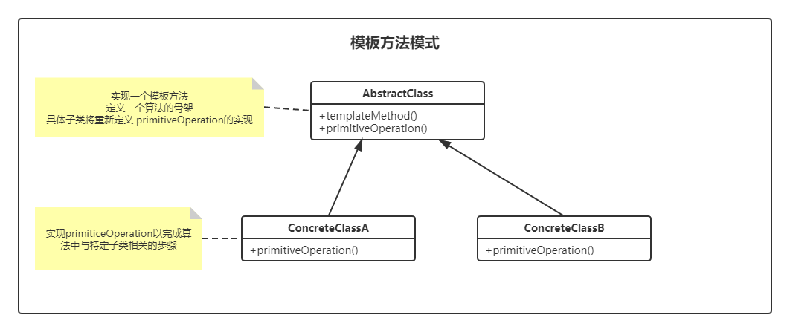

# 模板方法模式（Template）

> 设计模式是一种思想，适用于任何一门面向对象的语言
> 

## 定义

定义算法框架，并将一些步骤的实现延迟到子类。

通过模板方法，子类可以重写定义算法的某些步骤，而不用改变算法的结构。

### UML



## 实例

冲咖啡和泡茶都有类似的流程，但是某些步骤会有不一样，要求复用那些相同步骤的代码。

```java
public abstract class CaffeineBeverage {

    /**
     * 模板方法，用来控制泡茶与重咖啡的流程
     * 声明为final，不希望子类覆盖这个方法，防止更改流程的执行顺序
     */
    public final void prepareRecipe() {
        // 煮水
        boilWater();
        // 冲泡
        brew();
        // 倒入杯中
        pourInCup();
        // 添加调味品
        if (customerWantsCondiment()) {
            // 如果顾客需要添加调料，我们才会调用 addCondiment() 方法
            addCondiment();
        }
    }

    /*
     将brew()、addCondiment()声明为抽象类，具体操作由子类实现
     */

    /**
     * 冲泡
     */
    abstract void brew();

    /**
     * 添加调味品
     */
    abstract void addCondiment();

    /**
     * 煮水
     */
    void boilWater() {
        System.out.println("煮水 Boiling water...");
    }

    /**
     * 倒入杯中
     */
    void pourInCup() {
        System.out.println("将水倒入杯中 Pouring into Cup...");
    }

    public boolean customerWantsCondiment() {
        return true;
    }
}
```

```java
public class Coffee extends CaffeineBeverage {
    @Override
    void brew() {
        System.out.println("煮咖啡 Coffee.brew");
    }

    @Override
    void addCondiment() {
        System.out.println("咖啡中添加佐料 Coffee.addCondiment");
    }
}
```

```java
public class Tea extends CaffeineBeverage {
    @Override
    void brew() {
        System.out.println("泡茶 Tea.brew");
    }

    @Override
    void addCondiment() {
        System.out.println("茶水添加佐料 Tea.addCondiment");
    }
}
```

```java
public class Test {
    public static void main(String[] args) {
        CaffeineBeverage caffeineBeverage = new Coffee();
        caffeineBeverage.prepareRecipe();
        System.out.println("---------");
        caffeineBeverage = new Tea();
        caffeineBeverage.prepareRecipe();
    }
}
```

```shell
煮水 Boiling water...
煮咖啡 Coffee.brew
将水倒入杯中 Pouring into Cup...
咖啡中添加佐料 Coffee.addCondiment
---------
煮水 Boiling water...
泡茶 Tea.brew
将水倒入杯中 Pouring into Cup...
茶水添加佐料 Tea.addCondiment
```

## 优缺点

**优点**  

- 封装不变的部分，扩展可变的部分。把认为是不变的部分的算法封装到父类，可变部分交由子类来实现。
- 提取公共部分的代码，行为由父类控制，子类实现。

**缺点**  

- 抽象类定义了部分抽象方法，这些抽象的方法由子类来实现，子类执行的结果影响了父类的结果（子类对父类产生了影响），会带来阅读代码的难度。

## 使用场景

实现一些操作时，整体步骤很固定，但是呢。就是其中一小部分容易变，这时候可以使用模板方法模式，将容易变的部分抽象出来，供子类实现。

其中，各个框架中，都有模板方法模式的影子。

数据库访问的封装、`Junit`单元测试、`servlet`中关于`doGet/doPost`方法的调用

`Hibernate`中模板程序、`spring`中`JDBCTemplate`，`HibernateTemplate`等等