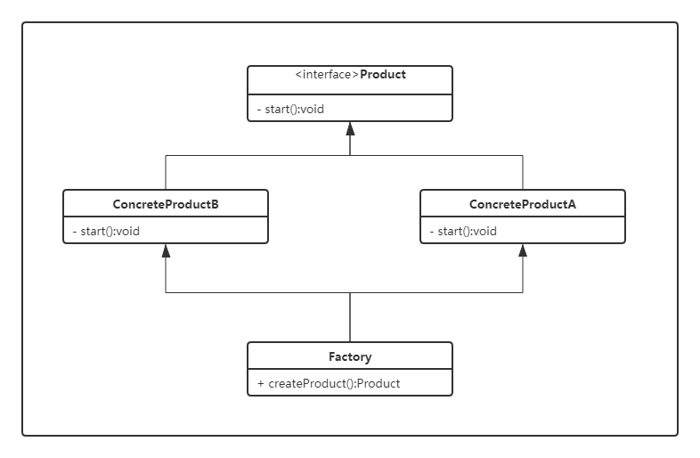

# 简单工厂模式（Simple Factory）

> 设计模式是一种思想，适用于任何一门面向对象的语言

## 简单工厂模式的定义

简单工厂模式（Simple Factory Pattern）：又称为静态工厂方法（Static Factory Method）模式，它属于类创建型模式。是由一个工厂类来实例化具体的子类。

### 类图



- `Product`：抽象产品类，简单工厂模式所创建的所有对象的父类，它负责描述所有实例所共有的公共接口。
- `ConcreteProduct`：具体的产品类，是简单工厂模式的创建目标。
- `Factory`：工厂类，简单工厂模式的核心，它负责实现创建所有实例的内部逻辑。工厂类的创建产品类的方法可以被外界直接调用，创建所需的产品对象。

## 简单工厂模式实例

```java
public interface Product {
    /**
     * 产品的抽象方法，有具体的产品类去实现
     */
    void start();
}
```

```java
public class SlicedNoodlesProduct implements Product {
    @Override
    public void start() {
        System.out.println("生产刀削面");
    }
}
```

```java
public class RiceNoodlesProduct implements Product {
    @Override
    public void start() {
        System.out.println("生产米线");
    }
}
```

以下的 Test  类包含了实例化的代码，这是一种错误的实现。如果在客户类中存在这种实例化代码，就需要考虑将代码放到简单工厂中。

```java
public class Test {

    public static void main(String[] args) {
        String type = 米线;
        Product product;
        if (type == “刀削面”) {
            product = new SlicedNoodlesProduct();
        } else if (type == “米线”) {
            product = new RiceNoodlesProduct();
        }
        // do something with the product
    }
}
```

以下的 SimpleFactory 是简单工厂实现，它被所有需要进行实例化的客户类调用。

```java
public class SimpleFactory {

    public static Product createProduct(String type) {
        Product product = null;
        switch (type) {
            case "刀削面":
                product = new SlicedNoodlesProduct();
                break;
            case "米线":
                product = new RiceNoodlesProduct();
                break;
        }
        return product;
    }
}
```

```java
public class Test {
    public static void main(String[] args) {
        SimpleFactory.createProduct("米线").start();
    }
}
```

## 简单工厂模式的优缺点

- 优点：使用户根据参数获得对应的类实例，避免直接实例化类，降低了耦合性
- 缺点：可实例化的类型在编译期间已经被确定，一旦新增子类，则需要修改工厂，违背了开放封闭原则（OCP）。简单工厂需要知道所有要生成的类型，当具体产品类过多时不适合使用。

## 使用场景

- 工厂类负责创建的对象明确且比较少
- 客户只需要传进工厂类的参数，对如何创建对象不关系
