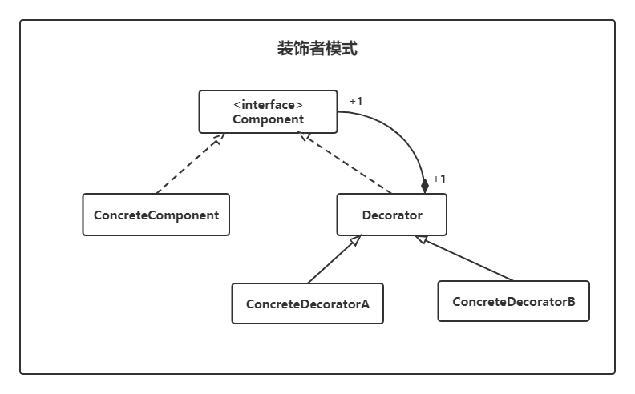
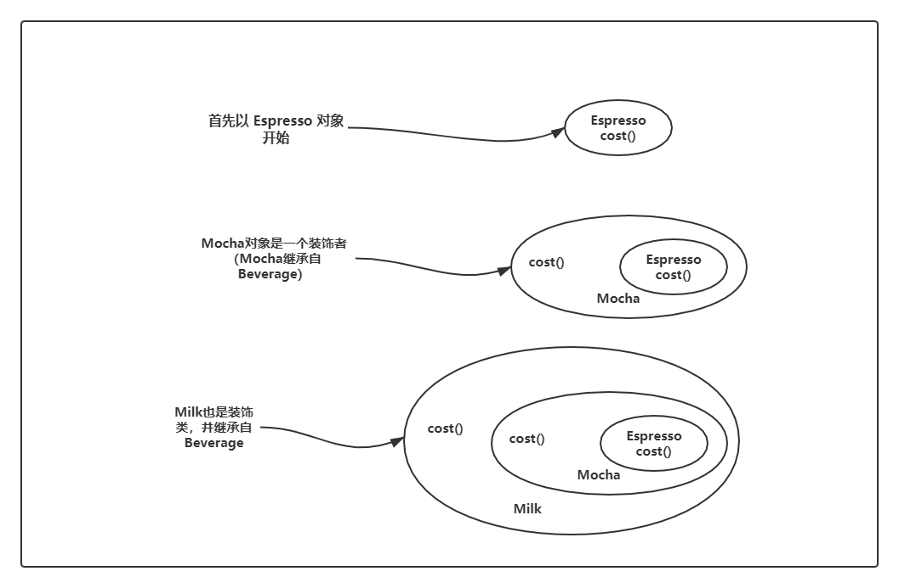
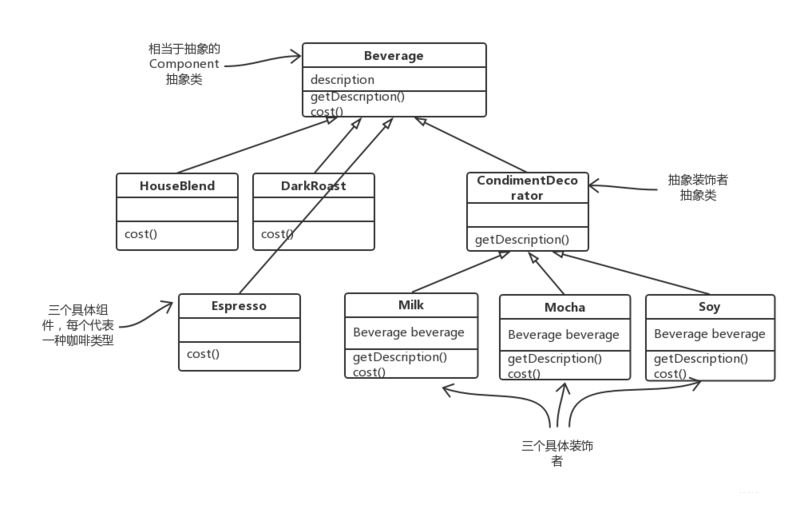
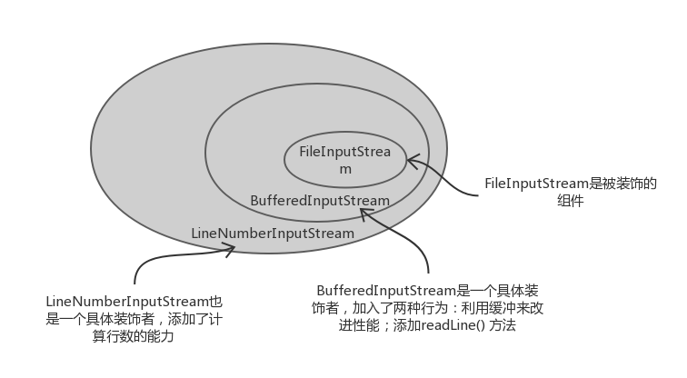
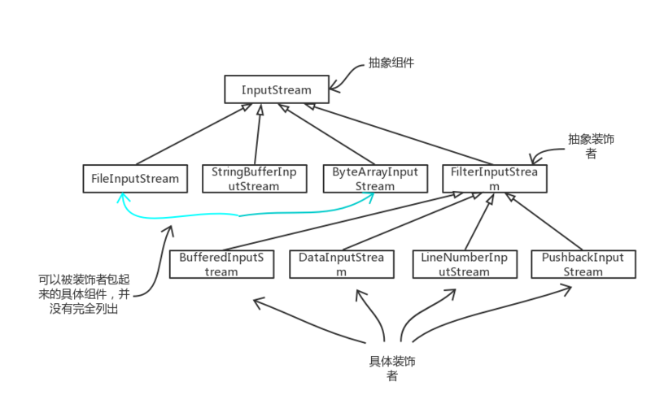

# 装饰者模式（Decorator）

> 设计模式是一种思想，适用于任何一门面向对象的语言
> 

## 定义

装饰者模式指的是在不必改变原类文件和使用继承的情况下，动态地扩展一个对象的功能。它是通过创建一个包装对象，也就是装饰者来包裹真实的对象。

所以装饰者可以动态地将责任附加到对象上。若要扩展功能，装饰者提供了比继承更有弹性的方案。

### 类图



- `Component`（被装饰对象的基类）：抽象组件，定义一个抽象接口或抽象类，可以给这些对象动态地添加职责。
- `ConcreteComponent`（具体被装饰对象）：定义一个具体的组件对象，可以给这个对象添加一些职责。
- `Decorator`（装饰者抽象类）：装饰者共同要实现的类，可以是接口，也可以是抽象类；实现`Component`抽象组件。
- `ConcreteDecorator`（具体装饰者）：具体的装饰对象，持有一个 `Component` 对象，给内部持有的 `Component`，增加具体的职责。

## 实例

设计不同种类的饮料，饮料可以添加配料，比如可以添加牛奶，并且支持动态添加新配料，比如可以添加牛奶，并且支持动态添加新配料。每增加一种配料，该饮料的价格就会增加，要求计算一组饮料的价格。

将装饰者模式应用到问题中去：假如我们想要摩卡和牛奶的浓咖啡，那么，要做的是：

1. 拿一个浓咖啡（`Espresso`）对象
2. 以摩卡（`Mocha`）装饰它
3. 以牛奶（`Milk`）装饰它
4. 调用 `cost()` 方法，并依赖委托将调料的价钱加上去





饮料 `Beverage` 抽象类（抽象组件）

```java
public abstract class Beverage {
    
    String description = "Unknown Beverage";
    
    public String getDescription() {
        return description;
    }
    
    public abstract double cost();
}

```

浓咖啡 `Espresso` 类（具体组件）

```java
public class Espresso extends Beverage {
    
    public Espresso() {
        description = "Espresso ";
    }
    
    @Override
    public double cost() {
        return 1.99;
    }
}
```

黑咖啡 `HouseBlend` 类（具体组件）

```java
public class HouseBlend extends Beverage {
    
    public HouseBlend() {
        description = "House Blend Coffee ";
    }
    
    @Override
    public double cost() {
        return 1;
    }
}
```

调料 `CondimentDecorator` 抽象类（抽象装饰组件）

```java
public abstract class CondimentDecorator extends Beverage {

    @Override
    public abstract String getDescription();
}
```

摩卡 `Mocha` 类（具体装饰组件）

```java
public class Mocha extends CondimentDecorator {
    
    private Beverage beverage;   // 用一个实例变量来记录饮料，也就是被装饰者

    public Mocha(Beverage beverage) {
        this.beverage = beverage;   // 通过构造函数将被装饰者实例化
    }

    @Override
    public double cost() {
        return 0.2 + beverage.cost();   // 计算摩卡饮料的价钱，为摩卡价钱 + 饮料价钱
    }

    @Override
    public String getDescription() {
        return beverage.getDescription() + ", Mocha ";  // 用来加上调料，一起描述饮料
    }
}
```

牛奶 `Milk` 类（具体装饰组件）

```java
public class Milk extends CondimentDecorator {
    
    private Beverage beverage;

    public Milk(Beverage beverage) {
        this.beverage = beverage;
    }

    @Override
    public double cost() {
        return 1.0 + beverage.cost();
    }

    @Override
    public String getDescription() {
        return beverage.getDescription() + ", Milk ";
    }
}
```

测试代码

```java
public class Test {
    public static void main(String[] args) {
        // 简单要一杯黑咖啡
        Beverage beverage = new HouseBlend();
        System.out.println(beverage.getDescription() + "$" + beverage.cost());

        // 两份摩卡加一份牛奶的黑咖啡
        beverage = new Mocha(beverage);
        beverage = new Mocha(beverage);
        beverage = new Milk(beverage);
        System.out.println(beverage.getDescription() + "$" + beverage.cost());

        beverage = null;

        // 一份摩卡加一分牛奶的浓咖啡
        beverage = new Espresso();
        beverage = new Mocha(beverage);
        beverage = new Milk(beverage);
        System.out.println(beverage.getDescription() + "$" + beverage.cost());
    }
}

/**
 * 输出结果
 * House Blend Coffee $1.0
 * House Blend Coffee , Mocha , Mocha , Milk $2.4
 * Espresso , Mocha , Milk $3.19
 */
```

**装饰者模式问题总结**  

- 装饰者与被装饰对象有相同的基类（`Espresso`与装饰类 `Mocha` 和 `Milk` 都继承自 `Beverage`（饮料））。
- 可以使用一个或多个装饰对象包装一个对象。
- 因为装饰者与被装饰者具有相同的基类，所以在任何需要原始对象的情况下，都可以用装饰过的对象去代替它。
- 装饰者可以在所委托被装饰者的行为之前与之后，加上自己的行为，以达到特定的目的。
- 对象可以在任何时候被装饰，所以在运行时动态地、不限量地用你喜欢的装饰者去装饰对象。

## 优缺点

**优点**  

- 装饰类与被装饰类是可以独立的，低耦合的。
- 装饰模式是继承的一种替代方案，无论包装多少层，返回的对象都是 is-a 的关系。
- 实现动态扩展，只要继承了装饰器就可以动态扩展想要的功能。

**缺点**  

产生了太多的装饰者类，提高了系统的复杂度。

## 应用场景

- 需要扩展一个类的功能，或者给一个类增加附加功能。
- 需要动态地给一个对象增加功能，这些功能可以再动态地撤销。
- 需要增加由一些基本功能的排列组合而产生的非常大量的功能，从而使继承关系变的不现实。
- 当不能采用生成子类的方式进行扩充时，可能有大量独立的扩展，为支持每一种组合将产生大量的子类，使得子类数目呈爆炸性增长。

## 代理模式和装饰者模式的区别

装饰者模式：以对客户端透明的方式扩展对象的功能，是继承关系的一个替代方案；
代理模式：给一个对象提供一个代理对象，并有代理对象来控制对原有对象的引用

装饰者模式应该为所装饰的对象增加功能；代理模式对代理的对象施加控制，并不提供对象本身的增强功能。

## 装饰者模式在JDK中的运用

Java 当中的 IO 是运用了装饰者模式的最典型的例子。

### 了解 Java I/O 装饰者模式

在了解了装饰者模式之后， I/O 相关的类对你来说就更有意义了，因为这其中很多类都是装饰者。比如下面相关的类



装饰 I/O 类



### 自定义 Java I/O 装饰者

问题描述：读取文件，把输出流内的所有大写字符转为小写。


```java
/**
 * 扩展 FilterInputStream，这是所有 InputStream 的抽象装饰者
 */
public class LowerCaseInputStream extends FilterInputStream {
    protected LowerCaseInputStream(InputStream in) {
        super(in);
    }

    @Override
    public int read() throws IOException {
        int c = super.read();
        return (c == -1 ? c : Character.toLowerCase(c));
    }

    @Override
    public int read(byte[] b, int off, int len) throws IOException {
        int result = super.read(b, off, len);
        for (int i = off; i < off + result; i++) {
            b[i] = (byte) Character.toLowerCase(b[i]);
        }
        return result;
    }
}
```

```java
public class InputTest {
    public static void main(String[] args) {
        int c = 0;
        InputStream in = null;

        try {
            // 设置 FileInputStream，先用 BufferedInputStream 装饰它，再用 LowerCaseInputStream  进行装饰
            in = new LowerCaseInputStream(
                    new BufferedInputStream(
                            new FileInputStream("test.txt")));
            while ((c = in.read()) >= 0) {
                System.out.print((char)c);
            }
            in.close();
        } catch (IOException e) {
            e.printStackTrace();
        }
    }
}

/** 在文件中为 "HELLO WORLD"
 *
 * 输出
 * hello world
 */
```