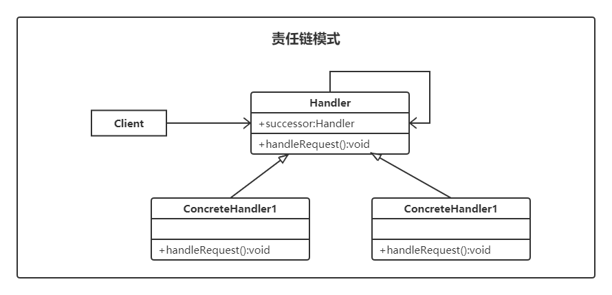

# 责任链模式（Chain Of Responsibility）

> 设计模式是一种思想，适用于任何一门面向对象的语言

## 定义

责任链模式（称职责链模式）将请求的处理对象像一条长链一般组合起来，形成一条对象链。请求并不知道具体执行请求的对象是哪个，这样就实现了请求与处理对象之间的解耦。

### 特点

- 接收请求的对象连接成一条链，对象之间存在层级关系。
- 这些对象可处理请求，也可传递请求，直到有对象处理该请求。

### UML



- 抽象处理角色（`Handler`）：定义出一个处理请求的接口或者抽象类，提供了处理请求的方法和设置下一个处理者的方法。
- 具体处理角色（`ConcreteHandler`）：实现或者继承 `Handler`，具体处理者接到请求后，可以选择处理，或者传递到下一个处理者。由于具体处理者持有下一个处理者的引用，因此，如果需要，具体处理者可以访问下一个处理者。

**什么是链？**  

- 链是多个节点的有序集合。
- 链的各节点可灵活拆分在重组。

## 实例

用责任链模式设计一个请假条审批模块。

分析：加入规定学生请假小于或等于 3 天，辅导员可以批准；小于或等于 7 天，系主任可以批准；小于或等于 10 天，院长可以批准；小于或等于 15 天，校长可以批准；其它情况不予批准；这个实例适合使用责任链模式实现。

首先，定义一个抽象类 `Handler` ，相当于领导类，包含一个指向下一位的处理器 `successor` 和一个处理假条的抽象处理方法 `handleRequest(LeaveRequest request)`；然后，定义辅导员（`Instructor`）、系主任（`DepartmentHead`）、院长（`Dean`）和校长（`President`），它们是抽象处理者的子类，是具体处理者，必须根据自己的权利去实现父类的 `handleRequest()` 方法，如果无权处理就将假条交给下一位具体处理者，直到最后；客户类负责创建处理链，并将假条交给链头的具体处理者（辅导员）。

```java
public abstract class Handler {
    /**
     * 姓名
     */
    protected String name;
    /**
     * 持有后继的责任对象
     */
    private Handler successor;

    public Handler(String name) {
        this.name = name;
    }

    public Handler getSuccessor() {
        return successor;
    }

    public void setSuccessor(Handler successor) {
        this.successor = successor;
    }

    /**
     * 示意处理请求的方法
     */
    public abstract void handleRequest(LeaveRequest request);
}
```

```java
public class InstructorHandler extends Handler {
    public InstructorHandler(String name) {
        super(name);
    }

    @Override
    public void handleRequest(LeaveRequest request) {
        if (request.getNumOfDays() <= 3) {
            // 小于3天的辅导员审批
            System.out.println("辅导员-" + name + "审批" +request.getName() + "同学的请假条,请假天数为" + request.getNumOfDays() + "天。");
        } else {
            // 大于 3 天的假条要传递给下一个处理器（系主任）
            if (this.getSuccessor() != null) {
                this.getSuccessor().handleRequest(request);
            }
        }
    }
}
```

```java
public class DepartmentHeadHandler extends Handler {
    public DepartmentHeadHandler(String name) {
        super(name);
    }

    @Override
    public void handleRequest(LeaveRequest request) {
        if (request.getNumOfDays() <= 7) {
            // 小于7天的系主任审批
            System.out.println("系主任-" + name + "审批" +request.getName() + "同学的请假条,请假天数为" + request.getNumOfDays() + "天。");
        } else {
            // 大于 7 天的假条要传递给下一个处理器（院长）
            if (this.getSuccessor() != null) {
                this.getSuccessor().handleRequest(request);
            }
        }
    }
}
```

```java
public class DeanHandler extends Handler {

    public DeanHandler(String name) {
        super(name);
    }

    @Override
    public void handleRequest(LeaveRequest request) {
        if (request.getNumOfDays() <= 10) {
            // 小于10天的院长审批
            System.out.println("院长-" + name + "审批" +request.getName() + "同学的请假条,请假天数为" + request.getNumOfDays() + "天。");
        } else {
            // 大于 10 天的假条要传递给下一个处理器（校长）
            if (this.getSuccessor() != null) {
                this.getSuccessor().handleRequest(request);
            }
        }
    }
}
```

```java
public class PresidentHandler extends Handler {

    public PresidentHandler(String name) {
        super(name);
    }

    @Override
    public void handleRequest(LeaveRequest request) {
        if (request.getNumOfDays() <= 15) {
            // 小于15天的校长审批
            System.out.println("校长-" + name + "审批" +request.getName() + "同学的请假条,请假天数为" + request.getNumOfDays() + "天。");
        } else {
            // 大于 15 条一律不批准
            System.out.println("请假天数超过15天的，一律不批准...");
        }
    }
}
```

请假请求

```java
public class LeaveRequest {
    private String name;    // 请求人姓名
    private int numOfDays;  // 请求天数

    public LeaveRequest(String name, int numOfDays) {
        this.name = name;
        this.numOfDays = numOfDays;
    }

    public String getName() {
        return name;
    }

    public void setName(String name) {
        this.name = name;
    }

    public int getNumOfDays() {
        return numOfDays;
    }

    public void setNumOfDays(int numOfDays) {
        this.numOfDays = numOfDays;
    }
}
```

测试代码：

```java
public class Test {
    public static void main(String[] args) {
        // 组装责任链
        Handler h1 = new PresidentHandler("赵校长");
        Handler h2 = new DeanHandler("钱院长");
        h2.setSuccessor(h1);
        Handler h3 = new DepartmentHeadHandler("孙主任");
        h3.setSuccessor(h2);
        Handler h4 = new InstructorHandler("李辅导员");
        h4.setSuccessor(h3);


        // 提交请求
        // 周同学请假 2 天
        LeaveRequest request1 = new LeaveRequest("周同学", 2);
        h4.handleRequest(request1);

        // 吴同学请求 7 天
        LeaveRequest request2 = new LeaveRequest("吴同学", 7);
        h4.handleRequest(request2);

        // 郑同学请求 9 天
        LeaveRequest request3 = new LeaveRequest("郑同学", 9);
        h4.handleRequest(request3);

        // 王同学请假 15 天
        LeaveRequest request4 = new LeaveRequest("王同学", 15);
        h4.handleRequest(request4);

        // 小明同学请求 30 天
        LeaveRequest request5 = new LeaveRequest("小明同学", 30);
        h4.handleRequest(request5);
    }
}

/**
 * 输出结果:
 * 
 * 辅导员-李辅导员审批周同学同学的请假条,请假天数为2天。
 * 系主任-孙主任审批吴同学同学的请假条,请假天数为7天。
 * 院长-钱院长审批郑同学同学的请假条,请假天数为9天。
 * 校长-赵校长审批王同学同学的请假条,请假天数为15天。
 * 请假天数超过15天的，一律不批准...
 */
```

## 优缺点

**优点**  

- 降低耦合度：客户端不知道请求由哪个处理者处理，而处理者也可以指派任意的继任者去处理。
- 良好的扩展性：增加处理者的实现很简单，只需重写处理请求业务逻辑的方法

**缺点**  

- 请求从链头出发，直到有处理者响应，在责任链比较长的时候会影响系统性能。
- 请求递归，调试排错比较麻烦。

## 使用场景

- 有多个对象可以处理一个请求，或添加新的处理者。
- 可动态指定一组对象处理请求，或添加新的处理者。
- 在不明确指定请求处理者的情况下，向多个处理者中的一个提交请求。