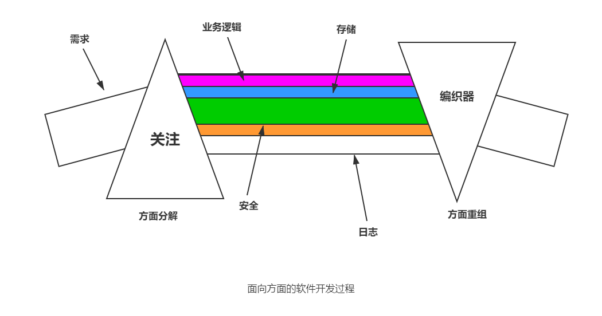

面向对象技术的出现改变了人们编写软件的方法，它将软件需求中的对象抽象出来，一定程度上实现了软件结构的模块化。但随着软件设计的进一步深入，人们逐渐发现对象的抽象并不能完全解决问题。在软件系统的设计过程中，人们首先关注的往往是与系统业务相关的模块，比如银行系统中账户的存取模块、库存管理系统中的货物购置和入库模块，然后会考虑分布在多个核心模块中的公共行为，比如日志记录、安全性、缓存和权限控制等。人们把前者称为核心关注点，后者称为横切关注点。面向对象的编程技术（OOP）可以很好地完成对核心关注点的设计与开发，而对横切关注点却有些力不从心。其原因在于，横切关注点会跨越多个模块，是多维的，而 OOP 的设计方法确实一维的，把多维的需求映射到一维上，便产生了许多需要探讨的问题。

## 面向方面编程

面向方面编程（aspect-oriented programming，AOP）是对软件工程的一种革新性思考，是由施乐公司帕洛阿尔托研究中心（Xerox Palo Alto Research Center）的 Gregor Kiczales 等在 1997 年提出的，主要用来解决横切关注点问题，并开发了第一个 AOP 开发环境 AspectJ。AOP 为开发者提供了一种描述横切关注点的方法，人们可以通过它单独实现横切模块。此外，AOP 还提供了一种机制，使得核心模块和横切模块能够融合在一起，从而构造出最后的实际系统。AOP 用一种边界清晰的方式把横切关注点模块化，产生一个更容易设计、实现和维护的系统架构。与常规的软件开发技术不同的是，常规技术会将这些不同的关注点实现于多个类中，而面向方面编程将使它们局部话。

这里简单介绍 AOP 中的一些基本概念。

**1. 关注点（concern）**

关注点也就是要考察或解决的问题。比如在一个电子商务系统中，订单的处理、用户的验证和用户日志记录等都属于关注点。核心关注点，是指一个系统中的核心功能，也就是一个系统中跟特定业务需求联系最紧密的商业逻辑。除了核心关注点以外，还有一种关注点，它们分散在各个模块中解决同样的问题，这种跨越多个模块的关注点称为横切关注点或交叉关注点（crosscutting concerns）。在一个电子商务系统中，用户验证、日志管理、事务处理、数据缓存都属于交叉关注点。

**2. 方面（aspect）**

方面是一个抽象的概念，从软件的角度来说是指在应用程序不同模块中的某一个领域或方面。从程序抽象的角度来说，可以对照 OOP 中的类来理解。OOP 中的类（class）是实现世界模板的一个抽象，它包括方法、属性、实现的接口、继承等。而 AOP 中的方面是实现世界领域问题的抽象，包括属性和方法等。从抽象意义上讲，方面是对软件系统构件的性能和语法产生一定影响的一些属性；从设计上讲是横切系统的一些软件系统级关注点；从实现上讲，是一种程序设计单元，它支持将横切系统的关注点封装在单独的模块单位中，是 AOP 将横切关注点局部化和模块化的实现机制。

**3. 连接点（join point）**

连接点也就是运用程序执行过程中需要插入方面模块的某一点。连接点主要强调的是一个具体的 “点” 的概念。这个点可以是一个方法、属性、构造函数、类静态初始化模块，甚至一条语句。

**4. 织入（weaving）**

织入是指把解决横切问题的方面模块，与系统中的其它核心模块通过一定策略或规则组合在一起的过程。编译器织入是一种常用的织入方法，这种方法使用专门的编译器来编译包括方面模块在内的整个应用程序，在编译的过程中实现织入，这种织入是功能最强大的。编译器织入的 AOP 实现一般都是基于语言扩展的方法，即通过对标准语言进行一些简单的扩展，加入一些专用于处理 AOP 模块的关键字，定义一套语言规范，通过这套语言规范来开发方面模块，使用自己的编译器来生成目标代码或中间代码。

## AOP 语言规范

从抽象的角度看来，一种 AOP 语言要说明下面两个方面：

① 关注点的实现。把每个需求映射为代码，然后，编译器把它翻译成可执行代码，由于关注点的实现以指定过程的形式出现，可以使用传统语言如C、C++、Java等。

② 织入规则规范。怎样把独立实现的关注点组合起来形成最终系统呢？为此，需要建立一种语言来指定组合不同的实现单元已形成最终系统的规则，这种指定织入规则的语言可以实现语言的扩展，也可以是一种完全不同的语言。

AOP 设计的具体步骤如下：

① 对需求规约进行方面（Aspect）分解。

- 确定哪些功能是组件必须实现的，即提取核心关注点。
- 哪些功能可以以方面的形式动态加入到系统组件中去，即提取系统级的横切关注点。

② 对标识出的方面分别通过程序机制实现。

- 构造系统的组件。利用组件语言实现系统的组件。对于 OOP 语言，这些组件可以是类；对于过程化程序设计语言，这些组件可以是各种函数和 API。
- 构造系统的方面。利用一种或多种 AOP 语言实现方面，且 AOP 语言必须提供声明方面的机制。

③ 用方面编织器将所有的单元编排重组在一起，形成最终的可运行系统。

- 为组件语言和 AOP 语言构造相应的语法树；依据方面中的连接点定义对语法树进行连接；在连接的语法树上生成中间文件或目标代码。
- AOP 语言必须提供将方面代码和基础代码织入的机制。
- AOP 语言必须提供生成可运行系统的实现机制。

## AOP 与 OOP 比较

OOP 是 AOP 的技术基础，AOP 是对 OOP 的继承和发展，它们之间区别如下。

**1. 可扩展性**

可扩展性是指软件系统在需求更改时程序的已修改能力。由于切面模块根本不知道横切关注点，所以很容易通过建立新的切面加入新的功能。另外，如果系统中加入新的模块，已有的方面自动横切进来，使系统易于扩展，因此：

① OOP 主要通过提供继承和重载机制来提高软件的可扩展性。
② AOP 通过扩展方面或增加方面，系统相关的各个部分都随之产生变化。

**2. 可重用性**

可重用性指某个应用系统中的元素被应用到其他应用系统的能力。AOP 把每个切面实现为独立的模块，模块之间是松散耦合的。举例来说，可以用另外一个独立的日志写入器方面（替换当前的）把日志写入数据库，以满足不同的日志写入要求。因此：

① OOP 以类机制作为一种抽象的数据类型，提供了比过程化更好的重用性。
② OOP 的重用性对非特定于系统的功能模块有很好的支持，如堆栈的操作和窗口机制的实现。
③ 对于不能封装成类的元素，如异常处理等，很难实现重用。
④ AOP 使不能封装成类的元素的重用成为可能。

总的来说，松散耦合的实现意味着更好的代码重用性。

**3. 易理解性和易维护性**

① 代码集中，易于理解，从而解决了由于 OOP 跨模块造成的代码混乱和代码分散问题。
② AOP 用最小的耦合来处理每个关注点，即使是横切关注点也是模块化的，这样实现的系统，其代码的冗余下，模块化的实现式系统容易理解和维护。

## 面向方面软件开发

面向方面软件开发（aspect-oriented software development，AOSD）使用 AOP 方法，在整个软件生存周期中提供系统化标识、模块化以及横切关注点，为功能需求、非功能需求和平台特性等创造了更好的模块性，便于开发出更易于理解的系统，也更易于配置和扩展，以满足和解决更广泛的需求。

面向方面软件开发可以将需求出现多次的公用代码集中到一处实现，从而大大减少代码的冗余度和耦合度，增强可读性。由于代码修改的后期成本大大减少，设计师再也不必陷入设计不足或者过度设计的两难境地，即使后期出现了额外的需求，也可以将它封装在方面中独立实现，下图是面向方面软件开发的具体过程。

AOSD 包括 3 个清晰的开发步骤：

① 方面分解。分解需求并提取出横切关注点和一般关注点。这一步把核心模块级关注点和系统级的横切关注点分离开来。
② 关注点实现。各自独立地实现这些关注点。
③ 方面的重新组合。在这一步，方面集成器通过创建一个模块单元——方面来指定重组的规则。重组过程（也称织入或结合）则使用这些信息来构建最终系统。