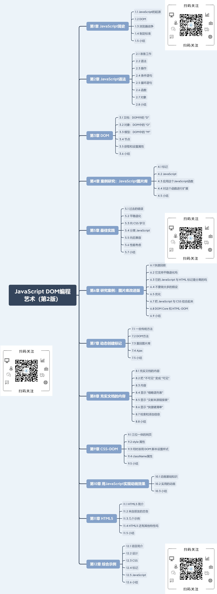

# 介绍

JavaScript DOM编程艺术（第2版）主要讲述了 JavaScript、DOM 和 HTML5 的基础知识，着重讲述了 DOM 编程，并通过几个实例演示了具有专业水准的网页开发。

下面介绍一下各章节的讲到的内容。

# 第1章 JavaScript简史

本章主要讲解JavaScript的发展简史、不同的浏览器会采用不同的办法来完成一样的任务，这会影响JavaScript的发展，而DOM标准化，让这种情况有所改变。而本书要讲的就是JavaScript和DOM一起完成的任务，不需要讨论浏览器。

# 第2章 JavaScript语法

本章主要是在使用`DOM`之前，学习一下JavaScript语法。主要是讲解语法（语句/注释/变量/数据类型/数组/对象/）、用于计算和处理数据的操作符、使用`if/if-else/if-else if-...-else`的条件语句、循环语句、函数等在下面能用到的语法。

# 第3章 DOM

本章主要讲解 DOM 由文档、对象和模型三者组成，和三者在其中表达的意思。还有 DOM 提供了五个方法，用于操作DOM模型：`getElementById/getElementsByTagName/getElementByClassName/getAttribute/setAttribute`。除了上述的这些，还提供了许多其它的属性和方法，如 `nodeName/nodeValue/childNodes/nextSibling/parentNode`等。

# 第4章 案例研究：JavaScript图片库

本章介绍了一个简单的 JavaScript 应用案例，和 DOM 提供的几个新属性：`childNodes/nodeType/nodeValue/firstChild/lastChild`。重点就是如何利用DOM提供的方法去编写图片库脚本和如何利用事件处理函数把JavaScript代码与网页集成在一起。

# 第5章 最佳实践

本章介绍了一些与 DOM 脚本编程工作有关的概念和实践，如平稳退化、分离JavaScript、向后兼容和性能考虑。

# 第6章 案例研究：图片库改进版

本章主要是对上述案例的图片库进行多项优化，将HTML标记变得更加整齐。还提供一个基本的 CSS。还有最重要的JavaScript代码的改进。

- 尽量让JavaScript代码不再依赖于没有保证的假设，为此引入许多项测试和检查。测试和检查能使JavaScript代码能够平稳退化。
- 没有使用 `onkeypress` 事件处理函数，使得JavaScript代码的可访问性得到保证。
- 最重要的是把事件处理函数从标记文档分离到一个外部的JavaScript文件。使得JavaScript代码不再依赖于HTML文档的内容和结构。

# 第7章 动态创建标记

本章主要介绍几种不同的向浏览器的文档动态添加标记的办法。

- `createElement`方法。
- `createTextNode` 方法。
- `appendChild`方法。
- `insertBefore`方法。

并且还简要地回顾两种“传统的”技术：

- `document.write`方法。
- `innerHTML`属性。

使用这些方法的关键是将 Web 文档视为节点树。要注意，用 `createElement/createTextNode`方法创建的节点还没有插入到HTML中。利用 `appendChild/insertBefore`方法，可以将这些`DocumentFragment`对象插入某个文档的节点树，让它们呈现在浏览器窗口中。

这一章还讲到了对图片库如何做进一步改进。这里，有一个实用的 `insertAfter` 函数的构建过程。在需要把一些标记添加到文档时，这个函数往往能帮上忙。

# 第8章 充实文档的内容

本章主要介绍使用 JavaScript 语言和 DOM 去维护和创建标记。用以充实文档的内容。主要是 JavaScript 和 DOM 的使用状况。

# 第9章 CSS-DOM

本章主要介绍 `CSS-DOM` 技术是如何得到和设置 `style` 对象的各种属性，而 `style` 对象本身又是文档中的每个元素节点都具备的属性。

`style` 属性的最大限制是它不支持获取外部 CSS 设置的样式。但仍可以利用 `style` 属性去改变各种 HTML 元素的呈现效果。这在无法或是难以通过外部 CSS 去设置样式的场合非常有用。只要有可能，就应选择更新 `className` 属性，而不是去直接更新 `style` 对象的有关属性。

在本章中，主要介绍了以下几种 `CSS_DOM` 技术的具体应用示例。

- 根据元素在节点树里的位置设置样式（`styleHeaderSiblings`函数）。
- 遍历一个节点集合设置有关元素的样式（`stripeTables`函数）。
- 在事件发生时设置有关元素的样式（`highlightRows`函数）。

这几种应用都属于用 JavaScript 入侵 CSS 领地的情况，而这么做的理由不外乎两点：其一是 CSS 无法找到想要处理的目标元素，其二是用 CSS 寻找目标元素的办法还未得到广泛的支持。

# 第10章 用JavaScript实现动画效果

本章主要讲的是使用 JavaScript 实现动画效果。首先对 “动画” 进行了定义：随时间变化而改变某个元素在浏览器窗口里的显示位置。通过结合使用 `CSS-DOM` 和 JavaScript 的 `setTimeout` 函数，很容易实现一个简单的动画。

在这里，主要是使用 JavaScript 创建的动画，使得图片库能够有平滑的动画效果和平稳退化。

# 第11章 HTML5

本章主要讲解 HTML5 以及使用 Modernizr 等工具检测特性的重要性。同时编写几个例子来熟悉使用 HTML5 的特性。这里介绍的 HTML5 的新特性包括：

- 可以用来在文档中绘制矢量及位图的 `<canvas>` 元素。
- 可以免插件而直接在网页中嵌入音频和视频的 `<audio>` 和 `<video>` 元素。
- 可以提供更广泛选择的新的表单控件类型以及新的属性。

# 第12章 综合示例

本章主要是学以致用，将上面的知识加入到你创建的网站中。这里主要把内容放在有效的、语义化的 HTML5 标签里面，并用外部样式表实现整个外观设计。最后，利用 JavaScript 和 DOM 为它添加诸多交互功能及可用性方面的增强。

到这里就已经学完了书中的内容并应用到实际，构建完整的站点。但是，前端之路也才刚开始，本书只是JavaScript入门书籍，都是围绕 DOM 技术进行编程。

如想获取本资源请按以下步骤操作：

- 识别二维码并关注公众号 「海人的博客」
- 在公众号后台回复关键字 「1367」

