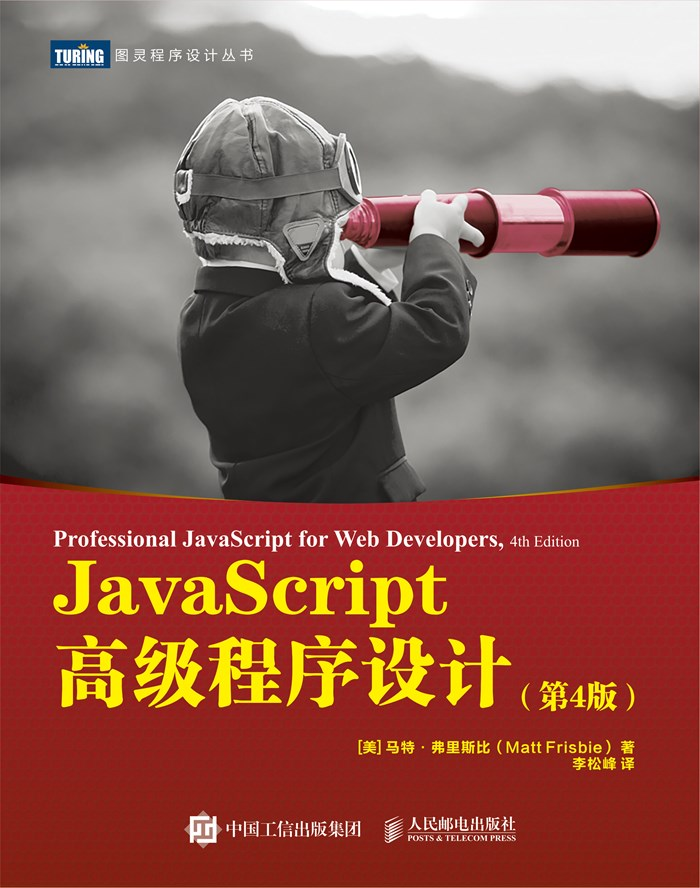

# JavaScript高级程序设计 第四版 PDF

JavaScript高级程序设计 第四版，主要添加了 ES6 相关的知识。

主要内容包括：

- JavaScript 的历史
- 数据类型
- DOM 与 BOM
- 事件
- 客户端数据存储
- JavaScript 设计模式与实践策略
- 关于 ES6 的内容

按以下步骤获取：

1. 识别二维码并关注公总号 「海人的博客」 
2. 在公总号后台回复关键字 「7913」

