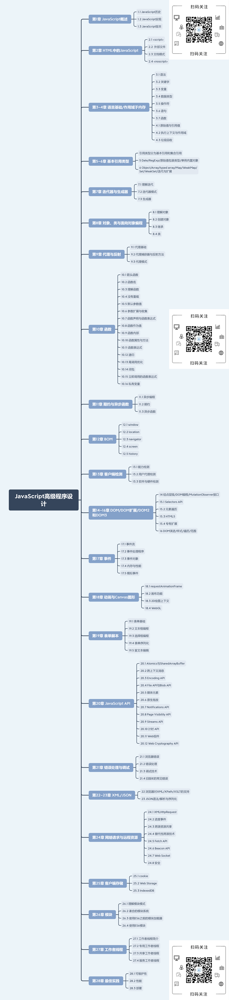

# 介绍

JavaScript高级程序设计 第四版，在第三版的基础上添加了`ES6`相关的内容。如`let`、`const`关键字，`Fetch API`、工作者线程、模块、`Promise` 等。适合具有一定编程经验的 Web 应用开发人员阅读。

下面介绍一下各章节的知识点。

# 第1章 JavaScript概述

这章节主要讲解JavaScript历史回顾，它是在1995年由网景公司的  `Brendan Eich` 工程师开发的 JavaScript 1.0，1997 年，JavaScript 1.1 作为提案提交给 Ecma。TC39 完成了语言标准化 ECMA-262，即 ECMAScript 新的脚本语言标准。1998 年，ISO 和 IEC 也采纳了 ECMAScript 标准。至此以后，ECMAScript就作为 JavaScript 实现的标准。

JavaScript 实现包含 `ECMAScript`、`DOM`、`BOM` 三部分。

# 第2章 HTML中的JavaScript

这章节主要讲述使用 `<script>` 标签将 JavaScript 引入 HTML 中，也可以使用 `<noscript>` 标签用于浏览器不支持脚本或脚本支持被关闭的情况，还有 `defer` 和 `async` 两个属性用于延迟脚本执行和无需等待其它脚本。

# 第3章 语言基础

这章节讲述了JavaScript的语言基础，任何语言的核心都是描述语言在最基本层面上如何工作，其中会涉及语法、操作符、数据类型及内置功能，在此基础上才能构建复杂的解决方案。

# 第4章 变量、作用域与内存

这章节主要是讲述JavaScript变量的两种类型的值：原始值和引用值。在这其中原始值有6中`Undefined/Null/Boolean/Number/String/Symbol`和原始值的特点。变量的作用域决定了变量的生命周期。JavaScript也是使用垃圾回收的编程语言，不需要操心内存分配和回收。

# 第5章 基本引用类型

这章节介绍JavaScript中的对象称为引用值，所有引用类型都继承自`Object`。讲述了几种引用类型的作用和 API，还有三种相较于原始值的包装类型：`Boolean/Number/String`的介绍和特点。代码开始执行时，全局上下文会存在`Global`和 `Math` 两个内置对象。

# 第6章 集合引用类型

这章节介绍了几种 `ECMAScript 6` 中新增的几种引用类型：`Map/WeakMap/Set/WeakSet`。使用这些类型可以简化应用程序的编写和内存管理的新功能。

# 第7章 迭代器与生成器

`ECMAScript 6` 支持迭代模式并引入了迭代器和生成器两种语言特性。迭代器是一个可以由任意对象实现的接口，支持继续获取对象产出的每一个值。任何实现 `Iterable` 接口的对象都有一个 `Symbol.iterator` 属性，这个属性引用默认迭代器。默认迭代器就像一个迭代器工厂，也就是一个函数，调用之后会产生一个实现 `Iterator` 接口的对象。生成器是一种特殊的函数，调用之后会返回一个生成器对象。生成器对象实现了 `Iterable` 接口，并支持 `yield` 关键字，这个关键字能够暂停执行生成器函数。

# 第8章 对象、类与面向对象编程

本章节主要介绍对象的概念、`Object`类的创建`工厂模式/构造函数模式/原型模式/对象迭代`和JavaScript实现继承的方式`原型链/盗用构造函数/组合函数/原型式继承/寄生式继承/寄生式组合继承`，还介绍了 `ECMAScript 6` 中新增的类，其实就是基于原型机制的语法糖。但类的语法可以很优雅地定义向后兼容的类，既可以继承内置类型，也可以继承自定义类型。类有效地跨越了对象实例、对象原型和对象类之间的鸿沟。

# 第9章 代理与反射

`ECMAScript 6` 新增的代理和反射为开发者提供了拦截并向基本操作嵌入额外行为的能力。代理尽管不支持向后兼容，但它是真实JavaScript对象的透明抽象层。可以定义包含捕获器的处理程序对象，而捕获器可以拦截绝大部分 JavaScript 的基本操作和方法。在这个捕获器处理程序汇总，可以修改任何基本操作的行为，前提是遵从捕获器不变式。而反射 API，则封装了一整套与捕获器拦截的操作相对的方法。可以把反射 API 看作一套基本操作，这些操作是绝大部分 JavaScript 对象 API的基础。

代理的应用场景：跟踪属性访问、隐藏属性、组织修改或删除属性、函数参数验证、构造函数参数验证、数据绑定、以及可观察对象。

# 第10章 函数

函数是 JavaScript 编程中最有用的工具。在 `ECMAScript 6` 中更是新增了许多强大的语法特性。

- 函数表达式与匿名函数。
- `ES6` 新增的箭头函数语法、扩展操作符，可以实现函数定义和调用的完全动态化。
- JavaScript 引擎优化符合尾调用条件的函数，节省栈空间等等。

# 第11章 期约与异步函数

`ECMAScript 6` 及以后的几个版本逐步加大了对异步编程机制的支持，新增的期约（`Promise`）和`async`和`await`关键字，实现了异步编程和定义异步函数的机制。

期约的主要功能是为异步代码提供清晰的抽象。可以用期约表示异步执行的代码块，也可以表示异步计算的值。在需要串行异步代码时最为突出。期约可以被序列化、连锁使用、复合、扩展和重组。异步函数可以说是现代 JavaScript 中的最重要的工具之一。

# 第12章 BOM

BOM是指浏览器对象模型，用于表示浏览器窗口和页面可见区域的。最要有 `window/location/navigator/screen/history`几种表示窗口区域的对象。

# 第13章 客户端检测

客户端检测是 JavaScript 中争议最多的话题之一。因为不同浏览器之间存在差异，所以经常需要根据浏览器的能力来编写不同的代码。客户端检测有不少方式，但下面两种用的最多。

- 能力检测。又称特性检测，即在运行时检测浏览器是否支持某种特性的检测逻辑。
- 用户代理检测。通过用户代理字符串确定使用的浏览器。
- 软硬件检测。通过BOM中的一些对象获取操作系统与硬件信息。

# 第14~16章 DOM

这三章主要讲解DOM模型、DOM Level、节点层级及 `Node` 类型，和 Selectors API 用来根据 CSS 选择符匹配 DOM 元素，DOM中的元素遍历，和HTML 与 DOM 交互的核心 API，在HTML5中也提供了DOM扩展，DOM2 和 DOM3 是在 DOM1 的基础上添加了更多的交互能力及更高级的XML特性。

# 第17章 事件

JavaScript 与 HTML 的交互是通过事件实现的，而事件中的事件流分为事件冒泡和事件捕获，DOM想要实现事件就需要与事件进行绑定，而事件绑定分为`HTML/DOM0/DOM2/IE`几种，而发生的事件主要有 `UIEvent/FocusEvent/MouseEvent/WheelEvent/InputEvent/KeyboardEvent/CompositionEvent`等几种类型，还有一些类型这里没有列举。可以使用事件委托和事件移除来减少内存消耗和提供性能。事件是 JavaScript 中最重要的主题之一，理解事件的原理及其对性能的影响非常重要。

# 第18章 动画与 Canvas 图形

本章主要介绍前端绘图和动画的技术，主要是 HTML5 中的 `<canvas>` 元素提供了动态创建创建图形的 API。这种主要是绘制 2D 图形。而 3D 绘图就需使用 WebGL 技术，它是对 OpenGL ES 2.0 的实现。

# 第19章 表单脚本

本章主要介绍了HTML 中 `<form>`、`<select>`、`<option>`、`<input>`、`<textarea>`等元素的使用和富文本编辑。

# 第20章 JavaScript API

本章主要介绍 JavaScript 中比较重要的几种 API，如`Atomics/SharedArrayBuffer/Encoding API/File API/Blob API/<audio>/<video>/Notifications API/Page Visibility`等几种较为重要的API。

# 第21章 错误处理与调试

本章介绍了JavaScript中使用 `try/catch`和 `throw` 语句来处理浏览器错误和一些错误类型，主流浏览器也提供了向用户报告错误的机制。

# 第22~23章 XML/JSON

这两章主要介绍了JavaScript处理XML和JSON两种数据格式，而现在使用较多的是JSON格式，因为它是轻量级的、可以较方便地表示复杂数据结构。在`ECMAScript 5`中定义了原生 JSON 对象，用于将JavaScript对象序列化为 JSON 字符串，以及将JSON数组解析为JavaScript对象。而DOM2中为XML实现了两个类型：

- DOMParser 类型将 XML 字符串解析为 DOM 文档。
- XMLSerializer 类型执行相反操作，将 DOM 文档序列化为 XML 字符串。

DOM3 新增了 XPath API 的规范，可以让JavaScript针对DOM文档执行任何XPath查询并得到不同数据类型的结果。

# 第24章 网络请求与远程调用

本章介绍了Ajax技术和实现Ajax的`XMLHttpRequest`对象，这个对象最早由微软发明并在IE5中引入。之后其余浏览器都复刻了该技术。W3C也在之后将`XMLHttpRequest`加入Web标准。其中也讲述了进度事件。

而`XMLHttpRequest`主要限制是同源策略，访问超出限制之外的资源会导致安全错误，触发使用正式跨域方案CORS，`XMLHttpRequest`原生支持CORS。图片探测和JSONP是另两种跨域通信技术，但没有CORS可靠。

Fetch API 是作为对 `XMLHttpRequest`对象的一种端到端的替代方案而提出的。这个 API 提供了优秀的基于期约的结构、更直接的接口，以及对Stream API 的最好支持。

还有 Web Socket、与服务器全双工、双向通信。但需要专用的服务器，速度优势明显。

# 第25章 客户端存储

本章主要讲述了将数据保存在客户的机器上的存储方式，主要有`cookie/Web Storage/IndexedDB`。

Web Storage定义了`sessionStorage/localStorage`两个对象存储数据。而IndexedDB是类似SQL数据库结构的数据化数据存储机制，但IndexedDB存储的是对象，可以定义键来添加数据，而索引针对特定属性实现更快查询。但因为这些数据没加密，因此要注意别存储敏感信息。

# 第26章 模块

本章介绍了模块模式，它是管理复杂性的永恒工具。分为`ES6`之前的模块模式和`ES6`之后的模块模式，在`ES6之前`，CommonJS和AMD两种实现模块的方式，但它们编写的代码会在很多方面不一致，经常会带有冗余的样板代码。而`ES6`之后重新定义了浏览器模块，集两个系统之长于一身，并通过更简单的声明性语法暴露出来。

# 第27章 工作者线程

本章介绍工作者线程的概念和实现，而工作者线程主要分为：专用工作者线程、共享工作者线程和服务工作者线程。现代浏览器都支持它们。它们非常适合复杂计算和数据处理，特别是需要花较长时间因而会影响用户使用网页的处理任务。

# 第28章 最佳实践

本章主要介绍一些编码习惯、松散耦合和编码惯例来保证JavaScript代码的可维护性，一些可以提高性能的方式还有部署：构建的过程、验证、压缩。

如想获取本资源请按以下步骤操作：

1. 识别二维码并关注公众号 「海人的博客」 
2. 在公众号后台回复关键字 「7913」

