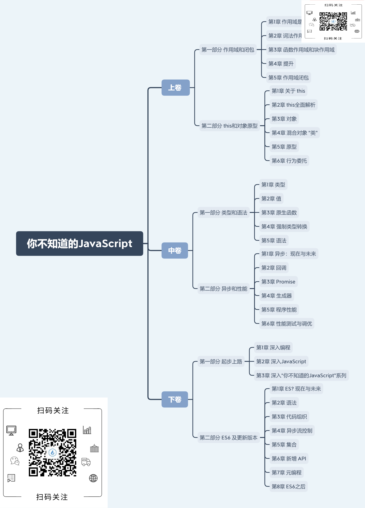

# 介绍

JavaScript语言本质上有许多复杂的概念，但却用一种较简单的方式体现出来，开发者并不会关心内部的实现原理，只需实现需要的功能即可。而本书就是让开发者深入了解JavaScript语言本身的特性，弄清其中每个功能的原理与用途。是本非常值得一看的。

你不知道的JavaScript分为上中下三卷。上卷主要介绍了两个主题：`“作用域和闭包”` 以及`“this和对象原型”`；中卷主要介绍两个主题：`类型和语法` 以及 `异步和性能`；下卷主要介绍两个主题：`起步上路` 以及 `ES6 及更新版本`

# 上卷

## 第一部分 作用域和闭包

### 第1章 作用域是什么

### 第2章 词法作用域

#### 词法查找

全局变量会自动称为全局对象（浏览器中的 window）属性，因此是不可以直接通过全局对象的此法名称，而是间接地通过全局对象属性的应用来对其进行访问 window.a，通过这种方法可以访问那些被同名变量所遮蔽的全局变量。但是如果非全局的变量如果被遮蔽了，无论如何都无法被访问到。

### 第3章 函数作用域和块作用域

### 第4章 提升

### 第5章 作用域闭包

## this和对象原型

### 第1章 关于 this

### 第2章 this全面解析

### 第3章 对象

### 第4章 混合对象“类”

### 第5章 原型

### 第6章 行为委托

# 中卷

## 类型和语法

### 第1章 类型

### 第2章 值

### 第3章 原生函数

### 第4章 强制类型转换

### 第5章 语法

## 异步和性能

### 第1章 异步：现在与未来

### 第2章 回调

### 第3章 Promise

### 第4章 生成器

### 第5章 程序性能

### 第6章 性能测试与调优

# 下卷

## 起步上路

### 第1章 深入编程

### 第2章 深入JavaScript

### 第3章 深入“你不知道的JavaScript”系列

## ES6 及更新版本

### 第1章 ES? 现在与未来

### 第2章 语法

### 第3章 代码组织

### 第4章 异步流控制

### 第5章 集合

### 第6章 新增 API

### 第7章 元编程

### 第8章 ES6 之后

如想获取本资源请按以下步骤操作：

- 识别二维码并关注公众号 「海人的博客」
- 在公众号后台回复关键字 「7511」

