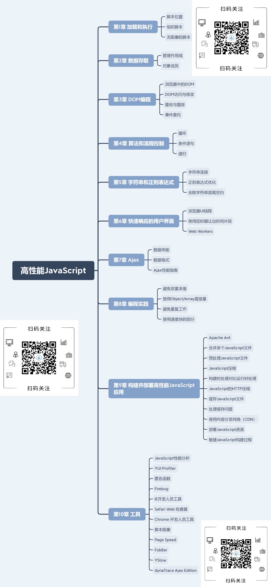

# 介绍

高性能JavaScript主要讲述了通过技术和策略帮助开发者在开发过程中消除性能瓶颈。通过各方面的提升性能，如代码的加载、运行、DOM交互、页面生存周期等。

下面介绍一下各章节的讲到的内容。

# 第1章 加载和执行

本章主要讲解了几种方式来减少 JavaScript 对性能的影响;

- 在 `.html` 中，将 `<script>` 标签放在 `</body>` 闭合之前的底部。
- 减少页面中 `<script>` 标签，将脚本进行合并。
- 无阻塞下载 JavaScript 的方法：`<script>` 标签的 `defer` 属性、动态创建 `<script>` 下载并执行代码、 `XMLHttpRequest` 下载 JavaScript 代码并注入页面中。

通过上面的策略，来提高使用 JavaScript 的 Web 应用的实际性能。

# 第2章 数据存取

本章主要讲解数据存储的位置对代码整体性能的影响。而存储的方式主要有：字面量、变量、数组项、对象成员。下面对几种存储方式的特定进行介绍。

- 字面量和局部变量最快，数组元素和对象成员相对较慢。
- 局部变量在作用域链中的起始位置，因此比跨作用域变量块。而变量的位置越深，速度越慢。因此全部变量是最慢的。
- 避免使用 `with` 和 `try-catch` 语句。
- 嵌套的对象成员影响性能，尽量少用。
- 属性和方法在原型链的位置越深，访问速度越慢。
- 常用的对象成员、数组、跨域变量保存在局部变量中会改善 JavaScript 的性能。

# 第3章 DOM编程

本章主要讲解 DOM 的访问和操作对 JavaScript 性能的影响。要使得 DOM 减少性能损失，就要记住几点：

- 减少 DOM 访问次数。
- 如果需要多次访问 DOM，就使用局部变量存储它的引用。
- HTML 集合要是经常操作，建议拷贝到一个数组中。
- 使用更快的 API，如 `querySelectorAll()` 和 `firstElementChild`。
- 留意重绘和重排，批量修改样式时，“离线” 操作 DOM 数，使用缓存，并减少访问布局信息的次数。
- 动画中使用绝对定位，使用拖放代理。
- 使用事件委托来减少事件处理器的数量。

# 第4章 算法和流程控制

本章主要介绍 JavaScript 的代码写法对性能的影响，因此要优化代码：

- for、while 和 do-while 三种循环基本相当。
- 避免使用 for-in 循环。
- 减少循坏中每次迭代的运算量和迭代次数。
- 通常 switch 比 if-else 快，但判断条件多时，使用查找表。
- 浏览器调用栈大小限制了递归算法在 JavaScript 中的应用，栈溢出错误会导致其他代码终端运行。
- 遇到栈溢出错误，将方法改为迭代算法，或 Memoization 来避免重复计算。

当运行的代码量越多，使用上述情况得到的性能提升会越大。

# 第5章 字符串和正则表达式

# 第6章 快速响应的用户界面

# 第7章 Ajax

# 第8章 编程实践

# 第9章 构建并部署高性能JavaScript应用

# 第10章 工具

如想获取本资源请按以下步骤操作：

- 识别二维码并关注公众号 「海人的博客」
- 在公众号后台回复关键字 「1367」

