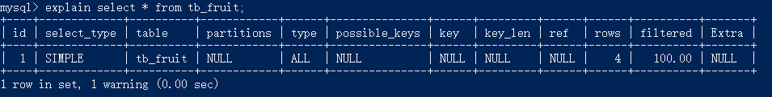

# 简介

从以下方面进行性能优化：

- 减少系统瓶颈，提高数据库整体性能；
- 合理的结构设计和参数调整，提高系统响应的速度；
- 减少资源占用，提供更大负荷的服务。

性能优化包括查询优化、更新速度优化、服务器优化等。

**查询数据库的性能参数**  

```sql
SHOW STATUS LIKE 'value';
```

其中，value是要查询的参数值，一些常用的性能参数如下：

- Connections：连接 MySQL 服务器的次数。
- Uptime：MySQL 服务器的上线时间。
- Slow_queries：慢查询的次数。
- Com_select：查询操作的次数。
- Com_insert：插入操作的次数。
- Com_update：更新操作的次数。
- COm_delete：删除操作的次数。

查询 MySQL 服务器的连接次数：

```sql
SHOW STATUS LIKE 'Connections';
```

查询 MySQL服务器的慢查询次数：

```sql
SHOW STATUS LIKE 'Slow_queries';
```

# 优化查询

查询是数据库中最频繁的操作，提高查询速度可以有效地提高 MySQL 数据库的性能。

### 分析查询语句

通过对查询语句的分析，可以了解查询语句执行情况，找出查询语句执行的瓶颈，从而优化查询语句。

MySQL提供了 `EXPLAIN` 语句和 `DESCRIBE` 语句，用来分析查询语句。

`EXPLAIN` 语句的基本语句如下：

```sql
EXPLAIN [EXTENDED] SELECT select_options;
```

使用 `EXTENDED` 关键字，`EXPLAIN` 语句将产生附加信息。

执行该语句，可以分析 `EXPLAIN` 后面的 `SELECT` 语句的执行情况，并且能够分析出所查询的表的一些特征。

执行以下语句：

```sql
EXPLAIN SELECT * FROM tb_fruit;
```

执行情况如下：



id：`SELECT` 识别符。这是 `SELECT` 的查询序列号。

select_type：表示 `SELECT` 语句的类型。几种取值：`SIMPLE` 表示简单查询，其中不包括连接查询和子查询；`PRIMARY` 表示主查询，或者是最外层的查询语句；`UNION` 表示连接查询的第2个或后面的查询语句；`DEPENDENT UNION`，连接查询中的第2个或后面的`SELECT`语句，取决于外面的查询；`UNION RESULT`，连接查询的结果；`SUBQUERY`，子查询中的第1个`SELECT`语句；`DEPENDENT SUBQUERY`，子查询中的第1个`SELECT`，取决于外面的查询；`DERIVED`，导出表的`SELECT`（`FROM`子句的子查询）。

table：表示查询的表。

type：表示表的连接类型。下面按照从最佳类型到最差类型的顺序给出各种连接类型：

1. system
   该表示仅有一行的系统表。这是 `const` 连接类型的一个特例。

2. const
   数据库最多只有一个匹配行，它将在查询开始时被读取，并在余下的查询优化中作为常量对待。`const`表查询速度很快，因为它们只读取一次。`const`用于使用常数值比较 `PRIMARY KEY` 或 `UNIQUE` 索引的所有部分的场合。

   在下面的查询中，`tb1_name` 可用于 `const` 表：

```sql
SELECT * FROM tb1_name WHERE primary_key=1;
SELECT * FROM tb1_name
WHERE primary_key_part1=1 AND primary_key_part2=2;
```

3. eq_ref
   对于每个来自前面的表的行组合，从该表中读取一行。当一个索引的所有部分都在查询中使用并且索引是 `UNIQUE` 或 `PRIMARY KEY` 时，即可使用这种类型。
   eq_ref 可以用于使用 "=" 操作符比较带索引的列。比较值可以为常量或一个在该表前面所读取的表的列的表达式。
   在下面的例子中，MySQL 可以使用 eq_ref 连接来处理 `ref_tables`：

```sql
SELECT * FROM ref_table, other_table
WHERE ref_table.key_column=other_table.column;
SELECT * FROM ref_table, other_table
WHERE ref_table.key_column_part1=other_table.column
AND ref_table.key_column_part2=1;
```

4. ref
   对于来自前面的表的任意行组合，将从该表中读取所有匹配的行。这种类型用于索引既不是 `UNIQUE` 也不是 `PRIMARY KEY` 的情况，或者查询中使用了索引列的左子集，即索引中左边的部分列组合。ref 可以用于使用 `=` 或 `<=>` 操作符的带索引的列。
   在下面的例子中，MySQL 可以使用 ref 连接来处理 `ref_tables` ：

```sql
SELECT * FROM ref_table WHERE key_column=expr;

SELECT * FROM ref_table, other_table
WHERE ref_table.key_column=other_table.column;

SELECT * FROM ref_table,other_table
WHERE ref_table.key_column_part1=other_table.column
AND ref_table.key_column_part2=1;
```

5. ref_or_null
   该连接类型如同 ref，但是添加了 MySQL 可以专门搜索包含 NULL 值的行。在解决了查询中经常使用该连接类型的优化。
   在下面的例子中，MySQL 可以使用 ref_or_null 连接来处理 ref_tables：

```sql
SELECT * FROM ref_table
WHERE key_column=expr OR key_column IS NULL;
```

6. index_merge
   该连接类型表示使用了索引合并优化方法。在这种情况下，key列包含了使用的索引的清单，key_len 包含了使用的索引的最长的关键元素。

7. unique_subquery
   该类型替换了下面形式的 IN 子查询的 ref：

```sql
value IN (SELECT primary_key FROM single_table WHERE some_expr)
```

   `unique_subquery` 是一个索引查找函数，可以完全替换子查询，效率更高。

8. index_subquery
   该连接类型类似于 `unique_subquery`，可以替换 IN 子查询，但只适合下列形式的子查询中的 非唯一索引：

```sql
value IN (SELECT key_column FROM single_table WHERE some_expr)
```

9. range
   只检索给定范围的行，使用一个索引来选择行。key列显示使用了哪个索引。key_len 包含所使用索引的最长关键元素。
   当使用 `=`、`<>`、`>`、`>=`、`<`、`<=`、`IS NULL`、`<=>`、`BETWEEN` 或者 `IN` 操作符，用常量比较关键字列时，类型为 range。
   下面介绍几种检索指定行情况：

```sql
SELECT * FROM tb1_name WHERE key_column = 10;

SELECT * FROM tb1_name WHERE key_column BETWEEN 10 and 20;

SELECT * FROM tb1_name WHERE key_column IN(10, 20, 30);

SELECT * FROM tb1_name WHERE key_part1 = 10 AND key_part2 IN(10, 20, 30);
```

10. index
   该连接类型与 ALL 相同，除了只扫描索引树。这通常比 ALL 块，因为索引文件通常比数据文件小。

11. ALL
   对于前面的表的任意行组合，进行完整的表扫描。如果表示第一个没标记 `const` 的表，这样不好。并且在其它情况下很差。通常可以增加更多的索引来避免使用 ALL 连接。
   possible_keys：possible_keys 列指出 MySQL 能使用哪个索引在该表中找到行。如果该列是 NULL，则没有相关的索引。在这种情况下，可以通过检查 `WHERE` 子句看它是否引用某些列或适合索引的列来提高查询性能。如果是这样，可以创建适合的索引来提高查询的性能。
   key：表示查询实际使用到的索引，如果没有选择索引，该列的值是 NULL。要想强制 MySQL 使用或忽视 possible_keys 列中的索引，在查询中使用 `FORCE INDEX`、`USE INDEX` 或者 `IGNORE INDEX`。
   key_len：表示 MySQL 选择的索引字段按字节计算的长度，如果键是 NULL，则长度为 NULL。注意通过 key_len 值可以确定 MySQL 将实际使用一个多列索引中的几个字段。
   ref：表示使用哪个列或常数与索引一起来查询记录。
   rows：显示 MySQL 在表中进行查询时必须检查的行数。
   Extra：该列 MySQL 在处理查询时的详细信息。


`DESCRIBE` 语句的使用方法与 `EXPLAIN` 语句是一样的，并且分析结果也是一样的。`DESCRIBE` 语句的语法形式如下：

```sql
DESCRIBE SELECT select_options;
```

`DESCRIBE` 可以缩写成 `DESC`。


### 索引对查询速度的影响

MySQL 中提高性能的一个最有效的方式就是对数据表设计合理的索引。索引提供了高效访问数据的方法，并且加快查询的速度，因此，索引对查询的速度有着至关重要的影响。使用索引可以快速地定位表中的某条记录，从而提高数据库查询的速度，提高数据库的性能。

如果查询时没有使用索引，查询语句将扫描表中的所有记录。在数据量大的情况下，这样查询的速度会很慢。如果使用索引进行查询，查询语句可以根据索引快速定位到待查询记录，从而减少查询的记录数，达到提高查询速度的目的。


### 使用索引查询

索引可以提高查询查询的速度。但并不是使用带有索引的字段查询时，索引都会起到作用。

使用索引有几种特殊的情况，在这些情况下，有可能使用带有索引的字段查询时，索引并没有起作用，下面介绍几种特殊情况。

1. 使用 `LIKE` 关键字的查询语句
   在使用 `LIKE` 关键字进行查询的查询语句中，如果匹配字符串的第一个字符为 "%"，索引不起作用。只有 "%" 不在第一个位置，索引才会起到作用。

2. 使用多列索引的查询语句
   MySQL 可以为多个字段创建索引。一个索引可以包括 16 个字段。对于多列索引，只有查询条件中使用了这些字段中第 1 个字段时，索引才会被使用。

3. 使用 `OR` 关键字的查询语句
   查询语句的查询条件中只有 `OR` 关键字，且 `OR` 前后的两个条件中的列都是索引时，查询中才使用索引。否则，查询将不使用索引。


### 优化子查询

子查询可以一次性完成很多逻辑上需要多个步骤才能完成的 SQL 操作。子查询虽然可以使查询语句很灵活，但执行效率不高。执行子查询时，MySQL 需要为内层查询语句的查询结果建立一个临时表。然后外层查询语句从临时表中查询记录。查询完毕后，再撤销这些临时表。因此，子查询的速度会受到一定的影响。如果查询的数据量比较大。这种影响就会随之增大。

在 MySQL 中，可以使用连接（`JOIN`） 查询来替代子查询。连接查询不需要建立临时表，其速度比子查询要快，如果查询中使用索引的话，性能会更好。连接之所以更有效率，是因为 MySQL 不需要在内存中创建临时表来完成查询工作。


# 优化数据库结构

一个好的数据库设计方案对于数据库的性能常常会起到事半功倍的效果。合理的数据库结构不尽可以使数据库占用更小的磁盘空间，而且能够使查询速度更快。数据库结构的设计，需要考虑数据冗余。查询和更新的速度、字段的数据类型是否合理等多方面的内容。

### 将字段很多的表分解成多个表

对于字段较多的表，如果有些字段的使用频率很低，可以将这些字段分离出来形成新表。因为当一个表的数据量很大时，会由于使用频率低的字段的存在而变慢。但通过分解，可以提高表的查询效率。

### 增加中间表

对于需要经常联合查询的表，可以建立中间表以提高查询效率。通过建立中间表，把需要经常联合查询的数据插入到中间表中，然后将原来的联合查询改为对中间表的查询，以此来提高查询效率。

首先，分析经常联合查询表中的字段。然后，使用这些字段建立一个中间表，并将原来联合查询的表的数据插入到中间表中。最后，可以使用中间表来进行查询了。

### 增加冗余字段

设计数据库表时应尽量遵循范式理论的规约，尽可能减少冗余字段，让数据库设计看起来精致、优雅。但是，合理地加入冗余字段可以提高查询速度。

### 优化插入记录的速度

插入记录时，影响插入速度的主要是索引、唯一性效验、一次插入记录条数等。根据这些情况，可以分别进行优化。

对于 MyISAM 引擎的表，常见的优化方法如下：

1. 禁用索引
   对于非空表，插入记录时，MySQL 会根据表的索引对插入的记录建立索引。如果插入大量数据，建立索引会降低插入记录的速度。为了解决这种情况，可以在插入记录前禁用索引，数据插入完毕后再开启索引。禁用索引的语句如下：

```sql
-- 禁用索引，table_name 是引用的表名。
ALTER TABLE table_name DISABLE KEYS;
```

重新开启索引的语句如下：

```sql
ALTER TABLE table_name ENABLE KEYS;
```

对于空表批量导入数据，则不需要进行此操作，因为 MySQL 引擎的表示在导入数据之后才建立索引的。

2. 禁用唯一性检查
   插入数据时，MySQL 会对插入的记录进行唯一性效验。这种唯一性效验也会降低插入记录的速度。为了降低这种情况对查询速度的影响，可以在插入记录之前禁用唯一性检查，等到记录插入完毕后再开启。禁用唯一性检查的语句如下：

```sql
SET UNIQUE_CHECKS=0;
```

开启唯一性检查的语句如下：

```sql
SET UNIQUE_CHECKS=1;
```

3. 使用批量插入
   插入多条记录时，可以使用一条 `INSERT` 语句插入一条记录；也可以使用一条 `INSERT` 语句插入多条记录。插入一条记录的 `INSERT` 语句情况如下：

```sql
INSERT INTO tb_fruit VALUES('x1', '101', 'mongo1', '5.5');
INSERT INTO tb_fruit VALUES('x2', '102', 'mongo2', '5.5');
INSERT INTO tb_fruit VALUES('x3', '103', 'mongo3', '5.5');
```

使用一条 `INSERT` 语句插入多条记录的情形如下：

```sql
INSERT INFO tb_fruit VALUES
('x1', '101', 'mongo1', '5.5'),
('x2', '102', 'mongo2', '5.5'),
('x3', '103', 'mongo3', '5.5');
```

第二种情形的插入速度要比第一种速度快。

4. 使用 `LOAD DATA INFILE` 批量导入
   当需要批量导入数据时，如果能用 `LOAD DATA INFILE` 语句，就尽量使用。因为 `LOAD DATA INFILE` 语句导入数据的速度比 `INSERT` 语句快。


对于 InnoDB 引擎的表，常见的优化方法如下：

1. 禁用唯一性检查
   插入数据之前执行 `SET UNIQUE_CHECKS=0` 来禁用对唯一索引的检查，数据导入完成之后再运行 `SET UNIQUE_CHECKS=1`。这个和 MyISAM 引擎的使用方法一样。

2. 禁用外键检查
   插入数据之前执行禁止对外键的检查，数据插入完成之后再恢复堆外键的检查。禁用外键检查的语句如下：

```sql
SET FOREIGN_KEY_CHECKS=0;
```

恢复对外键的检查语句如下：

```sql
SET FOREIGIN_KEY_CHECKS=1;
```

3. 禁止自动提交
   插入数据之前禁止事务的自动提交，数据导入完成之后，执行恢复自动提交操作。禁止自动提交的语句如下：

```sql
SET AUTOCOMMIT=0;
```

   恢复自动提交的语句如下：

```sql
SET AUTOCOMMIT=1;
```

### 分析表、检查表和优化表

MySQL提供了分析表、检查表和优化表的语句。分析表主要是分析关键字的分布；检查表主要是检查表是否存在错误；优化表主要是消除删除或者更新造成的空间浪费。

1. 分析表
   MySQL 中提供了 `ANALYZE TABLE` 语句分析表，`ANALYZE TABLE` 语句的基本语法如下：

```sql
ANALYZE [LOCAL|NO_WRITE_TO_BINLOG] TABLE tb1_name[,tb2_name]
```

   `LOCAL` 关键字是 `NO_WRITE_TO_BINLOG` 关键字的别名，二者都是执行过程不写入二进制日志，`tb1_name` 为分析的表的表名，可以有一个或多个。

   使用 `ANALYZE TABLE` 分析表的过程中，数据库系统会自动对表加一个只读锁。在分析期间，只能读取表中的记录，不能更新和插入记录。`ANALYZE TABLE` 语句能够分析 InnoDB、BDB 和 MyISAM 类型的表。

2. 检查表
   MySQL中可以使用 `CHECK TABLE` 语句来检查表。`CHECK TABLE` 语句能够检查 InnoDB 和 MyISAM 类型的表是否存在错误。对于 MyISAM 类型的表，`CHECK TABLE` 语句还会更新关键字统计数据。而且，`CHECK TABLE` 也可以检查视图是否有错误，比如在视图定义中被引用的表已不存在。该语句的基本语法如下：

```sql
CHECK TABLE tb1_name[,tb2_name]...[option]...
option = {QUICK|FAST|MEDIUM|EXTENDED|CHANGED}
```

   其中，`tb1_name` 是表名；`option`参数有5个取值，分别是 `QUICK`、`FAST`、`MEDIUM`、`EXTENDED`和`CHANGED`。各个选项的意义分别是：

- `QUICK`：不扫描行，不检查错误的连接。
- `FAST`：只检查没有被正确关闭的表。
- `CHANGED`：只检查上次检查后被更改的表和没有被正确关闭的表。
- `MEDUIM`：扫描行，以验证被删除的连接是有效的。也可以计算各行的关键字效验和，并使用计算出的效验和验证这一点。
- `EXTENDED`：对每行的所有关键字进行一个全面的关键字查找。这可以确保表示 100% 一致的，但是花的时间较长。

   `option` 只对 MyISAM 类型的表有效，对 InnoDB 类型的表无效。`CHECK TABLE` 语句在执行过程中也会给表加上只读锁。

3. 优化表
   MySQL 中使用 `OPTIMIZE TABLE` 语句来优化表。该语句对 InnoDB 和 MyISAM 类型的表都有效。但是，`OPTILMIZE TABLE` 语句只能优化表中的 `VARCHAR`、`BLOB` 或 `TEXT` 类型的字段。
   `OPTILMIZE TABLE` 语句的基本语法如下：

```sql
OPTILMIZE [LOCAL|NO_WRITE_TO_BINLOG] TABLE tb1_name[,tb2_name]...
```

   `LOCAL|NO_WRITE_TO_BINLOG` 关键字的意义和分析表相同，都是指定不写入二进制日志；`tb1_name` 是表名。
   通过 `OPTILMIZE TABLE` 语句可以消除删除和更新造成的文件碎片。`OPTILMIZE TABLE` 语句在执行过程中也会给表加上只读锁。


# 优化 MySQL 服务器

优化 MySQL 服务器主要从两个方面来优化，一方面是对硬件进行优化；另一方面是对 MySQL 服务的参数进行优化。

### 优化服务器硬件

服务器的硬件性能直接决定着 MySQL 数据库的性能。硬件的性能瓶颈，直接决定 MySQL 数据库的运行速度和效率。针对性能瓶颈，提高硬件配置，可以提高 MySQL 数据库的查询、更新的速度。

1. 配置较大的内存。足够大的内存，是提高 MySQL 数据库性能的方法之一。内存的速度比磁盘 I/O 快得多，可以通过增加系统的缓冲区容量，使数据在内存停留的时间更长，以减少磁盘 I/O。
2. 配置高速磁盘系统，以减少读盘的等待时间，提高响应速度。
3. 合理分布磁盘 I/O，把磁盘 I/O 分散在多个设备上，以减少资源竞争，提高并行操作能力。
4. 配置多处理器，MySQL 是多线程的数据库，多处理器可同时执行多个线程。

### 优化 MySQL 的参数

通过优化 MySQL 的参数可以提高资源利用率，从而达到提高 MySQL 服务器性能的目的。

MySQL 服务的配置参数都在 `my.cnf` 或者 `my.ini` 文件的 `[mysqld]` 组中。下面对几个对性能影响比较大的参数进行详细介绍。

- `key_buffer_size`：表示索引缓冲区的大小。索引缓冲区所有的线程共享。增加索引缓冲区可以得到更好处理的索引（对所有读和多重写）。当然，这个值也不是越大越好，它的大小取决于内存的大小，如果这个值太大，导致操作系统频繁换页，也会降低系统性能。
- `table_cache`：表示同时打开的表的个数。这个值越大，能够同时打开的表的个数越多，这个值不是越大越好，因为同时打开的表太多会影响操作系统的性能。
- `query_cahce_size`：表示查询缓冲区的大小。该参数需要和 `query_cache_type` 配合使用，当`query_cache_type` 值是 0 时，所有的查询都不使用查询缓冲区，但是 `query_cahce_type=0` 并不会导致 MySQL 释放 `query_cahce_size` 所配置的缓冲区内存，当 `query_cache_type=1` 时，所有的查询都将使用查询缓冲区，除非在查询语句中指定 `SQL_NO_CACHE`，如 `SELECT SQL_NO_CACHE * FROM tb1_name`，当 `query_cache_type=2` 时，只有在查询语句中使用 `SQL_CACHE` 关键字，查询才会使用查询缓冲区。使用查询缓冲区可以提高查询的速度，这种方式只适用于修改操作少且经常执行相同的查询操作的情况。
- `sort_buffer_size`：表示排序缓冲区的大小。这个值越大，进行排序的速度越快。
- `read_buffer_size`：表示每个线程连续扫描时为扫描的每个表分配的缓冲区的大小（字节）。当线程从表中连续读取记录时需要用到这个缓冲区，`SET SESSION read_buffer_size=n` 可以临时设置该参数的值。
- `read_md_buffer_size`：表示为每个线程保留的缓冲区的大小，与 `read_buffer_size` 相似。当主要用于存储按特定顺序读取出来的记录。也可以用 `SET SESSION read_rnd_buffer_size=n` 来临时设置该参数的值。如果频繁进行多次连续扫描，可以增加该值。
- `innodb_buffer_pool_size`：表示 InnoDB 类型的表和索引的最大缓存。这个值越大，查询的速度就会越快。但是这个值太大会影响操作系统的性能。
- `max_connections`：表示数据库的最大连接数。这个链接数不是越大越好，因为这些链接会浪费内存的资源。过多的连接可能会导致 MySQL 服务器僵死。
- `innodb_flush_log_at_trx_commit`：表示何时将缓冲区的数据写入日志文件，并且将日志文件写入磁盘中。该参数对于 InnoDB 引擎非常重要。该参数有 3 个值，分别为 0，1 和 2。值为 0 时表示每隔 1 秒将数据写入日志文件并将日志文件写入磁盘；值为 2 时表示每次提交事务时将数据写入日志文件，每隔 1 秒将日志文件写入磁盘。该参数的默认值为 1。默认值 1 安全性最高，但是每次事务提交或事务外的指令都需要把日志写入（flush）磁盘，是比较费时的；0 值更快一点，但安全方面比较差；2 值日志仍然会每秒写入到磁盘，所以即使出现故障，一般也不会丢失超过 1~2 秒的更新。
- `back_log`：表示在 mysql 暂时精致回答新请求之前的短时间内，多少个请求可以被存在堆栈中。换句话说，该值表示对到来的 TCP/IP 连接的侦听队列的大小。只有期望在一个短时间内有很多连接，才需要增加该参数的值。操作系统在这个队列大小上也有限制。设定 `back_log` 高于操作系统的限制将是无效的。
- `interactive_timeout`：表示服务器在关闭连接前等待行动的秒数。
- `sort_buffer_size`：表示每隔需要进行排序的线程分配的缓冲区的大小。增加这个参数的值可以提高 `ORDER BY` 或 `GROUP BY` 操作的速度。默认数值是 2097144（2MB）。
- `thread_cache_size`：表示可以复用的线程的数量。如果有很多新的线程，为了提高性能可以增大该参数的值。
- `wait_timeout`：表示服务器在关闭一个连接时等待行动的秒数。默认数值是 28800。

合理地配置这些参数可以提高 MySQL 服务器的性能。除了上述参数以外，还有 `innodb_log_buffer_size`、`inno_log_file_size` 等参数。配置完参数以后，需要重新启动 MySQL 服务才会生效。