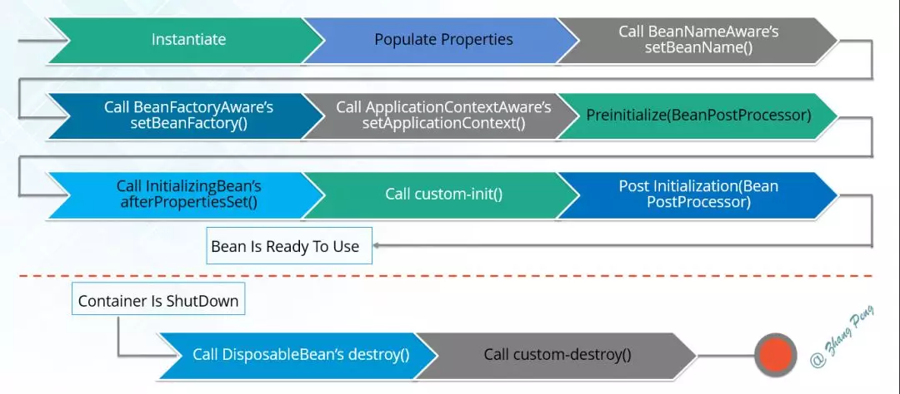

# Spring框架常问面试题

- 一般问题
  - 什么是 Spring Framework
  - 不同版本的 Spring Framework 有哪些主要功能？
  - Spring Framework 有哪些不同的功能？
  - 列举Spring Framework 的优点。
  - Spring Framework框架中用到了哪些设计模式？
  - 什么是 Spring 配置文件？
  - Spring 应用程序有哪些不同的组件？
  - 使用 Spring 有哪些方式？

- Beans
  - 什么是Spring Bean
  - Spring提供了哪些配置方式？
  - Spring支持几种 Bean Scope？
  - Spring Bean容器的生命周期是什么样的？
  - 什么是Spring 的内部 Bean？
  - Spring中的单例Bean的线程安全问题
  - 什么是Spring装配
  - 自动装配有哪些方式？
  - 自动装配有什么局限？

- 依赖注入(DI)
  - 控制反转(IOC)和依赖注入(DI)
  - Spring IOC实现原理
  - 可以通过多少种方式完成依赖注入？
  - 区分构造函数注入和Setter注入？
  - Spring循环依赖的三种方式
  - Spring中有多少中IOC容器？
  - 区分BeanFactory和ApplicationContext。
  - 列举IOC的一些好处。

- 注解
  - 你用过哪些重要的Spring注解？
  - 如何在Spring中启动注解装配？
  - @Component，@Controller，@Repository，@Service有何区别？
  - @RestController与@Controller的区别
  - @Component和@Bean的区别
  - 将一个类声明为Spring的Bean的注解有哪些？
  - @Required注解有什么用？
  - @Autowired注解有什么用？
  - @Qualifier注解有什么用？
  - @RequestMapping注解有什么用？

- 数据访问
  - Spring DAO有什么用？
  - 列举Spring DAO抛出的异常？
  - Spring JDBC API 中存在哪些类？
  - 使用 Spring 访问 Hibernate 的方法有哪些？
  - Spring 支持哪些 ORM 框架
  - 使用 Spring 支持的事务管理类型
  - Spring管理事务的方式有几种？
  - Spring事务中的隔离级别有哪几种？
  - Spring事务中哪几种事务传播行为？
  - @Transactional(rollbackFor=Exception.class)注解了解吗？

- AOP切面编程
  - 什么是AOP？
  - Spring AOP实现原理
  - AOP中的Asepect、Advice、Pointcut、JoinPoint和Advice参数分别是什么？
  - 什么是通知(Advice)？
  - 有哪些类型的通知（Advice）？
  - 指出在Spring AOP 中 concern 和cross-cutting concern 的不同之处。
  - AOP有哪些实现方式？
  - Spring AOP and AspectJ AOP 有什么区别？
  - 如何理解 Spring 中的代理？
  - 什么是编织(Weaving)？

- MVC
  - Spring MVC 框架有什么用？
  - 描述一下 DispatcherServlet 的工作流程
  - 介绍一下 WebApplicationContext
  - Spring MVC中常用的注解有哪些？


### 一、一般问题

1. 什么是 Spring Framework

Spring是一个开源应用框架，指在降低应用程序开发的复杂度。
它是轻量级、松散耦合的。
它具有分层体系结构，允许用户选择组件，同时还为J2EE应用程序开发提供了一个有凝聚力的框架。
它可以继承其它框架，如Struct2、Hibernate。EJB等，所以又称为框架的框架。

2. 不同版本的 Spring Framework 有哪些主要功能？

|Version|Feature|
|---|---|
|Spring 2.5| 发布于2007年。这是第一个支持注解的版本。|
|Spring 3.0| 发布于2009年。它完全利用了Java5中的改进，并为JEE6提供了支持。|
|Spring 4.0| 发布于2013年。这是第一个完全支持JAVA8的版本。|

3. Spring Framework 有哪些不同的功能？

轻量级 - Spring在代码量和透明度方面都很轻便。
IOC - 控制反转
AOP - 面向切面编程可以将应用业务逻辑和系统服务分离，以实现高内聚。
容器 - Spring 负责创建和管理对象(Bean)的声明周期和配置。
MVC - 对WEB应用提供了高度可配置性，其它框架的继承业务十分方便。
事务管理 - 提供了用于事务管理的通用抽象层。Spring的事务支持也可用于容器较少的环境。
JDBC异常 - Spring的JDBC抽象层提供了一个异常层次结果，简化了错误处理策略。
    
4. 列举Spring Framework 的优点。

由于Spring Framework的分层架构，用户可以自由选择自己需要的组件。
Spring Framework支持 POJO(Plan Old Java Object)编程，从而具备持续集成和可测试性。
由于依赖注入和控制反转，JDBC得以简化。
它是开源免费的。
    
5. Spring Framework框架中用到了哪些设计模式？

工厂设计模式：SPring使用工厂模式通过BeanFactory、ApplicationContext创建bean对象。
代理设计模式：Spring AOP功能的实现。
单例设计模式：SPpring中的Bean默认都是单例的。
模板方法模式：Spring中jdbcTemplate、hibernateTempate等以Template结尾的对数据库操作的类，它们就使用到了模板模式。
包装器设计模式：我们的项目需要连接多个数据库，而且不同的客户在每次访问中根据需要会去访问不同的数据库。这种模式让我们可以根据客户的需求能够动态切换不同的数据源。
观察者模式：Spring事件驱动模型就是观察者模式很经典的一个应用。
适配器模式：Spring AOP的增强或通知(Advice)使用到了适配器模式、Spring MVC中也是用到的适配器模式适配Controller。
装饰者模式：
    
6. 什么是 Spring 配置文件？

Spring配置文件是XML文件。该文件主要包含类信息。它描述了这些类是如何配置以及相互引入的。但是，XML配置文件冗长且更加干净。如果没有正确规划和编写，那么在大型项目中管理变得非常困难。
    
7. Spring 应用程序有哪些不同的组件？


Spring Container - 该层基本上是 Spring Framework的核心。它包含以下模块：
- Spring Core
- Spring Bean
- SpEL(Spring Expression Language)
- Spring Context

数据访问/集成 - 该层提供与数据库交互的支持。它包含以下模块：
- JDBC(Java Database Connectivity)
- ORM(Object Relational Mapping)
- OXM(Object XML Mappers)
- JMS(Java Messaging Service)
- Transaction

WEB - 该层提供了创建Web应用程序的支持。它包含以下模块：
- Web
- Web - Servlet
- Web - Socket
- Web - Portlet

AOP - 该层支持面向切面编程
Instrumentation - 该层为类检测和类加载器实现提供支持。
Test - 该层为使用 JUnit 和 TestNG 进行测试提供支持。
几个杂项模块：
- Messaging - 该模块为STOMP提供支持。它还支持注解编程模型，该模型用于从WebSocket客户端路由和处理STOMP消息。
- Aspects - 该模块为与AspectJ的集成提供支持。

8. 使用 Spring 有哪些方式？
   

使用Spring有以下方式：
- 作为一个成熟的Spring Web应用程序。
- 作为第三方Web框架，使用Spring Framework中间层。
- 用于远程使用。
- 作为企业级Java Bean，它可以包装现有的POJO(Plain Old Java Objects)。

### 二、Beans
1. 什么是Spring Bean？
   

它们是构成用户应用程序主干的对象。
Bean由Spring IoC容器管理。
它们由Spring IoC容器实例化，配置，装配和管理。
Bean是基于用户提供给容器的配置元数据创建。
    
2. Spring提供了哪些配置方式？

基于XML配置
Bean所需的依赖项和服务在XML格式的配置文件中指定。这些配置文件同行包含许多bean定义和特定于应用程序的配置选项。它们通常以bean标签开头。例如：
    
```xml
<bean id="studentbean" class="org.edureka.firstSpring.StudentBean">
		<property name="name" value="Edureka"></property>
    </bean>
```

基于注解配置
您可以通过在相关的类，方法或字段声明上使用注解，将 bean 配置为组件类本身，而不是使用 XML 来描述 bean 装配。默认情况下，Spring 容器中未打开注解装配。因此，您需要在使用它之前在 Spring 配置文件中启用它。例如：
```xml
    <beans>
		<context:annotation-config/>
		<!-- bean definitions go here -->
</beans>
```

基于Java API配置
Spring的Java配置是用过使用@Bean和@Configuration来实现。
-  @Bean注解扮演与元素相同的角色。
- @Configuration类允许通过简单地调用同一个类中的其它@Bean方法来定义bean间的依赖关系。

例如：

```java
    @Configuration
    public class StudentConfig {
    	@Bean
		public StudentBean myStudent() {
        	return new StudentBean();
    	}
    }
```

3. Spring支持几种 Bean Scope？

Spring Bean支持5中Scope：
-  Singleton：每个Spring IoC容器仅有一个单实例。
-  Prototype：每次请求都会产生一个新的实例。
-  Request：每一次HTTP请求都会产生一个新的实例，并且该Bean仅在当前HTTP Session内有效。
-  Global-Session：类似于标准的HTTP Session作用域，不过它不仅仅在基于protlet的web应用中才有意义。Portlet规范定义了全局Session的概念，它被所有构成某个portlet web应用的各种不同的 portlet 所共享。在 global session 作用域中定义的 bean 被限定于全局 portlet Session 的生命周期范围内。如果你在 web 中使用 global session 作用域来标识 bean，那么 web 会自动当成 session 类型来使用。

仅当用户使用支持Web的ApplicationContext时，最后三个才可用。
    
4. Spring Bean容器的生命周期是什么样的？

Spring Bean容器的生命周期流程如下：
4.1. Spring容器根据配置中的bean定义中实例化bean。
4.2. Spring使用依赖注入填充所有属性，如bean中所定义的配置。
4.3. 如果bean实现BeanNaneAware接口，则工厂通过传递bean的ID来调用setBeanName()。
4.4. 如果bean实现BeanFactoryAware接口，工厂通过传递自身的实例来调用setBeanFactory()。
4.5. 如果存在于bean关联的任何BeanPostProcessors，则调用preProcessBeforeInitialization()方法。
4.6. 如果为bean指定了init方法(init-method属性)，那么将调用它。
4.7. 最后，如果存在与bean关联的任何BeanPostProcessors，则将调用postProcessAfterInitialization()方法。
4.8. 如果bean实现DisposableBean接口，当Spring容器关闭时，会调用destory()。
4.9. 如果为bean指定了destroy方法(destroy-method属性)，那么将调用它。


    
5. 什么是Spring 的内部 Bean？

只有将bean用作另一个bean的属性时，才能将bean声明为内部bean。为了定义bean，Spring的基于XML的配置元数据在 `<property>` 或  `<constructor-arg>` 中提供了 `<bean>` 元素的使用。内部bean总是匿名的，它们总是作为原型。
例如，假设我们有一个Student类，其中引用了Person类。这里我们将只创建一个Person类实例并在Student中使用它。
Student.java
    
```java
    public class Student {
    	private Person person;
	//Setters and Getters
}
    public class Person {
    	private String name;
    	private String address;
	//Setters and Getters
    }
```

bean.xml

```xml
    <bean id=“StudentBean" class="com.edureka.Student">
    <property name="person">
        <!--This is inner bean -->
        <bean class="com.edureka.Person">
            <property name="name" value=“Scott" />
            <property name="address" value=“Bangalore" />
        </bean>
</property>
    </bean>
```

6. Spring中的单例Bean的线程安全问题

大部分时候我们并没有在系统中使用多线程，所以很少有人会关注这个问题。单例bean存在线程问题，主要是因为当多个线程操作同一个对象的时候，对这个对象的非静态成员变量的写操作会存在线程安全问题。
常见的有两种解决办法：
- 在Bean对象中尽量避免定义可变的成员变量(不太现实)。
- 在类中定义一个ThreadLocal成员变量，将需要的可变成员变量保存在ThreadLocal中(推荐的一种方式。)
  
7. 什么是Spring装配

当bean在Spring容器中组合在一起时，它被称为装配或bean装配。Spring容器需要知道需要什么bean以及容器应该如何使用依赖注入将bean绑定在一起，同时装配bean。
    
8. 自动装配有哪些方式？

Spring 容器能够自动装配 bean。也就是说，可以通过检查 BeanFactory 的内容让 Spring 自动解析 bean 的协作者。
自动装配的不同模式：
- no - 这是默认设置，表示没有自动装配。应使用显式 bean 引用进行装配。
- byName - 它根据 bean 的名称注入对象依赖项。它匹配并装配其属性与 XML 文件中由相同名称定义的 bean。
- byType - 它根据类型注入对象依赖项。如果属性的类型与 XML 文件中的一个 bean 名称匹配，则匹配并装配属性。
- 构造函数 - 它通过调用类的构造函数来注入依赖项。它有大量的参数。
- autodetect - 首先容器尝试通过构造函数使用 autowire 装配，如果不能，则尝试通过 byType 自动装配。
  
9. 自动装配有什么局限？

- 覆盖的可能性 - 您始终可以使用和设置指定依赖项，这将覆盖自动装配。
- 基本原数据类型 - 简单属性(如原数据类型，字符串和类)无法自动装配。
- 令人困惑的性质 - 总是喜欢使用明确的装配，因为自动装配不太精确。

### 三、依赖注入(DI)
1. 控制反转(IOC)和依赖注入(DI)

什么是Spring IoC控制反转：
Spring框架的核心是Spring容器。容器创建对象，将它们装配在一起，配置它们并管理它们的完整生命周期。Spring容器使用依赖注入来管理组成应用程序的组件。
容器通过读取提供的配置元数据来接收对象进行实例化，配置和组装的指令。该元数据可以通过XML、Java注解或者Java代码提供。


什么是依赖注入：
在依赖注入中，您不必创建对象，但必须描述如何创建它们。您不是直接在代码中将组将和服务连接在一起，而是描述配置文件中哪些组件需要哪些服务。由IoC容器将它们装配在一起。

3. Spring IOC实现原理

Spring中IoC的实现原理就是工厂模式加反射机制。
示例：
```java
interface Fruit {
     public abstract void eat();
}
class Apple implements Fruit {
    public void eat(){
        System.out.println("Apple");
    }
}
class Orange implements Fruit {
    public void eat(){
        System.out.println("Orange");
    }
}
class Factory {
    public static Fruit getInstance(String ClassName) {
        Fruit f=null;
        try {
            f=(Fruit)Class.forName(ClassName).newInstance();
        } catch (Exception e) {
            e.printStackTrace();
        }
        return f;
    }
}
class Client {
    public static void main(String[] a) {
        Fruit f=Factory.getInstance("io.github.dunwu.spring.Apple");
        if(f!=null){
            f.eat();
        }
    }
}
```

4. 可以通过多少种方式完成依赖注入？

通常，依赖注入可以通过三种方式来完成，即：
- 构造函数注入
- Setter注入
- 接口注入

在Spring Framework中，仅使用构造函数和setter注入。

5. 区分构造函数注入和Setter注入？

|构造函数注入|setter注入|
|---|---|
|没有部分注入|有部分注入|
|不会覆盖setter属性|会覆盖setter属性|
|任意修改都会创建一个新实例|任意修改不会创建一个新实例|
|适用于设置很多属性|适用于设置少量属性|

6. Spring循环依赖的三种方式

- 构造器参数循环依赖
- setter方式单例，默认方式
- setter方式原型，prototype

循环依赖就是N个类中循环嵌套引用，如果在日常开发中我们用new对象的方式发生这种循环依赖的话程序会在运行时一直循环调用，直至内存溢出报错。下面说一下Spring是如何解决循环依赖的。

7. Spring中有多少中IOC容器？

- BeanFactory - BeanFactory就像一个包含bean集合的工厂类。它会在客户端要求时实例化bean。
- ApplicationContext - ApplicationContext接口扩展了BeanFactory接口。它在BeanFactory基础上提供了一些额外的功能。

8. 区分BeanFactory和ApplicationContext。

|BeanFactory|ApplicationContext|
|---|---|
|它使用懒加载|它使用即时加载|
|它使用语法显式提供资源对象|它自己创建和管理资源对象|
|不支持国际化|支持国际化|
|不支持基于依赖的注入|支持基于依赖的注入|

9. 列举IOC的一些好处。

IoC的一些好处：
- 它将最小化应用程序中的代码量。
- 它将使您的应用程序易于测试，因为它不需要单元测试用例中的任何单例或JNDI查找机制。
- 它以最小的影响和最少的侵入机制促进松耦合。
- 它支持即时的实例化和延迟的加载服务。

### 四、注解
1. 你用过哪些重要的Spring注解？

- @Controller - 用于Spring Mvc项目中的控制器类。
- @Service - 用于服务类。
- @RequestMapping - 用于在控制器处理程序方法中配置URI映射。
- @ResponseBody - 用于发送Object作为相应，通常用于发送XML或JSON数据作为相应。
- @PathVariable - 用于将动态值从URI映射到处理程序的方法参数中。
- @Autowired - 用于在Spring Bean中自动装配依赖项。
- @Qualifier - 使用@Autowired注解，以避免在存在多个bean类型实例时出现混淆。
- @Scope - 用于配置Spring Bean的范围。
- @Configuration，@ComponentScan和@Bean - 用于基于Java的配置。
- @Aspect，@Before，@After，@Around，@Pointcut - 用于切面编程(AOP)

2. 如何在Spring中启动注解装配？

默认情况下，Spring容器中未打开注解装配，因此，要使用基于注解装配，我们必须通过配置 `<context:annotation-config />` 元素在Spring配置文件中启用它。

3. @Component，@Controller，@Repository，@Service有何区别？

- @Component：这将Java类标记为bean。它是任何Spring管理组件的通用构造型。Spring的组件扫描机制现在可以将其拾取并将其拉入应用程序环境中。
- @Controller：这将一个类标记为Spring Web Mvc控制器。标有它的Bean会自动导入到IoC容器中。
- @Service：此注解是组件注解的特化。它不会对@Component注解提供任何其它行为。您可以在服务类中使用@Service而不是@Component，因为它以更好的方式指定了意图。
- @Repository：这个注解是具有类似用途和功能的 @Component 注解的特化。它为 DAO 提供了额外的好处。它将 DAO 导入 IoC 容器，并使未经检查的异常有资格转换为 Spring DataAccessException。

4. @RestController与@Controller的区别
5. @Component和@Bean的区别
6. 将一个类声明为Spring的Bean的注解有哪些？
7. @Required注解有什么用？

@Required 应用于 bean 属性 setter 方法。此注解仅指示必须在配置时使用 bean 定义中的显式属性值或使用自动装配填充受影响的 bean 属性。如果尚未填充受影响的 bean 属性，则容器将抛出 BeanInitializationException。
示例：
```java
public class Employee {
    private String name;
    @Required
    public void setName(String name){
        this.name=name;
    }
    public string getName(){
        return name;
    }
}
```

8. @Autowired注解有什么用？

@Autowired 可以更准确地控制应该在何处以及如何进行自动装配。此注解用于在 setter 方法，构造函数，具有任意名称或多个参数的属性或方法上自动装配 bean。默认情况下，它是类型驱动的注入。
```java
public class Employee {
    private String name;
    @Autowired
    public void setName(String name) {
        this.name=name;
    }
    public string getName(){
        return name;
    }
}
```

9. @Qualifier注解有什么用？

当您创建多个相同类型的 bean 并希望仅使用属性装配其中一个 bean 时，您可以使用@Qualifier 注解和 @Autowired 通过指定应该装配哪个确切的 bean 来消除歧义。
例如，这里我们分别有两个类，Employee 和 EmpAccount。在 EmpAccount 中，使用@Qualifier 指定了必须装配 id 为 emp1 的 bean。

```java
// Employee.java
public class Employee {
    private String name;
    @Autowired
    public void setName(String name) {
        this.name=name;
    }
    public string getName() {
        return name;
    }
}

// EmpAccount.java
public class EmpAccount {
    private Employee emp;
    @Autowired
    @Qualifier(emp1)
    public void showName() {
        System.out.println(“Employee name : ”+emp.getName);
    }
}
```

10. @RequestMapping注解有什么用？

@RequestMapping 注解用于将特定 HTTP 请求方法映射到将处理相应请求的控制器中的特定类/方法。此注解可应用于两个级别：
- 类级别：映射请求的URL
- 方法级别：映射URL以及HTTP请求方法


### 五、数据访问

1. Spring DAO有什么用？

Spring DAO使得JDBC，Hibernate或JDO这样的数据访问技术更容易以一种统一的方式工作。这使得用户容易在持久性技术之间切换。它还允许您在编写代码时，无序考虑捕捉每种技术不同的异常。

2. 列举Spring DAO抛出的异常？


3. Spring JDBC API 中存在哪些类？

- JdbcTemplate
- SimpleJdbcTemplate
- NamedParameterJdbcTemplate
- SimpleJdbcInsert
- SimpleJdbcCall

4. 使用 Spring 访问 Hibernate 的方法有哪些？

我们可以通过两种方式使用Spring访问Hibernate：
- 使用Hibernate模板和回调进行控制反转
- 扩展HibernateDAOSupport并应用AOP拦截器节点

5. Spring 支持哪些 ORM 框架

- Hibernate
- iBatis
- JPA
- JDO
- OJB

6. 使用 Spring 支持的事务管理类型
7. Spring管理事务的方式有几种？
8. Spring事务中的隔离级别有哪几种？
9. Spring事务中哪几种事务传播行为？
10. @Transactional(rollbackFor=Exception.class)注解了解吗？

### 六、AOP切面编程

1. 什么是AOP？

AOP(Aspect-Oriented Programming)，即面向切面编程，它与OOP(Object-Oriented Programming，面向对象编程)相辅相成，提供了与OOP不同的抽象软件结果的视角。
在OOP中，我们以类(Class)作为我们的基本单元，而AOP中的基本单元是Aspect(切面)。

2. Spring AOP实现原理
3. AOP中的Asepect、Advice、Pointcut、JoinPoint和Advice参数分别是什么？


- Aspect - Aspect是一个实现交叉问题的类，例如事务管理。方面可以是配置的普通类，然后在Spring Bean配置文件中配置，或者我们可以使用Spring AspectJ 支持使用@Aspect注解将声明为Aspect。
- Advice - Advice是针对特定JoinPoint采取的操作。在编程方面，它们是在应用程序中达到具有匹配切入点的特定JoinPoint时执行的方法。您可以将Advice视为Spring拦截器(Interceptor)或Servlet过滤器(Filter)。
- Advice Arguments - 我们可以在adivce方法中传递参数。我们可以在切入点中使用args()表达式来应用于与参数模式匹配的任何方法。如果我们使用它，那么我们需要在确定参数类型的advice方法中使用相同的名称。
- Pointcut - Pointcut 是与 JoinPoint 匹配的正则表达式，用于确定是否需要执行 Advice。 Pointcut 使用与 JoinPoint 匹配的不同类型的表达式。Spring 框架使用 AspectJ Pointcut 表达式语言来确定将应用通知方法的 JoinPoint。
- JoinPoint - JoinPoint 是应用程序中的特定点，例如方法执行，异常处理，更改对象变量值等。在 Spring AOP 中，JoinPoint 始终是方法的执行器。


4. 什么是通知(Advice)？

特定 JoinPoint 处的 Aspect 所采取的动作称为 Advice。Spring AOP 使用一个 Advice 作为拦截器，在 JoinPoint “周围”维护一系列的拦截器。

5. 有哪些类型的通知（Advice）？

- Before - 这些类型的 Advice 在 joinpoint 方法之前执行，并使用 @Before 注解标记进行配置。
- After Returning - 这些类型的 Advice 在连接点方法正常执行后执行，并使用@AfterReturning 注解标记进行配置。
- After Throwing - 这些类型的 Advice 仅在 joinpoint 方法通过抛出异常退出并使用 @AfterThrowing 注解标记配置时执行。
- After (finally) - 这些类型的 Advice 在连接点方法之后执行，无论方法退出是正常还是异常返回，并使用 @After 注解标记进行配置。
- Around - 这些类型的 Advice 在连接点之前和之后执行，并使用 @Around 注解标记进行配置。

6. 指出在Spring AOP 中 concern 和cross-cutting concern 的不同之处。

concern 是我们想要在应用程序的特定模块中定义的行为。它可以定义为我们想要实现的功能。
cross-cutting concern 是一个适用于整个应用的行为，这会影响整个应用程序。例如，日志记录，安全性和数据传输是应用程序几乎每个模块都需要关注的问题，因此它们是跨领域的问题。

7. AOP有哪些实现方式？

实现 AOP 的技术，主要分为两大类：
- 静态代理 - 指使用 AOP 框架提供的命令进行编译，从而在编译阶段就可生成 AOP 代理类，因此也称为编译时增强；
- 编译时编织（特殊编译器实现）
- 类加载时编织（特殊的类加载器实现）。
- 动态代理 - 在运行时在内存中“临时”生成 AOP 动态代理类，因此也被称为运行时增强。
- JDK 动态代理
- CGLIB

8. Spring AOP and AspectJ AOP 有什么区别？

- Spring AOP 基于动态代理方式实现；AspectJ 基于静态代理方式实现。
- Spring AOP 仅支持方法级别的 PointCut；提供了完全的 AOP 支持，它还支持属性级别的 PointCut。

9. 如何理解 Spring 中的代理？

将 Advice 应用于目标对象后创建的对象称为代理。在客户端对象的情况下，目标对象和代理对象是相同的。
Advice + Target Object = Proxy

10. 什么是编织(Weaving)？

为了创建一个 advice 对象而链接一个 aspect 和其它应用类型或对象，称为编织（Weaving）。在 Spring AOP 中，编织在运行时执行。请参考下图：


### 七、MVC
1. Spring MVC 框架有什么用？

Spring Web MVC 框架提供 模型-视图-控制器 架构和随时可用的组件，用于开发灵活且松散耦合的 Web 应用程序。MVC 模式有助于分离应用程序的不同方面，如输入逻辑，业务逻辑和 UI 逻辑，同时在所有这些元素之间提供松散耦合。

2. 描述一下 DispatcherServlet 的工作流程

DispatcherServlet 的工作流程可以用一幅图来说明：


- 向服务器发送 HTTP 请求，请求被前端控制器 DispatcherServlet 捕获。
- DispatcherServlet 根据 -servlet.xml 中的配置对请求的 URL 进行解析，得到请求资源标识符（URI）。然后根据该 URI，调用 HandlerMapping 获得该 Handler 配置的所有相关的对象（包括 Handler 对象以及 Handler 对象对应的拦截器），最后以HandlerExecutionChain 对象的形式返回。
- DispatcherServlet 根据获得的Handler，选择一个合适的 HandlerAdapter。（附注：如果成功获得HandlerAdapter后，此时将开始执行拦截器的 preHandler(…)方法）。
- 提取Request中的模型数据，填充Handler入参，开始执行Handler（Controller)。 在填充Handler的入参过程中，根据你的配置，Spring 将帮你做一些额外的工作：
	- HttpMessageConveter：将请求消息（如 Json、xml 等数据）转换成一个对象，将对象转换为指定的响应信息。
	- 数据转换：对请求消息进行数据转换。如`String`转换成`Integer`、`Double`等。
	- 数据根式化：对请求消息进行数据格式化。如将字符串转换成格式化数字或格式化日期等。
	- 数据验证：验证数据的有效性（长度、格式等），验证结果存储到`BindingResult`或`Error`中。

- Handler(Controller)执行完成后，向 DispatcherServlet 返回一个 ModelAndView 对象；
- 根据返回的ModelAndView，选择一个适合的 ViewResolver（必须是已经注册到 Spring 容器中的ViewResolver)返回给DispatcherServlet。
- ViewResolver 结合Model和View，来渲染视图。
- 视图负责将渲染结果返回给客户端。

3. 介绍一下 WebApplicationContext

WebApplicationContext 是 ApplicationContext 的扩展。它具有 Web 应用程序所需的一些额外功能。它与普通的 ApplicationContext 在解析主题和决定与哪个 servlet 关联的能力方面有所不同。

4. Spring MVC中常用的注解有哪些？

- @ControllerAdvice：通过该注解，我们可以将对于控制器的全局配置放在同一个位置，注解了@Controller的类的方法可使用@ExceptionHandler、@InitBinder、@ModelAttribute注解到方法上，这对所有注解了@RequestMapping的控制器内的方法有效。
- @RequestMapping：用于处理请求 url 映射的注解，可用于类或方法上。用于类上，则表示类中的所有响应请求的方法都是以该地址作为父路径。
- @RequestBody：注解实现接收http请求的json数据，将json转换为java对象。
- @ResponseBody：注解实现将conreoller方法返回对象转化为json对象响应给客户。
- @PathVariable： 用于接收路径参数，比如@RequestMapping("/hello/{name}")申明的路径，将注解放在参数中前，即可获取该值，通常作为Restful的接口实现。
- @RequestParam：注解实现在SpringMvc后台控制层获取参数，类似一种是request.getParameter("name");
- @ResponseStatus

5. SpringMvc中的控制器的注解一般用哪个，有么有别的注解可以替代？

 答：一般用@Controller注解,也可以使用@RestController,@RestController注解相当于@ResponseBody ＋ @Controller,表示是表现层,除此之外，一般不用别的注解代替。


7.4、SpringMVC怎样设定重定向和转发的？

（1）转发：在返回值前面加"forward:"，譬如"forward:user.do?name=method4"

（2）重定向：在返回值前面加"redirect:"，譬如"redirect:[http://www.baidu.com](http://www.baidu.com/)"

 7.10、如果在拦截请求中，我想拦截get方式提交的方法,怎么配置？

可以在@RequestMapping注解里面加上method=RequestMethod.GET。

7.11、怎样在方法里面得到Request,或者Session？

直接在方法的形参中声明request,SpringMvc就自动把request对象传入。

7.13、如果想在拦截的方法里面得到从前台传入的参数,怎么得到？

直接在形参里面声明这个参数就可以,但必须名字和传过来的参数一样。

7.14、如果前台有很多个参数传入,并且这些参数都是一个对象的,那么怎么样快速得到这个对象？

直接在方法中声明这个对象,SpringMvc就自动会把属性赋值到这个对象里面。

7.15、SpringMvc中函数的返回值是什么？

返回值可以有很多类型,有String, ModelAndView。ModelAndView类把视图和数据都合并的一起的，但一般用String比较好。

7.16、SpringMvc用什么对象从后台向前台传递数据的？

通过ModelMap对象,可以在这个对象里面调用put方法,把对象加到里面,前台就可以通过el表达式拿到。

7.17、怎么样把ModelMap里面的数据放入Session里面？

可以在类上面加上@SessionAttributes注解,里面包含的字符串就是要放入session里面的key。


7.18、SpringMvc里面拦截器是怎么写的：

有两种写法,一种是实现HandlerInterceptor接口，另外一种是继承适配器类，接着在接口方法当中，实现处理逻辑；然后在SpringMvc的配置文件中配置拦截器即可：
    
```xml
  <!-- 配置SpringMvc的拦截器 -->
<mvc:interceptors>
    <!-- 配置一个拦截器的Bean就可以了 默认是对所有请求都拦截 -->
    <bean id="myInterceptor" class="com.zwp.action.MyHandlerInterceptor"></bean>
    <!-- 只针对部分请求拦截 -->
    <mvc:interceptor>
       <mvc:mapping path="/modelMap.do" />
       <bean class="com.zwp.action.MyHandlerInterceptorAdapter" />
    </mvc:interceptor>
</mvc:interceptors>
```


7.19、如何解决POST请求中文乱码问题，GET的又如何处理呢？
（1）解决post请求乱码问题：
在web.xml中配置一个CharacterEncodingFilter过滤器，设置成utf-8；

```xml
<filter>
    <filter-name>CharacterEncodingFilter</filter-name>
    <filter-class>org.springframework.web.filter.CharacterEncodingFilter</filter-class>
    <init-param>
        <param-name>encoding</param-name>
        <param-value>utf-8</param-value>
    </init-param>
</filter>
<filter-mapping>
    <filter-name>CharacterEncodingFilter</filter-name>
    <url-pattern>/*</url-pattern>
</filter-mapping>
```

（2）get请求中文参数出现乱码解决方法有两个：
①修改tomcat配置文件添加编码与工程编码一致，如下：

<ConnectorURIEncoding="utf-8" connectionTimeout="20000" port="8080" protocol="HTTP/1.1" redirectPort="8443"/>

 ②另外一种方法对参数进行重新编码：

String userName = new String(request.getParamter("userName").getBytes("ISO8859-1"),"utf-8")

ISO8859-1是tomcat默认编码，需要将tomcat编码后的内容按utf-8编码。
