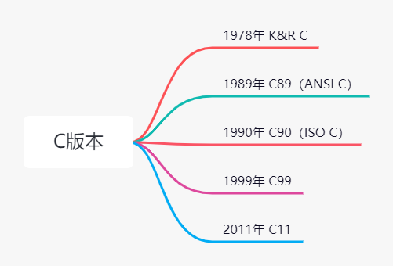
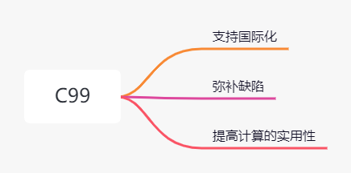

C 语言是一门功能强大的专业化编程语言，具有高级语言和汇编语言两者的特点，深受专业人员与业余爱好者的喜欢。C 语言作为一种计算机语言，可以开发很多靠近底层的应用。

# C语言的起源

1971 年，丹尼尔·里奇（D.M.Ritchie）想玩肯·汤普森（Ken Thrompson）使用本人发明的 B语言编写的 Space Travel 游戏，就与肯·汤普森合作开发了 UNIX，主要工作是改进 B 语言。于是，1972 年，改进的B语言，被称为C语言。1973 年，C语言主体完成后，使用它重写了 UNIX。至此，C 语言随着UNIX开始一起发展。成为现在首选的编程语言之一。

# C 语言的发展

C 语言发展之初，并没有所谓的 C 标准。1987 年，布莱恩·柯林汉（Brian Kernighan）和丹尼斯·里奇（Dennis Ritchie）合著的 The C Programming Language（《C 语言程序设计》）第 1 版是公认的 C 标准，通常称之为 K & R C 或经典 C。特别是，该书中的附录中的 “C 语言参考手册” 已成为实现 C 的指导标准。例如，编译器都声称提供完整的 K & R 实现。虽然这本书的附录定义了 C 语言。但却没有定义 C 库。与大多数语言不同的是，C 语言比其他语言更依赖库，因此需要一个标准库。实际上，由于缺乏官方标准，UNIX 实现提供的库已成为了标准库。

UNIX 与 C 语言在这一阶段蓬勃发展，采用的标准是《K&R》标准，是以 1978 年，Brain W.Kernighhan 和 Dennis M.Ritchie合著的《The C Programming Language》书籍为第一个标准。

随着 C 的蓬勃发展，更多的系统使用 C 语言，这让 C 社区意识到需要规定一个标准。由此，ANSI 与 1983 年组建了 X3J11 委员会，并公布了第一个 C 语言的标准草案（83 ANSI C）。之后，根据 C 各个版本对 C 语言进行发展和扩充，在 1989 年，公布了完整的 C 语言标准 X3.159.1989，简称 C89。

1990 年，ISO 组织接受了 C89 为 ISO C 的标准，也称 C90。其实跟 C89 没有区别，但业界人士通常称为 ANSI C，因为 ANSI 先发布的。

1994 年，ANSI/ISO 联合组委会（C9X委员会）开始修订 C 标准，后来成为了发布的 ISO/IEC 9899::1999 的标准，简称 C99。

C99 主要解决如下三点问题。

其它方面的改变较为保守，保留了 C 语言的精髓，使得 C 仍是一门简洁高效的语言。

2011 年，ISO 又发布了新的 C 语言版本 ISO/IEC9899::2011，简称 C11。本版本将 C99 中的一些特性在C11中成为可选项。该版本中引入了 字节对齐说明符、泛型机制、对多线程的支持、静态断言、原子操作以及对 Unicode 的支持。

但目前流行的 C 语言编译系统大多是以 C89 为基础进行开发的，而对其它版本，只是选择了部分支持。

# 总结

在过去的 40多年里，C 语言已成为最重要且流行的编程语言之一。它是强大且简洁的编程语言。自身提供了大量的使用编程工具，能很好地控制而且，与大多数其它程序相比，C 程序更容易从一个系统移植到另一个系统。使用 C 编写的著名软件非常多，如 Unix、Linux、Redis等其它软件。学习 C 语言，你可以开发操作系统、底层软件、嵌入式开发和与硬件打交道的软件开发。因此，学好 C 语言也是非常有帮助的。