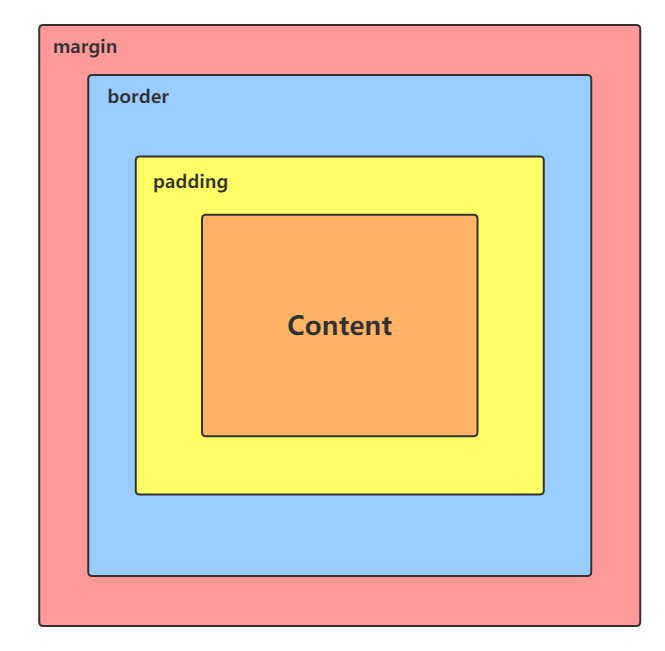
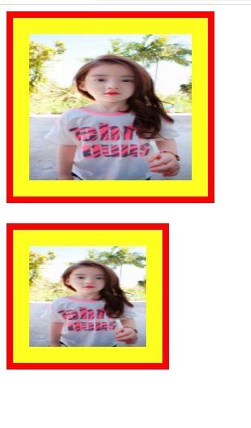
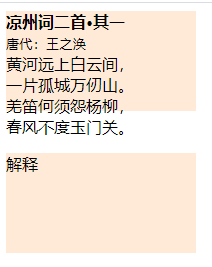
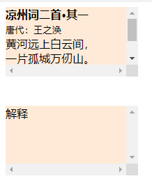
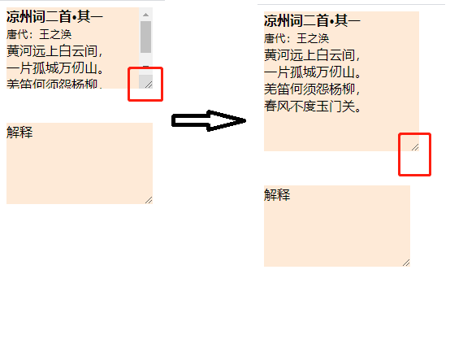
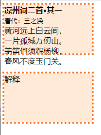

# 概念

当对文档进行布局时，所有元素会根据CSS盒模型进行渲染。CSS决定盒子的大小、位置以及其它属性。

# 模型

盒模型又称框模型（Box Model），由内容`content`、内边距`padding`、边框`border`和外边距`margin`四部分组成。



标准模型元素宽度`width=content-width`，高度`height=content-height`。

而IE模型元素宽度`width=content-width+padding-left+padding-right+border-left+border-right`，高度`height=content-height+padding-top+padding-bottom+border-top+border-bottom`。

## 盒模型计算方式

W3C的标准盒子中盒子尺寸的计算：

`element`空间宽度`width=content-width+padding-left+padding-right+border-left+border-right+margin-left+margin-right`；
`element`空间高度`height=content-height+padding-top+padding-bottom+border-top+border-bottom+margin-top+margin-bottom`。

外边距（`margin`）为元素之间的距离，盒子的尺寸并没有改变，因此不计算在内，则`element`空间的实际尺寸计算：

`element`空间宽度`width`=`content-width`+`padding-left`+`padding-right`+`border-left`+`border-right`；

`element`空间高度`height`=`content-height`+`padding-top`+`padding-bottom`+`border-top`+`border-bottom`。

## Content

`Cotent`：用于展示盒子的内容，例如文本、图像或视频等。大小为`Content`的宽高，含有背景颜色（默认为透明）或背景图像。

在设置区域大小之前，先明确`width`、`min-width`、`max-width`、`height`、`min-height`、`max-height`。

`width`属性给定元素设置宽度，`height`属性给定元素设置高度。

`min-width`属性为给定元素设置最小宽度值。`width`属性的值不得低于`min-width`的值。`max-width`属性为给定元素设置最大宽度值，定义了`max-width`的元素会在达到`max-width`之后避免进一步按照`width`属性设置变大。

`max-width`属性会覆盖`width`的设置，而 `min-width`设置的值会同时覆盖`max-width`和`width`。

`min-height`属性为给定元素设置最小高度值。`height`属性的值不得低于`min-height`的值。`max-height`属性为给定元素设置最大高度值。`height`属性的值不得高于`max-height`的值。

`max-height`属性会覆盖`height`设置的值，而`min-height`会覆盖`max-height`的值。

而`min-width`、`max-width`、`min-height`和`max-height`的语法相同。

```css
/*<length> value*/
min-width: 3.5em;
/*<percentage> value*/
max-width: 75%;
/*keyword values*/
max-width: none;
min-height: max-content;
max-width: min-content;
max-height: fit-content
min-width: fill-available;
/*Global values*/
max-width: inherit;
max-width: initial;
max-height: unset;
```

看一下这些属性可以赋予的值：

- `length`（单位长度），例如`1px`、`2cm`、`3mm`、`4Q`、`5in`、`6pc`、`7pt`、`8em`、`9rem`。
- `percentage`（百分比：相对于父元素长度来鵆定），例如：`50%`。
- `auto`用于弹性元素的默认最小宽度，相比其它布局中以`0`为默认值，`auto`能为弹性布局指明更合理的默认表现；
- `max-content`固有最大宽度；
- `min-content`固有最小宽度；
- `fill-content`包含块的宽度减去水平`margin`、`border`和`padding`。
- `fit-content`等同于`min(max-content, max(min-content, fill-available))`
- `none`元素未设置最大值，`max-width`可以使用该值。

## Padding

`Padding`：对内容区域的扩展，背景为`Content`的延伸（默认为透明），内边距是不允许有赋值的。

- `padding-top`：元素内边距区域上方的高度。
- `padding-left`：元素内边距区域左边的宽度。
- `padding-bottom`：元素内边距区域下方的高度。
- `padding-right`：元素内边距区域右边的宽度。

四个方向的内边距可以使用`padding`简写控制内边距区域。

```css
/*应用于所有边*/
padding: lem;
/*上边下边 | 左边右边*/
padding: 5% 10%;
/*上边 | 左边右边 | 下边*/
padding: 1em 2em 2em;
/*上边 | 右边 | 下边 | 左边*/
padding: 5px 1em 0 2em;
/*全局值*/
padding: inherit;
padding: initial;
padding: unset;
```

`padding`属性接受1~4个值。每个值可以是`<length>`或`<percentage>`。取值不能为负。

- 一个值时，统一应用到四个边的内边距。
- 两个值时，第一个值应用到上边和下边的内边距，第二只应用到左边和右边的内边距。
- 三个值时，第一个值应用到上边的内边距，第二个值应用到右边和左边的内边距，第三个值应用到下边的内边距。
- 四个值时，顺时针方向作为上边、右边、下边和左边的内边距。

## Border

`Border`：对内边距的扩展，是盒模型的边框区域。如何盒模型设有背景（`background-color`或`background-image`），则会一直延伸至边框的外沿，而边框会盖在背景上。

`border-width`：设置盒模型边框的宽度。它是`border-top-width`，`border-right-width`、`border-bottom-width`和`border-left-width`的简写。

```css
/*应用于所有边*/
border-width: 5px;
/*左右边 | 上下边*/
border-width: 2px 1.5em;
/*上边 | 左右边 | 下边*/
border-width: 1px 2em 1.5cm
/*上边 | 右边 | 下边 | 左边*/
border-width: 1px 2em 0 4rem;
/*使用全局关键字：inherit(继承),initial(初始值),unset(不设置)*/
border-width: inherit;
/*作用于border-width的关键字：thin(细边线),medium(中等边线),thick(宽边线)*/
border-width: thin;
```

`border-width`可以使用简写`border`：

```css
/*width | style | color*/
border: medium dashed green;
```

`border`的三个取值为`border-width`、`border-style`和`border-color`。

## Margin

`Margin`：使用的空白区域来扩展边框区域，以分开相邻区域。

- `margin-top`：元素顶部的外边距，可以负值。
- `margin-left`：元素左边的外边距，可以负值。
- `margin-bottom`：元素底部的外边距，可以负值。
- `margin-right`：元素右边的外边距，可以负值。

四个外边距可以使用`margin`简写四个方向的外边距属性。

```css
/* 应用于所有边 */
margin: -3px;
/* 上边下边 | 左边右边 */
margin: 5% auto;
/* 上边 | 左边右边 | 下边 */
margin: 1em auto 2em; 
/* 上边 | 右边 | 下边 | 左边 */
margin: 2px 1em 0 auto;
/* 全局值：inherit,initial,unset */
margin: inherit;
```

`margin`属性接受1~4个值。每个值可以是`<length>`、`<percentage>`或`auto`（让浏览器选择合适的外边距，特殊情况下，该值使元素居中）。取值为负时元素会比原来更接近临近元素。

- 一个值时，全部应用到四个边的外边距上。
- 二个值时，第一个值应用于上边和下边的外边距，第二个值应用于左边和右边的外边距。
- 三个值时，第一个值应用于上边的外边距，第二个值应用于左边和右边的外边距，第三个值应用于下边的外边距。
- 四个值时，顺时针应用于上边、右边、下边和左边的外边距。

竖直排列相邻的两个盒子模型的外边距会重叠，称为`margin-collapsing`。

提示：在盒模型中，外边距可以是负值，而且在很多情况下都要使用负值的外边距。

最后，请注意，除可替换元素外，对于行内元素来说，尽管内容周围存在内边距与边框，但其占用空间（每一行文字的高度）则由 line-height 属性决定，即使边框和内边距仍会显示在内容周围。

## box-sizing

根据盒模型定义，一个元素的`width`和`height`属性只会应用到内容区，CSS3新增的`box-sizing`能够定义盒模型的解析方式。

`box-sizing`的属性值主要有以下三个：

- `content-box`默认值。W3C标准盒模型，设置的`width/height`就是`content`的宽高。
- `border-box`重新定义盒模型，`width/height`中除了有`content`的宽高还要加上`padding`和`border`的宽高。
- `inherit`值会继承父元素的`box-sizing`属性的值。

对`box-sizing`中`content-box`和`border-box`值进行解析，比较两者的不同。

```css
div img {
    width: 200px;
    height: 180px;
    padding: 20px;
    border: 8px solid red;
    background: yellow;
}
.content-box img {
    box-sizing: content-box;
}
.border-box img {
    box-sizing: border-box;
}
```

```html
<div class="content-box">
    
</div>
<br>
<div class="border-box">
    
</div>
```



上面显示的结果就是不同`box-sizing`值改变相同元素的渲染结果。

全局设置`border-box`属性，省略每次在元素上添加。

```css
html {
    -webkit-box-sizing:border-box;
    -moz-box-sizing:border-box;
    box-sizing:border-box;
}
*,*::before,*::after {
    /*Safari支持*/
    -webkit-box-sizing:inherit;
    /*Firefox支持*/
    -moz-box-sizing:inherit;
    box-sizing:inherit;
}
```

> 选择器 * 无法覆盖到伪元素，所有需要给 :before 和 :after 分别设置。

但是全局的`box-sizing:border-box`注意对第三方组件库的侵入，第三方组件库可能基于`content-box`布局的，
因此将所有元素的`box-sizing`设为`inherit`


## overflow

`overflow`属性用于在`content`内容超过容纳大小出现溢出问题时使用。`overflow`属性是CSS2.1规范中的特性，而在CSS3中增加了`overflow-x`和`overflow-y`属性。

`overflow-x`设置水平方向的溢出；`overflow-y`设置垂直方向的溢出；`overflow`为两者的简写。

关于三个处理溢出的属性有四种处理值可选：

- `auto`：自行处理溢出内容。如果有溢出内容，溢出部分隐藏在容器中并显示滚动条。
- `hidden`：内容溢出时，所有内容都隐藏，并且不显示滚动条。
- `scroll`：不管是否溢出，上下滚动条都将显示。
- `visible`：默认值，溢出时会显示在框外。
- `inherit`：从父元素继承`overflow`属性的值。

我们看一下它的例子：

```css
div {
    width: 180px;
    height: 100px;
    background: antiquewhite;
    overflow: visible;
        }
```

```html
<div>
    <b>凉州词二首·其一</b>  <br>
    <small>唐代：王之涣</small>     <br>
    黄河远上白云间， <br>
    一片孤城万仞山。 <br>
    羌笛何须怨杨柳， <br>
    春风不度玉门关。
</div>
<br>
<div>
    解释
</div>
```



当将 `overflow`换成`scroll`后的效果如下：




## resize

CSS3添加了`resize`属性，来改变元素尺寸。

我们将上面的CSS例子中添加`resize`可以改变元素大小

```css
div {
    width: 180px;
    height: 100px;
    background: antiquewhite;
    overflow: auto;
    resize: both;
}
```



拖动右下角就可以将元素大小进行改变。

`resize`属性的值可以有以下几种：

- `none`：无法调整元素尺寸。
- `both`：调整元素宽高。
- `horizontal`：调整元素宽度。
- `vertical`：调整元素高度。
- `inherit`：继承父元素`resize`属性。

当`overflow`属性设置为`visible`时，`resize`属性不起作用。

## outline

CSS的`outline`属性可以设置外轮廓，是多个轮廓属性的简写，例如`outline-style`、`outline-width`和`outline-color`。

在上面的例子中添加`outline`属性：

```css
div {
    width: 180px;
    height: 100px;
    background: antiquewhite;
    outline: 4px dotted #ee7733;
}
```



`outline`属性语法如下：

```css
/*style*/
outline: solid;
/*color | style*/
outline: #f66 dashed;
/*style | width*/
outline: inset thick;
/*color | style | width*/
outline: green | solid 3px;
/*Global value(inherit, initial, unset)*/
outline: inherit;
```

`outline`属性可以使用一至三个值，顺序不重要。


`border`和`outline`类似，但也有区别：

- `border`几乎可应用在所有有形的`html`元素中，`outline`针对链接、表单控件和`ImageMap`等元素设计。
- `outline`效果随元素的`focus`自动出现，相应的由`blur`自动消失；是浏览器默认行为，无需JavaScript配合CSS来控制。
- `outline`不占空间，绘制于元素内容周围，而`border`属于盒模型一部分。

# 总结

本章简单介绍了下`CSS`的盒模型和怪异盒模型的对比，可以影响到盒模型的属性，因此可以利用这些属性来布局想要的UI界面。