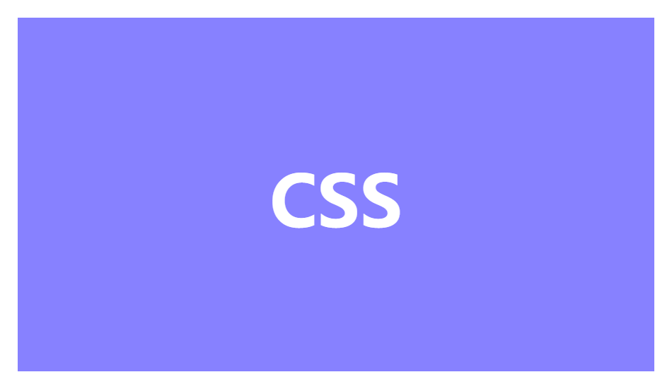
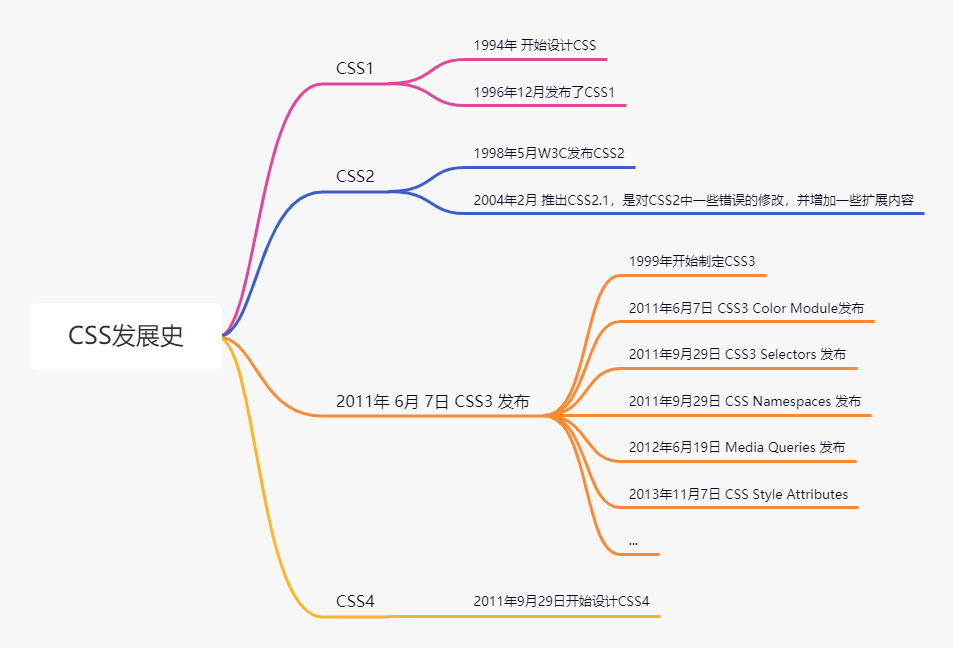

CSS（Cascading Style Sheets，层叠样式表）是用来为 HTML 文档添加样式的一种语言，是由 W3C 定义和维护的，现在大部分浏览器都已经支持 CSS3，而下一版本还在开发中。

CSS 一般都是和 HTML 一起工作的，为 HTML 元素添加样式，使得界面美观，CSS 可以使用 `<style>` 标签零散地添加在 HTML 文档中，也可以全部写入 `.css` 文件中，并引入文档中。

## 发明CSS

`Tim Berners-Lee` 在 1990 年创建了 HTML ，用于在万维网中方便的阅读网页，但是并没有样式来对 HTML 进行装饰，因此，并不美观。在 HTML 开发后，也陆续出现了各种形式的样式表，都是用户使用样式自己调节网页的显示。

在 1994 年，哈肯·维姆·莱提出了CSS的建议并与伯特·波斯合作设计，且在芝加哥会议上展示了 CSS 的建议。在 1995 年，W3C 也加入进来，并让它们两个负责这个项目，直到 1996 年 12月，发布了 CSS1 规范。也是哈肯·莱论文的一部分，新产品需要市场检验，在当时并不火的项目，在浏览器大战的时候，微软的 IE 先实现了该标准。

## CSS 发展

CSS1 在 1996 年 12 月发布，但当时并不是太火，之后还有各种问题，因此，W3C 在 1997 年组织了专管 CSS 的工作组，对 CSS1 进行更新迭代，直到 1998 年 5月推出了 CSS2，其中包括许多新的内容，如支持的字体的大小等、字的颜色、背景颜色、文字的排列等多种功能，而 1998 年 5 月发布的 CSS2.1 是对 CSS2 中错误地填补和加入一些新的功能。

在之后的 CSS3 是对 CSS 的一次大改，将 CSS 分为不同的模块，每一个模块都有 CSS2 中额外增加的功能，以及向后兼容。它是在 1999年就开始制定了，里面增加了 `border-radius`、`text-shadow` 等功能，还支持动画及立体。2001年 5月 23 日才完成CSS3 的工作草案， 也是现代浏览器支持的版本。而 CSS4  2011 年 9月 29日开始设计，但只有极少数的功能被部分网页浏览器支持，离真正发布的距离还较遥远。

## CSS3

CSS2 由于一些次要特性使得经历了较长时间的更新，因此在 CSS3 中，才使用模块的方式独立开发并实现标准化，将 CSS2 中的功能进行拆分成为现在的 CSS3 的基础上，在开发一些单独的模块，扩充 CSS3 的功能，使之丰满起来。

由于每个模块都独立标准化，在叫 CSS3 标准也不合适，但长称这次的更新版本为 CSS3，而有些在 CSS4 中实现的模块，现在也可以使用，但也只是草案阶段，因此，现在还是已 CSS3 为主。

## 总结

CSS 发展到现在，已经变得非常复杂，由于前端工程化的不断发展，使得前端开发也可以进入移动端，实现跨平台开发，CSS 也走到了这一步，但也使得前端业务复杂度越来越高，工程也越来越庞大，这也发展出了一些 CSS 框架和工具等来简化前端开发。希望未来的 CSS 发展能够更好吧。