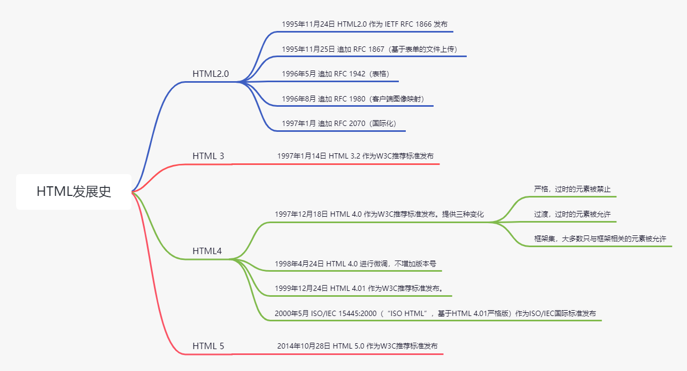

HTML（HyperText Markup Language，超文本标记语言）是一种用于定义网页内容的含义和结构的标记语言。除此之外，网页还需要 CSS 描述网页的展示效果和 JavaScript实现与用户的交互性。它不是编程语言。

## 发明HTML

HTML 是由 `Tim Berners-Lee` 和同事 `Daniel W.Connolly` 于 1990 年创立的一种标记语言。当时，`Tim Berners-Lee` 发明了万维网，并且为了方便阅读网页，又发明了 HTML、HTTP、URL，使用自制的浏览器去访问网页。HTML 中元素的设计深受 CERN 内部的 SGML 为基础的文件格式 SGMLguid影响。

## HTML 的发展

在`Tim Berners-Lee` 与 1990年发明了 HTML 后，经过了24年时间，到 2014年才发展到HTML 5，之间经历了HTML 2.0、HTML 3.2、HTML 4.0、HTML4.01，直到HTML 5 这几个版本。

`Tim Berners-Lee`加入的互联网工程任务组（IETF）于 1993 年发布首个HTML规范的提案，并于6个月后过期，IETF创建了一个HTML工作组，并在 1995年完成 HTML 2.0，这是第一个HTML规范，而之前的版本只是草案阶段，非正式版本。

而之后HTML标准的发展因为竞争利益遭到停歇，因此，从 1996 年开始，就一直由W3C组织维护HTML规范了，W3C 组织将标准化发布到 4.0版本后，终于在 2000年成为国际标准。

然而，发布了四个版本后，业界普遍认为 HTML 已经到了穷途末路，因此也将焦点转移到了XML和XHTML上，因此，HTML迫切需要添加新功能，指定新规范，从而扭转这一切。

就在这种情况下，一组人在 2004 年成立了 WHATWG，并创立了 HTML5 规范，同时也开始专门针对 Web 应用开发新功能，Web 2.0 就是在这时被发明的。在 2006 年，W3C 又重新介入 HTML，并与 WHATWG 合作共同，最终在 2008 年发布了 HTML5 工作草案。而在 HTML 5 规范还为定稿的情况下，各大浏览器厂商都开始将自家产品升级以支持 HTML 5 的新功能了。最终在 2014 年 10月 28 日完成标准化。

## HTML5

HTML 5 是基于各种各样的理念进行设计的，这些设计理念体现了对可能性和可行性的新认识。但 HTML 5 并不是颠覆性的革新。而是要保持一切新特性平滑过渡。

因为在 HTML 5 之前，在网页上看视频等，只能使用插件，如 Adobe 开发的 Flash，但浏览器厂商不想在自家产品上使用插件，因此，HTML 5 中的一个新特性就是让浏览器直接处理那些原来要使用 Flash 的富内容。

## 总结

HTML 经过这些年的发展，已经走向成熟，是前端开发中不可或缺的一环，而 HTML 5 标准还没有到最终版本，现在仍处在完善阶段。前端要学习的还有很多，大家要加油！