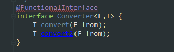

# Java8 函数式编程


> 函数式编程语言操作代码片段就像操作数据一样容易。虽然 Java 不是函数式语言，但 Java 8 Lambda 表达式和方法引用（Method References）允许你以函数式编程。


OO（object oriented，面向对象）是抽象数据。FP（functional programming，函数式编程）是抽象行为。

## 新旧对比

下面使用传统形式和Java 8 的函数式演示 `Runnable` 接口的表示形式：

```java
// 方法引用于 Runnable 接口的结合使用
class Go {
    static void go() {
        System.out.println("Go::go()");
    }
}
public class RunnableMethodReference {
    public static void main(String[] args) {
    	// Java 8 之前使用匿名内部类
        new Thread(new Runnable() {		
            @Override
            public void run() {
                System.out.println("Anonymous");
            }
        }).start();
		// Java 8 之后使用 Lambda 表达式来缩短代码
        new Thread(
                () -> System.out.println("lambda")
        ).start();
        // Java 8 之后也可以使用方法引用来替代匿名内部类
        new Thread(Go::go).start();
    }
}
```

输出结果：

```shell
Anonymous
lambda
Go::go()
```


## Lambda表达式

Lambda表达式是 JDK8 新增的功能，简化开发者的编码，底层通过 `invokedynamic` 指定来生成匿名类来实现。Lambda 表达式本质上是一个匿名方法，但这个方法不是独立执行的，而是用于实现由函数式接口定义的另一个方法。因此，Lambda 表达式会导致生成一个匿名类。

我们在 **Strategize.java** 中看到了一个 Lambda 表达式，但还有其它语法变体：

```java
interface Description {
    String brief();
}

interface Body {
    String detailed(String head);
}

interface Multi {
    String twoArg(String head, Double d);
}

public class LambdaExpressions {

    static Body bod = h -> h + " No Parens!";   // [1]

    static Body bod2 = (h) -> h + " More details";  // [2]

    static Description desc = () -> "Short info";   // [3]

    static Multi mult = (h, n) -> h + n;    // [4]

    static Description moreLines = () -> {  // [5]
        System.out.println("moreLines()");
        return "from moreLines()";
    };

    public static void main(String[] args) {
        System.out.println(bod.detailed("Oh!"));
        System.out.println(bod2.detailed("Hi!"));
        System.out.println(desc.brief());
        System.out.println(mult.twoArg("Pi! ", 3.14159));
        System.out.println(moreLines.brief());
    }
}
```

输出结果：

```shell
Oh! No Parens!
Hi! More details
Short info
Pi! 3.14159
moreLines()
from moreLines()
```

我们从三个接口开始，每个接口都有一个单独的方法。但是，每个方法都有不同数量的参数，以便演示Lambda 表达式语法。

任何 Lambda 表达式的基本语法是：`(parameters) -> expression` 或者  `(parameters) -> {statements;}`

1. `parameters`：类似方法中的形参列表，这里的参数是函数式接口里的参数。这里的参数类型可以显示指定也可以不声明，因为很多时候参数的类型是可以推断出来的，当只有一个推断类型时可以省略掉圆括号。
2. 接着 `->` ，可以理解为 "被用于" 的意思 。
3. `->` 之后的内容都是方法体，可以是表达式也可以是代码块，实现函数式接口中的方法。这个方法体可以有返回值也可以没有返回值。

Lambda表达式单行时，自动生成返回值，使用 `return` 是非法的。多行时，则必须使用 `{}` 括起来，并且使用 `return`。

### Lambda访问变量

Lambda表达式对外部变量的操作权限会有一些不同，Lambda表达式可以访问标记了 `final` 的外层局部变量，类的实例变量以及静态变量。但是如果访问局部变量，局部变量必须是被 `final` 修饰的，没有被修饰的局部变量，Lambda调用时会被隐式地声明为常量。

```java
public class LambdaScopeTest {
    
    private static boolean flag = true;

    public static void main(String[] args) {

        int num = 1;    // 等价于 `final int num = 1;`
        // 可以直接访问外层的局部变量，局部变量可以不用声明为 `final`，
        // 因为 lambda 表达式中使用的变量应该是 `final` 或有效的 `final`
        // 这里的 `num` 变量是隐性具有 `final` 语义的变量
        Function<Integer, String> f1 = from -> String.valueOf(num);
        Function<Integer, String> f3 = from -> String.valueOf(num);
        String s = f1.apply(2);
        // num = 3; 这里不能修改，因为 `num` 变量是隐性的 `final`
        Function<Integer, String> f2 = from -> {
            // 可以访问并修改静态变量
            flag = false;
            // 不支持访问默认方法
            // andThen(f1);
            return String.valueOf(num);
        };
    }
}
```

从上述例子中，可以看出，Lambda表达式内部不能访问默认方法。

### 递归

递归函数是一个自我调用的函数。可以编写递归的 Lambda 表达式，但需要注意：递归方法必须是实例变量或静态变量，否则会出现编译时错误。我们将为每个案例创建一个示例。

这两个示例都需要一个接受 `int` 型参数并生成 `int` 的接口：

```java
public interface IntCall {
    int call(int arg);
}
```

整数 n 的阶乘将所有小于或等于 n 的正整数相乘。阶乘函数是一个常见的递归示例：

```java
public class RecursiveFactorial {
    static IntCall fact;
    public static void main(String[] args) {
        fact = n -> n == 0 ? 1 : n * fact.call(n - 1);
        for (int i = 0; i <= 10; i++) {
            System.out.println(fact.call(i));
        }
    }
}
```

输出结果：

```shell
1
1
2
6
24
120
720
5040
40320
362880
3628800
```

这里， `fact` 是一个静态变量。注意使用三元 `if-else`。递归函数将一直调用自己，直到 `i == 0`。所有递归函数都有 "停止条件"，否则将无限递归并产生异常。

我们可以将 `Fibonacci` 序列改为使用递归 Lambda 表达式来实现，这次使用实例变量：

```java
public class RecursiveFibonacci {
    IntCall fib;

    RecursiveFibonacci() {
        fib = n -> n == 0 ? 0 :
                n == 1 ? 1 :
                        fib.call(n - 1) + fib.call(n - 2);
    }

    int fibonacci(int n) {
        return fib.call(n);
    }

    public static void main(String[] args) {
        RecursiveFibonacci rf = new RecursiveFibonacci();
        for (int i = 0; i <= 10; i++) {
            System.out.println(rf.fibonacci(i));
        }
    }
}
```

输出结果：

```shell
0
1
1
2
3
5
8
13
21
34
55
```

将 `Fibonacci` 序列中的最后两个元素求和来产生下一个元素。

## 方法引用

Lambda 表达式允许我们可以通过函数式接口来声明一个匿名方法，方法引用和 Lambda 表达式拥有类似的特性（都需要一个目标类型以及可以被转化为函数式接口的实例），我们不需要为方法引用提供方法体，而是可以直接通过方法名称引用已有方法

方法引用组成：类名或对象名，后面跟 `::` ，然后跟方法名称。

```java
public class MethodReferences {
    static class Description {
        String about;
        Description(String desc) {
            about = desc;
        }
        void help(String msg) { // [4]
            System.out.println(about + " " + msg);
        }
    }
    public static void main(String[] args) {
    	Consumer<String> c = i -> {
            Description a = new Description("Valuable");
            a.help(i);
        };
        c.accept("information");
    }
}
```

在这里我们用方法引用代替 lambda 表达式

```java
Consumer<String> c = new Description("Valuable")::help;
c.accept("information");
```

这里的 `new Description("Valuable")::help` 可以看作为 Lambda 表达式的简写形式。尽管方法引用不一定会把语法变得更紧凑，但它拥有更明确的语义 —— 如果我们想要调用的方法拥有一个名字，我们就可以通过它的名字直接调用它。

### 方法引用的种类

方法引用有很多种，它们的语法如下：

- 静态方法引用：`ClassName::methodName`
- 实例上的实例方法引用：`instanceReference::methodName`
- 超类上的实例方法引用：`super::methodName`
- 类型上的实例方法引用：`ClassName::methodName`
- 构造方法引用：`ClassName::new`
- 数组构造方法引用：`TypeName[]::new`


```java
class Logger {
    // 静态方法
    static void info(String msg) {
        System.out.println(msg);
    }
}
class Describe {
    // 实例方法
    void show(String msg) {
        System.out.println(msg);
    }
}
public class KindMethodReferences {

    public static void main(String[] args) {
        
        Consumer<String> c1 = Logger::info; // [1]
        c1.accept("static method reference");
        
        Consumer<String> c2 = new Describe()::show; // [2]
        c2.accept("instance method reference");
    }
}
```

[1] `info()` 是静态方法引用。
[2] `show()` 是实例化对象的方法引用。

#### 构造函数引用

你还可以捕获构造函数的引用，然后通过引用调用该构造函数。

```java
class Person {
    String name;
    int age = -1;    // For "unknown"
    Person() { name = "Jan"; }
    Person(String name) { this.name = name; }
    Person(String name, int age ) {
        this.name = name;
        this.age = age;
    }

    @Override
    public String toString() {
        return new StringJoiner(", ", Person.class.getSimpleName() + "[", "]")
                .add("name='" + name + "'")
                .add("age=" + age)
                .toString();
    }
}
interface MakeNoArgs {
    Person make();
}

interface Make1Arg {
    Person make(String nm);
}

interface Make2Args {
    Person make(String nm, int age);
}
public class ConstructorReferences {
    public static void main(String[] args) {
        MakeNoArgs mna = Person::new;   // [1]
        Make1Arg m1a = Person::new;     // [2]
        Make2Args m2a = Person::new;    // [3]

        Person pn = mna.make();
        Person p1 = m1a.make("Feb");
        Person p2 = m2a.make("Mar", 24);

        System.out.println(pn);
        System.out.println(p1);
        System.out.println(p2);
    }
}
```

输出结果：

```shell
Person[name='Jan', age=-1]
Person[name='Feb', age=-1]
Person[name='Mar', age=24]
```

`Person` 有三个构造函数，函数接口内的 `make()` 方法反映了构造函数参数列表。

[1]，[2] 和 [3] 都是用的是 `Person::new`，因为构造函数只有 `::new` 方法引用。编译器可以检测并将构造函数赋值给对应的接口进行调用。

#### 类型上的实例方法引用

上述的方法引用，都比较容易理解，但是想要理解 "类型上的实例方法引用" 并不容易。下面举例：

```java
String[] strings = {"Hello", "World"};
Comparator<String> c = String::compareToIgnoreCase;
Arrays.sort(strings, c);
```

与 "实例上的方法引用" 不同，实例方法要通过对象来调用，方法引用对象 Lambda，Lambda 的第一个参数会成为调用实例方法的对象。用 Lambda 表达式来表述上面的例子：

```java
String[] strings = {"Hello", "World"};
Comparator<String> c = (s1, s2) -> s1.compareToIgnoreCase(s2);
Arrays.sort(strings, c);
```

### 未绑定的方法引用

未绑定的方法引用是指没有关联对象的普通（非静态）方法。使用未绑定的引用之前，我们必须先提供对象：

```java
// 没有方法引用的对象
class X {
    String f() {
        return "X::f()";
    }
}

interface MakeString {
    String make();
}

interface TransformX {
    String transform(X x);
}

public class UnboundMethodReference {
    public static void main(String[] args) {
//         MakeString ms = X::f;    // [1]
        TransformX sp = X::f;
        X x = new X();
        System.out.println(sp.transform(x));    // [2]
        System.out.println(x.f());  // 等同效果
    }
}
```

输出结果：

```shell
X::f()
X::f()
```

截止目前，我们已经知道了与接口方法同名的方法引用。 在 [1]，我们尝试把 X 的 f() 方法引用赋值给 `MakeString`。结果：即使 `make()` 与 `f()` 具有相同的签名，编译也会报“invalid method reference”（无效方法引用）错误。 这是因为实际上还有另一个隐藏的参数：我们的老朋友 `this`。 你不能在没有 `X` 对象的前提下调用 `f()`。 因此，`X::f` 表示未绑定的方法引用，因为它尚未“绑定”到对象。

要解决这个问题，我们需要一个 `X` 对象，所以我们的接口实际上需要一个额外的参数的接口，如上例中的 `TransformX`。 如果将 `X::f` 赋值给 `TransformX`，这在 Java 中是允许的。这次我们需要调整下心里预期——使用未绑定的引用时，函数方法的签名（接口中的单个方法）不再与方法引用的签名完全匹配。 理由是：你需要一个对象来调用方法。

[2] 的结果有点像脑筋急转弯。 我接受未绑定的引用并对其调用 `transform()`，将其传递给 `X`，并以某种方式导致对 `x.f()` 的调用。 Java 知道它必须采用第一个参数，这实际上就是 `this`，并在其上调用方法。

```java
class This {
    void two(int i, double d) {}
    void three(int i, double d, String s) {}
    void four(int i, double d, String s, char c) {}
}

interface TwoArgs {
    void call2(This athis, int i, double d);
}

interface ThreeArgs {
    void call3(This athis, int i, double d, String s);
}

interface FourArgs {
    void call4(
            This athis, int i, double d, String s, char c);
}

public class MultiUnbound {
    public static void main(String[] args) {
        TwoArgs twoargs = This::two;
        ThreeArgs threeargs = This::three;
        FourArgs fourargs = This::four;
        This athis = new This();
        twoargs.call2(athis, 11, 3.14);
        threeargs.call3(athis, 11, 3.14, "Three");
        fourargs.call4(athis, 11, 3.14, "Four", 'Z');
    }
}
```

为了说明这一点，我将类命名为 `This`，函数方法的第一个参数则是 `athis`，但是你应该选择其他名称以防止生产代码混淆。


## 函数式接口

函数式接口是仅仅定义了一个抽象方法，但是可以有多个非抽象方法(即默认方法)的接口。

在编写接口时，可以使用 `@FunctionalInterface` 注解强制执行此 "函数式方法" 模式：

```java
@FunctionalInterface
interface Converter<F,T> {
    T convert(F from);
}

public class FunctionalAnnotations {
    public static void main(String[] args) {
        // 将数字字符串转换为整数类型
        Converter<String, Integer> converter = Integer::valueOf;
        Integer converted = converter.convert("123456");
        System.out.println(converted.getClass());	// class = java.lang.Integer
    }
}
```

`@FunctionalInterface` 注解是可选的；我们把 `Convertor` 接口中的注解去掉，也可以被 Java 当作函数式接口。

当接口中存在多个方法时，使用 `@FunctionalInterface` 注解会使接口产生编译时错误。



上述图片会报编译时错误信息：`Multiple non-overriding abstract methods found in interface xx.xx.Converter`

`@FunctionalInterface` 的值在 `NotFunctional` 的定义中可见；接口中如果有多个方法则会产生编译时错误消息。

函数式接口里允许定义默认方法与静态方法，因为默认方法与静态方法都不是抽象方法，是一个实现。

函数式接口里也允许定义 `java.lang.Object` 里的 `public` 方法，这些方法对于函数式接口，不会被当成抽象方法（虽然它们是抽象方法）；因为任何一个函数式接口的实现，默认都继承了 `Object` 类，因此也包含了 `Object` 类中这些抽象方法的实现。

符合函数式接口的定义：

```java
@FunctionalInterface
interface Converter<F,T> {
    T convert(F from);
    // 默认方法
    default void defaultMethod() {
    	System.out.println("default method");
    }
    // 静态方法
    static void staticMethod() {
    	System.out.println("static method");
    }
    // Object方法
    @Override
    boolean equals(Object o);
}
```

### 常用函数式接口

`Consumer`（消费者）

`java.util.function.Consumer<T>` 接口是进行消费的，其消费的数据类型由泛型决定。

抽象方法：`void accept(T t)`，作用为消费一个指定泛型的数据。

默认方法：`default Comsumer<T> andThen(Consumer<? super T> after)`，表示参数和返回全都是 `Consumer` 类型，就可以调用；消费数据的时候，首先做一个操作，然后再做一个操作，实现组合。

```java
public class ConsumerTest {
    public static void main(String[] args) {
        Consumer<String[]> c1 = v1 -> {
            for (int i = 0; i < v1.length; i++) {
                System.out.println(v1[i].split("\\,")[0] + " ");
            }
        };
        Consumer<String[]> c2 = v2 -> {
            System.out.println();
            for (int i = 0; i < v2.length; i++) {
                System.out.println(v2[i].split("\\,")[1] + " ");
            }
        };
        c1.andThen(c2).accept(new String[]{"迪丽热巴,女", "古力娜扎,女", "马尔扎哈,男"});
        System.out.println();
        // 自身消费
        String[] datas = new String[]{"迪丽热巴,女", "古力娜扎,女", "马尔扎哈,男"};
        Consumer<String> one = s -> System.out.print(s.split("\\,")[0]);
        Consumer<String> two = s -> System.out.println("," + s.split("\\,")[1]);
        for (String info : datas) {
            one.andThen(two).accept(info);
        }

    }
}
/*格式化输出：
迪丽热巴 
古力娜扎 
马尔扎哈 

女 
女 
男 

迪丽热巴,女
古力娜扎,女
马尔扎哈,男
*/
```

`Supplier`（提供者）

`java.util.function.Supplier<T>` 接口只有 `T get()` 方法，用于获取一个泛型参数指定类型的对象数据。由于是一个函数式接口，这意味着对应的 Lambda 表达式需要 "对外提供" 一个服务泛型类型的对象数据。

```java
public class SupplierTest {
    public static void main(String[] args) {
        // 定义一个 Integer 类型的数组并赋值
        Integer[] data = new Integer[]{31, 23, 66, 12, 9};
        // 定义一个 Supplier 获取最大值的提供者
        Supplier<Integer> supplier = () -> {
            // 获取数组最大值并返回
            int max = data[0];
            for (Integer datum : data) {
                max = Math.max(max, datum);
            }
            return max;
        };
        int result = supplier.get();
        System.out.println(result);
    }
}
```

`Function`接口

`java.util.function.Function<T,R>` 接口中最主要的抽象方法为类型转换，源码如下：

```java
@FunctionalInterface
public interface Function<T, R> {
	// 根据泛型类型 T 的参数获取类型 R 的结果
    R apply(T t);
}
```

如下例子所示，将一个数字类型转换为字符串类型：

```java
Function<Number, String> function = String::valueOf;
String apply = function.apply(12);
```

`Function` 接口中有两个默认方法，是用来进行组合操作。

`compose()` 方法源码如下：

```java
default <V> Function<V, R> compose(Function<? super V, ? extends T> before) {
	Objects.requireNonNull(before);
	// 先执行 before 的 apply 方法，后执行调用者
	return (V v) -> apply(before.apply(v));
}
```

`andThen()` 源码如下：

```java
// 这里的V 一个作为输入值，一个作为输出值 按照调用的顺序不同，对于 T V 做输入，输出的顺序也不同
default <V> Function<T, V> andThen(Function<? super R, ? extends V> after) {
	Objects.requireNonNull(after);
	// 先执行调用者，再执行 after 的 apply 方法
	return (T t) -> after.apply(apply(t));
}
```

还有一个静态方法 `identity()` 方法，源码如下：

```java
// 返回一个执行了 apply() 方法之后只会返回输入参数的函数对象
static <T> Function<T, T> identity() {
	return t -> t;
}
```

调用自身，输入对象就是输出对象。

下面根据 `Function` 函数式接口中的方法实现如下例子：

```java
public class FunctionTest {
    public static void main(String[] args) {
        String str = "赵丽颖,20";
        // 截取字符串
        Function<String, String> f1 = s -> s.split("\\,")[1];
        // 将数字字符串转换为数字
        Function<String, Integer> f2 = Integer::parseInt;
        // 数字累加100，得到新的数字
        Function<Integer, Integer> f3 = s -> s+= 100;

		// 该例子先调用f1表达式，再调用f2表达式，最后在调用f3表达式
        Integer apply = f3.compose(f1.andThen(f2)).apply(str);
        System.out.println(apply);
    }
}
/*
输出结果：
120
*/
```

`Predicate`接口

`Predicate` 接口中的抽象方法是用来进行条件判断的，源码如下：

```java
@FunctionalInterface
public interface Predicate<T> {
    boolean test(T t);
}
```

我们对 `Predicate` 实现一个例子，来说明 `test()` 方法的作用，判断字符串中是否存在字符d：

```java
Predicate<String> p1 = s -> s.contains("d");
boolean b1 = p1.test("Hello World!");
```

`Predicate` 中有三个默认方法，是条件判断中的与、或、非三种逻辑关系：

```java
// 逻辑关系中的与
default Predicate<T> and(Predicate<? super T> other) {
	Objects.requireNonNull(other);
	return (t) -> test(t) && other.test(t);
}
// 逻辑关系中的非
default Predicate<T> negate() {
	return (t) -> !test(t);
}
// 逻辑关系中的或
default Predicate<T> or(Predicate<? super T> other) {
	Objects.requireNonNull(other);
	return (t) -> test(t) || other.test(t);
}
```

对上述三个默认方法的使用：

```java
Predicate<String> p1 = s -> s.contains("d");
Predicate<String> p2 = s -> s.contains("h");
// 该表达式是 判断 "Hello World!" 是否同时存在 d 和 h
boolean b2 = p1.and(p2).test("Hello World!");

Predicate<String> p3 = s -> s.contains("f");
// 该表达式是 判断 "Hello World!" 是否存在 d 或 f
boolean b3 = p1.or(p3).test("Hello World!");

Predicate<String> p4 = s -> s.contains("o");
// 该表达式是 判断 "Hello World!" 不存在 o
boolean b4 = p4.negate().test("Hello World!");
```

`Predicate` 中还有两个静态方法：

```java
// 判断两个对象是否相等
static <T> Predicate<T> isEqual(Object targetRef) {
	return (null == targetRef)
		? Objects::isNull
		: object -> targetRef.equals(object);
}
// 对 表达式 取反
@SuppressWarnings("unchecked")
static <T> Predicate<T> not(Predicate<? super T> target) {
	Objects.requireNonNull(target);
	return (Predicate<T>)target.negate();
}
```

`java.util.function` 包旨在创建一组完整的目标接口，使得我们一般情况下不需要再定义自己的接口。这主要是因为基本类型会产生一小部分接口。如果你了解命名模式，顾名思义就能知道特定接口的作用。

扩展函数比较多，但是掌握了上面几个基本的接口，其它接口使用方式基本相同。

### 多参数函数式接口


`java.util.function` 提供了优先的接口。但当参数增多时，我们就必须自行创建，代码示例：

```java
@FunctionalInterface
public interface TriFunction<T, U, V, R> {
    R apply(T t, U u, V v);
}
```

简单测试，验证它是否有效：

```java
public class TriFunctionTest {
    static int f(int i, long l, double d) {
        return (int) (i + l + d);
    }
    public static void main(String[] args) {
        TriFunction<Integer, Long, Double, Integer> tf;
        tf = TriFunctionTest::f;
        System.out.println(tf.apply(1, 2L, 3.0));
    }
}
```

这里我们测试了方法引用和 Lambda 表达式。

## 高阶函数

函数式编程有一个很大的特点就是高阶函数。

"函数式" 语言中，"函数" 都是 "第一公民"，也就是说，函数可以像整数，浮点数，字符串等一样，作为函数的参数，成员变量与返回值。

Java中的函数不是第一公民，函数是只有一个虚成员函数的接口。

高阶函数是指参数是函数，或返回返回值是函数。

下面是一个高阶函数的例子，利用局部变量域特性，进行延迟求值：

```java
public class HigherOrderFunctionTest {
    /**
     * 输入一定数量的参数，然后统一求值
     * @param size      需要求值的个数
     * @param fn        求值函数
     * @return          函数对象
     *
     * 从函数的定义就可以看出，Java函数编程的内在思想还是面向对象
     */
    public IntFunction<Integer> add(int size, ToIntFunction<List<Integer>> fn) {
        // 声明局部变量，用于存储传入参数
        final List<Integer> args = new ArrayList<>();
        return value -> {
            // 没有达到定义的数量之前，不求值
            int result = 1;
            if (args.size() == size) {
                result = fn.applyAsInt(args);
            } else {
                args.add(value);
            }
            // 返回结果
            return result;
        };
    }
    public static void main(String[] args) {
        // 准备测试对象
        IntFunction<Integer> addFun = new HigherOrderFunctionTest().add(3, items -> {
            // 利用 reduce 进行求值
            return items.stream().reduce(0, (x, y) -> x + y);
        });
        // 方法调用还很生硬，有个莫名其妙的函数名 apply，可能会引起业务的误解
        addFun.apply(1);
        addFun.apply(2);
        addFun.apply(3);
        // 超过了数量不求值
        int result = addFun.apply(4);
        // 1 + 2 + 3 = 6
        assertThat(result, IsEqual.equalTo(6));
    }
}
```

