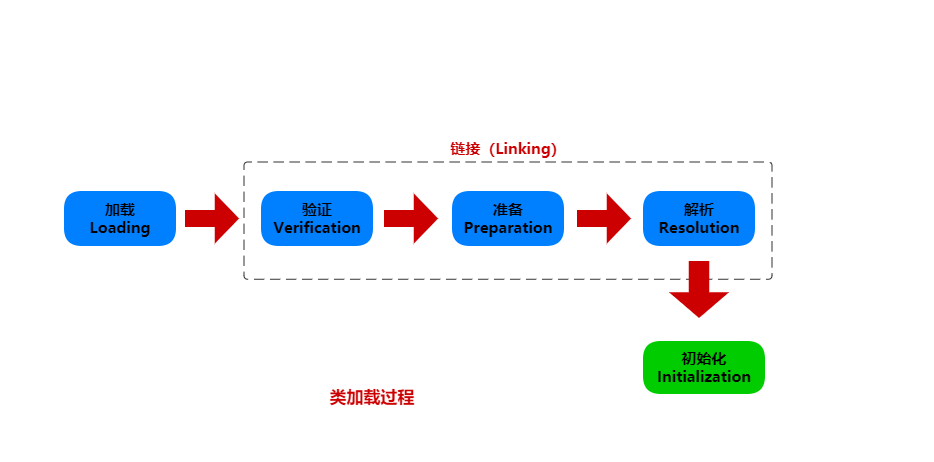

反射允许你在运行时分析任意的对象。如果对象是泛型类的实例，关于泛型类型参数则得不到太多信息，因为它们会被擦除。下面的小结中，可以了解利用泛型可以获得泛型类的什么信息。

## 泛型 Class 类


## 一、Class对象

在Java中，每个类的运行时的类型信息就是用 `Class` 对象表示的，它包含了与类有关的信息。其实我们的实例对象就通过 `Class` 对象来创建的。

类是程序的一部分，每个类都有一个 `Class` 对象。每当编译一个新类就产生一个 `Class` 对象（被保存在一个同名的`.class`文件中）。`Class` 类没有公共的构造方法，`Class` 类在生成对应这个类的对象， Java虚拟机（JVM）会先调用 "类加载器"  把这个类加载到内存中。当使用 `.class` 来创建 `Class` 对象的引用时，不会自动地初始化该 `Class` 对象。

### Class对象的加载

所有的类都是在对其第一次使用时动态加载到JVM中的，当程序创建第一个对类的静态成员的引用时，就会加载这个类。其实构造器也是类的静态方法，虽然构造器前面并没有 `static` 关键字。所以，使用 `new` 操作符创建类的新对象也算作对类的静态成员引用。

因此，Java程序在它开始运行之前并没有并完全加载，很多部分是在需要时才会加载。这一点与许多传统编程语言不同，动态加载使得Java具有一些静态加载语言（如C++）很难或者根本不可能实现的特性。

类加载器首先会检查这个类的 `Class` 对象是否已经加载，如果未加载，默认的类加载器就会根据类名查找 `.class` 文件。这个类的字节码被加载后，JVM就对其进行验证，确保它没有损坏，并且不包含不良Java代码。一旦某个类的 `Class` 对象被载入内存，它就可以用来创建这个类的所有对象。下面的例子用来证明：

```java
class Cookie {
    static { System.out.println("Loading Cookie"); }
}
class Gum {
    static { System.out.println("Loading Gum"); }
}
class Candy {
    static { System.out.println("Loading Candy"); }
}
public class SweetShop {    // 糖果店
    public static void main(String[] args) {
        System.out.println("inside main");
        new Candy();
        System.out.println("After crreating Candy");
        try {
            Class.forName("Gum");
        } catch (ClassNotFoundException e) {
            System.out.println("Couldn't find Gum");
        }
        System.out.println("After Class.forName(\"Gum\")");
        new Cookie();
        System.out.println("After creating Cookie");
    }
}
```

输出结果：

```shell
inside main
Loading Candy
After crreating Candy
Couldn't find Gum
After Class.forName("Gum")
Loading Cookie
After creating Cookie
```

上面的代码中，`Candy`、`Gum` 和 `Cookie` 这几个类都有一个 `static{...}` 静态初始化块，这些静态初始化块在类第一次被加载的时候就会执行。也就是说，静态初始化块会打印相应的信息，告诉我们这些类分别是什么时候被加载。而在主方法中，创建对象的代码都放在了 `print()` 语句之间，以帮助我们判断类加载的时间点。

从输出中可以看到，`Class` 对象仅在需要的时候才会被加载，`static` 初始化时在类加载时进行的。比较有意思的是：

```java
Class.forName("Gum");
```

所有 `Class` 对象都属于 `Class` 类，而且它跟其他普通对象一样，我们可以获取和操控它的引用(这也是类加载器的工作)。`forName()` 是 `Class` 类的一个静态方法，我们可以使用 `forName()` 根据目标类的类名（`String`）得到该类的 `Class` 对象。上面的代码忽略了 `forName()` 的返回值，因为那个调用是为了得到它产生的“副作用”。从结果可以看出，`forName()` 执行的副作用是如果 `Gum` 类没有被加载就加载它，而在加载的过程中，`Gum` 的 `static` 初始化块被执行了。

还需要注意的是，如果 `Class.forName()` 找不到要加载的类，它就会抛出异常 `ClassNotFoundException`。

有三种方式来获取 `Class` 对象：

- `Class.forName(String className)`：使用类的完全限定名来获取类对象
- `instance.getClass()`：使用实例对象的`getClass()`方法获取类对象
- `ClassName.class`：使用类的字面常量的方式获取类对象

#### Class.forName() 方法

无论何时，只要你想在运行时使用类型信息，我们可以使用 `Class.forName()` 方法获取对应`Class` 对象的引用。这样做的好处是你不需要先持有该类的实例对象。但是，如果你已经拥有了该实例对象，那么可以调用 `getClass()` 方法来获取 `Class` 对象的引用，这个方法来自根类 `Object`，它将返回表示该对象实际类型的 `Class` 对象的引用。

```java
public static main(String[] args) {
	try {
		// Class.forName获取Class对象
		Class cls = Class.forName("Gum");
	} catch (ClassNotFoundException ex) {
		ex.printStackTrace();
	}
	
	// 通过实例对象获取Class对象
	Gum gum = new Gum();
	Class clz = gum.getClass();
}
```

#### Class字面常量

Java还提供另一种方法来生成类对象的引用：**类字面常量**。例如：`Gum.class`。这样做不仅简单，而且更安全，因为它在编译时就会受到检查（因此不必放在 `try` 语句块中）。并且它根除了对 `forName()` 方法的调用，所以效率更高。

类字面常量不仅可以应用于普通类，也可以应用于接口、数组以及基本数据类型。另外，对于基本数据类型的包装类，还有一个标准字段 `TYPE`。`TYPE` 字段是一个引用，指向对应的基本数据类型的 `Class` 对象，如下所示：

|等价于(使用"=="代表等价)|
|:---:|
|`boolean.class == Boolean.TYPE`|
|`char.class ==Character.TYPE`|
|`byte.class == Byte.TYPE`|
|`short.class == Short.TYPE`|
|`int.class==Integer.TYPE`|
|`long.class==Long.TYPE`|
|`float.class==Float.TYPE`|
|`double.class==Double.TYPE`|
|`void.class==Void.TYPE`|

注意：当使用 `.class` 来创建 `Class` 对象的引用时，不会自动地初始化该 `Class` 对象。简单了解下类加载过程：



1. **加载**。这是由类加载器执行的。该步骤将查找字节码（通常在classpath所指定的路径中查找，但这并非是必须的），并从这些字节码中创建一个 `Class` 对象。
2. **链接**。在链接阶段将验证类中的字节码，为 `static` 字段分配存储空间，并且如果需要的话，将解析这个类创建的对其它类的所有引用。
3. **初始化**。如果该类具有超类，则先初始化超类，执行 `static` 初始化器和 `static` 初始化块。

由此可知，我们获取字面常量的 `Class` 引用时，触发的应该是加载过程，因为在这个阶段 `Class` 对象已创建完成，获取其引用并不困难，而无需触发类的最后阶段初始化。下面通过小例子来验证这个过程：

```java
class Initable {
    // 编译期静态常量
    static final int STATIC_FINAL = 47;
    // 非编译期静态常量
    static final int STATIC_FINAL2 = ClassInitialization.rand.nextInt(1000);
    static {
        System.out.println("Initializing Initable");
    }
}
class Initable2 {
    // 静态成员变量
    static int staticNonFinal = 147;
    static {
        System.out.println("Initializing Initable2");
    }
}

class Initable3 {
    // 静态成员变量
    static int staticNonFinal = 74;
    static {
        System.out.println("Initializing Initable3");
    }
}
public class ClassInitialization {
    public static Random rand = new Random(47);
    public static void main(String[] args) throws ClassNotFoundException {
        // 字面常量方式获取Class对象
        Class initable = Initable.class;
        System.out.println("After creating Initable ref");
        // 不触发类初始化
        System.out.println(Initable.STATIC_FINAL);
        // 会触发类初始化
        System.out.println(Initable.STATIC_FINAL2);
        // 会触发类初始化
        System.out.println(Initable2.staticNonFinal);
        // forName方法获取Class对象
        Class initable3 = Class.forName("me.xx.xx.Initable3");
        System.out.println("After creating Initable3 ref");
        System.out.println(Initable3.staticNonFinal);
    }
}
```

输出结果：

```shell
After creating Initable ref
47
Initializing Initable
258
Initializing Initable2
147
Initializing Initable3
After creating Initable3 ref
74
```

从输出结果看，通过类字面常量 `Initable.class` 获取类对象的引用不会触发初始化。但与此相反，使用 `Class.forName()` 来产生 `Class` 引用会立即就进行初始化，如 `initable3`。

如果一个 `static final` 值是“编译期常量”（如 `Initable.staticFinal`），那么这个值不需要对 `Initable` 类进行初始化就可以被读取。但是，如果只是将一个字段设置成为 `static` 和 `final`，还不足以确保这种行为。例如，对 `Initable.STATIC_FINAL2` 的访问将强制进行类的初始化，因为它不是一个编译期常量。

如果一个 `static` 字段不是 `final` 的，那么在对它访问时，总是要求在它被读取之前，要先进行链接（为这个字段分配存储空间）和初始化（初始化该存储空间），就像在对 `Initable2.staticNonFinal` 的访问中所看到的那样。

### 泛化的 Class 引用

`Class` 引用总是指向某个类的 `Class` 对象，利用 `Class` 对象创建实例类。它还包含该类的 `static` 成员，因此 `Class` 引用表明了它所指向对象的确切类型，而该对象便是 `Class` 类的一个对象。

Java 5 引入反省后，我们可以使用泛型对 `Class` 引用所指向的 `Class` 对象的类型进行限定，即使在运行期间会被擦除，但编译期足以确保我们使用正确的对象类型。如下：

```java
public class GenericClassReferences {
    public static void main(String[] args) {
        // 没有使用泛型
        Class intClass = int.class;
        // 使用泛型的 Class 对象
        Class<Integer> genericIntClass = int.class;
        genericIntClass = Integer.class;    //同一个东西
        // 没有泛型的约束，可以随意赋值
        intClass = double.class;
        // 编译期错误，无法编译通过
        // 使用泛型的Class对象不能赋值不同的Class对象
        //genericIntClass = double.class; // 非法
    }
}
```

普通的类引用不会产生警告信息。你可以看到，普通的类引用可以重新赋值指向任何其他的 `Class` 对象，但是使用泛型限定的类引用只能指向其声明的类型。通过使用泛型语法声明的`Class`对象，编译器将强制执行额外的类型检查。我们使用下面的语句来稍微放松泛型的限制：

```java
// 编译无法通过
Class<Number> geenericNumberClass = int.class;
```

但编译无法通过，`Integer`是`Number`的子类，但`Integer.class`对象并不是`Number.class` 对象的子类，因为所有`Class`对象都来源于`Class`类，因此，我们使用`?`通配符解决该问题：

```java
Class<?> intClass = int.class;
intClass = double.class;
```

 `Class<?>` 与 `Class` 等价，但是，我们还是使用 `Class<?>` 较好，这样是告诉编译器，我们使用的是任意类型的泛型，而非忘记泛型约束，因此`Class<?>`总是优先`Class`，并且不会产生编译器警告信息。

 我们可以将通配符 `extends` 关键字来限定 `Class` 范围，如解决`Number`与`Integer`的问题：

 ```java
 Class<? extends Number> bounded = int.class;
// 赋值其它类型
bounded = double.class;
bounded = Number.class;
 ```

上述代码中，`extends` 关键字的作用是告诉编译器，赋值的范围为Number及其子类。实际上，应该时刻记住向 `Class` 添加泛型约束仅仅是为了提供编译期类型检查从而避免将错误延续到运行期。使用普通的 `Class` 引用你要确保自己不会犯错，因为一旦犯错，就要等到运行时才能发现它，很不方便。

下面的示例使用了泛型语法，它保存了一个类引用，稍后又用 `newInstance()` 方法产生类的对象：

```java
class CountedInteger {
    private static long counter;
    // 每次创建一个实例，都会执行一次初始化id=counter++
    private final long id = counter++;
    @Override
    public String toString() {
        return Long.toString(id);
    }
}
public class DynamicSupplier<T> implements Supplier<T> {
    private Class<T> type;
    public DynamicSupplier(Class<T> type) {
        this.type = type;
    }
    @Override
    public T get() {
        try {
            return type.newInstance();
        } catch (IllegalAccessException | InstantiationException e) {
            throw new RuntimeException(e);
        }
    }
    public static void main(String[] args) {
        // CountedInteger必须提供默认的构造函数，通过CountedInteger类的Class对象创建一个实例对象
        Stream.generate(new DynamicSupplier<>(CountedInteger.class))
                .skip(10)
                .limit(5)
                .forEach(System.out::println);
    }
}
```

输出结果：

```shell
10
11
12
13
14
```

注意：这个类必须假设与它一起工作的任何类型都有一个无参构造器，否则运行时会抛出异常。编译期对该程序不会产生任何警告信息。

### cast()方法

Java中还有用于 `Class` 引用的转换语法，即 `cast()` 方法：

```java
class Building {}
class House extends Building {}
public class ClassCasts {
    public static void main(String[] args) {
        Building b = new House();
        Class<House> houseType = House.class;
        House h = houseType.cast(b);
        h = (House) b;  // ...或者这样做.
    }
}
```

`cast()` 方法接受参数对象，并将其类型转换为 `Class` 引用的类型。但是，如果观察上面的代码，你就发现，与实现了相同功能的 `main` 方法中最后一行相比，这种转型好像做了很多额外的工作。

`cast()` 在无法使用普通类型转换的情况下会显得非常有用，在你编写泛型代码时，如果保存了 `Class` 引用，并希望以后通过这个引用来执行转型，你就需要用到 `cast()`。

## 二、类型转换检测

### instanceof

关于 `instanceof` 关键字，它返回一个 `boolean` 类型的值，意在告诉我们对象是不是某个特定的类型实例。如下，在强制转换前利用 `instanceof` 检测 `o` 是不是 `Pet` 类型的实例对象，如果返回 `true` 再进行类型转换，这样可以避免抛出类型转换异常`ClassCastException`。

```java
public void cast(Object o) {
	if (o instanceof Pet) {
		Pet pet = (Pet) o;
	}
}
```

### isInstance方法


`isInstance` 方法是 `Class` 类中的一个 `Native` 方法，也是用于判断对象类型的，例如：

```java
public void cast(Object o) {
	// isInstance方法
	if (Pet.class.isInstance(o)) {
		Pet pet = (Pet) o;
	}
}
```

### 类的等价比较

当你查询类型信息时，需要注意：`instanceof` 的形式（即`instanceof` 或 `isInstance()`，这两者产生的结果相同）和与 `Class` 对象直接比较，这两者间存在重要区别。下面的例子展示了这种区别：

```java
class Base {}
class Derived extends Base {}

public class FamilyVsExactType {
    static void test(Object x) {
        System.out.println(
                "Testing x of type " + x.getClass());
        System.out.println(
                "x instanceof Base " + (x instanceof Base));
        System.out.println(
                "x instanceof Derived " + (x instanceof Derived));
        System.out.println(
                "Base.isInstance(x) " + Base.class.isInstance(x));
        System.out.println(
                "Derived.isInstance(x) " +
                        Derived.class.isInstance(x));
        System.out.println(
                "x.getClass() == Base.class " +
                        (x.getClass() == Base.class));
        System.out.println(
                "x.getClass() == Derived.class " +
                        (x.getClass() == Derived.class));
        System.out.println(
                "x.getClass().equals(Base.class)) "+
                        (x.getClass().equals(Base.class)));
        System.out.println(
                "x.getClass().equals(Derived.class)) " +
                        (x.getClass().equals(Derived.class)));
    }

    public static void main(String[] args) {
        test(new Base());
        test(new Derived());
    }
}
```

输出结果：

```shell
Testing x of type class me.xx.typeinfo.Base
x instanceof Base true
x instanceof Derived false
Base.isInstance(x) true
Derived.isInstance(x) false
x.getClass() == Base.class true
x.getClass() == Derived.class false
x.getClass().equals(Base.class)) true
x.getClass().equals(Derived.class)) false
Testing x of type class me.xx.typeinfo.Derived
x instanceof Base true
x instanceof Derived true
Base.isInstance(x) true
Derived.isInstance(x) true
x.getClass() == Base.class false
x.getClass() == Derived.class true
x.getClass().equals(Base.class)) false
x.getClass().equals(Derived.class)) true
```

`test()` 方法使用两种形式的 `instanceof` 对其参数执行类型检查。然后，它获取 `Class` 引用，并使用 `==` 和 `equals()` 测试 `Class` 对象的相等性。令人放心的是，`instaceof` 和 `isInstance()` 产生的结果相同，`equals()` 和 `==` 产生的结果也相同。但测试本身得出了不同的结论。与类型概念一致，`instanceof` 说的是 "你是这个类型，还是从这个类派生的类？"。而如果使用 `==` 比较实际的 `Class` 对象，则与继承无关 —— 它要么是确切的类型，要么不是。

## 三、反射

Java的反射机制是指在运行状态中：

- 对任意一个类，都能够知道这个类的所有属性和方法
- 对任意一个对象，都能够调用这个对象的所有属性和方法

这种动态获取信息以及动态调用对象方法的功能称为Java语言的反射机制。

类 `Class` 支持反射的概念，`java.lang.reflect` 库中包含类 `Field`、`Method`和 `Constructor`（每一个都实现了 `Member` 接口）。这些类型的对象由 JVM 在运行时创建，以表示未知类中的对应成员。然后，可以使用 `Constructor` 创建新对象， `get()` 和 `set()` 方法读取和修改与 `Field` 对象关联的字段，`invoke()` 方法调用与 `Method` 对象关联的方法。此外，还可以调用遍历方法 `getFields()`、`getMethods()`、`getConstructors()`等，以返回表示字段、方法和构造函数的对象数组。因此，匿名对象的类信息可以在运行时完全确定，编译时不需要知道任何信息。下面对这几个重要类进行分别说明。

### Constructor类及其用法

`Constructor`类存在于`java.lang.reflect`中，反映的是 `Class` 对象所表示的类的构造方法。获取 `Constructor` 对象是通过 `Class` 类中的方法获取的，`Class`类中与 `Constructor` 相关的主要方法如下：

- `Class<?> forName(String className)`：返回与带有给定字符串名的类或接口相关联的`Class`对象
- `Constructor<T> getConstructor(Class<?>... parameterTypes)`：返回指定参数类型、具有`public`访问权限的构造函数对象
- `Constructor<?>[] getConstructors()`：返回所有具有`public`访问权限的构造函数的`Constructor`对象数组
- `Constructor<T> getDeclaredConstructor(Class<?>... parameterTypes)`：返回指定参数类型、所有声明的（包括`private`）构造函数对象
- `Constructor<?>[] getDeclaredConstructors()`：返回所有声明的（包括`private`）构造函数对象
- `T newInstance()`：创建此`Class` 对象所表示的类的一个新实例

> 注意：`Constructor` 总是当前类定义的构造方法，和父类无关，因此不存在多态的问题。
> 调用非 `public` 的 `Constructor` 时，必须首先通过 `setAccessible(true)` 设置允许访问。`setAccessible(true)` 可能会失败。

### FIeld类及其用法

`Field`提供有关类或接口的单个字段的信息，以及对它的动态访问权限。反射的字段可能是一个类（静态）字段或实例字段。同样的道理，我们可以通过`Class`类提供的方法来获取代表字段信息的`Field`对象，`Class`类与`Field`对象相关方法如下：

- `Field getDeclaredField(String name)`：获取指定`name`名称的（包含`private`修饰的）字段，不包括继承的字段
- `Field[] getDeclaredFields()`：获取`Class`对象所表示的类或接口的所有（包含`private`修饰的）字段，不包括继承的字段
- `Field getField(String name)`：获取指定`name`名称、具有`public`修饰的字段，包含继承字段
- `Field[] getFields()`：获取所有修饰符为`public`的字段，包含继承字段

### Method类及其用法

Method提供关于类或接口上单独某个方法（以及如何访问该方法）的信息，所反映的方法可能是类方法或实例方法（包括抽象方法）。下面是`Class`类获取`Method`对象相关的方法：

- `Method getDeclaredMethod(String name, Class<?>... parameterTypes)`：获取当前类的某个Method（不包括父类）
- `Method[] getDeclaredMethods()`：获取当前类的所有Method（不包括父类）
- `Method getMethod(String name, Class<?>... parameterTypes)`：获取某个public的Method（包括父类）
- `Method[] getMethods()`：获取所有public的Method（包括父类）

一个 `Method` 对象包含一个方法的所有信息：

- `getName()` ：返回方法名称，例如："getScore"
- `getReturnType()`：返回方法返回值类型，也是一个Class实例，例如：`String.class`
- `getParameterTypes()`：返回方法的参数类型，是一个Class数组，例如：`{String.class, int.class}`
- `getModifiers()`：返回方法的修饰符，它是一个 `int`，不同的bit表示不同的含义

### 反射包中的Array类

在Java的`java.lang.reflect`包中存在着一个可以操作数组的类：`Array`；它提供了创建和访问Java数组的方法。`Array`允许在执行`get()`或`set()`操作进行取值和赋值。在`Class`类中与数组关联的方法是：

- `Class<?> getComponentType()`：返回表示数组元素类型的`Class`对象，即数组的类型
- `boolean isArray()`：判断此 `Class` 对象是否表示一个数组类

`java.lang.reflect.Array` 中常用静态方法如下：

- `Object get(Object array, int index)`：返回指定数组对象中索引位置的值
- `int getLength(Object array)`：以 `int` 形式返回指定数组对象的长度
- `Object newInstance(Class<?> componentType, int... dimensions)`：创建一个具有指定类型和维度的新数组
- `Object newInstance(Class<?> componentType, int length)`：创建一个具有指定类型和长度的新数组
- `void set(Object array, int index, Object value)`：将指定数组对象中索引位置的值设置为指定的新值

### 类方法提取器

通常，你不会直接使用反射工具，但它们可以帮助你创建更多的动态代码。反射是用来支持其它 Java 特性的，例如对象序列化。但是，有时动态提取有关类的信息很有用。

考虑一个类方法提取器。查看类定义的源代码或 JDK 文档，只显示在该类定义中定义或重写的方法。但是，可能还有几十个来自基类的可用方法。找到它们既单调又费时[^1]。幸运的是，反射提供了一种方法，可以简单地编写一个工具类自动地向你展示所有的接口：

```java
// 使用反射展示一个类的所有属性、方法、构造方法，甚至包括定义在基类中的方法
public class ShowReflects {
    public static String staticField = "ShowReflect Static Field";
    // 静态属性
    private static String usage =
            "usage:n" +
                    "ShowMethods qualified.class.namen" +
                    "To show all methods in class or:n" +
                    "ShowMethods qualified.class.name wordn" +
                    "To search for methods involving 'word'";

    public static void main(String[] args) {
        String arg = "me.xx.typeinfo.ShowReflects";
        try {
            Class<?> c = Class.forName(arg);
            // 获取类中所有公共字段
            Field[] fields = c.getFields();
            // 获取类中所有公共方法
            Method[] methods = c.getMethods();
            // 获取类中所有构造方法
            Constructor[] ctors = c.getConstructors();
            System.out.println("获取所有公共字段：");
            for (Field field : fields) {
                System.out.println(
                        field.toString());
            }

            System.out.println("获取所有公共方法：");
            for (Method method : methods)
                System.out.println(
                        method.toString());

            System.out.println("获取所有公共构造方法：");
            for (Constructor ctor : ctors)
                System.out.println(
                        ctor.toString());
        } catch (ClassNotFoundException e) {
            System.out.println("No such class: " + e);
        }
    }
}
```

输出结果：

```shell
获取所有公共字段：
public static java.lang.String me.xx.typeinfo.ShowReflects.staticField
获取所有公共方法：
public static void me.xx.typeinfo.ShowReflects.main(java.lang.String[])
public final native void java.lang.Object.wait(long) throws java.lang.InterruptedException
public final void java.lang.Object.wait(long,int) throws java.lang.InterruptedException
public final void java.lang.Object.wait() throws java.lang.InterruptedException
public boolean java.lang.Object.equals(java.lang.Object)
public java.lang.String java.lang.Object.toString()
public native int java.lang.Object.hashCode()
public final native java.lang.Class java.lang.Object.getClass()
public final native void java.lang.Object.notify()
public final native void java.lang.Object.notifyAll()
获取所有公共构造方法：
public me.xx.typeinfo.ShowReflects()
```

`Class` 方法 `getmethods()` 和 `getconstructors()` 分别返回 `Method` 数组和 `Constructor` 数组。这些类中的每一个都有进一步的方法来解析它们所表示的方法的名称、参数和返回值。

### 反射的作用

- 检查类的属性和方法
- 在运行时检查对象的类型
- 动态构造某个类的对象
- 可以任意调用对象的方法

### 反射的优点

- 提高程序的灵活性，避免将程序写死到代码里。
- 代码简洁，提高代码的复用率，外部调用方便
- 对于任意一个类，都能够知道这个类的所有属性和方法：对于任意一个对象，都能够调用它的任意一个方法

### 反射的缺点

尽管反射非常强大，但也不能滥用。如果一个功能可以不用反射完成，那么最好就不用。在我们使用反射技术时，下面几条内容应该牢记于心。

- **性能开销**   ：反射涉及了动态类型的解析，所以 JVM 无法对这些代码进行优化。因此，反射操作的效率要比那些非反射操作低得多。我们应该避免在经常被执行的代码或对性能要求很高的程序中使用反射。
- **使用反射会模糊程序内部逻辑**：程序人员希望在源代码中看到程序的逻辑，反射等绕过了源代码的技术，因而会带来维护问题。反射代码比相应的直接代码更复杂。
- **安全限制**   ：使用反射技术要求程序必须在一个没有安全限制的环境中运行。如果一个程序必须在有安全限制的环境中运行，如 Applet，那么这就是个问题了。
- **内部暴露**   ：由于反射允许代码执行一些在正常情况下不被允许的操作（比如访问私有的属性和方法），所以使用反射可能会导致意料之外的副作用，这可能导致代码功能失调并破坏可移植性。反射代码破坏了抽象性，因此当平台发生改变的时候，代码的行为就有可能也随着变化。

## 四、动态代理

代理是基本的设计模式之一。一个对象封装真实对象，代替其提供其他或不同的操作---这些操作通常涉及到与“真实”对象的通信，因此代理通常充当中间对象。这是一个简单的示例，显示代理的结构：

```java
interface Interface {
    void doSomething();

    void somethingElse(String arg);
}

class RealObject implements Interface {
    @Override
    public void doSomething() {
        System.out.println("doSomething");
    }

    @Override
    public void somethingElse(String arg) {
        System.out.println("somethingElse " + arg);
    }
}

class SimpleProxy implements Interface {
    private Interface proxied;

    SimpleProxy(Interface proxied) {
        this.proxied = proxied;
    }

    @Override
    public void doSomething() {
        System.out.println("SimpleProxy doSomething");
        proxied.doSomething();
    }

    @Override
    public void somethingElse(String arg) {
        System.out.println(
                "SimpleProxy somethingElse " + arg);
        proxied.somethingElse(arg);
    }
}
public class SimpleProxyDemo {
    public static void consumer(Interface iface) {
        iface.doSomething();
        iface.somethingElse("bonobo");
    }

    public static void main(String[] args) {
        consumer(new RealObject());
        consumer(new SimpleProxy(new RealObject()));
    }
}
```

输出结果：

```shell
doSomething
somethingElse bonobo
SimpleProxy doSomething
doSomething
SimpleProxy somethingElse bonobo
somethingElse bonobo
```

因为 `consumer()` 接受 `Interface`，所以它不知道获得的是 `RealObject` 还是 `SimpleProxy`，因为两者都实现了 `Interface`。 但是，在客户端和 `RealObject` 之间插入的 `SimpleProxy` 执行操作，然后在 `RealObject` 上调用相同的方法。

当你希望将额外的操作与“真实对象”做分离时，代理可能会有所帮助，尤其是当你想要轻松地启用额外的操作时，反之亦然（设计模式就是封装变更---所以你必须改变一些东西以证明模式的合理性）。例如，如果你想跟踪对 `RealObject` 中方法的调用，或衡量此类调用的开销，该怎么办？你不想这部分代码耦合到你的程序中，而代理能使你可以很轻松地添加或删除它。

Java 的动态代理更进一步，不仅动态创建代理对象而且动态处理对代理方法的调用。在动态代理上进行的所有调用都被重定向到单个调用处理程序，该处理程序负责发现调用的内容并决定如何处理。重写上述代理的例子：

```java
class DynamicProxyHandler implements InvocationHandler {
    private Object proxied;

    DynamicProxyHandler(Object proxied) {
        this.proxied = proxied;
    }

    @Override
    public Object
    invoke(Object proxy, Method method, Object[] args)
            throws Throwable {
        System.out.println(
                "**** proxy: " + proxy.getClass() +
                        ", method: " + method + ", args: " + args);
        if (args != null)
            for (Object arg : args)
                System.out.println("  " + arg);
        return method.invoke(proxied, args);
    }
}
public class SimpleDynamicProxy {
    public static void consumer(Interface iface) {
        iface.doSomething();
        iface.somethingElse("bonobo");
    }

    public static void main(String[] args) {
        RealObject real = new RealObject();
        consumer(real);
        // Insert a proxy and call again:
        Interface proxy = (Interface) Proxy.newProxyInstance(
                Interface.class.getClassLoader(),
                new Class[]{Interface.class},
                new DynamicProxyHandler(real));
        consumer(proxy);
    }
}
```

输出结果：

```shell
doSomething
somethingElse bonobo
**** proxy: class $Proxy0, method: public abstract void
Interface.doSomething(), args: null
doSomething
**** proxy: class $Proxy0, method: public abstract void
Interface.somethingElse(java.lang.String), args:
[Ljava.lang.Object;@6bc7c054
  bonobo
somethingElse bonobo

doSomething
somethingElse bonobo
**** proxy: class me.xx.typeinfo.$Proxy0, method: public abstract void me.xx.typeinfo.Interface.doSomething(), args: null
doSomething
**** proxy: class me.xx.typeinfo.$Proxy0, method: public abstract void me.xx.typeinfo.Interface.somethingElse(java.lang.String), args: [Ljava.lang.Object;@458ad742
  bonobo
somethingElse bonobo
```

可以通过调用静态方法 `Proxy.newProxyInstance()` 来创建动态代理，该方法需要一个类加载器（通常可以从已加载的对象中获取），希望代理实现的接口列表（不是类或抽象类），以及接口 `InvocationHandler` 的一个实现。动态代理会将所有调用重定向到调用处理程序，因此通常为调用处理程序的构造函数提供对“真实”对象的引用，以便一旦执行中介任务便可以转发请求。

`invoke()` 方法被传递给代理对象，以防万一你必须区分请求的来源---但是在很多情况下都无需关心。但是，在 `invoke()` 内的代理上调用方法时要小心，因为接口的调用是通过代理重定向的。

通常执行代理操作，然后使用 `Method.invoke()` 将请求转发给被代理对象，并携带必要的参数。这在一开始看起来是有限制的，好像你只能执行一般的操作。但是，可以过滤某些方法调用，同时传递其他方法调用：

```java
class MethodSelector implements InvocationHandler {
    private Object proxied;

    MethodSelector(Object proxied) {
        this.proxied = proxied;
    }

    @Override
    public Object
    invoke(Object proxy, Method method, Object[] args)
            throws Throwable {
        if (method.getName().equals("interesting"))
            System.out.println(
                    "Proxy detected the interesting method");
        return method.invoke(proxied, args);
    }
}
interface SomeMethods {
    void boring1();

    void boring2();

    void interesting(String arg);

    void boring3();
}
class Implementation implements SomeMethods {
    @Override
    public void boring1() {
        System.out.println("boring1");
    }

    @Override
    public void boring2() {
        System.out.println("boring2");
    }

    @Override
    public void interesting(String arg) {
        System.out.println("interesting " + arg);
    }

    @Override
    public void boring3() {
        System.out.println("boring3");
    }
}
public class SelectingMethods {
    public static void main(String[] args) {
        SomeMethods proxy =
                (SomeMethods) Proxy.newProxyInstance(
                        SomeMethods.class.getClassLoader(),
                        new Class[]{Interface.class},
                        new MethodSelector(new Implementation()));
        proxy.boring1();
        proxy.boring2();
        proxy.interesting("bonobo");
        proxy.boring3();
    }
}
```

输出结果：

```shell
boring1
boring2
Proxy detected the interesting method
interesting bonobo
boring3
```

在这个示例里，我们只是在寻找方法名，但是你也可以寻找方法签名的其他方面，甚至可以搜索特定的参数值。
