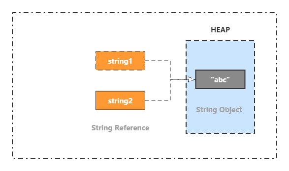

# Java基础

- 一、基本数据类型
- 二、面向对象
- 三、运算
- 四、关键字
- 五、嵌套类
- 六、String类
- 七、Object类
- 参考资料

# 一、Java的数据类型

## 8种基本类型

基本数据类型是CPU可以直接进行运算的类型。Java定义了以下几种基本数据类型：
- 整数类型：byte、short、int、long
- 浮点数类型：float、double
- 字符类型：char
- 布尔类型：boolean

|基本类型|字节数|表示数的范围|包装类型|
|---|---|---|---|
|byte|1(8bit)|-128~127|Byte|
|short|2(16bit)|-2^15~2^15-1|Short|
|char|2(16bit)|0~65535|Character|
|int|4(32bit)|-2^31~2^31-1|Integer|
|long|8(64bit)|-2^63~2^63-1|Long|
|float|4(32bit)|-3.403E38~3.403E38|Float|
|double|8(64bit)|-1.798E308~1.798E308|Double|
|boolean|~||Boolean|

boolean 只有两个值：true、false，可以使用 1 bit 来存储，但是具体大小没有明确规定。JVM 会在编译时期将 boolean 类型的数据转换为 int，使用 1 来表示 true，0 表示 false。JVM 支持 boolean 数组，但是是通过读写 byte 数组来实现的。

## 包装类型

基本类型都有对应的包装类型，基本类型与其对应的包装类型之间的赋值使用自动装箱与拆箱完成。

```java
Integer x = 2;     // 装箱 调用了 Integer.valueOf(2)
int y = x;         // 拆箱 调用了 X.intValue()
```

## 数据类型的转换

数据类型的转换就是将一种数据类型转换为另一种数据类型，不同的数据类型之间是无法进行运算的。

### 隐式转换

所有隐式转换就是不需要程序员过多的干预，编译器可以自动进行转换，这种情况下，只要在编译器确保万无一失的情况下才会放行，比如小的数据类型转换成大的数据类型

示例：
```java
public static void main(String[] args) {
	// 将byte类型转换成int类型
	byte b = 10;
	int a = 4;
	int c = a + b;
	System.out.println(c);
}
```

### 强制转换

当转换时有风险存在，编译器不会帮我们做这些事情，就需要我们手动进行转换，这时称之为强制转换，强制转换存在风险，一定要确保可行再转换。

示例：
```java
public static void main(String[] args) {
	int i = 1000;
	byte b;
	// 将int类型转换成byte类型
	b = (byte)i;
}
```
> 注意事项：当我们定义byte类型的变量并赋值的时候，其实后面的数值是int类型，也就是说其实是将大的类型转换到小的类型上去，但是这里编译器依然没有报错，那是因为编译器在编译的时候会尝试判定数值的大小，如果数值没有超过变量类型的限定，就可以存放。
> ```java
>public static void main(String[] args) {
> 	byte b = 10;	// 数值10是int型的，没有超过byte的范围
>	byte by = 128;	// 数值128是int型的，超过了byte的范围，会报错
>}
> ```

### String转为包装类型

使用包装类型的静态方法 `Integer.parseInt(string)` 进行转换，但是可能会出现 `NumberFormatException` 异常，原因可能有以下几点：

- 输入的字符串中含有字母。
- 输入为空。
- 输入超出int上限时，这个时候可以考虑用`Long.parseLong(string)`转换为long

## 缓存池

new Integer(123) 与 Integer.valueOf(123) 的区别在于：

- new Integer(123) 每次都会新建一个对象；
- Integer.valueOf(123) 会使用缓存池中的对象，多次调用会取得同一个对象的引用。

```java
Integer x = new Integer(123);
Integer y = new Integer(123);
System.out.println(x == y);    // false
Integer z = Integer.valueOf(123);
Integer k = Integer.valueOf(123);
System.out.println(z == k);   // true
```

valueOf() 方法的实现比较简单，就是先判断值是否在缓存池中，如果在的话就直接返回缓存池的内容。

```java
public static Integer valueOf(int i) {
    if (i >= IntegerCache.low && i <= IntegerCache.high)
        return IntegerCache.cache[i + (-IntegerCache.low)];
    return new Integer(i);
}
```

在 Java 8 中，Integer 缓存池的大小默认为 -128\~127。

```java
static final int low = -128;
static final int high;
static final Integer cache[];

static {
    // high value may be configured by property
    int h = 127;
    String integerCacheHighPropValue =
        sun.misc.VM.getSavedProperty("java.lang.Integer.IntegerCache.high");
    if (integerCacheHighPropValue != null) {
        try {
            int i = parseInt(integerCacheHighPropValue);
            i = Math.max(i, 127);
            // Maximum array size is Integer.MAX_VALUE
            h = Math.min(i, Integer.MAX_VALUE - (-low) -1);
        } catch( NumberFormatException nfe) {
            // If the property cannot be parsed into an int, ignore it.
        }
    }
    high = h;

    cache = new Integer[(high - low) + 1];
    int j = low;
    for(int k = 0; k < cache.length; k++)
        cache[k] = new Integer(j++);

    // range [-128, 127] must be interned (JLS7 5.1.7)
    assert IntegerCache.high >= 127;
}
```

编译器会在自动装箱过程调用 valueOf() 方法，因此多个值相同且值在缓存池范围内的 Integer 实例使用自动装箱来创建，那么就会引用相同的对象。

```java
Integer m = 123;
Integer n = 123;
System.out.println(m == n); // true
```

基本类型对应的缓冲池如下：

- boolean values true and false
- all byte values
- short values between -128 and 127
- int values between -128 and 127
- char in the range \u0000 to \u007F

在使用这些基本类型对应的包装类型时，如果该数值范围在缓冲池范围内，就可以直接使用缓冲池中的对象。

在 jdk 1.8 所有的数值类缓冲池中，Integer 的缓冲池 IntegerCache 很特殊，这个缓冲池的下界是 - 128，上界默认是 127，但是这个上界是可调的，在启动 jvm 的时候，通过 -XX:AutoBoxCacheMax=&lt;size&gt; 来指定这个缓冲池的大小，该选项在 JVM 初始化的时候会设定一个名为 java.lang.IntegerCache.high 系统属性，然后 IntegerCache 初始化的时候就会读取该系统属性来决定上界。

# 二、面向对象

面向对象编程就是将食物高度抽象化的编程模式。

面向对象程序设计有以下优点：
1. 可重用性：代码重复使用，减少代码量，提高开发效率。
2. 可扩展性：指新的功能可以很容易地加入到系统中来，便于软件的修改。
3. 可管理性：能够将功能与数据结合，方便管理。

## 2.1、Java面向对象的三大特征

**封装（Encapsulation）**

所谓封装，就是把客观事物封装成抽象的类，尽可能隐藏内部的实现细节，同时提供一些可以被外界访问属性的方法。

**继承（Inheritance）**

所谓继承，是从已有类的定义作为基础创建新类的过程。通过继承创建的新类称为"子类"或"派生类"，被继承的类称为"基类"、"父类"或"超类"。继承的过程，就是从一般到特殊的过程。要实现继承，可以通过"继承（Inheritance）"和"组合（Composition）"来实现。继承概念的实现方式有两类：实现继承与接口继承。实现继承是指直接使用基类的属性和方法而无需额外编码的能力；接口继承是指仅使用属性和方法的名称、但是子类必须提供实现的能力。

**多态（Polymorphism）**

所谓多态就是指一个类实例的相同方法在不同情形有不同表现形式。多态机制使具有不同内部结构的对象可以共享相同的外部接口。这意味着，虽然针对不同的对象的具体操作不同，但通过一个公共的类，它们可以通过相同的方式予以调用。

在Java中有两种形式可以实现多态：继承（多个子类对同一方法的重写）和接口（实现接口并覆盖接口中同一方法）。

## 2.2、方法重写与重载

**1. 重写（Override）** 

所谓重写，就是在Java的继承中，子类与父类中有两个名称、参数列表都相同的方法的情况的情况下，子类覆盖父类中原有的方法。

为了满足里式替换原则，重写有以下三个限制：

- 子类方法的访问权限必须大于等于父类方法；
- 子类方法的返回类型必须是父类方法返回类型或为其子类型。
- 子类方法抛出的异常类型必须是父类抛出异常类型或为其子类型。

使用 @Override 注解，可以让编译器帮忙检查是否满足上面的三个限制条件。

下面的示例中，SubClass 为 SuperClass 的子类，SubClass 重写了 SuperClass 的 func() 方法。其中：

- 子类方法访问权限为 public，大于父类的 protected。
- 子类的返回类型为 `ArrayList<Integer>`，是父类返回类型 `List<Integer>` 的子类。
- 子类抛出的异常类型为 Exception，是父类抛出异常 Throwable 的子类。
- 子类重写方法使用 @Override 注解，从而让编译器自动检查是否满足限制条件。

```java
class SuperClass {
    protected List<Integer> func() throws Throwable {
        return new ArrayList<>();
    }
}
class SubClass extends SuperClass {
    @Override
    public ArrayList<Integer> func() throws Exception {
        return new ArrayList<>();
    }
}
```

在调用一个方法时，先从本类中查找看是否有对应的方法，如果没有再到父类中查看，看是否从父类继承来。否则就要对参数进行转型，转成父类之后看是否有对应的方法。总的来说，方法调用的优先级为：

- this.func(this)
- super.func(this)
- this.func(super)
- super.func(super)


```java
/*
    A
    |
    B
    |
    C
    |
    D
 */


class A {

    public void show(A obj) {
        System.out.println("A.show(A)");
    }

    public void show(C obj) {
        System.out.println("A.show(C)");
    }
}

class B extends A {

    @Override
    public void show(A obj) {
        System.out.println("B.show(A)");
    }
}

class C extends B {
}

class D extends C {
}
```

```java
public static void main(String[] args) {

    A a = new A();
    B b = new B();
    C c = new C();
    D d = new D();

    // 在 A 中存在 show(A obj)，直接调用
    a.show(a); // A.show(A)
    // 在 A 中不存在 show(B obj)，将 B 转型成其父类 A
    a.show(b); // A.show(A)
    // 在 B 中存在从 A 继承来的 show(C obj)，直接调用
    b.show(c); // A.show(C)
    // 在 B 中不存在 show(D obj)，但是存在从 A 继承来的 show(C obj)，将 D 转型成其父类 C
    b.show(d); // A.show(C)

    // 引用的还是 B 对象，所以 ba 和 b 的调用结果一样
    A ba = new B();
    ba.show(c); // A.show(C)
    ba.show(d); // A.show(C)
}
```

**2. 重载（Overload）** 

所谓重载，指的是在同一类中，函数或者方法具有相同的名称，但是参数列表不同的情形，这样的同名不同参数的方法，称之为方法重载。

重载的例子：

```java
class Person {
	public void func() {
		System.out.println("动作");
	}
	// overloading method
	public void func(int num) {
		System.out.println("数字：" + num);
	}
}
```

**3.重载VS重写**

关于重载与重写，应该知道以下几点：
> 1. 重载是一个编译期概念、重写是一个运行期概念。
> 2. 重载遵循所谓"编译期绑定"，即在编译时根据参数变量的类型判断应该调用哪个方法
> 3. 重写遵循所谓"运行期绑定"，即在运行的时候，根据引用变量所指向的实际对象的类型来调用方法
> 4. 因为在编译期已经确定调用哪个方法，所以重载并不是多态。而重写是多态。重载只是一种语言特性，是一种语法规则，与多态无关，与面向对象也无关。（注：严格来说，重载是编译时多态，即静态多态。但是，Java中提到的多态，在不特别说明的情况下都指动态多态）
> 

## 2.3、访问权限

Java有四种访问控制级别：`public`、`protected`、`private`和`default`（即不加修饰符，默认访问级别）

- `public(公开)`：表示任何人都可以访问和使用该元素
- `private(私有)`：除了类本身和类内部的方法，外界无法直接访问该元素。`private`是类和调用者之间的屏障。任何视图访问私有成员的行为都会报编译时错误
- `protected(受保护)`：类似于`private`，区别是子类可以访问`protected`的成员，但不能访问`private`成员
- `default(默认)`：如果你不使用前面的三者，默认就是`default`访问权限。`default`被称为包访问，因为该权限下的资源可以被同一包（组件库）中其它类的成员访问。

|访问级别|从其它包中的类来访问|从同一包中的其它类来访问|从一个类中访问|
|---|---|---|---|
|public|可以|可以|可以|
|private|不可以|不可以|可以|
|protected|若是子类，直接调用则可以，声明对象后在调用则不可以。若非子类，则不可以|可以|可以|
|default|不可以|可以|可以|

## 2.4、Java的继承与组合

**面向对象的复用技术**  

复用性是面向对象技术带来的很棒的潜在好处之一。如果运用的好的话可以帮助我们节省很多开发时间，提升开发效率。但是，如果被滥用那么就可能产生很多难以维护的代码。

作为一门面向对象开发的语言，代码复用是Java引人注意的功能之一。Java代码的复用有继承，组合以及代理三种具体的表现形式。本文将重点介绍继承复用和组合复用。

**继承**  

继承（Inheritance）是一种联结类与类的层次模型。指的是一个类（称为子类）继承另外一个类（称为父类）的功能，并可以增加它自己的新功能的能力，继承是类与类或者接口与接口之间最常见的关系；继承是一种 `is-a` 关系。

**组合**  

组合（Composition）体现的是整体与部分、拥有的关系，即 `has-a` 的关系。

**组合与继承的区别与联系**  

> 在继承结构中，父类的内部细节对于子类是可见的。所以我们通常也可以说通过继承的代码复用是一种白盒式代码复用。（如果基类的实现发生改变，那么派生类的实现也将随之改变。这样就导致了子类行为的不可预知性；）
> 组合是通过对现有的对象进行拼装（组合）产生新的、更复杂的功能。因为在对象之间，各自的内部细节是不可见的，所以我们也说这种方式的代码复用是黑盒式代码复用。（因为组合中一般都定义一个类型，所以在编译期根本不知道具体会调用哪个实现类的方法）
> 继承，在写代码的时候就要指名具体继承哪个类，所以，在编译期就确定了关系。（从基类继承来的实现是无法在运行期动态改变的，因此降低了应用的灵活性。）
> 组合，在写代码的时候可以采用面向接口编程。所以，类的组合关系一般在运行期确定。

**优缺点对比**  

|组合关系|继承关系|
|---|---|
|优点：不破坏封装，整体类与局部类之间松耦合，彼此相对独立|缺点：破坏封装，子类与父类之间紧密耦合，子类依赖于父类的实现，子类缺乏独立性|
|优点：具有较好的可扩展性|缺点：支持扩展，但是往往以增加系统结构的复杂度代价|
|优点：支持动态组合。在运行时，整体对象可以选择不同类型的局部对象|缺点：不支持动态继承。在运行时，子类无法选择不同的父类|
|优点：整体类可以对局部类进行包装，封装局部类的接口，提供新的接口|缺点：子类不能改变父类的接口|
|缺点：创建整体类的对象时，需要创建所有局部类的对象|优点：创建子类的对象时，无序创建父类的对象|

**如何选择**  

建议在同样可行的情况下，优先使用组合而不是继承。
因为组合更安全，更简单，更灵活，更高效。

>继承要慎用，其使用场合仅限于你确信使用该技术有效的情况。一个判断方法是，问一问自己是否需要从新类向基类进行向上转型。如果是必须的，则继承是必要的。反之则应该好好考虑是否需要继承。《Java编程思想》
>只有当子类真正是超类的子类型时，才适合用继承。换句话说，对于两个类A和B，只有当两者之间确实存在is-a关系的时候，类B才应该继承类A。《Effective Java》


## 2.5、接口和抽象类

**1. 抽象类**  

在面向对象的概念中，所有的对象都是通过类来描述的。但并不是所有的类都是用来描述对象的，如果一个类中没有包含足够的信息来描述一个具体的对象，这样的类就是抽象类（Abstract）。

抽象类和抽象方法都使用 abstract 关键字进行声明。如果一个类中包含抽象方法，那么这个类必须声明为抽象类。

抽象类和普通类最大的区别是，抽象类不能被实例化，只能被继承。

声明抽象方法会造成以下两个结果：

- 如果一个类包含抽象方法，则该类必须声明为抽象类
- 子类必须重写父类的抽象方法，否则自身也必须声明为抽象类

```java
public abstract class AbstractClassExample {

    protected int x;
    private int y;

    public abstract void func1();

    public void func2() {
        System.out.println("func2");
    }
}
```

```java
public class AbstractExtendClassExample extends AbstractClassExample {
    @Override
    public void func1() {
        System.out.println("func1");
    }
}
```

```java
// AbstractClassExample ac1 = new AbstractClassExample(); // 'AbstractClassExample' is abstract; cannot be instantiated
AbstractClassExample ac2 = new AbstractExtendClassExample();
ac2.func1();
```

**2. 接口**  

接口是抽象类的延伸，在 Java 8 之前，它可以看成是一个完全抽象的类，也就是说它不能有任何的方法实现。

从 Java 8 开始，接口也可以编写默认方法和静态方法，这是因为不支持默认方法的接口的维护成本太高了。在 Java 8 之前，如果一个接口想要添加新的方法，那么要修改所有实现了该接口的类，让它们都实现新增的方法。

接口的成员（字段 + 方法）默认都是 public 的，并且不允许定义为 private 或者 protected。

接口的字段默认都是 static 和 final 的。

```java
public interface InterfaceExample {

    void func1();
	// 等价于以下三种形式
	// public void func1();
	// public abstract void func1();
	// abstract void func1();

	// 默认方法
    default void func2(){
    	// 实现具体业务
        System.out.println("func2");
    }
    
    // 静态方法，可以省略public声明，因为在接口中的静态方法默认就是公有的
    public static void func3() {
    	// 实现具体业务
    }

    int x = 123;
    // int y;               // Variable 'y' might not have been initialized
    public int z = 0;       // Modifier 'public' is redundant for interface fields
    // private int k = 0;   // Modifier 'private' not allowed here
    // protected int l = 0; // Modifier 'protected' not allowed here
    // private void fun3(); // Modifier 'private' not allowed here
}
```

```java
public class InterfaceImplementExample implements InterfaceExample {
    @Override
    public void func1() {
        System.out.println("func1");
    }
}
```

```java
// InterfaceExample ie1 = new InterfaceExample(); // 'InterfaceExample' is abstract; cannot be instantiated
InterfaceExample ie2 = new InterfaceImplementExample();
ie2.func1();
System.out.println(InterfaceExample.x);
```
接口的特点：

- 接口没有构造方法
- 接口不能用于实例化对象
- 接口中的字段必须初始化，并且隐式地设置为公有的、静态的和final的。因此，为了符合规范，接口中的字段名要全部大写
- 接口不是被类继承，而是要被类实现
- 接口中每一个方法默认都是公有和抽象的，即接口中的方法会被隐式的指定为 `public abstract`。从JDK1.8开始，可以在接口中编写默认的和静态的方法。声明默认方法需要使用关键字 `default`
- 当类实现接口时，类要实现接口中所有的方法。否则，类必须声明为抽象的
- 接口支持多重继承，即可以继承多个接口


**3. 比较**  

- 从设计层面上看，抽象类提供了一种 IS-A 关系，需要满足里式替换原则，即子类对象必须能够替换掉所有父类对象。而接口更像是一种 LIKE-A 关系，它只是提供一种方法实现契约，并不要求接口和实现接口的类具有 IS-A 关系。
- 从使用上来看，一个类可以实现多个接口，但是不能继承多个抽象类。
- 接口的字段只能是 public static final类型的，而抽象类的字段没有这种限制。
- 接口的成员只能是 public 的，而抽象类的成员可以有多种访问权限。

**4. 使用选择**  

使用接口：

- 需要让不相关的类都实现一个方法，例如不相关的类都可以实现 Compareable 接口中的 compareTo() 方法；
- 需要使用多重继承。

使用抽象类：

- 需要在几个相关的类中共享代码。
- 需要能控制继承来的成员的访问权限，而不是都为 public。
- 需要继承非静态和非常量字段。

在很多情况下，接口优先于抽象类。因为接口没有抽象类严格的类层次结构要求，可以灵活地为一个类添加行为。并且从 Java 8 开始，接口也可以有默认的方法实现，使得修改接口的成本也变的很低。


## 2.6、C/C++/Java的区别

C语言是面向过程的语言，Java与C++都是面向对象的语言，都使用了面向对象的思想（封装、继承、多态），由于面向对象由许多非常好的特性（继承、组合等），因此二者有很好的可重用性。

**主要不同点**  

1. Java为解释性语言，其运行过程为：程序源代码经过Java编译器编译成字节码，然后由JVM解释执行。而C/C++为编译型语言，源代码经过编译和链接后生成可执行的二进制代码，可直接执行。因此Java的执行速度比C/C++慢，但Java能够跨平台执行，C/C++不能。

2. Java是纯面向对象语言，所有代码（包括函数、变量）必须在类中实现，除基本数据类型（包括int、float等）外，所有类型都是类。此外，Java语言中不存在全局变量或者全局函数，而C++可以定义全局变量和全局函数。

3. 在Java中不可能直接操作对象本身，所有的对象都由一个引用指向，必须通过这个引用才能访问对象本身，包括获取成员变量的值，改变对象的成员变量，调用对象的方法等。而在C++中存在引用，对象和指针三个东西，这三个东西都可以访问对象。

4. 与C++语言相比，Java语言不支持多重继承，但是Java语言引入了接口的概念，可以同时实现多个接口。由于接口也有多态特性，因此Java语言中可以通过实现多个接口来实现与C++语言中多重继承类似的目的。

5. 在C++语言中，需要开发人员去管理内存的分配（包括申请和释放），而Java语言提供了垃圾回收器来实现垃圾的自动回收，不需要程序显示地管理内存的分配。

6. C++有goto，Java没有goto。但是Java提供了一种类似的跳转机制：标签。用法 label：。（break label ，continue label）

# 三、运算

## 3.1、值传递与引用传递

**值传递（pass by value）**是指在调用函数时将实际参数复制一份传递到函数中，这样在函数中如果对参数进行修改，将不会影响到实际参数。

**引用传递（pass by reference）**是指在调用函数时将实际参数的地址直接传递到函数中，那么在函数中对参数所进行的修改，将影响到实际参数。

Java中只有值传递，对于基本类型来说，传递的就是值。对于一个具体的对象来说，值的内容是对象的引用，这样在函数中改变这个地址的值（例如重新new一个对象）实际上不会影响到原对象，但是如果修改这个地址指向的内容，就会对原对象产生影响。

**参数传递**  

Java 的参数是以值传递的形式传入方法中，而不是引用传递。

以下代码中 Dog dog 的 dog 是一个指针，存储的是对象的地址。在将一个参数传入一个方法时，本质上是将对象的地址以值的方式传递到形参中。

```java
public class Dog {

    String name;

    Dog(String name) {
        this.name = name;
    }

    String getName() {
        return this.name;
    }

    void setName(String name) {
        this.name = name;
    }

    String getObjectAddress() {
        return super.toString();
    }
}
```

在方法中改变对象的字段值会改变原对象该字段值，因为引用的是同一个对象。

```java
class PassByValueExample {
    public static void main(String[] args) {
        Dog dog = new Dog("A");
        func(dog);
        System.out.println(dog.getName());          // B
    }

    private static void func(Dog dog) {
        dog.setName("B");
    }
}
```

但是在方法中将指针引用了其它对象，那么此时方法里和方法外的两个指针指向了不同的对象，在一个指针改变其所指向对象的内容对另一个指针所指向的对象没有影响。

```java
public class PassByValueExample {
    public static void main(String[] args) {
        Dog dog = new Dog("A");
        System.out.println(dog.getObjectAddress()); // Dog@4554617c
        func(dog);
        System.out.println(dog.getObjectAddress()); // Dog@4554617c
        System.out.println(dog.getName());          // A
    }

    private static void func(Dog dog) {
        System.out.println(dog.getObjectAddress()); // Dog@4554617c
        dog = new Dog("B");
        System.out.println(dog.getObjectAddress()); // Dog@74a14482
        System.out.println(dog.getName());          // B
    }
}
```

## 3.2、float 与 double

Java 不能隐式执行向下转型，因为这会使得精度降低。

1.1 字面量属于 double 类型，不能直接将 1.1 直接赋值给 float 变量，因为这是向下转型。

```java
// float f = 1.1;
```

1.1f 字面量才是 float 类型。

```java
float f = 1.1f;
```

## 3.3、隐式类型转换

因为字面量 1 是 int 类型，它比 short 类型精度要高，因此不能隐式地将 int 类型向下转型为 short 类型。

```java
short s1 = 1;
// s1 = s1 + 1;
```

但是使用 += 或者 ++ 运算符会执行隐式类型转换。

```java
s1 += 1;
s1++;
```

上面的语句相当于将 s1 + 1 的计算结果进行了向下转型：

```java
s1 = (short) (s1 + 1);
```


## 3.4、switch

从 Java 7 开始，可以在 switch 条件判断语句中使用 String 对象。

```java
String s = "a";
switch (s) {
    case "a":
        System.out.println("aaa");
        break;
    case "b":
        System.out.println("bbb");
        break;
}
```

switch 不支持 long，是因为 switch 的设计初衷是对那些只有少数几个值的类型进行等值判断，如果值过于复杂，那么还是用 if 比较合适。

```java
// long x = 111;
// switch (x) { // Incompatible types. Found: 'long', required: 'char, byte, short, int, Character, Byte, Short, Integer, String, or an enum'
//     case 111:
//         System.out.println(111);
//         break;
//     case 222:
//         System.out.println(222);
//         break;
// }
```

## 3.5、运算符

Java提供了丰富的运算符，可以将之分为四种：算术运算符、位运算符、关系运算符、逻辑运算符

### **算术运算符**

算术运算符的操作对象必须是数值类型，不能为boolean类型使用算术运算符，但是可以为char类型使用算术运算符。因为在Java中，char类型在本质上是int的子集

|运算符|含义|
|:--:|:--:|
|+|加法（也是一元加号）|
|-|减法（也是一元减号）|
|*|乘法|
|/|除法|
|%|求模|
|++|自增|
|\- -|自减|
|+=|加并赋值|
|-=|减并赋值|
|*=|乘并赋值|
|/=|除并赋值|
|%=|求模并赋值|

---

### **位运算符** 

Java定义了几个位运算符，可用于整数类型——long，int，short，char和byte

|运算符|含义|
|:--:|:--:|
|~|按位一元取反|
|&|按位与|
|&#124;|按位或|
|^|按位异或|
|\>>|右移|
|\>>>|右移零填充|
|<<|左移|
|&=|按位与并赋值|
| &#124;= |按位或并赋值|
|^=|按位异或并赋值|
|\>>=|右移并赋值|
|\>>>=|右移零填充并赋值|
|<<=|左移并赋值|

在Java中，所有整数类型都由宽度可变的二进制数字表示，除char类型外都是有符号整数，这意味着它们即可表示正数，也可以表示负数

Java中使用“2的补码”进行编码，即负数的表示方法为：首先反转数值中的所有位（1变为0，0变为1），然后再将结果加1。例如，-42的表示方法为：通过反转42中的所有位（00101010），得到11010101，然后再加1，得到11010110，即-42

为了解码负数，首先反转所有位，然后加1。例如，反转-42（11010110），得到00101001，即41，再加一则得到42

**位逻辑运算符**  

位逻辑运算符包括&、|、^和~

运算规则如下表所示

|A|B|A&#124;B|A&B|A^B|~A
|:--:|:--:|:--:|:--:|:--:|:--:|
|0|0|0|0|0|1|
|1|0|1|0|1|0|
|0|1|1|0|1|1|
|1|1|1|1|0|0|

**左移**  

左移运算符“<<”可以将数值中的所有位向左移动指定的次数，格式为：

```java
	value << num
```

num指定了将value中的值向左移动的次数，对于高阶位，每次左移都被移出并丢失，右边的位用0补充。这意味着左移int类型操作数时，如果某些位一旦超出31位，那么这些位将丢失。如果操作数是long类型，那么超出位63的位会丢失

当左移byte和short型数据时，Java的自动类型提升会导致意外的结果。当对表达式进行求值时，byte和short型数值会被提升为int类型，且表达式的结果也是int型

这意味着对byte和short型数值进行左移操作的结果为int型，若移动的位数不超出位31，则移动的位不会丢失。此外，当将负的byte和short型数值提升为int型时，会进行符号扩展，因此高阶位将使用1填充

例如，如果左移byte型数值，会先将该数值提升为int型，然后左移。这意味着如果想要的结果是移位后的byte型数值，就必须丢弃结果的前三个字节，可以通过将结果强制转换为byte类型来完成位数截取

举个例子：

```java
	public static void main(String[] args) {
		public static void main(String[] args) {
		//0011 1100
		byte a = 60;
		// a首先被提升为int类型，即（0000 0000 0000 0000 0000 0000 0011 1100）
		// 左移两位，结果为（0000 0000 0000 0000 0000 0000 1111 0000），即240
		int i = a << 2;
		// 先左移两位，结果为（0000 0000 0000 0000 0000 0011 1100 0000）
		// 舍弃前三个字节，得到（1100 0000），即-64
		byte b = (byte) (i << 2);
		System.out.println("i等于:" + i);
		System.out.println("b等于:" + b);
	}
	}
```
输出结果是：

```java
	i等于:240
	b等于:-64
```

因为每次左移都相当于将原始值乘2，所以可以将之作为乘法的搞笑替代方法。但是如果将二进制1移进高阶位，结果将会变成负数

**右移**  

右移的规则与左移类似，实例代码如下：

```java
	public static void main(String[] args) {
		//0011 1100
		byte a = 60;  
		// a首先被提升为int类型，即（0000 0000 0000 0000 0000 0000 0011 1100）
		// 右移两位，结果为（0000 0000 0000 0000 0000 0000 0000 1111），即15
		int i = a >> 2;
		// 先右移两位，结果为（0000 0000 0000 0000 0000 0000 0000 0011）
		// 舍弃前三个字节，得到（0000 0011），即3
		byte b = (byte) (i >> 2);
		System.out.println("i等于:" + i);
		System.out.println("b等于:" + b);
	}
```

```java
	i等于:15
	b等于:3
```

每次右移一位，相当于将该值除以2，并舍弃所有余数。可以利用这一特性实现高效的除法操作

当进行右移操作时，右移后的顶部（最左边）位使用右移前顶部为使用的值填充，这称为符号扩展。当对负数进行右移操作时，该特性可以保留负数的符号

```java
	public static void main(String[] args) {
		byte a=(byte) 0b11111000;
		System.out.println("a等于："+a);
		int b=a>>1;
		System.out.println("b等于："+b);
	}
```

```java
	a等于：-8
	b等于：-4
```

**无符号右移**   

每次移位时，“>>”运算符自动使用原来的内容填充高阶位，这个特性可以保持数值的正负性。但是，有时候对那些非数值的内容进行移位操作，并不关心高阶位初始值是多少，只希望用0来填充高阶位，这就是无符号右移

为了完成无符号右移，需要使用Java的无符号右移运算符“>>>”，该运算符总是将0移进高阶位

```java
	public static void main(String[] args) {
		//二进制表示（11111111 11111111 11111111 11111111）
		int a=-1;
		System.out.println(a);
		//右移二十四位（00000000 00000000 00000000 11111111）
		a=a>>>24;
		//输出结果是 255
		System.out.println(a); 
	}
```

### **关系运算符**

关系运算符用于判定一个操作数与另一个操作数之间的关系

|运算符|结果|
|:--:|:--:|
|==|等于|
|!=|不等于|
|>|大于|
|<|小于|
|\>=|大于等于|
|<=|小于等于|

### **逻辑运算符**

关系运算符用于判定一个操作数与另一个操作数之间的关系

|运算符|结果|
|:--:|:--:|
|&|逻辑与|
|&#124;|逻辑或|
|^|逻辑异或|
|&#124;&#124;|短路或|
|&&|短路与|
|!|逻辑一元非|
|&=|逻辑与并赋值|
|&#124;=|逻辑或并赋值|
|^=|逻辑异或并赋值|
|==|等于|
|!=|不等于|
|?:|三元运算符|

# 四、关键字

## 关键字总览

<table class="table table-bordered table-striped table-condensed">
	<tr>
		<td>访问控制</td>
		<td>private</td>
		<td>protected</td>
		<td>public</td>
	</tr>
	<tr>
		<td rowspan="2">类，方法和变量修饰符</td>
		<td>abstract</td>
		<td>class</td>
		<td>extends</td>
		<td>final</td>
		<td>implements</td>
		<td>interface</td>
		<td>native</td>
	</tr>
	<tr>
		<td>new</td>
		<td>static</td>
		<td>strictfp</td>
		<td>synchronized</td>
		<td>transient</td>
		<td>volatile</td>
	</tr>
	<tr>
		<td rowspan="2">程序控制</td>
		<td>break</td>
		<td>continue</td>
		<td>return</td>
		<td>do</td>
		<td>while</td>
		<td>if</td>
	</tr>
	<tr>
		<td>else</td>
		<td>for</td>
		<td>instanceof</td>
		<td>switch</td>
		<td>case</td>
		<td>default</td>
	</tr>
	<tr>
		<td>错误处理</td>
		<td>try</td>
		<td>catch</td>
		<td>throw</td>
		<td>throws</td>
	</tr>
	<tr>
		<td>包相关</td>
		<td>import</td>
		<td>package</td>
	</tr>
	<tr>
		<td  rowspan="2">基本类型</td>
		<td>boolean</td>
		<td>byte</td>
		<td>char</td>
		<td>double</td>
		<td>float</td>
		<td>int</td>
	</tr>
	<tr>
		<td>long</td>
		<td>short</td>
		<td>null</td>
		<td>true</td>
		<td>false</td>
	</tr>
	<tr>
		<td>变量引用</td>
		<td>super</td>
		<td>this</td>
		<td>void</td>
	</tr>
	<tr>
		<td>保留字</td>
		<td>goto</td>
		<td>const</td>
	</tr>
</table>

## 关键字含义

|关键字|含义|
|---|---|
|abstract|表明类或者成员方法具有抽象属性|
|assert|断言，用来进行程序调试|
|boolean|基本数据类型之一，布尔类型|
|break|提前跳出一个块|
|byte|基本数据类型之一，字节类型|
|case|用在switch语句之中，表示其中的一个分支|
|catch|用在异常处理中，用来捕捉异常|
|char|基本数据类型之一，字符类型|
|class|声明一个类|
|const|保留关键字，没有具体含义|
|continue|回到一个块的开始处|
|default|默认，例如，用在switch语句中，表明一个默认的分支|
|do|用在do-while循环结构中|
|double|基本数据类型之一，双精度浮点数类型|
|else|用在条件语句中，表明当条件不成立时的分支|
|enum|枚举|
|extends|表明一个类型是另一个类型的子类型，这里常见的类型有类和接口|
|final|用来说明最终属性，表明一个类不能派生出子类，或者成员方法不能被覆盖，或者成员域的值不能被改变，用来定义常量|
|finally|用来处理异常情况，用来声明一个基本肯定会被执行到的语句块|
|float|基本数据类型之一，单精度浮点数类型|
|for|一种循环结构的引导词|
|goto|保留关键字，没有具体含义|
|if|条件语句的引导词|
|implements|表明一个类实现了给定的接口|
|import|表明要访问指定的类或包|
|instanceof|用来测试一个对象是否是指定类型的实例对象|
|int|基本数据类型之一，整数类型|
|interface|接口|
|long|基本数据类型之一，长整数类型|
|native|用来声明一个方法是由于计算机相关的语言（如C/C++/FORTRAN语言）实现的|
|new|用来创建新实例对象|
|package|包|
|private|一种访问控制方式：私有模式|
|protected|一种访问控制方式：保护模式|
|public|一种访问控制方式：共用模式|
|return|从成员方法中返回数据|
|short|基本数据类型之一，短整型类型|
|static|表明具有静态属性|
|strictfp|用来声明FP_strict（单精度或双精度浮点数）表达式遵循IEEE 754算术规范[1]|
|super|表明当前对象的父类型的引用或者父类型的构造方法|
|switch|分支语句结构的引导词|
|synchronized|表明一段代码需要同步执行|
|this|指向当前实例对象的引用|
|throw|抛出一个异常|
|throws|声明在当前定义的成员方法中所有需要抛出的异常|
|transient|声明不用序列化的成员域|
|try|尝试一个可能抛出异常的程序块|
|void|声明当前成员方法没有返回值|
|volatile|表明两个或者多个变量必须同步地发生变化|
|while|用在循环结构中|

## 重要关键字说明

### final

Java中的final关键字用于限制用户修改变量或重写一个类或方法。final关键字主要用在三个地方：变量、方法、类。

**变量**  

声明数据为常量，可以是编译时常量，也可以是在运行时被初始化后不能被改变的常量。

- 对于基本类型，final 使数值不变；
- 对于引用类型，final 使引用不变，也就不能引用其它对象，但是被引用的对象本身是可以修改的。

```java
final int x = 1;
// x=2;		// cannot assing value to final variable 'x'
final A y = new A();
y.a = 1;
```

**方法**  

final修饰的成员方法不能被子类重写，但可以重载和调用。

private 方法隐式地被指定为final，如果在子类中定义的方法和基类中的一个 private 方法签名相同，此时此类的方法不是重写基类方法，而是在子类中定义了一个新的方法。

**类**  

final修饰类时，表明这个类不能被继承。final类中的所有成员方法都会被隐式地指定为final方法。

### static

**static修饰成员变量**

static修饰的成员变量又称为静态变量或者类变量，不属于单个类的某个对象，被类中所有对象共享，可以通过类名访问。静态变量在内存中只存在一份。

```java
public class A {
	private int x;			// 实例变量
	private static int y;	// 静态变量
	
	public static void main(Stirng[] args) {
		// int x = A.x;		// Non-static field 'x' cannot be referenced from a static context
		A a = new A();
		int x = a.x;
		int y = A.y;
	}
}
```

**static修饰成员方法**

static修饰的成员方法也叫静态方法，在类加载的时候就存在了，它不依赖于任何实例。所以静态方法必须有实现，也就是说它不能是抽象方法。

```java
public abstract class A {
	public static void func1() {}
	// public abstract static void func2();	// Illegal combination of modifiers: 'abstract' and 'static'
}
```

只能访问所属类的静态字段和静态方法，方法中不能有this和super关键字，因此这两个关键字与具体对象关联。

```java
public class A {
	private static int x;
	private int y;
	
	public static void func1() {
		int a = x;
		// int b = y;	// Non-static field 'y' cannot be referenced from a static context
		// int b = this.y;	// 'A.this' cannot be referenced from a static context
	}
}
```

static方法不能被覆盖，因为方法覆盖是基于运行时动态绑定的，而static方法是编译时静态绑定的。static方法跟类的任何实例都不相关，所以概念上不适用。

**static修饰代码块**

static修饰的代码块也叫静态语句块，定义在类中方法外，静态代码块在非静态代码块之前执行（静态代码块-非静态代码块-构造方法）。且只执行一次。

```java
public class A {
	static {
		System.out.println("123");
	}
	public static void main(String[] args) {
		A a1 = new A();
		A a2 = new A();
	}
}
```

```shell
123
```

**static修饰类**

static修饰的类只能是内部类，不能使用任何外部类的非static成员变量和方法。静态内部类延迟加载，只有用到的时候才会被创建，且只会被创建一次。非静态内部类依赖于外部类的实例，也就是说需要先创建外部实例，才能用这个实例去创建非静态内部类。而静态内部类不需要。

```java
public class OuterClass {
	class InnerClass {
	}
	
	static class StaticInnerClass {
	}
	public static void main(String[] args) {
		// InnerClass innerClass = new InnerClass(); // 'OuterClass.this' cannot be referenced from a static context
        OuterClass outerClass = new OuterClass();
        InnerClass innerClass = outerClass.new InnerClass();
        StaticInnerClass staticInnerClass = new StaticInnerClass();
	}
}
```

**静态导包**

在使用静态变量和方法时不能再指明 ClassName，从而简化代码，但可读性大大降低。

```java
import static com.xxx.ClassName.*
```

**初始化顺序**

静态变量和静态语句块优先于实例变量和普通语句块，静态变量和静态语句块的初始化顺序取决于他们在代码中的顺序。

```java
public static String staticField = "静态变量";
```

```java
static {
	System.out.println("静态语句块");
}
```

```java
public String field = "实例变量";
```

```java
{
	System.out.println("普通语句块");
}
```

最后才是构造函数的初始化。

```java
public InitialOrderTest() {
	System.out.println("构造函数");
}
```

存在继承的情况下，初始化顺序为：
- 父类（静态变量、静态语句块）
- 子类（静态变量、静态语句块）
- 父类（实例变量、普通语句块）
- 父类（构造函数）
- 子类（实例变量、普通语句块）
- 子类（构造函数）


# 五、嵌套类

嵌套类是在一个类或接口中的主体中声明的一个类，嵌套类分为两种：静态的和非静态的。非静态的嵌套类叫做内部类，术语“顶级类”用来表示没有在其它类或接口之中定义的一个类，即没有类能够包含一个顶级类

对于顶级类来说，嵌套类就像其它的类成员一样。嵌套类可以有如下四种访问修饰符之一：public、protected、default、private。这和顶级类不同，顶级类只能是public和default的

## 5.1、静态嵌套类

静态嵌套类和内部类的行为并不完全相同

- 静态嵌套类可以有静态成员，内部类不能
- 就像是实例方法一样，内部类可以访问外部类的静态和非静态成员，包括私有成员。静态嵌套类只能访问外部类的静态成员

```java
public class Outer {
	private static int value = 10;
	protected static class Nested {
		public int getValue() {
			return value;
		}
	}
}
public static void main(String[] args) {
	Outer.Nested nested = new Outer.Nested();
	System.out.println(nested.getValue());
}
```

不需要创建外围类的实例即可实例化一个静态嵌套类，也可以在静态嵌套类中访问外围类的静态成员，但不能访问非静态成员，因为如以上代码所示，当静态嵌套类实例化时，外围类并没有实例化，也就不能访问其非静态成员了。

## 5.2、内部类

内部类有几种类型：

- 成员内部类
- 局部内部类
- 匿名内部类

内部类有以下一些优点：

- 能够访问外部类的所有成员，包括私有的
- 帮助隐藏一个类的实现
- 提供了一种简洁的方式，在Swing和其它基于事件的应用程序中编写监听器

**成员内部类**  

要创建一个成员内部类的实例，需要拥有其外部类的一个实例的引用

假设外部类为A，成员内部类为B，则创建一个B类的实例的语法规则如下：

```java
A a = new A();
A.B b = a.new B();
```

```java
public class Outer {
	private static int value = 10;
	private static int staticValue = 11;
	protected class Nested {
		public int getValue() {
			// 可以访问外部类的非静态、静态、私有成员
			return value + staticValue;
		}
	}
}
public static void main(String[] args) {
	Outer outer = new Outer();
	Outer.Nested nested = new outer.new Nested();
	System.out.println(nested.getValue());
}
```

**局部内部类**   

局部内部类可以简称为局部类，局部内可以在任何代码块中声明，并且其作用域位于代码块之中。例如，可以在一个方法快、一个if语句块、一个while语句块中声明一个局部类

如果类的实例只在作用域内使用的话，使用局部类可以说是一个好办法

```java
public interface Logger {
	void log(String message);
}
public class Outer {
	String time = LocalDateTime.now().format(DateTimeFormatter.ofLocalizedDateTime(FormatStyle.MEDIUM));
	
	public Logger getLogger() {
		class LoggerImpl implements Logger {
			@Override
			public void log(String message) {
				System.out.println(time + " : " + message);
			}
		}
		return new LoggerImpl();
	}
}
public static void main(String[] args) {
	Outer outer = new Outer();
	Logger logger = outer.getLogger();
	logger.log("Hi");
}
```

**匿名内部类**  

匿名内部类没有名称，这种类型的嵌套类用于编写一个接口实现

```java
public interface Logger {
	void log(String message);
}
public static void main(String[] args) {
	Logger logger = new Logger() {
		@Override
		public void log(String message) {
			System.out.println("Hi : " + message);
		};
		logger.log("message");
	}
}
```

# 六、String

## 6.1、概述

String被声明为 final，因此它不可被继承。（Integer等包装类也不能被继承）

在Java8中，String内部使用 char 数组存储数据。

```java
public final class String
    implements java.io.Serializable, Comparable<String>, CharSequence {
    /** The value is used for character storage. */
    private final char value[];
}
```

在Java 9 之后，String类的实现改用 byte 数组存储字符串，同时使用 coder 来标识使用了哪种编码。

```java
public final class String
    implements java.io.Serializable, Comparable<String>, CharSequence {
    /** The value is used for character storage. */
    private final byte[] value;

    /** The identifier of the encoding used to encode the bytes in {@code value}. */
    private final byte coder;
}
```
value 数组被声明为 final，这意味着 value 数组初始化之后就不能再引用其它数组。并且 String 内部没有改变 value 数组的方法，因此可以保证 String 不可变。

## 6.2、不可变的好处

**1.可以缓存hash值**  

因为String的hash值经常被使用，例如 String 用作 HashMap的 key。不可变的特性可以使得 hash 值也不可变，因此只需要进行一次计算。

**2.String Pool的需要**  

如果一个 String 对象已经被创建了，那么就会从 String Pool 中取的引用。只有 String 是不可变的，才可能使用 String Pool。



**3.安全性**  

String 经常作为参数，String不可变性可以包装参数不可变。例如在作为网络连接参数的情况下如果 String 是可变的，那么在网络连接过程中，String被改变，改变String的那一方以为现在连接的是其它主机，而实际情况却不一定是。

**4.线程安全**  

String 不可变性天生具备线程安全，可以在多个线程中安全地使用。

## 6.3、String、StringBuffer and StringBuilder

**1.可变性**  

- String不可变
- StringBuffer和StringBuilder可变

**2.线程安全**  

- String不可变，因此是线程安全的
- StringBuilder不是线程安全的
- StringBuffer是线程安全的，内部使用synchronized进行同步

## 6.4、String Pool

字符串常量池（String Pool）保存着所有字符串字面量（literal strings），这些字面量在编译时期就确定。不仅如此，还可以使用 String 的 intern() 方法在运行过程将字符串添加到 String Pool中。

当一个字符串调用 intern()方法时，如果String Pool中已经存在一个字符串和该字符串值相等（使用equals()方法进行确定），那么就会返回String Pool中字符串的引用；否则，就会在String Pool中添加一个新的字符串，并返回这个字符串的引用。

下面示例中，s1 和 s2 采用 new String() 的方式新建了两个不同字符串，而 s3 和 s4 是通过 s1.intern() 方法取得同一个字符串引用。intern() 首先把 s1 引用的字符串放到 String Pool 中，然后返回这个字符串引用。因此 s3 和 s4 引用的是同一个字符串。

```java
String s1 = new String("aaa");
String s2 = new String("aaa");
System.out.println(s1 == s2);           // false
String s3 = s1.intern();
String s4 = s1.intern();
System.out.println(s3 == s4);           // true
```

如果是采用 "bbb" 这种字面量的形式创建字符串，会自动地将字符串放入String Pool中。

```java
String s5 = "bbb";
String s6 = "bbb";
System.out.println(s5 == s6);  // true
```

在 Java 7 之前，String Pool 被放在运行时常量池中，它属于永久代。而在 Java 7，String Pool 被移到堆中。这是因为永久代的空间有限，在大量使用字符串的场景下会导致 OutOfMemoryError 错误。

## 6.5、new String()

使用`new String("abc")`方式一共会创建两个字符串对象（前提是String Pool中还没有 "abc"）。

- "abc"属于字符串字面量，因此编译时期会在String Pool中创建一个字符串对象，指向这个"abc"字符串字面量
- 而使用 new 的方式会在堆中创建一个字符串对象。

创建测试类，其main方式中使用这种方式来创建字符串对象。

```java
public class NewStringTest {
    public static void main(String[] args) {
        String s = new String("abc");
    }
}
```

使用 javap -verbose 进行反编译，得到以下内容：

```java
// ...
Constant pool:
// ...
   #2 = Class              #18            // java/lang/String
   #3 = String             #19            // abc
// ...
  #18 = Utf8               java/lang/String
  #19 = Utf8               abc
// ...

  public static void main(java.lang.String[]);
    descriptor: ([Ljava/lang/String;)V
    flags: ACC_PUBLIC, ACC_STATIC
    Code:
      stack=3, locals=2, args_size=1
         0: new           #2                  // class java/lang/String
         3: dup
         4: ldc           #3                  // String abc
         6: invokespecial #4                  // Method java/lang/String."<init>":(Ljava/lang/String;)V
         9: astore_1
// ...
```

在 Constant Pool 中，#19 存储这字符串字面量 "abc"，#3 是 String Pool 的字符串对象，它指向 #19 这个字符串字面量。在 main 方法中，0: 行使用 new #2 在堆中创建一个字符串对象，并且使用 ldc #3 将 String Pool 中的字符串对象作为 String 构造函数的参数。

以下是 String 构造函数的源码，可以看到，在将一个字符串对象作为另一个字符串对象的构造函数参数时，并不会完全复制 value 数组内容，而是都会指向同一个 value 数组。

```java
public String(String original) {
    this.value = original.value;
    this.hash = original.hash;
}
```

# 七、Object类

## 7.1、概述

```java
public native int hashCode();
public boolean equals(Object obj) {}
protected native Object clone() throws CloneNotSupportedException;
public String toString() {}
public final native Class<?> getClass();
protected void finalize() throws Throwable {}
public final native void notify();
public final native void notifyAll();
public final native void wait(long timeout) throws InterruptedException;
public final void wait(long timeout, int nanos) throws InterruptedException {}
public final void wait() throws InterruptedException {}
```

## 6.2、equals()

**1.等价关系**  

两个对象具有等价关系，需要满足以下五个条件：

I 自反性

```java
x.equals(x);	// true
```

II 对称性

```java
x.equals(y) == y.equals(x);	// true
```

III 传递性

```java
if (x.equals(y) && y.equals(z)) {
	x.equals(z);	// true
}
```

IV 一致性

多次调用 equals() 方法结果不变

```java
x.equals(y) == x.equals(y);		// true
```

V 与null的比较

对任何不是 `null` 的对象 `x` 调用 `x.equals(null)` 结果都为 `false`

```java
x.equals(null);	// false
```

**2.等价与相等**  

- 对于基本类型，== 判断两个值是否相等，基本类型没有 `equals()` 方法。
- 对于引用类型，== 判断两个变量是否引用同一个对象，而 `equals()` 判断引用的对象是否等价。

```java
Integer x = new Integer(1);
Integer y = new Integer(1);
x.equals(y);		// true
x == y				// false
```

**3.实现**  

- 检查是否为同一个对象的引用，如果是直接返回true
- 检查是否是同一个类型，如果不是，直接返回false
- 将Object对象进行转型
- 判断每个关键域是否相等

```java
public class Example {
	private int x;
	private int y;
	private int z;
	
	public Example(int x, int y, int z) {
		this.x = x;
		this.y = y;
		this.z = z;
	}
	
	@Override
	public boolean equals(Object obj) {
		if (this == obj) return true;
		if (obj == null || getClass() != obj.getClass()) return false;
		
		Example other = (Example) obj;
		
		return (x == other.x && y == other.y && z == other.z); 
	}
}
```

## 6.3、hashCode()

`hashCode()`返回哈希值，而`equals()`是用来判断两个对象是否等价。等价的两个对象散列值一定相同，但是散列值相同的两个对象不一定等价，这是因为计算哈希值具有随机性，两个值不同的对象可能计算出相同的哈希值。

在覆盖 `equals()` 方法时应总是覆盖 `hashCode()` 方法，保证等价的两个对象哈希值也相等。

`HashSet`和`HashMap`等集合类使用了`hashCode()`方法来计算对象应该存储的位置，因此要将对象添加到这些集合类中，需要让对应的类实现 `hashCode()` 方法。

下面的代码中，新家了两个等价的对象，并将它们添加到 `HashSet` 中。我们希望将这两个对象当成一样的，只在集合中添加一个对象。但是 `Example` 没有实现 `hashCode()` 方法，因此这两个对象的哈希值是不同的，最终导致集合添加了两个等价的对象。

```java
Example e1 = new Example(1, 1, 1);
Example e2 = new Example(1, 1, 1);
System.out.println(e1.equals(e2)); // true
HashSet<Example> set = new HashSet<>();
set.add(e1);
set.add(e2);
System.out.println(set.size());   // 2
```

理想的哈希函数应当具有均匀性，即不相等的对象应当均匀分布到所有可能的哈希值上。这就要求了哈希函数要把所有域的值都考虑进来。可以将每个域都当成 R 进制的某一位，然后组成一个 R 进制的整数。

R 一般取 31，因为它是一个奇素数，如果是偶数的话，当出现乘法溢出，信息就会丢失，因为与 2 相乘相当于向左移一位，最左边的位丢失。并且一个数与 31 相乘可以转换成移位和减法：`31*x == (x<<5)-x`，编译器会自动进行这个优化。

```java
@Override
public int hashCode() {
    int result = 17;
    result = 31 * result + x;
    result = 31 * result + y;
    result = 31 * result + z;
    return result;
}
```

## 6.4、toString()

默认返回 ToStringExample@4554617c这种形式，其中 @ 后面的数值为散列码的无符号十六进制表示。

```java
public class ToStringExample {

    private int number;

    public ToStringExample(int number) {
        this.number = number;
    }
}
```

```java
ToStringExample example = new ToStringExample(123);
System.out.println(example.toString());
```

```java
ToStringExample@4554617c
```

## 6.5、clone()

**1.cloneable**  

`clone()` 是 `Object` 的 `protected` 方法，它不是 `public`，一个类不显示去重写 `clone()`，其它类就不能直接去调用该实例的 `clone()` 方法。

```java
public class CloneExample {
	private int a;
	private int b;
}
```

```java
CloneExample e1 = new CloneExample();
// CloneExample e2 = e1.clone(); // 'clone()' has protected access in 'java.lang.Object'
```

重写 `clone()` 得到以下实现：

```java
public class CloneExample {
    private int a;
    private int b;

    @Override
    public CloneExample clone() throws CloneNotSupportedException {
        return (CloneExample)super.clone();
    }
}
```

```java
CloneExample e1 = new CloneExample();
try {
    CloneExample e2 = e1.clone();
} catch (CloneNotSupportedException e) {
    e.printStackTrace();
}
```

```java
java.lang.CloneNotSupportedException: CloneExample
```

以上抛出了 `CloneNotSupprotedException`，这是因为 `CloneExample` 没有实现 `Cloneable` 接口。

应该注意的是，`clone()` 方法并不是 `Cloneable` 接口的方法，而是 `Object` 的一个 `protected` 方法。`Cloneable` 接口只是规定，如果一个类没有实现 `Cloneable` 接口又调用了 `clone()` 方法，就会抛出 `CloneNotSupportedException`。

```java
public class CloneExample implements Cloneable {
    private int a;
    private int b;

    @Override
    public Object clone() throws CloneNotSupportedException {
        return super.clone();
    }
}
```

**2.浅拷贝**

拷贝对象和原始对象的引用类型引用同一个对象。

```java
public class ShallowCloneExample implements Cloneable {

    private int[] arr;

    public ShallowCloneExample() {
        arr = new int[10];
        for (int i = 0; i < arr.length; i++) {
            arr[i] = i;
        }
    }

    public void set(int index, int value) {
        arr[index] = value;
    }

    public int get(int index) {
        return arr[index];
    }

    @Override
    protected ShallowCloneExample clone() throws CloneNotSupportedException {
        return (ShallowCloneExample) super.clone();
    }
}
```

```java
ShallowCloneExample e1 = new ShallowCloneExample();
ShallowCloneExample e2 = null;
try {
    e2 = e1.clone();
} catch (CloneNotSupportedException e) {
    e.printStackTrace();
}
e1.set(2, 222);
System.out.println(e2.get(2)); // 222
```

**3.深拷贝**  

拷贝对象和原始对象的引用类型引用不同对象。

```java
public class DeepCloneExample implements Cloneable {

    private int[] arr;

    public DeepCloneExample() {
        arr = new int[10];
        for (int i = 0; i < arr.length; i++) {
            arr[i] = i;
        }
    }

    public void set(int index, int value) {
        arr[index] = value;
    }

    public int get(int index) {
        return arr[index];
    }

    @Override
    protected DeepCloneExample clone() throws CloneNotSupportedException {
        DeepCloneExample result = (DeepCloneExample) super.clone();
        result.arr = new int[arr.length];
        for (int i = 0; i < arr.length; i++) {
            result.arr[i] = arr[i];
        }
        return result;
    }
}
```

```java
DeepCloneExample e1 = new DeepCloneExample();
DeepCloneExample e2 = null;
try {
    e2 = e1.clone();
} catch (CloneNotSupportedException e) {
    e.printStackTrace();
}
e1.set(2, 222);
System.out.println(e2.get(2)); // 2
```

**4.clone()的替代方案**  

使用 `clone()` 方法来拷贝一个对象即复杂又有风险，它会抛出异常，并且还需要类型转换。Effective Java书上讲到，最好不要去使用 `clone()` ，可以使用拷贝构造函数或者拷贝工厂来拷贝一个对象。

```java
public class CloneConstructorExample {

    private int[] arr;

    public CloneConstructorExample() {
        arr = new int[10];
        for (int i = 0; i < arr.length; i++) {
            arr[i] = i;
        }
    }

    public CloneConstructorExample(CloneConstructorExample original) {
        arr = new int[original.arr.length];
        for (int i = 0; i < original.arr.length; i++) {
            arr[i] = original.arr[i];
        }
    }

    public void set(int index, int value) {
        arr[index] = value;
    }

    public int get(int index) {
        return arr[index];
    }
}
```

```java
CloneConstructorExample e1 = new CloneConstructorExample();
CloneConstructorExample e2 = new CloneConstructorExample(e1);
e1.set(2, 222);
System.out.println(e2.get(2)); // 2
```


# 参考资料

- Eckel B. Java 编程思想[M]. 机械工业出版社, 2002.
- Bloch J. Effective java[M]. Addison-Wesley Professional, 2017.