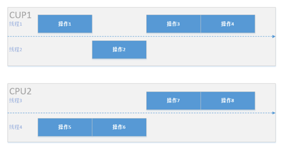
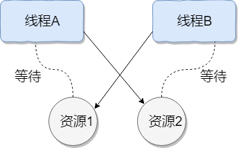

# Java并发

- 一、基础知识
- 二、线程状态
- 三、基础线程机制
- 四、中断
- 五、互斥同步
- 六、线程之间的协作
- 七、上下文切换
- 八、死锁


## 一、基础知识

### 1进程和线程

#### 进程  

进程是**资源分配的基本单位**。

进程控制块（Process Control Block，PCB）描述进程的基本信息和运行状态，所谓的创建进程和撤销进程，都是指对PCB的操作。

下图显示了 4 个程序创建了 4 个进程，这 4 个进程可以并发地执行。


#### 线程

**线程是 CPU 调度的基本单位。**

线程与进程相似，但线程是一个比进程更小的执行单位。一个进程在执行的过程中可以产生多个线程。与进程不同的是同类的多个线程共享进程的堆和方法区资源，但每个线程有自己的程序计数器、虚拟机栈和本地方法栈，所以系统在产生一个线程，或是在各个线程之间作为切换工作时，负担要比进程小得多，也正因为如此，线程也被称为轻量级进程。

Java 程序天生就是多线程程序，我们可以通过 JMX 来看一下普通的 Java 程序有哪些线程，代码如下：

```java
public class MultiThread {
    public static void main(String[] args) {
        // 获取 Java 线程管理 MXBean
        ThreadMXBean threadMXBean = ManagementFactory.getThreadMXBean();
        // 不需要获取同步的 monitor 和 synchronizer 信息，仅获取线程和线程堆栈信息
        ThreadInfo[] threadInfos = threadMXBean.dumpAllThreads(false, false);
        // 遍历线程信息，仅打印线程 ID 和线程名称信息
        for (ThreadInfo threadInfo : threadInfos) {
            System.out.println("[" + threadInfo.getThreadId() + "] " + threadInfo.getThreadName());
        }
    }
}
```

上述程序输出如下：

```shell
[1] main		// main线程，程序入口
[2] Reference Handler	// 清除 reference 线程
[3] Finalizer	// 调用对象 finalize 方法的线程
[4] Signal Dispatcher	// 分发处理给 JVM 信号的线程
[5] Attach Listener		// 添加事件
[11] Common-Cleaner
[12] Monitor Ctrl-Break
```

从上面的输出内容可以看出：一个 Java 程序的运行时 `main` 线程和多个其它线程同时运行。

### 2.进程与线程的区别

**资源**  

进程是资源调度的基本单位。

线程不占有任何资源。

**调度**  

线程是独立调度的基本单位。

同一进程中，线程的切换不会引起进程切换，但一个进程中线程切换到另一个进程中的线程时，就会引起进程切换。

**系统开销**  

进程的创建和撤销所付出的开销比线程的创建和撤销要大的多。

类似的，进程切换的开销也比线程切换的开销要大很多，因为进程切换时，涉及到当前执行进程的 CPU 环境的保存和新调度进程 CPU 环境的设置，而线程切换时只需要设置和保存少量的寄存器内容，开销很小。

**通信**  

线程可以通过直接读写同一进程中的数据进程通信。

进程之间的通信需要借助 IPC（InterProcess Communication）。

### 3.多进程与多线程

多进程的目的是提高 CPU 的使用率。

多线程的目的是提高应用程序的使用率。

多线程共享同一进程资源（堆内存和方法区），但是栈内存是独立的，JVM中一个线程对应一个线程栈。多线程抢夺的是 CPU 资源，一个时间点上只有一个线程运行。

**为什么要使用多线程？**  

先从总体上来说：

- **从计算机底层来说**：线程可以比作是轻量级的进程，是程序执行的最小单位，线程间的切换和调度的成本远远小于进程。另外，多核 CPU 时代意味着多个线程可以同时运行，这减少了线程上下文切换的开销。
- **从当代互联网发展趋势来说**：现在的系统动不动就要求百万级甚至千万级的并发量，而多线程并发编程正是开发高并发系统的基础，利用好多线程机制可以大大提高系统整体的并发能力以及性能。

在深入到计算机底层来探讨：

- **单核时代**：在单核时代多线程主要是为了提高 CPU 和 IO 设备的综合利用率。举个例子：当只有一个线程的时候会导致 CPU 计算时，IO 设备空闲；进行 IO 操作时，CPU 空闲。我们可以简单地说这两者的利用率目前都是 50%左右。但是当有两个线程的时候就不一样了，当一个线程执行 CPU 计算时，另外一个线程可以进行 IO 操作，这样两个的利用率就可以在理想情况下达到 100%了。
- **多核时代**：多核时代多线程主要是为了提高 CPU 利用率。举个例子：假如我们要计算一个复杂的任务，我们只用一个线程的话，CPU 只会一个 CPU 核心被利用到，而创建多个线程就可以让多个 CPU 核心被利用到，这样就提高了 CPU 的利用率。

### 4.并发与并行

- 并发：一个处理器同时处理多个任务，是逻辑上的同时发生。
- 并行：多个处理器或者多核处理器同时处理多个不同的任务，是物理上的同时发生。

来个比喻：并发是一个人同时吃三各馒头，而并行就是三个人同时吃三各馒头。

下图反映了一个包含 8 个操作的任务在一个有两核心的 CPU 中创建四个线程运行的情况。

假设每个核心有两个线程，那么每个 CPU 中两个线程会交替并发，两个 CPU 之间的操作会并行运算。

单就一个 CPU 而言两个线程可以解决线程阻塞造成的不流畅问题，其本身运行效率并没有提高，多 CPU 的并行运行才真正解决了运行效率问题，这也正是并发和并行的区别。



### 5.创建线程的几种方式

#### 5.1.三种创建线程的方式

Java 有 3 中创建线程的方式：

**继承 Thread 类**  

继承 `Thread` 类，并重写 `run()` 方法。

当调用 `start()` 方法启动一个线程时，虚拟机会将该线程放入就绪队列中等待被调度，当一个线程被调度时会执行该线程的 `run()` 方法。

```java
public class MyThread extends Thread {
	@Override
	public void run() {	// 重写 run() 方法
		System.out.println("Current Thread is : " + Thread.currentThread().getName());
	}
}
```

```java
public static void main(String[] args) {
	MyThread mt = new MyThread();
    mt.start();
}
```

**实现 Runnable 接口**  

实现 `Runnable` 接口，并重写 `run()` 方法。

```java
public class MyRunnable implements Runnable {
	@Override
	public void run() {
		System.out.println("Current Thread is : " + Thread.currentThread().getName());
	}
}
```

使用 `Runnable` 实例再创建一个 `Thread` 实例，然后调用 `Thread` 实例的 `start()` 方法来启动线程。

```java
public static void main(String[] args) {
	MyRunnable instance = new MyRunnable();
	Thread thread = new Thread(instance);
	thread.start();
}
```

**实现 Callable 接口**  

与 `Runnable` 相比，`Callable` 可以有返回值，返回值通过 `FutureTask` 进行封装。

```java
public class MyCallable implements Callable<Integer> {
	@Override
	public Integer call() {
		System.out.println("Current Thread is : " + Thread.currentThread().getName());
		return "";
	}
}
```

```java
public static void main(String[] args) throws ExecutionException, InterruptedException {
	MyCallable mc = new MyCallable();
	FutureTask<Integer> ft = new FutureTask<>(mc);
	Thread thread = new Thread(ft);
	thread.start();
	System.out.println(ft.get());
}
```

#### 5.2.选择

选择实现接口的方式比较好。

- Java 不支持多重继承，因此继承了 `Thread` 类就无法继承其它类，但是可以实现多个接口；
- 类可能只要求可执行就行，继承整个 `Thread` 类开销过大。

#### 5.3.Runnable 和 Callable 的区别

- `Callable` 的实现方法是 `call()` ；`Runnable` 的实现方法是 `run()` 
- `Callable` 任务执行后有返回值。`Callable` 与 `Future` 配合使用，运行 `Callable` 任务和获取一个 `Future` 对象 `Future` 表示异步计算后的结果；`Runnable`任务执行后是没有返回值的
- `Callable`的`call()`方法可以抛出异常；`Runnable`的`run()`方法不能抛出异常


**为什么调用 `start()` 方法时会执行 `run()` 方法，而不是直接调用 `run()` 方法？**  

`new` 一个 `Thread`，线程进入新键状态；调用 `start()` 方法，会启动一个线程并使线程进入就绪状态，当分配到时间片后就可以开始运行。`start()` 会执行线程的相应准备工作，然后自动执行 `run()` 方法，这是真正的多线程工作；而直接执行 `run()` 方法，会把 `run()` 方法当成一个 `main` 线程下的普通方法去执行，并不会在某个线程中执行它，所以这不是多线程工作。

总之，调用 `start()` 方法可启动线程并使线程进入就绪状态，而 `run()` 方法只是 `Thread` 的一个普通方法，还是在主线程中执行。


## 二、线程状态

一个线程只能处于一种状态，并且这里的线程状态特指 Java 虚拟机的线程状态，不能反映线程在特定操作系统下的状态。


### 新键（New）

创建后尚未启动。

### 可运行（Runnable）

可能正在运行，也可能正在等待 CPU 时间片。

包含了操作系统线程状态中的 `Running` 和 `Ready`。

调用 `start()` 方法后开始运行，线程这时候处于 Ready 状态。可运行状态的线程获得了 CPU 时间片后进入 Running 状态。

### 阻塞（Blocked）

等待获取一个 **排它锁**，如果其他线程释放了锁就会结束此状态。

### 无限期等待（Waiting）

等待其它线程显式地唤醒，否则不会被分配 CPU 时间段。

|进入方法|退出方法|
|---|---|
|没有设置 `Timeout` 参数的 `Object.wait()` 方法|`Object.notify()/Object.notifyAll()`|
|没有设置 `Timeout` 参数的 `Thread.join()` 方法| 被调用的线程执行完毕|
|`LockSupport.park()`方法|`LockSupport.unpark(Thread)`|

### 期限等待（Timed Waiting）

无需等待其它线程显式地唤醒，在一定时间之后会被系统自动唤醒。

调用 `Thread.sleep()` 方法使线程进入限期等待状态时，常常用 "使一个线程睡眠" 进行描述。

调用 `Object.wait()` 方法使线程进入限期等待或者无限期等待时，常常用“挂起一个线程”进行描述。

**睡眠和挂起是用来描述行为，而阻塞和等待用来描述状态。**

|进入方法|退出方法|
|---|---|
|`Thread.sleep()`方法|时间结束|
|设置了 `Timeout` 参数的 `Object.wait()` 方法|时间结束/`Object.notify()`/`Object.notifyAll()`|
|设置了 `Timeout` 参数的 `Thread.join()` 方法|时间结束/被调用的线程执行完毕|
|`LockSupport.parkNanos()`方法|`LockSupport.unpark(Thread)`|
|`LockSupport.parkUntil()`方法|`LockSupport.unpark(Thread)`|

**阻塞和等待的区别**在于：

阻塞是被动的，它是在等待获取一个排它锁。
等待是主动的，通过调用 `Thread.sleep()` 和 `Object.wait()` 等方法进入。

### 死亡（Terminated）

可以是线程完成任务后自己结束，或者产生了异常而结束。

## 三、基础线程机制

### Executor

`Executor` 管理多个异步任务的执行，而无需程序员显示地管理线程的生命周期。这里的异步是指多个任务的执行互不干扰，不需要进行同步操作。

主要有三种 `Executor`：

- `CachedThreadPool`：一个任务创建一个线程；
- `FixedThreadPool`：所有任务只能使用固定大小的线程；
- `SingleThreadExecutor`：相当于大小为 1 的 `FixedThreadPool`。

```java
public static void main(String[] args) {
	ExecutorService service = Executors.newCachedThreadPool();
	for (int i = 0; i < 5; i++) {
		service.execute(new MyRunnable());
	}
	service.shutdown();
}
```

### Daemon

Java 中有两类线程：

- 用户线程：运行在前台的线程，`main()`属于主线程。
- 守护线程：程序运行时在后台听服务的线程，不属于程序中不可或缺的部分。

当所有非守护线程结束时，程序也就终止，同时会杀死所有守护线程；因此不要在守护线程中执行业务逻辑操作，因为随时都可能中断（甚至无法执行 `finally` 中的语句）。

注意：在线程启动之前使用 `setDaemon()` 方法可以将一个线程设置为守护线程。

```java
public static main(String[] args) {
	Thread thread = new Thread(new MyRunnable());
	thread.setDaemon(true);
}
```

### sleep()

`Thread.sleep(millisec)` 方法会休眠当前正在执行的线程，millisec单位为毫秒。

`sleep()` 可能会抛出 `InterruptedException`，因为异常不能跨线程传播回 `main()` 中，因此必须在本地进行处理。线程中抛出的其它异常也同样需要在本地进行处理。

```java
public void run() {
	try {
		Thread.sleep(3000);
	} catch (InterruptedException e) {
		e.printStackTrace();
	}
}
```

### yield()

对静态方法 `Thread.yield()` 的调用声明了当前线程已经完成了生命周期中最重要的部分，可以切换给其它线程来执行。该方法只是对线程调度器的一个建议，而且也只是建议具有相同优先级的其它线程可以运行。

```java
public void run() {
	Thread.yield();
}
```

## 四、中断

一个线程执行完毕之后会自动结束，如果在运行过程中发生异常也会提前结束。

### InterruptedException

通过调用一个线程的 `interrupt()` 来中断该线程，如果该线程处于阻塞、限期等待或者无限期等待状态，那么就会抛出 `InterruptedException`，从而提前结束该线程。但是不能中断 I/O 阻塞和 `synchronized` 锁阻塞。

对于以下代码，在 `main()` 中启动一个线程之后再中断它，由于线程中断用了 `Thread.sleep()` 方法，因此会抛出一个 `InterruptedException`，从而提前结束线程，不执行之后的语句。

```java
public class InterruptExample {
    private static class MyThread extends Thread {
        @Override
        public void run() {
            try {
                Thread.sleep(2000);
                System.out.println("Thread run");
            } catch (InterruptedException e) {
                e.printStackTrace();
            }
        }
    }
}
```

```java
public static void main(String[] args) {
	Thread thread = new MyThread();
    thread.start();
    thread.interrupt();
    System.out.println("Main run");
}
```

```shell
Main run
java.lang.InterruptedException: sleep interrupted
	at java.base/java.lang.Thread.sleep(Native Method)
	at me.hireny.tutorial.java.concurrent.InterruptExample$MyThread.run(InterruptExample.java:14)
```

### interrupted()

如果一个线程的 `run()` 方法执行一个无限循环，并且没有执行 `sleep()` 等会抛出 `InterruptedException` 的操作，那么调用线程的 `interrupt()` 方法就无法使线程提前结束。

但是调用 `interrupt()` 方法会设置线程的中断标记，此时调用 `interrupted()` 方法会返回 true。因此可以在循环体中使用 `interrupted()` 方法来判断线程是否处于中断状态，从而提前结束线程。

```java
public class InterruptExample {
    private static class MyThread2 extends Thread {
        @Override
        public void run() {
            while (!interrupted()) {
                //...
            }
            System.out.println("Thread end");
        }
    }
}
```

```java
public static void main(String[] args) {
	Thread thread = new MyThread2();
	thread.start();
	thread.interrupt();
	System.out.println("Main run");
}
```

```shell
Thread end
```

### Executor 的中断操作

调用 `Exector` 的 `shutdown()` 方法会等待线程都执行完毕之后再关闭，但是如果调用的是 `shutdownNow()` 方法，则相当于调用每个线程的 `interrupt()` 方法。

以下使用 `Lambda` 创建线程，相当于创建了一个匿名内部线程。

```java
public static void main(String[] args) {
	ExecutorService executorService = Executors.newCachedThreadPool();
	executorService.execute(() -> {
		try {
			Thread.sleep(2000);
			System.out.println("Thread run");
        } catch (InterruptedException e) {
            e.printStackTrace();
        }
    });
    executorService.shutdownNow();
    System.out.println("Main run");
}
```

```shell
Main run
java.lang.InterruptedException: sleep interrupted
	at java.base/java.lang.Thread.sleep(Native Method)
	at me.hireny.tutorial.java.concurrent.InterruptExample.lambda$main$0(InterruptExample.java:44)
	at java.base/java.util.concurrent.ThreadPoolExecutor.runWorker(ThreadPoolExecutor.java:1128)
	at java.base/java.util.concurrent.ThreadPoolExecutor$Worker.run(ThreadPoolExecutor.java:628)
	at java.base/java.lang.Thread.run(Thread.java:834)
```

如果只想中断 `Exector` 中的一个线程，可以通过使用 `submit()` 方法来提交一个线程，它会返回一个 `Future<?>` 对象，通过调用该对象的 `cancel(true)` 方法就可以中断线程。

```java
Future<?> future = executorService.submit(() -> {
	//...
});
future.cancel(true);
```

## 五、互斥同步

Java提供了两种锁机制来控制多个线程对共享资源的互斥访问，第一个是 JVM 实现的 `synchronized`，而另一个是 JDK 实现的 `ReentrantLock`。

### synchronized

#### 1.同步一个代码块

```java
public void func() {
	synchronized (this) {
		// ...
	}
}
```

它只作用于同一个对象，如果调用两个对象上的同步代码块，就不会进行同步。

对于以下代码，使用 `ExecutorService` 执行了两个线程，由于调用的是同一个对象的同步代码块，因此这两个线程会进行同步，当一个线程进入同步语句块时，另一个线程就必须等待。

```java
public class SynchronizedExample {
	public void func() {
		synchronized (this) {
			for (int i = 0; i < 10; i++) {
				System.out.print(i + " ");
			}
		}
	}
}
```

```java
public static void main(String[] args) {
	SynchronizedExample e1 = new SynchronizedExample();
	ExecutorService executorService = Executors.newCachedThreadPool();
	executorService.execute(() -> e1.func());
	executorService.execute(() -> e1.func());
}
```

```shell
0 1 2 3 4 5 6 7 8 9 0 1 2 3 4 5 6 7 8 9 
```

对于以下代码，两个线程调用了不同对象的同步代码块，因此这两个线程就不需要同步。从输出结果可以看出，两个线程交叉执行。

```java
public static void main(String[] args) {
	SynchronizedExample e1 = new SynchronizedExample();
	SynchronizedExample e2 = new SynchronizedExample();
	ExecutorService executorService = Executors.newCachedThreadPool();
	executorService.execute(() -> e1.func());
	executorService.execute(() -> e2.func());
}
```

```shell
0 0 1 1 2 2 3 3 4 4 5 5 6 6 7 7 8 8 9 9 
```

#### 2.同步一个方法

```java
public synchronized void func() {
	// ...
}
```

它和同步代码块一样，作用于同一个对象。

#### 3.同步一个类

```java
public void func () {
	synchronized (SynchronizedExample.class) {
		// ...
	}
}
```

作用于整个类，也就是说两个线程调用同一个类的不同对象上的这种不同语句，也会进行同步。

```java
public class SynchronizedExample {
	public void func() {
		synchronized (SynchronizedExample.class) {
			for (int i = 0; i < 10; i++) {
				System.out.print(i + " ");
			}
		}
	}
}
```

```java
public static void main(String[] args) {
	SynchronizedExample e1 = new SynchronizedExample();
	SynchronizedExample e2 = new SynchronizedExample();
	ExecutorService executorService = Executors.newCachedThreadPool();
	executorService.execute(() -> e1.func());
	executorService.execute(() -> e2.func());
}
```

```shell
0 1 2 3 4 5 6 7 8 9 0 1 2 3 4 5 6 7 8 9 
```

#### 4.同步一个静态方法

```java
public synchronized static void func() {
	// ...
}
```

作用于整个类。

### ReentrantLock

`ReentrantLock` 是 `java.util.concurrent（J.U.C）`包中的锁。

```java
public class LockExample {

    private Lock lock = new ReentrantLock();

    public void func() {
        lock.lock();
        try {
            for (int i = 0; i < 10; i++) {
                System.out.print(i + " ");
            }
        } finally {
            lock.unlock();  // 确保释放锁，从而避免发生死锁
        }
    }
}
```

```java
public static void main(String[] args) {
    LockExample lockExample = new LockExample();
    ExecutorService executorService = Executors.newCachedThreadPool();
    executorService.execute(() -> lockExample.func());
    executorService.execute(() -> lockExample.func());
}
```

```shell
0 1 2 3 4 5 6 7 8 9 0 1 2 3 4 5 6 7 8 9 
```

### 比较

**1.锁的实现**

`synchronized` 是 JVM 实现的，而 `ReentrantLock` 是 JDK 实现的。

**2.性能**

新版本 Java 对 `synchronized` 进行了很多优化，例如自旋锁等， `synchronized` 与 `ReentrantLock` 大致相同。

**3.等待可中断**

当持有锁的线程长期不释放锁的时候，正在等待的线程可以选择放弃等待，改为处理其它事情。

**4.公平锁**

公平锁是指多个线程在等待同一个锁时，必须按照申请锁的时间顺序来依次获得锁。

`synchronized` 中的锁是非公平的，`ReentrantLock` 默认情况下也是非公平的，但是也可以是公平的。

**5.锁绑定多个条件**

一个 `ReentrantLock` 可以同时绑定多个 `Condition` 对象。

### 使用选择

除非需要使用 `ReentrantLock` 的高级功能，否则优先使用 `synchronized`。这是因为 `synchronized` 是 JVM 实现的一种锁机制，JVM原生地支持它，而 `ReentrantLock` 不是所有的 JDK 版本都支持。并且使用 `synchronized` 不用担心没有释放锁而导致死锁问题，因为 JVM 会确保锁的释放。

## 六、线程之间的协作

当多个线程可以一起工作去解决某个问题时，如果某些部分必须在其它部分之前完成，那么就需要对相乘进行协调。

### join()

当线程中调用另一个线程的 `join()` 方法，会将当前线程挂起，而不是忙等待，直到目标线程结束。

对于以下代码，虽然 b 线程先启动，但是因为在 b 线程中调用了 a 线程的 `join()` 方法，b 线程会等待 a 线程结束才继续执行，因此最后能够保证 a 线程的输出先于 b 线程的输出。

```java
public class JoinExample {
	private class A extends Thread {
		@Override
		public void run() {
			System.out.println("A");
		}
	}
	private class B extends Thread {
		private A a;
		B(A a) {
			this.a = a;
		}
		@Override
		public void run() {
			try {
				a.join();
			} catch(InterruptedException e) {
				e.printStackTrace();
			}
			System.out.println("B");
		}
	}
	public void test() {
        A a = new A();
        B b = new B(a);
        b.start();
        a.start();
    }
}
```

```java
public static void main(String[] args) {
    JoinExample example = new JoinExample();
    example.test();
}
```

输出结果：

```shell
A
B
```

### wait()/notify()/notifyAll()

调用 `wait()` 使得线程等待某个条件满足，线程在等待时会被挂起，当其它线程的运行使得这个条件满足时，其它线程会调用 `notify()` 或者 `notifyAll()` 来唤醒挂起的线程。

它们都属于 `Object` 的一部分，而不属于 `Thread`。

只能用在同步方法或者同步块中使用，否则会在运行时抛出 `IllegalMonitorStateException`。

使用 `wait()` 挂起期间，线程会释放锁。这是因为，如果没有释放锁，那么其它线程就无法进入对象的同步方法或者同步块中，那么就无法执行 `notify()` 或者 `notifyAll()` 来唤醒挂起的线程，造成死锁。

```java
public class WaitNotifyExample {
    public synchronized void before() {
        System.out.println("before");
        notifyAll();
    }
    public synchronized void after() {
        try {
            wait();
        } catch (InterruptedException e) {
            e.printStackTrace();
        }
        System.out.println("after");
    }
}
```

```java
public static void main(String[] args) {
	ExecutorService executorService = Executors.newCachedThreadPool();
	WaitNotifyExample example = new WaitNotifyExample();
	executorService.execute(() -> example.after());
	executorService.execute(() -> example.before());
    }
```

输出结果：

```shell
before
after
```

**wait() 和 sleep() 的区别**  

- `wait()` 是 `Object` 的方法，而 `sleep()` 是 `Thread` 的静态方法；
- 两者都可以暂停多线程，但 `wait()` 会释放锁，`sleep()` 不会释放锁；
- `wait()` 通常被用于线程间交互/通信，`sleep()` 通常被用于暂停执行；

**notify() 和 notifyAll() **  

池锁：线程 A 已经拥有某个对象的锁，线程 B、C 想要调用这个对象的同步方法，此时线程 B、C 就会被阻塞，进入一个地方去等待锁的释放，这个地方就是该对象的池锁。

等待锁：假设线程 A 调用了某个对象的 `wait()` 方法，线程 A 释放该对象的锁，同时线程 A 进入等待池，进入等待池的线程不会竞争该对象的锁。

`notifyAll()` 让所有处于等待池的线程进入锁池去竞争锁。

### await()/signal()/signalAll()

`java.util.concurrent` 类库中提供了 `Condition` 类来实现线程之间的协调，可以在 `Condition` 上调用 `await()` 方法使线程等待，其它线程调用 `signal()` 或 `signalAll()` 方法唤醒等待的线程。

相比于 `wait()` 这种等待方式，`await()` 可以指定等待的条件，因此更加灵活。

使用 `Lock` 来获取一个 `Condition` 对象。

```java
public class AwaitSignalExample {
    private Lock lock = new ReentrantLock();
    private Condition condition = lock.newCondition();

    public void before() {
        lock.lock();
        try {
            System.out.println("before");
            condition.signalAll();
        } finally {
            lock.unlock();
        }
    }

    public void after() {
        lock.lock();
        try {
            condition.await();
            System.out.println("after");
        } catch (InterruptedException e) {
            e.printStackTrace();
        } finally {
            lock.unlock();
        }
    }
}
```

```java
public static void main(String[] args) {
	ExecutorService executorService = Executors.newCachedThreadPool();
	AwaitSignalExample example = new AwaitSignalExample();
	executorService.execute(() -> example.after());
	executorService.execute(() -> example.before());
    }
```

输出结果：

```shell
before
after
```

## 七、上下文切换

多线程编程中一般线程的个数都大于 CPU 核心的个数，而一个 CPU 核心在任意时刻只能被一个线程使用，为了让这些线程都能得到有效执行，CPU 采取的策略是为每个线程分配时间片并轮转的形式。当一个线程的时间片用完的时候就会重新处于就绪状态让给其它线程使用，这个过程就属于一次上下文切换。

概括来说就是：当前任务在执行完 CPU 时间片切换到另一个任务之前会先保存自己的状态，以便下次再切换回这个任务时，可以再加载这个任务的状态。**任务从保存到再加载的过程就是一次上下文切换**。

上下文切换通常是计算密集型的。也就是说，它需要相当可观的处理器时间，在每秒几十上百次的切换中，每次切换都需要纳秒量级的时间。所以，上下文切换对系统来说意味着消耗大量的 CPU 时间，事实上，可能是操作系统中时间消耗最大的操作。

Linux 相比与其他操作系统（包括其他类 Unix 系统）有很多的优点，其中有一项就是，其上下文切换和模式切换的时间消耗非常少。

## 八、死锁

### 8.1.认识线程死锁

死锁是两个或者两个以上的线程在执行的过程中，因争夺资源产生的一种互相等待的现象。由于线程被无限期地阻塞，因此程序不可能正常终止。

如图所示，线程 A 持有资源 2，线程 B 持有资源 1，它们同时都想申请对方的资源，所以这两个线程就会互相等待二进入死锁状态。



死锁是一种很难调式的错误，原因有两点：

- 死锁通常很少发生，只有当两个线程恰好以这种方式获取 CPU 时钟周期时才会繁盛死锁；
- 死锁可能涉及更多的线程以及更多的同步对象。

下面通过一个例子来说明线程死锁，代码模拟了上图的死锁的情况：

```java
public class DeadLockDemo {
    private static Object resource1 = new Object(); // 资源 1
    private static Object resource2 = new Object(); // 资源 2

    public static void main(String[] args) {
        new Thread(() -> {
            synchronized (resource1) {
                System.out.println(Thread.currentThread() + " get resource1");
                try {
                    Thread.sleep(1000);
                } catch (InterruptedException e) {
                    e.printStackTrace();
                }
                System.out.println(Thread.currentThread() + " waiting get resource2");
                synchronized (resource2) {
                    System.out.println(Thread.currentThread() + " get resource2");
                }
            }
        }, "线程 1").start();


        new Thread(() -> {
            synchronized (resource2) {
                System.out.println(Thread.currentThread() + " get resource2");
                try {
                    Thread.sleep(1000);
                } catch (InterruptedException e) {
                    e.printStackTrace();
                }
                System.out.println(Thread.currentThread() + " waiting get resource1");
                synchronized (resource1) {
                    System.out.println(Thread.currentThread() + " get resource1");
                }
            }
        }, "线程 2").start();
    }
}
```

输出结果：

```shell
Thread[线程 1,5,main] get resource1
Thread[线程 2,5,main] get resource2
Thread[线程 2,5,main] waiting get resource1
Thread[线程 1,5,main] waiting get resource2
```

线程 A 通过 `synchronized(resource1)` 获得 `resource1` 的监视器锁，然后通过 `Thread.sleep(1000);`，让线程 A 休眠 1s，为的是让线程 B 得到执行然后获取到 `resource2` 的监视器锁。线程 A 和线程 B 休眠结束了都开始企图请求获取对方的资源，然后这两个线程就会陷入互相等待的状态，这就产生了死锁。上面的例子符合产生死锁的四个必要条件。

产生死锁必须具备以下四个条件：

1. 互斥条件：该资源任意一个时刻只由一个线程占用；
2. 请求与保持条件：一个进程因请求资源而阻塞时，对已获得的资源保持不放；
3. 不剥夺条件：线程已获得的资源在未使用完之前不能被其它线程强行剥夺，只能自己使用完毕后才释放资源；
4. 循环等待条件：若干进程之间形成一种头尾相接的循环等待资源关系。

### 8.2.如何避免死锁

为了避免死锁，我们只要破坏产生死锁的四个条件中的其中一个就可以了。现在我们挨个分析一下：

1. 破坏互斥条件：这个条件我们没有办法破坏，因为我们用锁本来就是想让它们互斥的（临界资源需要互斥访问）；
2. 破坏请求与保持条件：一次性申请所有的资源；
3. 破坏不剥夺条件：占用部分资源的线程进一步申请其它资源时，如果申请不到，可以主动释放它占用的资源；
4. 破坏循环等待条件：靠按序申请资源来预防。按某一顺序申请资源释放资源则反序释放。破坏循环等待条件。

我们对线程 2 的代码修改成下面这样就不会产生死锁了：

```java
new Thread(() -> {
	synchronized (resource1) {
		System.out.println(Thread.currentThread() + " get resource1");
		try {
			Thread.sleep(1000);
		} catch (InterruptedException e) {
			e.printStackTrace();
		}
		System.out.println(Thread.currentThread() + " waiting get resource2");
		synchronized (resource2) {
			System.out.println(Thread.currentThread() + " get resource2");
		}
	}
}, "线程 2").start();
```

输出结果：

```shell
Thread[线程 1,5,main] get resource1
Thread[线程 1,5,main] waiting get resource2
Thread[线程 1,5,main] get resource2
Thread[线程 2,5,main] get resource1
Thread[线程 2,5,main] waiting get resource2
Thread[线程 2,5,main] get resource2
```

我们分析一下上面的代码为什么避免了死锁的发生？

线程 1 首先获得到 `resource1` 的监视器锁,这时候线程 2 就获取不到了。然后线程 1 再去获取 `resource2` 的监视器锁，可以获取到。然后线程 1 释放了对 `resource1`、`resource2` 的监视器锁的占用，线程 2 获取到就可以执行了。这样就破坏了破坏循环等待条件，因此避免了死锁。