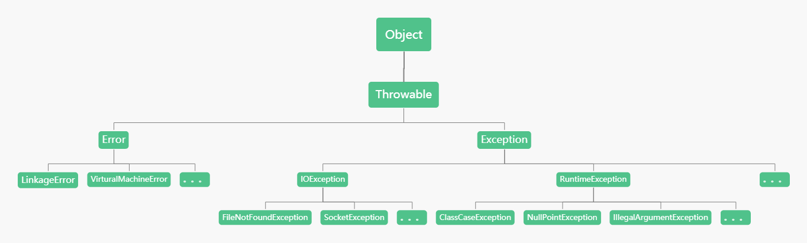

# Java异常

- 一、异常体系结构
- 二、异常处理机制
- 三、自定义异常
- 四、try-wth-resources用法

Java异常是一个描述在代码段中发生异常的对象，当发生异常情况时，一个代表该异常的对象被创建并且在导致该异常的方法中被抛出，而该方法可以选择自己处理异常或者传递该异常。

# 一、异常体系结构

Java内置了一套异常处理机制，总是使用异常来表示错误。

异常是一种 `class`，因此它本身带有类型信息，并定义了一个基类 `java.lang.Throwable` 作为所有异常的超类，可以表示任何可以作为异常抛出的类。



Java异常分为两类：错误 `Error` 和异常 `Exception`。

`Error` 用来表示JVM无法处理的错误。通常有 `VirtualMachineError`（虚拟机运行错误）、`NoClassDefFoundError`（类定义错误）等。当JVM耗尽内存时，会报错`OutOfMemoryError`（内存耗尽错误）。此类错误发生时，JVM终止线程。发生`Error`错误都是非代码性错误。因此，当发生此类错误时，应用不能去处理。

`Exception` 是运行时的错误，它可以被捕获并处理。`Exception`分为两种：

-   **受检异常(非运行时异常)**  ：`Exception`中除`RuntimeException`及其子类之外，编译器会检查此类异常，如果出现程序中此类异常，比如说`IOException`，必须使用 `try...catch` 语句进行捕获，或者使用`throws`子句抛出，否则编译无法通过
-   **非受检异常(运行时异常)**  ：`RuntimeException`类及其子类表示JVM在运行期间可能出现的错误。编译器不会检查此类异常，并且不要求处理异常，比如用空值对象的引用（`NullPointerException`）、数组下标越界（`ArrayIndexOutBoundException`）。此类异常属于不可查异常，一般是由程序逻辑错误引起的，在程序中可以选择捕获处理，也可以不处理。

注意：异常和错误的区别：异常能被程序本身处理，错误是无法处理的。

# 二、异常处理机制

Java的异常处理本质上是抛出异常（`throw`）和捕获异常（`try...catch`）。

## 2.1、捕获异常

在Java中，凡是可能抛出异常的语句，都可以用 `try...catch`捕获，把可能发生异常的语句放在`try {...}` 中，然后使用`catch`捕获对应的`Exception`及其子类。

**多catch语句**  

可以使用多个 `catch` 语句，每个 `catch` 分别捕获对应的 `Exception` 及其子类。JVM在捕获到异常后，会从上到小匹配 `catch` 语句，匹配到某个 `catch` 后，执行 `catch` 代码块，然后结束`try...catch`语句，`catch` 语句只有一个被执行。

```java
try {
	// 这里是可能发生异常的代码，一旦发生异常，就会跳至 catch 语句块中
} catch (IOException ex) {
	// 这里是用来处理被抛出的 IOException 及其子类的异常
} catch (CloneNotSupportedException  ex) {
	// 这里是用来处理被抛出的 CloneNotSupportedException 及其子类的异常
}
```

在多个 `catch` 语句的时候， `catch` 的顺序非常重要，子类必须写在前面。如果不按照顺序写，子类永远捕获不到。

**捕获所有异常**  

可以只写一个异常处理来捕获所有类型的异常。通过捕获异常类型的基类 `Exception`，就可以做到这一点（事实上还有其它的基类，但`Exception`是所有异常行为的基类）：

```java
catch (Exception ex) {
	System.out.println("Caught an exception");
}
```

这将捕获所有异常，所以最好把它放在`catch`语句的末尾，以防止抢在其它异常处理之前先把异常捕获了。

**捕获多种异常**  

如果某些异常的处理逻辑相同，但是异常本身不存在继承关系，那么就得编写多条`catch`语句：

```java
try {
	...
} catch (IOException ex) {
	System.out.println("Bad input");
} catch (NumberFormatException ex) {
	System.out.println("Bad input");
} catch (Exception ex) {
	System.out.println("Unknown error");
}
```

通过 Java 7 的多重捕获机制，可以使用 "|" 将不同类型的异常组合起来，只需要一行 `catch` ：

 ```java
try {
	// 这里是可能发生异常的代码，一旦发生异常，就会跳至 catch 语句块中
} catch (IOException | CloneNotSupportedException ex) {
	// 这里是用来处理被抛出的 IOException 及其子类的异常 或 处理被抛出的 CloneNotSupportedException 及其子类的异常
} finally {
	// 无论是否发生异常都会执行的语句块
}
```

这一特性可以很好的减少字节码并减少代码冗余。

**finally语句**  

无论是否有异常发生，如果我们希望有一些代码在异常中总会被执行的话，我们就要使用 `finally` 关键字。在`finaly`代码块中，可以运行清理类型等收尾善后性质的语句。语法如下：

```java
try {
	// 这里是可能发生异常的代码，一旦发生异常，就会跳至 catch 语句块中
} catch (IOException ex) {
	// 这里是用来处理被抛出的 IOException 及其子类的异常
} catch (CloneNotSupportedException  ex) {
	// 这里是用来处理被抛出的 CloneNotSupportedException 及其子类的异常
} finally {
	// 无论是否发生异常都会执行的语句块
}
```

`finally` 语句不是必须的且总是最后执行。

如果没有发生异常，执行 `try{...}` 语句块，然后执行 `finally{...}` 语句块。如果发生异常，就中断`try{...}`语句块，执行匹配的`catch{...}`语句块，最后执行`finally{...}`语句块。

在以下4中特殊情况下，`finally {...}`语句块不会被执行：

1. 在 `finally` 语句块第一行发生了异常。因为在其它行，`finally`块还是会得到执行
2. 在前面的代码中用了 `System.exit(int)` 已退出程序。`exit`是带参函数；若该语句在异常语句之后，`finally`会执行
3. 程序所在的线程死亡
4. 关闭CPU

注意：当 `try {...}` 语句块和 `finally {...}` 语句块中都有 `return` 语句时，在方法返回之前，`finally` 语句的内容将被执行，并且 `finally` 语句的返回值将会覆盖原始的返回值。如下：

```java
public static int process(int value) {
	try {
		return value * value;
	} finally {
		if (value == 2) {
			return 0;
		}
	}
}
```

如果调用 `process(2)`，返回值将是0，因为 `finally` 语句的返回值覆盖了 `try {...}` 语句块的返回值。

## 2.2、抛出异常

抛出异常所需要的关键字：`throw`、`throws`

当发生错误时，可以不用捕获异常，直接使用`throws/throw`将异常抛到上层调用方法。

```java
if (string == null) {
	throw new NullPointerException();
}
```

如果一个方法捕获了某个异常后，又在 `catch` 子句中抛出新的异常，就相当于把抛出的异常类型"转换"了：

```java
void process1(String s) {
	try {
		process2(s);
	} catch (NullPointerException ex) {
		// NullPointerException的实例传入到新的异常中，IllegalArgumentException就会持有NullPointerException信息。
		throw new IllegalArgumentException(ex);
	}
}
void process2(String s) {
	if (s == null) {
		throw new NullPointerException
	}
}
```

## 2.3、异常屏蔽

异常作为程序出错的标志，绝不应该被忽略，但它还是有可能被轻易地忽略。用某些特殊的方式使用 `finally` 子句，就会发生这种情况：

```java
class VeryImportantException extends Exception {
    @Override
    public String toString() {
        return "A very important exception!";
    }
}
class HoHumException extends Exception {
    @Override
    public String toString() {
        return "A trivial exception";
    }
}
public class LostMessage {
    void f() throws VeryImportantException {
        throw new VeryImportantException();
    }
    void dispose() throws HoHumException {
        throw new HoHumException();
    }
    public static void main(String[] args) {
        try {
            LostMessage lm = new LostMessage();
            try {
                lm.f();
            } finally {
                lm.dispose();
            }
        } catch(VeryImportantException | HoHumException e) {
            System.out.println(e);
        }
    }
}
```

输出为：

```shell
A trivial exception
```

从输出中看到，`VeryImportantException` 不见了，它被 `finally` 子句里的 `HoHumException` 所取代。在`finally{...}`语句块中抛出异常，`catch{...}`语句块中的异常就会被消失，因为只能抛出一个异常。没有被抛出的异常称为"被屏蔽"的异常（Suppressed Exception）

一种更加简单的丢失异常的方式是从 `finally` 子句中返回：

```java
public class ExceptionSilencer {
    public static void main(String[] args) {
        try {
            throw new RuntimeException();
        } finally {
            // Using 'return' inside the finally block
            // will silence any thrown exception.
            return;
        }
    }
}
```

如果运行这个程序，就会看到即使方法里抛出了异常，它也不会产生任何输出。

我们使用 `origin` 变量保存原始异常，然后调用 `Throwable.addSuppressed()`，把原始异常添加进来，最后在 `finally` 抛出：

```java
public static void main(String[] args) throws Exception {
	Exception origin = null;
	try {
		System.out.println(Integer.parseInt("abc"));
	} catch (Exception e) {
		origin = e;
		throw e;
	} finally {
		Exception e = new IllegalArgumentException();
		if (origin != null) {
			e.addSuppressed(origin);
		}
		throw e;
	}
}
```

当 `catch` 和 `finally` 都抛出异常，虽然 `catch` 的异常被屏蔽了，但是，`finally` 抛出的异常仍然包含了它。

通过 `Throwable.getSuppressed()` 可以获取所有的 `Suppressed Exception`。

绝大多数情况下，在`finally` 中不要抛出异常。因此，我们通常不需要关心 `Suppressed Exception`。


# 三、自定义异常

使用Java内置的异常类可以描述在编程时出现的大部分异常情况。除此之外，用户还可以自定义异常来表示程序中可能会遇到的特定问题。用户自定义异常类，只需要继承`Exception`及其子类，通常建议继承`RuntimeException`及其子类。

在程序中使用自定义异常类，大体可分为以下几个步骤：

- 创建自定义异常类。
- 在方法中通过 `throw` 关键字抛出异常对象。
- 如果在当前抛出异常的方法中处理异常，可以使用 `try...catch` 语句捕获并处理，否则在方法的声明处通过 `throws` 关键字指明要抛出给方法调用者的异常，继续进行下一步操作。
- 在出现异常方法的调用者中捕获并处理异常。

举例自定义异常：

```java
public class CustomException extends Exception {
    private int detail;
    public CustomException(int a) {
        detail = a;
    }
    @Override
    public String toString() {
        return "CustomException [" + detail + "]";
    }
}
public class CustomExceptionTest {

    static void compute(int a) throws CustomException {
        System.out.println("Called compute(" + a + ")");
        if (a > 10) {
            throw new CustomException(a);
        }
        System.out.println("Normal exit!");
    }

    public static void main(String[] args) {
        try{
            compute(1);
            compute(20);
        }catch(CustomException me){
            System.out.println("Caught " + me);
        }
    }
}
```

该例子完全按照上述步骤。

```shell
Called compute(1)
Normal exit!
Called compute(20)
Caught CustomException [20]
```

# 四、try-with-resources 用法

Java类库中包括许多必须通过调用 `close` 方法来手工关闭的资源。例如`InputStream`、`OutputStream` 和 `java.sql.Connection`。客户端会经常忽略资源的关闭，造成严重的性能后果。

根据经验，`try-finally` 语句是确保资源会被适时关闭的最佳方法，就算发生异常或者返回也一样：

```java
public class MessyExceptions {
    public static void main(String[] args) {
        InputStream in = null;
        try {
            in = new FileInputStream(
                    new File("MessyExceptions.java"));
            int contents = in.read();
            // Process contents
        } catch(IOException e) {
            // Handle the error
        } finally {
            if(in != null) {
                try {
                    in.close();
                } catch(IOException e) {
                    // Handle the close() error
                }
            }
        }
    }
}
```

当 `finally` 子句有自己的 `try` 块时，感觉事情变得过于复杂。

当 Java 7 引入 `try-with-resources` 语法时，所有问题一下子就全都解决了。要使用这个构造的资源，必须先实现 `java.lang.AutoCloseable` 接口，其中包含单个返回 `void` 的 `close` 方法。Java类库与第三方类库中的许多类和接口，现在都实现或扩展了 `AutoCloseable` 接口。如果编写了一个类，它代表的是必须被关闭的资源，那么这个类也应该实现 `AutoCloseable`。

下面是使用 `try-with-resources` 语法来简化上面的代码：

```java
public class TryWithResources {
    public static void main(String[] args) {
        try(
                InputStream in = new FileInputStream(
                        new File("TryWithResources.java"))
        ) {
            int contents = in.read();
            // Process contents
        } catch(IOException e) {
            // Handle the error
        }
    }
}
```

Java 7 之后，`try` 后面可以跟一个带括号的定义-这里是我们创建的 `FileInputStream` 对象。括号内的部分被称为资源规范头（resource specification header）。现在可用于整个 `try` 块的其余部分。无论如何退出 `try` 块（正常或异常），都会执行前一个 `finally` 子句的等价物。

Java 5 中的 `Closeable` 已经被修改，修改之后的接口继承了 `AutoCloseable` 接口。所有实现了 `Closeable` 接口的对象，都支持 `try-with-resources` 特性。

结论：在处理必须关闭的资源时，始终要有限考虑用 `try-with-resources`，而不是用 `try-finally`。这样得到的代码更加简洁，清晰，产生的异常也更有价值。有了 `try-with-resources` 语句，在使用必须关闭的资源时，就能更轻松地正确编写代码了。


## 揭示细节

为了研究 `try-with-resources` 的基本机制，我们创建自己的 `AutoCloseable` 类：

```java
public class AutoCloseableDetails {
    static class Reporter implements AutoCloseable {
        String name = getClass().getSimpleName();
        Reporter() {
            System.out.println("Creating " + name);
        }
        @Override
        public void close() throws Exception {
            System.out.println("Closing " + name);
        }
    }
    static class First extends Reporter {}
    static class Second extends Reporter {}

    public static void main(String[] args) {
        try (
                First f = new First();
                Second s = new Second()
                ) {

        } catch (Exception e) {
            e.printStackTrace();
        }
    }
}
```

输出为：

```java
Creating First
Creating Second
Closing Second
Closing First
```

退出 `try` 块会调用两个对象的 `close` 方法，并以与创建顺序相反的顺序关闭它们。顺序很重要，因为在此配置中，`Second` 对象可能依赖于 `First` 对象，因此如果 `First` 在第 `Second` 关闭时已经关闭。`Second` 的 `close` 方法可能会尝试访问 `First` 中不再可用的某些功能。

上述资源规范头中定义的2个对象并没有抛出异常，且`try`子句中没有语句，但是编译器强制我们使用 `catch` 子句，这意味着资源规范头实际上被 `try` 块包围。

从技术上将，我们并没有被迫在这里提供一个 `catch` 子句；你可以通过 `main() throws Exception` 的方式来抛出异常。