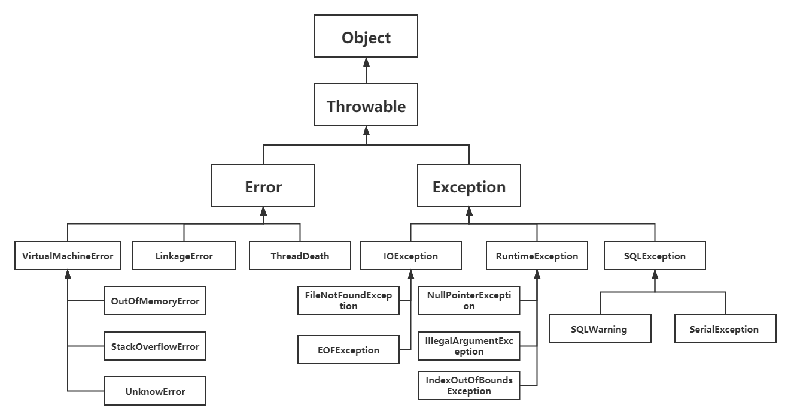

# 七、异常

Java异常是一个描述在代码段中发生异常的对象，当发生异常情况时，一个代表该异常的对象被创建并且在导致该异常的方法中被抛出，而该方法可以选择自己处理异常或者传递该异常。

## Java异常体系的结构

Java内置了一套异常处理机制，总是使用异常来表示错误。

异常是一种 `class`，因此它本身带有类型信息，并定义了一个基类 `java.lang.Throwable` 作为所有异常的超类，可以表示任何可以作为异常抛出的类。

<div align="center">  </div><br>
Java异常分为两类：错误 `Error` 和异常 `Exception`。其中 `Error` 用来表示 JVM 无法处理的错误，`Exception` 分为两种：

-   **受检异常(非运行时异常)**  ：`Exception`中除`RuntimeException`及其子类之外，编译器会检查此类异常，如果出现程序中此类异常，比如说`IOException`，必须使用 `try...catch` 语句进行捕获，或者使用`throws`子句抛出，否则编译无法通过
-   **非受检异常(运行时异常)**  ：`RuntimeException`类及其子类表示JVM在运行期间可能出现的错误。编译器不会检查此类异常，并且不要求处理异常，比如用空值对象的引用（`NullPointerException`）、数组下标越界（`ArrayIndexOutBoundException`）。此类异常属于不可查异常，一般是由程序逻辑错误引起的，在程序中可以选择捕获处理，也可以不处理。

## Java异常处理机制

Java的异常处理本质上是抛出异常和捕获异常。

**抛出异常**：当发生错误时，使用`throw`用来抛出一个异常对象。

```java
if (string == null) {
	throw new NullPointerException();
}
```

**捕获异常**：在Java中，凡是可能抛出异常的语句，都可以用 `try...catch`捕获，把可能发生异常的语句放在`try {...}` 中，然后使用`catch`捕获对应的`Exception`及其子类。

```java
try {
	// code-that might generate exceptions
} catch (Exception ex) {
	// the code of handling exception1
} catch (Throwable t) {
	// the code of handling exception2
}
```

## 自定义异常

使用Java内置的异常类可以描述在编程时出现的大部分异常情况。除此之外，用户还可以自定义异常。用户自定义异常类，只需要继承`Exception`或者`RuntimeException`等子类即可。

在程序中使用自定义异常类，大体可分为以下几个步骤：

- 创建自定义异常类。
- 在方法中通过 `throw` 关键字抛出异常对象。
- 如果在当前抛出异常的方法中处理异常，可以使用 `try...catch` 语句捕获并处理，否则在方法的声明处通过 `throws` 关键字指明要抛出给方法调用者的异常，继续进行下一步操作。
- 在出现异常方法的调用者中捕获并处理异常。

举例自定义异常：

```java
class MyException extends Exception {
	private int detail;
	MyException(int a) {
		detail = a;
	}
	public String toString() {
		return "MyException [" + detail + "]";
	}
}
public class TestMyException {
	static void compute(int a) throws MyException{
        System.out.println("Called compute(" + a + ")");
        if(a > 10){
            throw new MyException(a);
        }
        System.out.println("Normal exit!");
    }
    public static void main(String [] args){
        try{
            compute(1);
            compute(20);
        }catch(MyException me){
            System.out.println("Caught " + me);
        }
    }
}
```

该例子完全按照上述步骤。

```shell
D:\java>java TestMyException
Called compute(1)

Normal exit!

Called compute(20)

Caught MyException [20]
```


