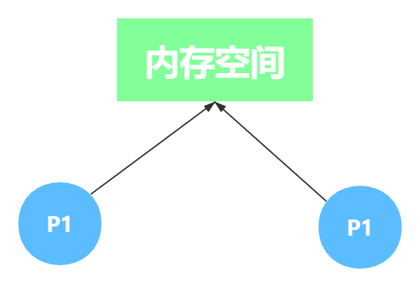
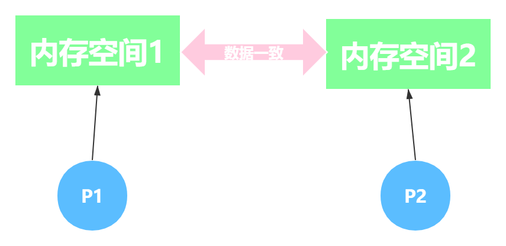

Java 是一门典型的面向对象语言，提供 `extends` 关键字使子类继承父类。

```java
public class Student extends Person {
    ...
}
```

但是创建 `Person` 类时不用使用 `extends` 继承 `Object`类。

```java
public class Person extends Object {
    ...
}
```

因为，创建的类没有明确指明继承关系时，会在编译时自动继承 `Object` 类。可以使用 `Object` 类型的变量引用任何类型的实例：

```java
Object sample = new Student(1001, "小咖", 20, "男");
```

也可以将任意的 `Object` 实例转换为需要的类型：

```java
Person p = (Person) sample;
```

上面两个例子在编译器中是不会报错的。因此，`Object` 类是 `Person` 类的父类，每个类都是由 `Object` 扩展而来的。所以，熟悉 `Object` 类中提供的服务是十分重要的。

Java 中的基本类型不是对象，但也提供了相应的包装类型，如 `int` 基本类型对应 `Integer` 包装类型。但使用基本类型创建的数组是扩展自 `Object` 类，实际上是引用。

```java
Object sample = new int[10];
```

其实，所有的数组类型都是扩展了 `Object` 类。

下表为 `Object` 类的通用方法。

|方法|描述|异常|
|:---|:---|:---|
|`final native Class<?> getClass()`| 返回对象的运行时类| 无 |
|`native int hashCode()` | 返回对象的散列码| 无 |
|`boolean equals(Object obj)`| 与其它对象是否相等 | 无 |
|`native Object clone()` | 克隆并返回对象的副本 | `CloneNotSupportedException` |
|`String toString()`|返回对象的字符串表示| 无 |
|`final native void notify()`|唤醒正在等待对象监听器上的一个线程| 无 |
|`final native void notifyAll()`|唤醒正在等待对象监听器上的所有线程| 无 |
|`final native void wait()`|导致当前线程等待，直到另一个线程调用此对象的`notify()`或`notifyAll()`| `InterruptedException` |
|`final native void wait(long timeout)`|导致当前线程等待，直到另一个线程调用此对象的`notify()`或`notifyAll()`，或者指定时间已到| `InterruptedException` |
|`final void wait(long timeout, int nanos)`| 导致当前线程等待，直到另一个线程调用此对象的`notify()`或`notifyAll()`，或者指定时间已到|`InterruptedException`|
|`void finalize()`| 当GC确定不再有对该对象的引用时，由对象的 GC 调用此方法 | `Throwable` |


### equals()

`Object` 类提供了 `equals()` 方法用于检测对象是否相等。其实现相等性要满足五个条件：

1. 自反性。 对于任何的非空引用都需满足 `x.equals(x) == true`。
2. 对称性。 对于任何引用都满足 `x.equals(y) == y.equals(x)`。
3. 传递性。 对于任何引用都满足 `(x.equals(y) && y.equals(z)) == x.equals(z)`。
4. 一致性。 对于不发生任何变化的引用都满足 `x.equals(y) == x.equals(y)`，多次调用 `equals()` 方法结果不变。
5. 与 `null` 的比较。`x.equals(null)` 返回 `false`。对任何不是 `null` 的对象调用 `equals()` 方法与 `null` 比较的结果都为 `false`。

引用类型最好使用 `equals()` 方法比较；而基本类型使用 `==` 比较。

其中，子类中定义 `equals()` 方法时，需先比较超类的 `equals()`。如果检测失败，对象就不可能相等。如果超类中的域都相等，就需要比较子类中的实例域。

下面可以从两个截然不同的情况看一下这个问题：

- 如果子类能够拥有自己的相等概念，则对称性需求将强制采用 getClass 进行检测。
- 如果由超类决定相等的概念，那么就可以使用 instanceof 进行检测，这样可以在不同子类的对象之间进行相同的比较。

对象中使用 `equals()` 方法比较需要实现的步骤如下：

1. 检查是否为同一个引用，如果是直接返回 `true`。
2. 检测传入的值是否为 `null`，如果是直接返回 `false`。
3. 检测是否属于同一个类型。如果不是直接返回 `false`。
4. 将 `Object` 对象类型转为要比较的类型。
5. 比较每个关键域是否相等。

```java
public boolean equals(Object o) {
    if (this == o) return true;
    if (o == null || getClass() != o.getClass()) return false;
    Person person = (Person) o; 
    return Objects.equals(name, person.name) 
            && Objects.equals(sex, person.sex)
            && (age != person.age);
}
```

如果子类重新定义 `equals`，就要在其中包含 `super.equals(other)`。

### hasCode()

`hashCode()` 返回的是整数值，是无规律的散列码。`hashCode()` 定义在了 `Object` 类中，每个类都可以使用 `hashCode()`方法调用自身散列码，其值为对象的存储地址。 

```java
Object sample = new Student(1001, "小咖", 20, "男");
System.out.println(sample); // [I@5b464ce8
```

**如果你在创建的类中覆盖了 `equals()` 方法，就必须覆盖 `hashCode()` 方法** 。这是 `hashCode()` 的通用约定。下面是覆盖 `hashCode()` 方法的约定：

- 程序执行期间，对象的 `equals()` 方法中比较的信息不变，同一个对象的 `hashCode()` 方法的返回值也不变。两个程序的执行期间，`hashCode()` 方法返回的值可以不一致。
- 如果两个对象根据 `equals(Object)` 方法比较相等，那 `hashCode()` 方法的返回值也必须相等。
- 如果两个对象根据 `equals(Object)` 方法比较不相等，那 `hashCode()` 方法的返回值最好不相等。如果相等，会在使用 `Map` 时造成散列码冲突。

总结就是两个对象相等，其散列码一定相同；但是散列码相同的两个对象并不一定相等。因为计算散列码具有随机性，两个值不同的对象可能计算出相同的散列码。

理想的散列函数是把集合中不相等的实例均匀地分布到所有可能的 `int` 之上。但非常困难，只能实现相对接近这种理想的情形。

当计算散列码时，要将每个域都考虑进去。可以将每个域都当成 R 进制的某一位，然后组成一个 R 进制的整数。

R 一般取奇数 31，偶数会出现乘法溢出，信息会丢失。因为与 2 相乘相当于向左移一位，最左边的位丢失。并且一个数与 31 相乘可以转换成移位和减法：`31*x == (x<<5)-x`，编译器会自动进行这个优化。

如下是一个如何简单的计算散列码的参考：

- 基本类型调用 `Type.hashCode(value)` 来生成。`Type` 类型为基本类型各自的包装类。
- 如果是引用类型，并且需要覆盖 `equals()` 方法，`equals()` 方法使用哪些域比较，`hashCode()` 方法也会递归地调用这些域的散列码并计算。
- 如果是数组类型，那数组中的每个值都当做单独的域来处理。也可以使用 `Arrays.hashCode()` 方法计算。

**不要试图从散列码计算中排除掉一个对象的关键域来提高性能**。

下面重写 `Student` 类的 `hashCode()` 方法：

```java
@Override
public int hashCode() {
    int result = super.hashCode();
    result = 31 * result + sid;
    return result;
}
```

`hashCode()` 方法返回的散列码也可以是负数，合理地组合实例域的散列码，以便能够让各个不同的对象产生的散列码更加均匀。


### toString()

默认的 `toString()` 方法是返回的是 `java.lang.Object@511baa65` 这种类型是的字符串。

```java
Student sample = new Student(1001, "小咖", 20, "男");
System.out.println(sample); // java.lang.Object@511baa65
```

上面 `System.out.println(sample)` 会自动调用 `sample.toString()` 方法将值输出到控制台。但是，提供好的 `toString()` 实现可以获取对象状态的必要信息，也易于调试。因此建议为每个自定义的类覆盖 `toString()` 方法。

下面重写 `Student` 类的 `toString()` 方法：

```java
@Override
public String toString() {
    return getClass().getName() 
            + "{ sid=" + sid
            + ", name=" + super.getName()
            + ", age=" + super.getAge()
            + ", sex=" + super.getSex()
            + " }";
}
```

如果父类 `Person` 也重写类 `toString()` 方法：

```java
@Override
public String toString() {
    return getClass().getName() + 
            "{" + '\'' +
            "name='" + name + '\'' +
            ", age=" + age +
            ", sex='" + sex + '\'' +
            '}';
    }
```

并且子类的 `toString()` 也可以调用：

```java
@Override
public String toString() {
    return super.toString() + "{sid = " + sid + "}";
}
// xxx.Student{'name='小咖', age=20, sex='男'}{sid = 1001}
```


### clone()

`Object` 类提供了 `clone()` 方法用于克隆实例，但因为是 `protected` 修饰符所修饰的方法，因此不会显示地覆盖 `clone()` 。实现 `Cloneable` 接口的类可以覆盖 `clone()` 方法提供克隆。如果不实现，会抛出 `CloneNotSupportedException` 异常。正确的写法如下所示：

```java
public class Person implements Cloneable {
    private String name;
    private int age;
    private String sex;
    private String[] address;
    public Person(String name, int age, String sex) {
        this.name = name;
        this.age = age;
        this.sex = sex;
    }
    
    ...省略getter与setter...

    @Override
    protected Person clone() throws CloneNotSupportedException {
        return (Person) super.clone();
    }
}
```

Java 支持协变返回类型，也就是覆盖方法的返回类型可以是被覆盖方法的返回类型的子类。并且在 `clone()` 方法中调用 `super.clone()` 方法得到功能完整的克隆对象。

当使用 `Person` 创建对象并调用 `clone()` 方法克隆。

```java
Person s1 = new Person("小卡", 22, "男");
s1.setAddress(new String[] {"浙江省", "江苏省", "湖南省"});
Person s2 = sample.clone();
System.out.println(s1.hashCode()); // 873415566
System.out.println(s2.hashCode()); // 818403870
System.out.println(s1 == s2); // false
System.out.println(s1.getAddress() == s2.getAddress()); // true
```

从上面的代码中得出，调用 `clone()` 方法获得的对象是个新的对象，但是对象中的引用还是原来的引用，而不是新引用。这次的克隆被称为 **浅拷贝**。



使用 `clone()` 方法与通过构造器创建对象实际上是一样的，要确保不会伤害到原始的对象，并确保正确地创建被克隆的对象中的约束条件。这次的克隆被称为 **深拷贝**。



因此，在 `Person` 类的内部，`address` 数组也要递归地调用 `clone()` 方法：

```java
@Override
protected Person clone() throws CloneNotSupportedException {
    Person result = (Person) super.clone();
    result.address = address.clone();
    return result;
}
```

记住，`Cloneable` 与引用可变对象的 `final` 域的正常用法是不兼容的。因此，实现 `clone()` 方法禁止给 `final` 赋新值。

上述的拷贝方式比较复杂。可以在类中提供一个拷贝构造器或拷贝工厂来实现克隆的替代功能。

```java
public Person(Person value) {...}
public static Person newInstance(Person value) {...}
```

### finalize()

当 GC 确定不再有对该对象的引用时，GC 会调用对象的 `finalize()` 方法来清除回收。

```java
protected void finalize() throws Throwable { }
```

因此，子类可以通过覆盖此方法处理一些额外的清理工作。 但是，`finalize()` 方法何时被调用取决于 Java VM，而且不保证 `finalize()` 方法会被及时地执行 。因此，不要依赖 `finalize()` 方法来更新重要的持久状态。

Java VM 会确保一个对象的 `finalize()` 方法只被调用一次，而且程序中不能直接调用 `finalize()` 方法。

`finalize()` 方法通常也不可预测，而且很危险，一般情况下，不必要覆盖 `finalize()` 方法。

### wait 与 notify

`Object` 对象提供了 `wait()` 和 `notify()` 方法，这两个方法的使用是相对的：

- `wait()`：线程进入等待状态。
- `notify()`：唤醒等待该对象的线程。

使用 `wait()` 方法必须在同步区域内部调用，这个同步区域将对象锁定在调用 `wait()` 方法的对象上。下面是使用 `wait()` 方法的标准模式：

```java
synchronized (obj) {
    while (<condition does not hold>) {
        obj.wait();
    }
}
```

这时的 `obj` 对象所在线程会处于等待状态，需要使用 `notify()` 方法唤醒 `obj` 所在线程。

```java
synchronized (obj) {
    obj.notify();
}
```

最好使用 `notifyAll()` 方法唤醒线程。因为总会产生正确的结果，保证会唤醒所有需要被唤醒的线程。虽然也会唤醒其他线程，但不影响程序的正确性，而且 `notifyAll()` 方法代替 `notify()` 方法可以避免来自不相关线程的意外或恶意的等待。

<small>注意：必须使用 `synchronized`，否则会报 `IllegalMonitorStateException` 异常。</small>

## 总结

这里对 `Object` 类做了一个简单的了解，知道 `Object`类是一切类的基类，可以引用一切的引用类型，包括数组类型。且 `Object` 中提供的方法需要在适合的场景下覆盖得到最佳的结果，最好始终都覆盖 `toString()` 方法。