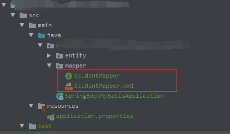
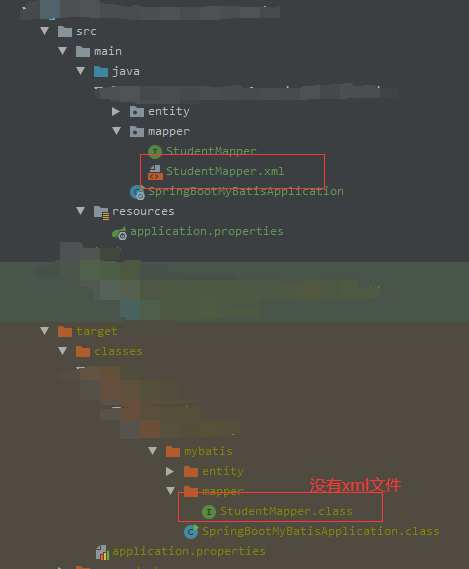
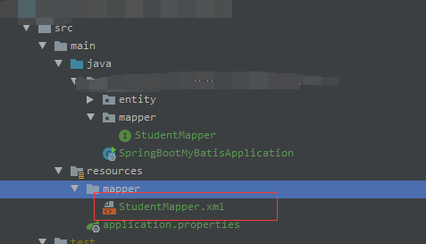

# 前言

MyBatis是常用的开源持久层框架，MyBatis简化了Java应用程序中对数据库的访问，实现了诸如动态SQL，结果集映射等，高效又不失灵活。

下面简单介绍下在 `spring-boot` 项目中整合`mybatis` 的过程。

# 项目

## 数据库

执行 `student.sql` 创建此表：

```sql
CREATE TABLE `student` (
  `sid` INT(11) PRIMARY KEY AUTO_INCREMENT 	COMMENT '学号',
  `sname` VARCHAR(20) 											COMMENT '姓名',
  `sex` VARCHAR(10) 												COMMENT '性别',
  `age` DATETIME 														COMMENT '年龄',
  `phone` VARCHAR(20) 											COMMENT '手机号码',
  `enrollment_time` TIMESTAMP       				COMMENT '入学时间'
) ENGINE=INNODB AUTO_INCREMENT=2020100001 DEFAULT CHARSET=utf8mb4;
```

## 引入 MyBatis

创建 Maven 项目并在 `pom.xml` 中引入 `mybatis-spring-boot-starter` 依赖：

```xml
<dependencies>
    <dependency>
        <groupId>org.mybatis.spring.boot</groupId>
        <artifactId>mybatis-spring-boot-starter</artifactId>
        <version>2.1.3</version>
    </dependency>
    <dependency>
        <groupId>mysql</groupId>
        <artifactId>mysql-connector-java</artifactId>
    </dependency>
    <dependency>
        <groupId>org.springframework.boot</groupId>
        <artifactId>spring-boot-starter-test</artifactId>
        <scope>test</scope>
    </dependency>
</dependencies>
```

## 配置数据库连接属性

在 `src/main/resources` 目录下创建 `application.properties` 文件并添加以下内容：

```properties
spring.datasource.driver-class-name=com.mysql.cj.jdbc.Driver
spring.datasource.url=jdbc:mysql://127.0.0.1:3306/xxxx?serverTimezone=Asia/Shanghai&useUnicode=true&characterEncoding=UTF-8&zeroDateTimeBehavior=convertToNull&useSSL=false
spring.datasource.username=xxxx
spring.datasource.password=xxxx
```

## 编写Java模型类

按照以下代码创建 `Student` 类：

```java
public class Student {
    /** 学号 */
    private Long sid;
    /** 学生姓名 */
    private String name;
    /** 性别 */
    private String sex;
    /** 年龄 */
    private LocalDateTime age;
    /** 手机号码 */
    private Long phone;
    /** 入学时间 */
    private LocalDateTime enrollmentTime;
    ...getter与setter...
}
```

## 创建数据访问层

创建 `StudentMapper` 接口：

```java
@Repository
@Mapper
public interface StudentMapper {
}
```

接口创建好后，我们需要创建 `StudentMapper.xml` 文件：

```xml
<?xml version="1.0" encoding="UTF-8"?>
<!DOCTYPE mapper
        PUBLIC "-//mybatis.org//DTD Mapper 3.0//EN"
        "http://mybatis.org/dtd/mybatis-3-mapper.dtd">

<mapper namespace="me.hireny.tutorial.springboot.mybatis.mapper.StudentMapper">
</mapper>
```

注意：接口创建好后，还需要配置 `mapper` 注解扫描，有两种方式，一种直接在接口上添加 `@Mapper` 注解，这种方式是所有 `Mapper` 接口都要手动添加，另一种就是直接在启动类上添加 `@MapperScan` 注解。如下所示：

```java
@SpringBootApplication
@MapperScan(basePackages = "xxx.mapper")
public class Application {
    public static void main(String[] args) {
        SpringApplication.run(Application.class, args);
    }
}
```

查看一下目录结构：



# Mapper

好了，所有的准备工作已经完成，现在可以开始使用`MyBatis`实现数据访问。

## INSERT

项目搭建完成后，我们在`StudentMapper`类中实现插入`SQL`的方法：

```java
int addStudent(Student student);
```

在 `StudentMapper.xml` 中对应如下：

```xml
<insert id="addStudent">
    INSERT INTO STUDENT (name, sex, age, phone, enrollment_time) VALUES (#{name},#{sex},#{age},#{phone},#{enrollmentTime});
</insert>
```

有时需要获取插入时数据库的自增`Key`。`MyBatis`的实现如下：

```java
int addStudentAndBackKey(Student student);
```

在 `StudentMapper.xml` 中对应如下：

```xml
<insert id="addStudentAndBackKey" useGeneratedKeys="true" keyProperty="sid" keyColumn="sid">
    INSERT INTO STUDENT (name, sex, age, phone, enrollment_time) VALUES (#{name},#{sex},#{age},#{phone},#{enrollmentTime});
</insert>
```

在`insert` 标签中有比上面添加方法多了三个参数：

- `useGeneratedKeys`：表示是否自动生成主键，默认 `false`。
- `keyProperty`：表示返回的主键赋值给哪个属性。
- `keyColumn`：表示数据库中的自增主键的列名，默认是数据库表的第一列。当主键列不是表中的第一列的时候需要设置，PostgreSQL 必须设置。

主键自动生成，取决于数据库是否支持自增主键。实际上当设置了 `useGeneratedKeys=true`时，MyBatis会调用 Jdbc 的 `getGeneratedKeys` 方法，并将获取的主键赋值给`keyProperty`指定的属性。

## DELETE

接着，实现删除`SQL`：

```java
int deleteStudent(Student student);
```

在 `StudentMapper.xml` 中对应如下：

```xml
<delete id="deleteStudent">
    DELETE FROM STUDENT WHERE sid=#{sid};
</delete>
```

## UPDATE

最后，实现更改`SQL`：

```java
int updateStudent(Student student);
```

在 `StudentMapper.xml` 中对应如下：

```xml
<update id="updateStudent">
    UPDATE STUDENT SET name=#{name}, sex=#{sex}, age=#{age}, phone=#{phone} WHERE sid=#{sid};
</update>
```

## SELECT

现在，实现查询`SQL`。先从简单的获取表中行数开始：

```java
int count();
```

在 `StudentMapper.xml` 中对应如下：

```xml
<select id="count" resultType="java.lang.Integer">
    SELECT COUNT(*) FROM STUDENT;
</select>
```

还可以简单的获取数据库中一行的单个列：

```java
String queryStudentName(Long sid);
```

在 `StudentMapper.xml` 中对应如下：

```xml
<select id="queryStudentName" resultType="java.lang.String">
    SELECT name FROM STUDENT WHERE sid=#{sid};
</select>
```

但我们不止要一个列的数据，如果想要更多列的数据，就要在`XML`中匹配的标签中的参数`resultType`添加对应数据库中每个列的实体对象：

```java
Student queryStudent(Long sid);
```

在 `StudentMapper.xml` 中对应如下：

```xml
<select id="queryStudent" resultType="xxx.entity.Student">
    SELECT sid, name, sex, age, phone, enrollment_time FROM STUDENT WHERE sid=#{sid}
</select>
```

想要获取学生信息的集合，在`XML`文件中与上述几乎差不多，只是在接口中将返回值改为`List`类型：

```java
List<Student> queryStudents();
```

在 `StudentMapper.xml` 中对应如下：

```xml
<select id="queryStudents" resultType="xxx.entity.Student">
    SELECT sid, name, sex, age, phone, enrollment_time FROM STUDENT;
</select>
```

基本功能已经完成，但是当我们运行程序并使用这些方法时，Maven会将Java目录下的`xml`资源在项目打包时忽略掉。



如果想将 `StudentMapper.xml` 放在`mapper`包下，就需要在 `pom.xml` 文件中添加一些防止打包时Java目录下的`XML`文件被自动忽略的配置：

```xml
<build>
    <resources>
        <resource>
            <directory>src/main/java</directory>
            <includes>
                <include>**/*.xml</include>
            </includes>
        </resource>
        <resource>
            <directory>src/main/resources</directory>
        </resource>
    </resources>
</build>
```

`StudentMapper.xml` 文件也可以直接放在 `resources` 目录下，这样打包时就不会被忽略了，但还需要在 `properties` 中添加额外的配置信息，才能被扫描上，因此我们将`StudentMapper.xml`文件放在`resources/mapper`文件夹中并配置如下信息：

```properties
mybatis.mapper-locations = classpath:mapper/*.xml
```




## 注解方式

`MyBatis`还提供了全注解的方式来写`SQL`。`@Insert`、`@Delete`、`@Update`和`@Select`四个注解来实现增删改查。在使用`@Insert`查询时，可以使用`@SelectKey`或`@Options`注解来实现主键回填的功能。

```java
@Repository
@Mapper
public interface StudentMapper {

    @Insert({"INSERT INTO STUDENT (name, sex, age, phone, enrollment_time) VALUES (#{name},#{sex},#{age},#{phone},#{enrollmentTime})"})
    int addStudent(Student student);

    // 这里获取自增主键，对应XML配置中的主键回填
    @Options(useGeneratedKeys = true, keyProperty = "sid")
    @Insert({"INSERT INTO STUDENT (name, sex, age, phone, enrollment_time) VALUES (#{name},#{sex},#{age},#{phone},#{enrollmentTime});"})
    int addStudentAndBackKey(Student student);
    
    // 这里是返回最近一次插入的id
    @SelectKey(statement = "SELECT last_insert_id()", keyProperty = "sid", before = false, resultType = Long.class, keyColumn = "sid")
    @Insert({"INSERT INTO STUDENT (name, sex, age, phone, enrollment_time) VALUES (#{name},#{sex},#{age},#{phone},#{enrollmentTime});"})
    int addStudentAndBackKey2(Student student);

    @Update({"UPDATE STUDENT SET name=#{name}, sex=#{sex}, age=#{age}, phone=#{phone} WHERE sid=#{sid};"})
    int updateStudent(Student student);

    @Delete({"DELETE FROM STUDENT WHERE sid=#{sid};"})
    int deleteStudent(Student student);

    @Select({"SELECT COUNT(*) FROM STUDENT;"})
    int count();

    @Select({"SELECT name FROM STUDENT WHERE sid=#{sid};"})
    String queryStudentName(Long sid);

    @Select({"SELECT sid, name, sex, age, phone, enrollment_time FROM STUDENT WHERE sid=#{sid};"})
    Student queryStudent(Long sid);

    @Select({"SELECT sid, name, sex, age, phone, enrollment_time FROM STUDENT;"})
    List<Student> queryStudents();
}
```

# 总结

本文简单的介绍了 `mybatis-spring-boot-starter` 依赖的引入和使用，`MyBatis`提供了配置`XML`文件和注解两种`SQL`编写的方式，注解方式编写比较方便，能够快速编写映射语句，但也只适合比较简单的语句，太复杂的语句像动态SQL就不行了。

> 本文使用的 `Spring Boot` 版本为 `2.2.1.RELEASE` ，`mysql-connector-java`版本为`8.0.18`。