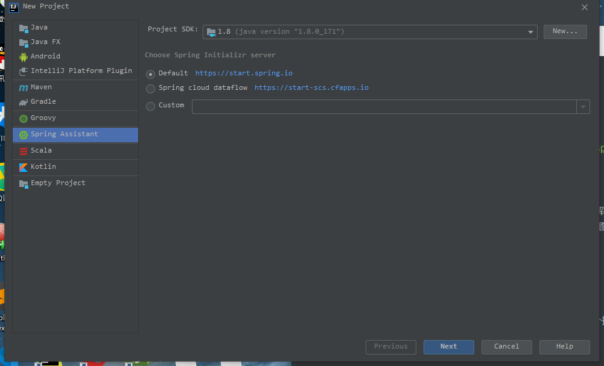
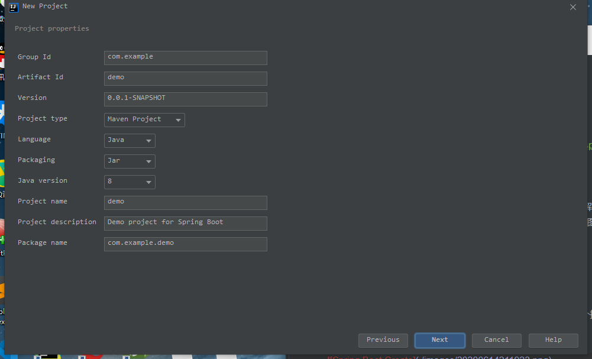

# 前言

Spring Boot是对于Spring Framework框架进行封装，实现简化Spring Framework框架搭建应用和开发的目的。中心思想是实现 "约定大于依赖"。

# 创建

Spring Boot创建的方式有几种，下面我们来介绍一下这几种创建的方式。

### 第一种

我们可以使用Spring提供的网页 [https://start.spring.io/](https://start.spring.io/) 在线创建。


这里我们选择对应的信息之后，点击按钮会下载一个压缩包，解压后可以使用 idea 等编译器导入，导入后会 idea 会自动编译项目并下载相应的依赖，项目如图所示：


### 第二种

如果你的编译器是 idea 的话，Community 版的可以先安装一个插件 Spring Assistant，而之后使用该插件创建一个 Spring Boot 项目：



当点击`Next`之后，会弹出填写程序配置，让我们将工程的一些信息填写上去：



在之后，我们就要选择项目依赖与项目版本，因为是入门的工程，只要选择 `Web` 中的 `Web` 依赖项即可。


在点击 `Next` 后，我们就可以将工程创建出来了。

### 第三种

这种情况就是正常的创建一个 maven 项目或者 gradle 项目：


这里填写工程的信息与本地存储：


创建之后，我们在 `pom.xml` 文件中填写如下配置：

```xml
<dependencyManagement>
	<dependencies>
		<dependency>
			<groupId>org.springframework.boot</groupId>
			<artifactId>spring-boot-dependencies</artifactId>
			<version>2.3.1.RELEASE</version>
			<type>pom</type>
			<scope>import</scope>
		</dependency>
	</dependencies>
</dependencyManagement>

<dependencies>
	<dependency>
		<groupId>org.springframework.boot</groupId>
		<artifactId>spring-boot-starter-web</artifactId>
	</dependency>
</dependencies>

<build>
	<plugins>
		<plugin>
			<groupId>org.springframework.boot</groupId>
			<artifactId>spring-boot-maven-plugin</artifactId>
		</plugin>
	</plugins>
</build>
```

上面的 `<dependencyManagement>`与其内信息可以使用下述信息代替：

```xml
<parent>
	<artifactId>org.springframework.boot</artifactId>
	<groupId>spring-boot-starter-parent</groupId>
	<version>2.3.1.RELEASE</version>
</parent>
```

添加之后再在 Java 目录下创建启动项

```java
@SpringBootApplication
public class SpringBootHelloApplication {
    public static void main(String[] args) {
        SpringApplication.run(SpringBootHelloApplication.class, args);
    }
}
```

上述的创建方式是Spring Boot的创建方式，创建就到这里了。


# 演示

既然我们已经创建完成，那么就运行一下试试。


可以在控制台看出已经成功运行，并且 `Tomcat` 初始化的端口号为 `8080`。


但是在 `Chrome` 中访问 `http://localhost:8080/hello` 是错误的。

这是因为我们还没有在项目中添加接口，现在，我们在入口类中添加一个 `/hello` 接口。

```java
@SpringBootApplication
@RestController
public class SpringBootHelloApplication {
    public static void main(String[] args) {
        SpringApplication.run(SpringBootHelloApplication.class, args);
    }
    @RequestMapping("/hello")
    public String hello() {
        return "Hello, My First Spring Boot";
    }
}
```
添加接口之后，我们在运行该工程，但出现如下信息时，就证明启动成功。


因此我们可以再次访问 `/hello` 接口时，它就能成功在页面上显示 `Hello, My First Spring Boot`。


显示完全正确，这样我们就搭建了一个简单的Web项目。

# 结尾

到此一个非常简单的小例子，教会了我们如何快速上手Spring Boot，该框架是将Spring Framework框架的复杂配置进行简化，让我们体会到了简洁优雅的Java开发。

> 本文使用的 `Spring Boot` 版本是 `2.3.1.RELEASE`。