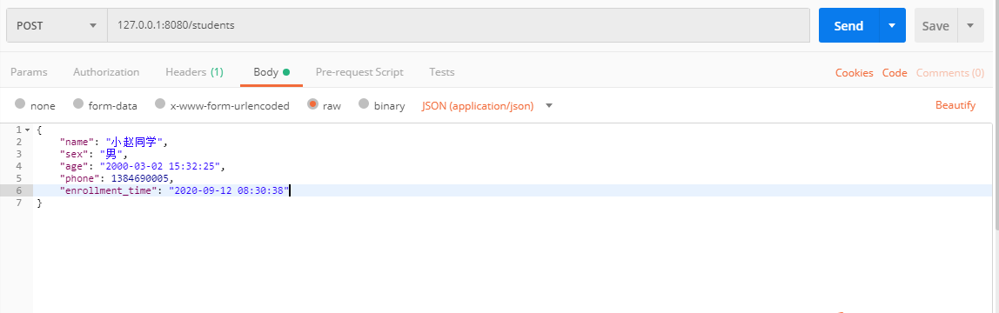
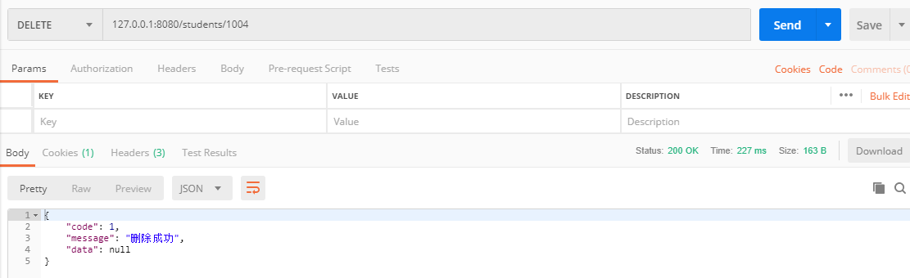
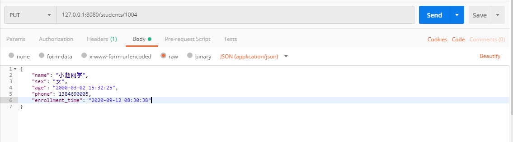
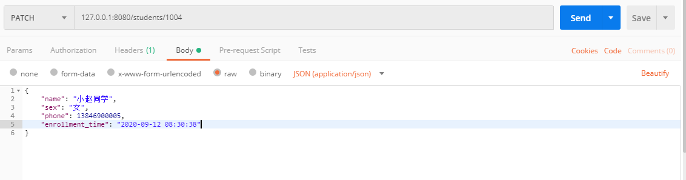
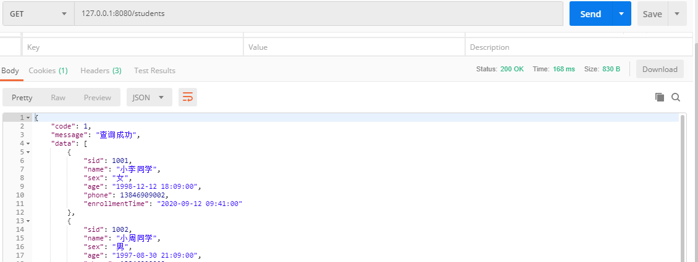
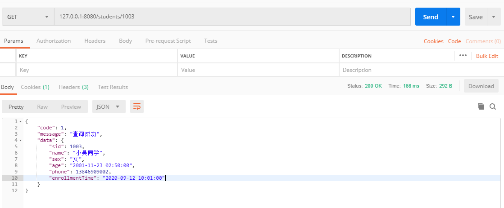
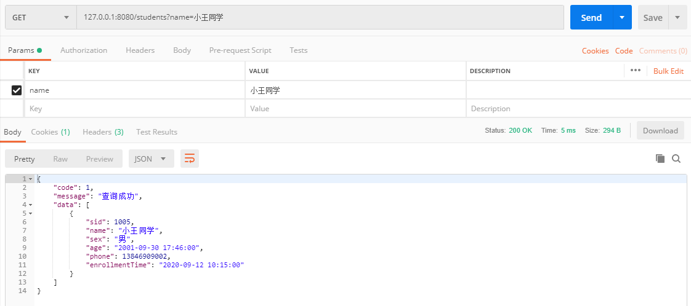

REST 是一种软件架构风格、设计风格，提供一组设计原则和约束条件，是目前较流行的 API 设计规范，用于 Web 数据接口的设计。利用 HTTP 协议通过 GET、POST、PUT、PATCH、DELETE操作具有URI标识的服务器资源，可扩展性强，结构清晰。

# 设计REST

REST本身只是一种设计风格，每一个 URI 是一个资源，表示一种实体，所以设计时使用名词而不是动词，如`/students/{id}`而不是`/getStudent/{id}`。如果某些动作是HTTP动词表示不了的，就应该把动作做成一种资源。比如网上汇款，从账户1向账户2汇款500元：

```http
POST /accounts/1/transfer/500/to/2		// 错误 URI
```

正确的写法是把动词 transfer 改成名词 transaction，资源不能是动词，但是可以是一种服务：

```http
POST /transaction?from=1&to=2&amount=500.00
```

在 URI 的查询部分可以使用 `&` 符号分隔参数，避免出现`.jsp`等扩展文件名。下面看一下构建URI的例子：

|URL|HTTP方法|含义|
|:---:|:---:|:---:|
|/students/|GET|获取全部学生信息|
|/students/{id}|GET|根据id获取某一学生信息|
|/students/|POST|添加新的学生信息|
|/students/{id}/|PUT|根据id修改某一学生信息，客户端提供全部信息|
|/students/{id}|PATCH|根据id修改某一学生中一项信息，客户端提供改变的属性|
|/students/{id}/|DELETE|根据id删除某一学生信息|

下面使用Spring Boot实现一套符合规范，并且具有RESTful风格的APi接口。

# 项目创建

首先创建Maven项目并在`pom.xml`中引入`spring-boot-starter-web`模块：

```xml
<dependencies>
    <dependency>
        <groupId>org.springframework.boot</groupId>
        <artifactId>spring-boot-starter-web</artifactId>
    </dependency>
    <dependency>
        <groupId>org.springframework.boot</groupId>
        <artifactId>spring-boot-starter-test</artifactId>
        <scope>test</scope>
    </dependency>
</dependencies>
```

然后我们需要编写`Student`模型类：

```java
public class Student {
    // 学号
    private Long sid;
    //学生姓名
    private String name;
    //性别
    private String sex;
    //年龄
    @JsonFormat(pattern = "yyyy-MM-dd HH:mm:ss")
    private LocalDateTime age;
    //手机号码
    private Long phone;
    //入学时间
    @JsonFormat(pattern = "yyyy-MM-dd HH:mm:ss")
    @JsonAlias(value = "enrollment_time")
    private LocalDateTime enrollmentTime;
    ...省略Getter和Setter...
}
```

在接口响应请求时，我们自行定义一个规范的数据交互结构：

```java
public class ResponseResult {
    
    private Integer code;
    private String message;
    private Object data;

    public ResponseResult(Integer code, 
                          String message, 
                          Object data) {
        this.code = code;
        this.message = message;
        this.data = data;
    }
    ...省略Getter和Setter...
}
```

创建`StudentController`控制层类：

```java
@RestController
public class StudentController {
}
```

我们创建一个 `students` 的 `List` 属性模拟数据库中数据：

```java
private static List<Student> students = students();
private static List<Student> students() {
    Student s1 = new Student(), s2 = new Student(), s3 = new Student(), s4 = new Student, s5 = new Student;
    ...省略数据添加...
    List<Student> students = new ArrayList<>();
    Collections.addAll(students, s1, s2, s3, s4, s5);
    return students;
}
```

# 使用 RESTful

该需要的代码都设置完之后，我们就可以根据上面的设计规则，使用 RESTful 架构设计 API 接口。

**POST**

我们先在`StudentController`控制层中实现一个`HTTP`的`POST`方法，添加一个学生信息：

```java
@RestController
public class StudentController {
    ...省略...
    @PostMapping(value = "/students", produces = "application/json")
    public ResponseResult add(@RequestBody Student student) {
        insert(student);
        return new ResponseResult(1, "添加成功", null);
    }
    ...省略...
}
```



在这里我们使用 `insert()` 方法模拟业务层添加学生数据方法：

```java
private void insert(Student s) {
    s.setSid(1006L);
    students.add(s);
}
```

而平常往数据库中插入数据时，数据会自动生成主键。

**DELETE**

在 `StudentController` 控制层中实现一个`HTTP`的`DELETE`方法，根据id删除一个学生信息：

```java
@RestController
public class StudentController {
    ...省略...
    @DeleteMapping(value = "/students/{id}")
    public ResponseResult del(@PathVariable Long id) {
        delete(id);
        return new ResponseResult(1, "删除成功", null);
    }
    ...省略...
}
```



在这里我们使用 `delete(Long id)` 方法模拟业务层删除学生信息的方法：

```java
private void delete(Long id) {
    students = students.stream().filter(s -> !id.equals(s.getSid())).collect(Collectors.toList());
}
```

**PUT**

在 `StudentController` 控制层中实现一个`HTTP`的`PUT`方法，根据id修改学生信息：

```java
@RestController
public class StudentController {
    ...省略...
    @PutMapping(value = "/students/{id}", produces = "application/json")
    public ResponseResult modify(@PathVariable Long id, @RequestBody Student s) {
        update(id, s);
        return new ResponseResult(1, "修改成功", null);
    }
    ...省略...
}
```



在这里我们使用`update(Long id, Student s)`方法模拟业务层修改学生信息的方法：

```java
private void update(Long id, Student s) {
    students.forEach(s1 -> {
        if (id.equals(s1.getSid())) {
            s1.setName(s.getName());
            s1.setAge(s.getAge());
            s1.setSex(s.getSex());
            s1.setPhone(s.getPhone());
            s1.setEnrollmentTime(s.getEnrollmentTime());
        }
    });
}
```

**PATCH**

在 `StudentController` 控制层中实现一个`HTTP`的`PATCH`方法，根据id修改学生某一项信息：

```java
@RestController
public class StudentController {
    ...省略...
    @PatchMapping(value = "/students/{id}", produces = "application/json")
    public ResponseResult modifyPortion(@PathVariable Long id, @RequestBody Student s) {
        updatePortion(id, s);
        return new ResponseResult(1, "修改成功", null);
    }
    ...省略...
}
```



在这里我们使用`updatePortion(Long id, Student s)`方法模拟业务层修改学生信息的方法：

```java
private void updatePortion(Long id, Student s) {
    Student exist = students.stream().filter(s1 -> id.equals(s1.getSid())).findFirst().orElse(null);
    BeanWrapper beanWrapper = new BeanWrapperImpl(s);
    PropertyDescriptor[] propertyDescriptors = beanWrapper.getPropertyDescriptors();
    List<String> nullPropertyNames = new ArrayList<>();
    for (PropertyDescriptor pd : propertyDescriptors) {
        if (beanWrapper.getPropertyValue(pd.getName()) == null) {
            nullPropertyNames.add(pd.getName());
        }
    }
    BeanUtils.copyProperties(s, exist, nullPropertyNames.toArray(new String[nullPropertyNames.size()]));
}
```

**GET**

在 `StudentController` 控制层中实现一个`HTTP`的`GET`方法用于查询所有学生信息：

```java
@RestController
public class StudentController {
    ...省略...
    @RequestMapping(value = "/students", method = RequestMethod.GET)
    public ResponseResult query() {
        return new ResponseResult(1, "查询成功", students);
    }
    ...省略...
}
```



在查询单个学生信息的时候，就需要在接口后面添加学生id：

```java
@RestController
public class StudentController {
    ...省略...
    /**
     * 根据id查询学生 
     * id:\\d+ 表示获取的 id 只接受数字
     * @param id
     * @return
     */
    @GetMapping(value = "/students/{id:\\d+}")
    public ResponseResult queryOne(@PathVariable Long id) {
        return new ResponseResult(1, "查询成功", students().stream().filter(s -> id.equals(s.getSid())).findFirst());
    }
    ...省略...
}
```

效果如下：



当查询时，需要搜索特定的学生信息时，需要设置复杂的查询条件，RESTful允许一定的url冗余如 `/students?age=16&sex='男'`，设置`HTTP`的`GET`方法：

```java
@RestController
public class StudentController {
    ...省略...
    @RequestMapping(value = "/students", method = RequestMethod.GET)
    public ResponseResult query(Student student) {
        return new ResponseResult(1, "查询成功", queryStudents(student));
    }
    ...省略...
}
```

效果如下：



我们使用`Student`对象接收`GET`方法中的参数。而在这里，我们将查询学生的业务逻辑封装在了`queryStudents(Student student)`方法中了：

```java
private List<Student> queryStudents(Student student) {
    BeanWrapper beanWrapper = new BeanWrapperImpl(student);
    PropertyDescriptor[] propertyDescriptors = beanWrapper.getPropertyDescriptors();
    List<String> nonNullPropertyNames = new ArrayList<>();
    for (PropertyDescriptor pd : propertyDescriptors) {
        if (beanWrapper.getPropertyValue(pd.getName()) != null && !"class".equals(pd.getName())) {
            nonNullPropertyNames.add(pd.getName());
        }
    }
    return students.stream().filter(s -> {
        BeanWrapper tbw = new BeanWrapperImpl(s);
        for (String e : nonNullPropertyNames) {
            if (beanWrapper.getPropertyValue(e).equals(tbw.getPropertyValue(e))) {
                return true;
            }
        }
        return false;
    }).collect(Collectors.toList());
}
```

查询还可以捎带排序`?sort=age,desc`、投影`?whitelist=id,name,email`或者分页`?limit?10&offset=3`。

# 总结

本文简单的介绍了使用`spring-boot-starter-web`实现 RESTful 风格的 API 接口，通过规范的 API 设计，来统一前后端交换数据格式和改变数据状态。

> 本文使用的 `Spring Boot` 版本为 `2.2.1.RELEASE`。