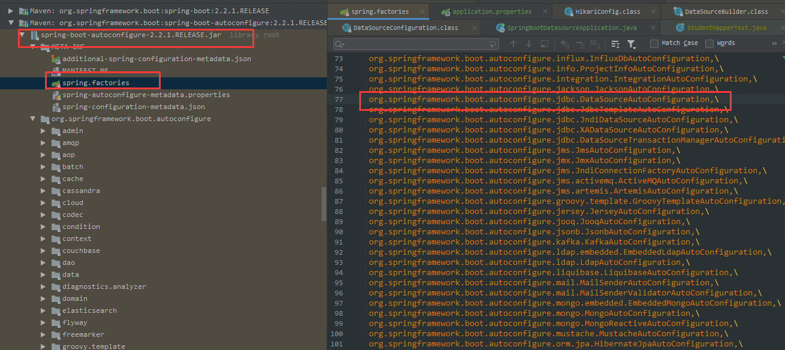

在实际的应用开发中，与数据库交互通常使用数据库连接池来重用Connection对象，减少资源消耗。

Spring Boot 的数据源是自动配置的。在 Spring Boot 2.2.1 版本中，有几种数据源配置可选，它们按照 `HikariCP -> Tomcat -> DBCP2` 优先顺序来选择最后实际使用哪个数据库连接池。

# 配置

在 Spring Boot 的自动化配置中，对于数据源的配置可以分为核心配置和数据源库接池配置。

## 核心配置

核心配置是以 `spring.datasource.*` 形式开始，主要是配置数据库的信息。本文以 `MySQL` 为例，先引入依赖：

```xml
<dependency>
    <groupId>org.springframework.boot</groupId>  
    <artifactId>spring-boot-starter-jdbc</artifactId>
</dependency>
<dependency>
    <groupId>mysql</groupId>
    <artifactId>mysql-connector-java</artifactId>
    <scope>runtime</scope>
</dependency>
```

然后在 `application.properties` 中配置如下信息：

```properties
# 驱动
spring.datasource.driver-class-name=com.mysql.cj.jdbc.Driver
# 数据库地址
spring.datasource.url=jdbc:mysql://127.0.0.1:3306/xxxx?serverTimezone=Asia/Shanghai&useUnicode=true&characterEncoding=UTF-8&zeroDateTimeBehavior=convertToNull&useSSL=false
# 数据库用户名
spring.datasource.username=xxxx
# 数据库密码
spring.datasource.password=xxxx
```

还有其它的关于数据源的配置：

```properties
spring.datasource.continue-on-error=					# 默认 false
spring.datasource.data=									# 指定DML脚本
spring.datasource.data-password=
spring.datasource.data-username=
spring.datasource.generate-unique-name=					# 默认 true
spring.datasource.initialization-mode=					# 默认 embedded
spring.datasource.jndi-name=
spring.datasource.name=
spring.datasource.platform=								# 默认 all
spring.datasource.schema-password=
spring.datasource.schema-username=
spring.datasource.separator=							
spring.datasource.sql-script-encoding=
spring.datasource.xa.data-source-class-name=			# 指定数据源的全限定名
spring.datasource.xa.properties.*=
```

## 数据源连接池配置

数据源连接池配置是以 `spring.datasource.<datasourcename>.*` 形式开始，主要是配置数据源连接池的一些信息。

在 `application.properties` 中通过配置`spring.datasource.type` 可以指定数据源。而 Spring Boot 提供的几种数据源可以忽略该配置。

下面介绍一下 Spring Boot 提供的几种数据源配置。

### HikariCP

HikariCP 号称是目前世界上最快的连接池，在 `pom.xml` 依赖引入：

```xml
<dependency>
    <groupId>com.zaxxer</groupId>
    <artifactId>HikariCP</artifactId>
    <version>3.4.1</version>
</dependency>
```

而 Spring Boot 2.2.1 框架中默认推荐使用，而项目中引入的 `spring-boot-starter-jdbc` 依赖来操纵数据库，就已经包括 HikariCP 连接池的依赖。我们经常用到的`mybatis-spring-boot-starter` 和 `spring-boot-starter-data-jpa` 两个操纵数据库的框架也依赖了 `spring-boot-starter-jdbc`。

```properties
spring.datasource.type=com.zaxxer.hikari.HikariDataSource
```

该配置会强制指定`Hikari`连接池。

下面就开始在 `application.properties` 配置文件中配置`HikariCP`连接池的信息并绑定到`HikariDataSource`中，如果不配置，Spring Boot 会使用默认配置信息。`HikariCP` 的配置信息以 `spring.datasource.hikari` 开头。

```properties
spring.datasource.hikari.allow-pool-suspension=				# 控制池是否可以通过JMX暂停和恢复 默认 false
spring.datasource.hikari.auto-commit=						# 是否自动提交事务。默认true
spring.datasource.hikari.catalog=							# 为支持catalog概念的数据库设置默认 catalog 默认 driver default
spring.datasource.hikari.connection-init-sql=				# 该属性设置一个SQL语句，在将每个新连接创建后，将其添加到池中之前执行该语句。默认 null
spring.datasource.hikari.connection-test-query=				# 连接池每分配一条连接前执行的查询语句（如SELECT 1），以验证该连接是否是有效的。如果你的驱动支持JDBC4，HikariCP强烈建议我们不要设置此属性。默认null
spring.datasource.hikari.connection-timeout=				# 链接超时时间（毫秒），如果在没有连接可用的情况下等待超过此时间，则抛出SQLException。默认30000（30秒）
spring.datasource.hikari.data-source-class-name=			# JDBC驱动程序提供的DataSource类的名称，如果使用了`jdbc-url`则不需要此属性。 默认 null
spring.datasource.hikari.data-source-j-n-d-i=
spring.datasource.hikari.data-source-properties=
spring.datasource.hikari.driver-class-name=					# HikariCP将尝试通过仅基于 jdbcUrl 的 DriverManager 解析驱动程序，但对于一些较旧的驱动程序，还必须指定 driverClassName。默认 null
spring.datasource.hikari.exception-override-class-name=
spring.datasource.hikari.health-check-properties=
spring.datasource.hikari.health-check-registry=				# 该属性允许您指定池使用的 Codahale / Dropwizard HealthCheckRegistry 的实例来报告当前健康信息	默认 null
spring.datasource.hikari.idle-timeout=						# 空闲超时时间（毫秒），只有在`minimum-idle<maximum-pool-size`时生效，超时的连接可能被回收，数值0表示空闲连接永不从池中删除。默认600000（10分钟）
spring.datasource.hikari.initialization-fail-timeout=		# 如果池无法成功初始化连接，则此属性控制池是否将 fail fast 默认 1
spring.datasource.hikari.isolate-internal-queries=			# 是否在其自己的事务中隔离内部池查询，例如连接活动测试 默认 false
spring.datasource.hikari.jdbc-url=							# 数据库链接地址
spring.datasource.hikari.leak-detection-threshold=			# 记录消息之前连接可能离开池的时间量，表示可能的连接泄露。默认 0
spring.datasource.hikari.login-timeout=
spring.datasource.hikari.max-lifetime=						# 连接池中连接的最长声明周期（毫秒）。数值0表示不限制。默认1800000（30分钟）
spring.datasource.hikari.maximum-pool-size=					# 连接池中可同时连接的最大连接数，当池中没有空闲连接可用时，就会阻塞直到超出`connection-timeout`设定的值。默认10
spring.datasource.hikari.metric-registry=					# 该属性允许您指定一个 Codahale / Dropwizard MetricRegistry 的实例，供池使用以记录各种指标 默认 null
spring.datasource.hikari.metrics-tracker-factory=			
spring.datasource.hikari.minimum-idle=						# 最小空闲连接数，HikariCP建议我们不要设置此值，而是充当固定大小的连接池。默认10
spring.datasource.hikari.password=							# 数据库密码，如果使用了`jdbc-url`则需要此属性
spring.datasource.hikari.pool-name=							# 连接池名称，主要用于显示在日志记录和JMX管理控制台中。默认auto-generated
spring.datasource.hikari.read-only=							# 从池中获取的连接是否默认处于只读模式 默认 false
spring.datasource.hikari.register-mbeans=					# 是否注册JMX管理Bean（MBeans） 默认 false
spring.datasource.hikari.scheduled-executor=				# 此属性允许您设置将用于各种内部计划任务的 java.util.concurrent.ScheduledExecutorService 实例 默认 null
spring.datasource.hikari.schema=							# 该属性为支持模式概念的数据库设置默认模式 默认 driver default
spring.datasource.hikari.transaction-isolation=				# 控制从池返回的连接的默认事务隔离级别。默认 null
spring.datasource.hikari.username=							# 数据库账户，如果使用了`jdbc-url`则需要此属性
spring.datasource.hikari.validation-timeout=				# 直接将被测试活动的最大时间量。默认 5000
```


### tomcat-jdbc

`tomcat-jdbc`是`commons-dbcp`连接池的一种替换或备选方案。在 `pom.xml` 中引入 `tomcat-jdbc` 依赖：


```xml
<dependency>
    <groupId>org.apache.tomcat</groupId>
    <artifactId>tomcat-jdbc</artifactId>
    <version>9.0.27</version>
</dependency>
```

下面的配置会强制指定 `tomcat-jdbc` 连接池。

```properties
spring.datasource.type=org.apache.tomcat.jdbc.pool.DataSource
```

下面就开始在 `application.properties` 配置文件中配置`tomcat-jdbc`连接池的信息并绑定到`org.apache.tomcat.jdbc.pool.DataSource`中，如果不配置，Spring Boot 会使用默认配置信息。`tomcat-jdbc` 的配置信息以 `spring.datasource.tomcat` 开头。


```properties
spring.datasource.tomcat.abandon-when-percentage-full=				# 除非使用中连接的数目超过该属性定义的百分比，否则不会关闭并报告已废弃的连接（因为超时）。取值范围 0~100。默认0，意味着只要达到 remove-abandoned-timeout，就应关闭连接。
spring.datasource.tomcat.access-to-underlying-connection-allowed=	# 没有用到的属性。可以在归入池内的连接上调用unwrap来访问。
spring.datasource.tomcat.alternate-username-allowed=				# 默认false
spring.datasource.tomcat.commit-on-return=							# 如果`auto-commit=false`，那么当连接返回池中时，池会在连接上调用提交方法，从而完成事务；如果`rollback-on-return=true`，则忽略该属性。默认false
spring.datasource.tomcat.connection-properties=						# 在建立新连接时，发送给JDBC驱动的连接属性。字符串格式必须为 `[propertyName=property;]*`。user与password属性会显示传入，这里不需要包括它们。默认null
spring.datasource.tomcat.data-source=								# （javax.sql.DataSource）将数据源注入连接池，从而使池利用数据源来获取连接，而不是利用`java.sql.Driver`接口来建立连接。它非常适用于使用数据源（而非连接字符串）来池化XA连接或者已建立的连接时。默认null
spring.datasource.tomcat.data-source-j-n-d-i=						# 在JNDI中查找的数据源的JNDI名称，随后将用于建立数据库连接。默认null
spring.datasource.tomcat.db-properties=
spring.datasource.tomcat.default-auto-commit=						# 连接池中创建的连接默认是否自动提交状态。未设置则默认采用JDBC驱动的缺省值
spring.datasource.tomcat.default-catalog=							# 连接池中穿件的连接的默认catalog
spring.datasource.tomcat.default-read-only=							# 连接池中创建的连接。默认只读模式
spring.datasource.tomcat.default-transaction-isolation=				# 连接池创建的连接的默认事务隔离状态。取值范围是`NONE/READ_COMMITTED/READ_UNCOMMITTED/REPEATABLE_READ/SERIALIZABLE`。默认为JDBC驱动
spring.datasource.tomcat.driver-class-name=							# 使用的JDBC驱动的完全限定名。该驱动必须能从域tomcat-jdbc.jar同样的类加载器访问
spring.datasource.tomcat.fair-queue=								# 对空闲连接列表将采用`org.apache.tomcat.jdbc.pool.FairBlockingQueue`实现。如果想使用异步连接获取功能，必须使用该标记。设置该标记可保证线程能够按照连接抵达顺序来接收连接。。默认true
spring.datasource.tomcat.ignore-exception-on-pre-load=				# 在初始化池时，是否忽略连接创建错误。取值为true时表示忽略；设为false时，抛出异常，从而宣告池初始化失败。默认false
spring.datasource.tomcat.init-s-q-l=								# 当连接第一次创建时，运行的自定义查询。默认null
spring.datasource.tomcat.initial-size=								# 连接器启动时创建的初始连接数量。默认10
spring.datasource.tomcat.jdbc-interceptors=							# 定义拦截器，并且插入到 java.sql.Connection 对象的操作队列中。预定义的拦截器有`ConnectionState`记录自动提交、只读、catalog以及事务隔离级别等状态，`StatementFinalizer`记录打开的语句，并当连接返回池后关闭它们
spring.datasource.tomcat.jmx-enabled=								# 是否利用JMX注册连接池。默认true
spring.datasource.tomcat.log-abandoned=								# 标志能够针对丢弃连接的应用代码，进行堆栈跟踪记录。由于生成堆栈跟踪，对废弃连接的日期记录会增加每一个借取连接的开销。默认false
spring.datasource.tomcat.log-validation-errors=						# 设为true时，能将验证阶段的错误记录到日志文件中，错误会被记录为SEVERE。考虑向后兼容性，默认false
spring.datasource.tomcat.login-timeout=
spring.datasource.tomcat.max-active=								# 连接池同一时间可分配的最大活跃连接数。默认 100
spring.datasource.tomcat.max-age=									# 连接保持时间（毫秒）。当连接要返回池中时，连接池会检查是否达到 `now - time-when-connected > max-age`的条件，如果条件达成，则关闭该连接，不再将其返回池中。默认0，意味着连接将保持开放状态，在将连接返回池中时，不会执行任何年龄检查。
spring.datasource.tomcat.max-idle=									# 始终保留在池中的最大连接数，如果启用，将周期性检查闲置连接，留滞时间超过minEvictableldleTimeMillis的连接被释放。默认 100
spring.datasource.tomcat.max-wait=									# 抛出异常之前的最长等待时间。 默认30000毫秒（30秒）
spring.datasource.tomcat.min-evictable-idle-time-millis=			# 连接在池中保持空闲而不被回收的最小时间（毫秒）。默认60000（60秒）
spring.datasource.tomcat.min-idle=									# 始终保留在池中的最小连接数。池中的连接数量低于此值会创建新的连接，如果连接验证失败会缩减此值。默认100
spring.datasource.tomcat.name=
spring.datasource.tomcat.num-tests-per-eviction-run=				# Tomcat JDBC连接池没有用到这个属性
spring.datasource.tomcat.password=									# 建立JDBC连接的密码
spring.datasource.tomcat.propagate-interrupt-state=					# 传播已中断的线程（还没有清除中断状态）的中断状态。考虑夏侯兼容性，默认false
spring.datasource.tomcat.remove-abandoned=							# 该值为标志值，表示如果连接时间超出了 remove-abandoned-timeout 的限制且被设置为true，连接会被认为是废弃连接，应予以清除。若应用关闭连接失败时，该值设为true能够恢复该应用的数据库连接。默认false
spring.datasource.tomcat.remove-abandoned-timeout=					# 在废弃连接（仍在使用）可以被清除之前的超时描述。应把该值设定为应用可能具有的运行时间最长的查询。默认60秒
spring.datasource.tomcat.rollback-on-return=						# 如果`auto-commit=false`，那么当连接返回池中时，池会在连接上调用回滚方法，从而终止事务。默认false
spring.datasource.tomcat.suspect-timeout=							# 超时时间（秒）。类似于`remove-abandoned-timeout`，但不会把连接当作废弃连接从而有可能关闭连接。如果`log-abandoned`设为true，它只会记录下警告。如果该值小于或等于0，则不会执行任何怀疑式检查。如果超时值大于0，而连接还没有被废弃，或者废弃检查被禁用时，才会执行怀疑式检查。如果某个连接被怀疑到，则记录下WARN信息并发送一个JMX通知。默认0
spring.datasource.tomcat.test-on-borrow=							# 从池中借出对象之前，是否对其进行验证。如果验证失败，将其从池中清除，再接着去借下一个。为了让true值生效，validation-query参数必须为非空字符串。为了实现更高效的验证，可以采用vaildation-interval。默认false
spring.datasource.tomcat.test-on-connect=							# 当一个连接首次被创建时是否进行验证，若验证失败则抛出 SQLException 异常。默认 false
spring.datasource.tomcat.test-on-return=							# 将对象返回池之前，是否对其进行验证。为了让true生效，validation-query参数必须为非空字符串。默认false
spring.datasource.tomcat.test-while-idle=							# 是否通过空闲对象清除者（如果存在）验证对象。如果验证失败，则将其从池中清除。为了让true生效，validation-query参数必须为非空字符串。默认false
spring.datasource.tomcat.time-between-eviction-runs-millis=			# 在空闲连接回收器线程运行期间休眠时间（毫秒），该值不应该小于 1 秒，它决定线程多久验证空闲连接或丢弃连接的频率。默认5000
spring.datasource.tomcat.url=
spring.datasource.tomcat.use-disposable-connection-facade=			# 如果希望在连接上放一个门面对象，从而使连接在关闭后无法重用，则要将值设为true。这能防止线程继续引用一个已被关闭的连接，并继续在连接上查询。默认true
spring.datasource.tomcat.use-equals=								# 如果想让`ProxyConnection`类使用`String.equals`，则将该值设为true；若想在对比方法名称时使用`==`，则应将其设置为false。该属性不能用于任何已添加的拦截器中，因为那些拦截器都是分别配置的。默认true
spring.datasource.tomcat.use-lock=
spring.datasource.tomcat.use-statement-facade=
spring.datasource.tomcat.username=									# 建立JDBC连接的用户名。
spring.datasource.tomcat.validation-interval=						# 避免过度验证而设定的频率时间值（秒）。最多以这种频率运行验证。如果连接应该进行验证，但却没能在此间隔时间内得到验证，则会重新对其进行验证。默认30000（30秒）
spring.datasource.tomcat.validation-query=							# 在连接池返回连接给调用者之前，用于验证这些链接的SQL查询。如果指定该值，则该查询不必返回任何数据，只是不抛出SQLException异常。默认null。
spring.datasource.tomcat.validation-query-timeout=					# SQL查询验证超时时间（秒）。通过在执行validation-query的语句上调用java.sql.Statement.setQueryTimeout(seconds)来实现。池本身并不会让查询超时，完全是由JDBC来强制实现。小于或等于0的数值表示禁用。默认-1
spring.datasource.tomcat.validator-class-name=						# 实现org.apache.tomcat.jdbc.pool.Validator接口并提供了一个无参（可能是隐式的）构造函数的类名。如果指定该值，将通过该值来创建一个Validator实例来验证连接，代替任何验证查询。默认null
```

### dbcp2

`commons-dbcp2`是`Apache`上的一个Java连接池项目，与`commons-dbcp`不相同。在 `pom.xml` 中引入 `commons-dbcp2` 依赖：

```xml
<dependency>
    <groupId>org.apache.commons</groupId>
    <artifactId>commons-dbcp2</artifactId>
    <version>2.7.0</version>
</dependency>
```

下面的配置会强制指定 `commons-dbcp2` 连接池。

```properties
spring.datasource.type=org.apache.commons.dbcp2.BasicDataSource
```

下面就开始在 `application.properties` 配置文件中配置`commons-dbcp2`连接池的信息并绑定到`org.apache.commons.dbcp2.BasicDataSource`中，如果不配置，Spring Boot 会使用默认配置信息。`commons-dbcp2` 的配置信息以 `spring.datasource.dbcp2` 开头。

```properties
spring.datasource.dbcp2.abandoned-usage-tracking=					# 默认false
spring.datasource.dbcp2.access-to-underlying-connection-allowed=	# 控制PoolGuard是否允许访问基础连接。默认false
spring.datasource.dbcp2.auto-commit-on-return=
spring.datasource.dbcp2.cache-state=
spring.datasource.dbcp2.connection-factory-class-name=
spring.datasource.dbcp2.connection-init-sqls=						# SQL语句的集合，将在首次创建连接时将其用于初始化。这些语句仅执行一次-当配置的连接工厂创建连接时。默认null
spring.datasource.dbcp2.default-auto-commit=						# 连接池中创建的连接默认是否自动提交事务。
spring.datasource.dbcp2.default-catalog=							# 连接池中创建的连接默认的 catalog
spring.datasource.dbcp2.default-query-timeout=
spring.datasource.dbcp2.default-read-only=							# 连接池中创建的连接默认是否为只读状态。
spring.datasource.dbcp2.default-schema=
spring.datasource.dbcp2.default-transaction-isolation=
spring.datasource.dbcp2.disconnection-sql-codes=					# 默认null
spring.datasource.dbcp2.driver=
spring.datasource.dbcp2.driver-class-name=							# 驱动类的名称
spring.datasource.dbcp2.eviction-policy-class-name=
spring.datasource.dbcp2.fast-fail-validation=						# 默认false
spring.datasource.dbcp2.initial-size=								# 连接池启动时创建的初始连接数量。默认 0
spring.datasource.dbcp2.jmx-name=									# 使用指定名称将数据源注册为JMX MBean。该名称必须符合JMX对象名称语法
spring.datasource.dbcp2.lifo=										# true表示借用对象返回池中最近使用的（“后入”）连接（如果有可用的空闲连接）。false表示该池充当FIFO队列-从空闲实例中获取连接，并按返回到池的顺序进行连接。默认true
spring.datasource.dbcp2.log-abandoned=								# 默认false
spring.datasource.dbcp2.log-expired-connections=					# 用于记录指示由于超出`max-conn-lifetime-millis`而导致池正在关闭连接的消息的标记。设置false可禁止过期的连接日志记录。默认true
spring.datasource.dbcp2.login-timeout=
spring.datasource.dbcp2.max-conn-lifetime-millis=					# 一个连接的最大生命周期（毫秒）。小于或等于0，意味着无限时间。默认-1
spring.datasource.dbcp2.max-idle=									# 可以在池中保持空闲的最大连接数，超出此值的空闲连接被释放，负数表示不限制。默认8
spring.datasource.dbcp2.max-open-prepared-statements=				# 可以同时从语句池分配的最大打开语句数，如果没有限制，则为负数。
spring.datasource.dbcp2.max-total=									# 连接池同一时间可分配的最大活跃连接数；负数表示不限制。默认 8
spring.datasource.dbcp2.max-wait-millis=							# 最大等待时间（毫秒），如果在没有连接可用的情况下等待超过此时间，则抛出异常；-1表示无期限等待，直到获取到连接为止。
spring.datasource.dbcp2.min-evictable-idle-time-millis=				# 连接在池中保持空闲而不被回收的最小时间（毫秒）。默认1800000
spring.datasource.dbcp2.min-idle=									# 可以在池中保持空闲的最小连接数，低于此值将创建空闲连接，若设置为0，则不创建。默认0
spring.datasource.dbcp2.num-tests-per-eviction-run=					# 空闲连接回收器线程运行期间检查连接的个数。默认3
spring.datasource.dbcp2.password=									# 数据库密码
spring.datasource.dbcp2.pool-prepared-statements=					# 设置该连接池的预处理语句池是否生效。默认false
spring.datasource.dbcp2.remove-abandoned-on-borrow=					# 标记是否删除泄露的连接，如果连接超出 remove-abandoned-timeout 的限制，且该属性设置为true，则连接被认为是被泄露并且可以被删除。默认false
spring.datasource.dbcp2.remove-abandoned-on-maintenance=			# 默认false
spring.datasource.dbcp2.remove-abandoned-timeout=					# 泄露的连接可以被删除的超时时间（秒），该值应设置为应用程序查询可能执行的最长时间。默认300
spring.datasource.dbcp2.rollback-on-return=
spring.datasource.dbcp2.soft-min-evictable-idle-time-millis=		# 默认-1
spring.datasource.dbcp2.test-on-borrow=								# 当从连接池中取出一个连接时是否进行验证，若验证失败则从池中删除该连接并尝试取出另一个连接。默认true
spring.datasource.dbcp2.test-on-create=								# 连接在创建之后是否进行验证。默认false
spring.datasource.dbcp2.test-on-return=								# 当一个连接使用完归还到连接池时是否进行验证。默认false
spring.datasource.dbcp2.test-while-idle=							# 对池中空闲的连接是否进行验证，验证失败则释放此连接。默认false
spring.datasource.dbcp2.time-between-eviction-runs-millis=			# 空闲链接验证/清除线程运行之间的休眠时间（毫秒）。不能低于1秒。该值决定了我们检查空闲连接、废弃连接的频率，以及验证空闲连接的频率。 默认5000（5秒）
spring.datasource.dbcp2.url=										# 数据库连接地址
spring.datasource.dbcp2.username=									# 数据库账户
spring.datasource.dbcp2.validation-query=							# 在连接池返回连接给调用者前用来对连接进行验证的查询SQL
spring.datasource.dbcp2.validation-query-timeout=					# SQL查询验证超时时间（秒）
```


# 原理

`spring-boot-autoconfigure`依赖中`jdbc`包下的`DataSourceAutoConfiguration`是实现数据库自动化配置数据源的类。：

```java
@Configuration(
    proxyBeanMethods = false
)
// 关于类的条件主机（DataSource类、EmbeddedDatabaseType类存在于classpath时才生效）
@ConditionalOnClass({DataSource.class, EmbeddedDatabaseType.class})
// spring.datasource的配置项加载到DataSourceProperties的bean实例中
@EnableConfigurationProperties({DataSourceProperties.class})
// 导入DataSourcePoolMetadataProvidersConfiguration、DataSourceInitializationConfiguration类
// DataSourcePoolMetadataProvidersConfiguration类根据引入的数据库连接池实现提供相应的DataSourcePoolMetadataProvider
// DataSourceInitializationConfiguration 是数据源配置的初始化相关类，同时引入 DataSourceInitializerInvoker（初始化数据库的schema和sql语句，并实现监听器）和Registrar（注册）组件完成相关的初始化操作
@Import({DataSourcePoolMetadataProvidersConfiguration.class, DataSourceInitializationConfiguration.class})
public class DataSourceAutoConfiguration {
    public DataSourceAutoConfiguration() {
    }

    static class EmbeddedDatabaseCondition extends SpringBootCondition {
        private final SpringBootCondition pooledCondition = new DataSourceAutoConfiguration.PooledDataSourceCondition();

        EmbeddedDatabaseCondition() {
        }

        public ConditionOutcome getMatchOutcome(ConditionContext context, AnnotatedTypeMetadata metadata) {
            Builder message = ConditionMessage.forCondition("EmbeddedDataSource", new Object[0]);
            if (this.anyMatches(context, metadata, new Condition[]{this.pooledCondition})) {
                return ConditionOutcome.noMatch(message.foundExactly("supported pooled data source"));
            } else {
                EmbeddedDatabaseType type = EmbeddedDatabaseConnection.get(context.getClassLoader()).getType();
                return type == null ? ConditionOutcome.noMatch(message.didNotFind("embedded database").atAll()) : ConditionOutcome.match(message.found("embedded database").items(new Object[]{type}));
            }
        }
    }

    static class PooledDataSourceAvailableCondition extends SpringBootCondition {
        PooledDataSourceAvailableCondition() {
        }

        public ConditionOutcome getMatchOutcome(ConditionContext context, AnnotatedTypeMetadata metadata) {
            Builder message = ConditionMessage.forCondition("PooledDataSource", new Object[0]);
            return DataSourceBuilder.findType(context.getClassLoader()) != null ? ConditionOutcome.match(message.foundExactly("supported DataSource")) : ConditionOutcome.noMatch(message.didNotFind("supported DataSource").atAll());
        }
    }

    static class PooledDataSourceCondition extends AnyNestedCondition {
        PooledDataSourceCondition() {
            super(ConfigurationPhase.PARSE_CONFIGURATION);
        }

        @Conditional({DataSourceAutoConfiguration.PooledDataSourceAvailableCondition.class})
        static class PooledDataSourceAvailable {
            PooledDataSourceAvailable() {
            }
        }
		// 通过spring.datasource.type属性指定数据源类型，不指定的话则是默认
        @ConditionalOnProperty(
            prefix = "spring.datasource",
            name = {"type"}
        )
        static class ExplicitType {
            ExplicitType() {
            }
        }
    }

    @Configuration(
        proxyBeanMethods = false
    )
    // 仅在类 PooledDataSourceCondition 条件满足时生效
    // PooledDataSourceCondition 会检查所使用的数据源组件是否支持连接池
    @Conditional({DataSourceAutoConfiguration.PooledDataSourceCondition.class})
    // 仅在没有类型为 DataSource/XADataSource 的 bean 定义时才生效
    @ConditionalOnMissingBean({DataSource.class, XADataSource.class})
    // 导入针对数据源连接组件的数据源配置，这些配置仅在使用了相应的数据源连接组件时才生效。
    // 依据数据源导入顺序，同时导入时的优先级 Hikari>Tomcat>Dbcp2
    @Import({Hikari.class, Tomcat.class, Dbcp2.class, Generic.class, DataSourceJmxConfiguration.class})
    protected static class PooledDataSourceConfiguration {
        protected PooledDataSourceConfiguration() {
        }
    }

    @Configuration(
        proxyBeanMethods = false
    )
    // 仅在嵌入式数据库被使用时才生效
    // 嵌入式数据库这里指的是 H2、derby 或者 hsql
    @Conditional({DataSourceAutoConfiguration.EmbeddedDatabaseCondition.class})
    // 仅在没有类型为 DataSource/XADataSource 的 bean 定义时才生效
    @ConditionalOnMissingBean({DataSource.class, XADataSource.class})
    // 导入嵌入式数据库有关的数据源配置
    // 提供的所使用的嵌入式数据库的数据源 bean EmbeddedDatabase
    @Import({EmbeddedDataSourceConfiguration.class})
    protected static class EmbeddedDatabaseConfiguration {
        protected EmbeddedDatabaseConfiguration() {
        }
    }
}
```

`DataSourceConfiguration`的配置

```java
abstract class DataSourceConfiguration {
    DataSourceConfiguration() {
    }
    // DataSourceProperties中创建数据源
    protected static <T> T createDataSource(DataSourceProperties properties, Class<? extends DataSource> type) {
        return properties.initializeDataSourceBuilder().type(type).build();
    }

    @Configuration(
        proxyBeanMethods = false
    )
    @ConditionalOnMissingBean({DataSource.class})
    @ConditionalOnProperty(
        name = {"spring.datasource.type"}
    )
    static class Generic {
        Generic() {
        }
        // 提供的扩展点，自定义数据源
        @Bean
        DataSource dataSource(DataSourceProperties properties) {
        // 使用 DataSourceBuilder 创建数据源，利用反射创建响应type的数据源，并且绑定相关属性
            return properties.initializeDataSourceBuilder().build();
        }
    }

    @Configuration(
        proxyBeanMethods = false
    )
    @ConditionalOnClass({BasicDataSource.class})
    @ConditionalOnMissingBean({DataSource.class})
    @ConditionalOnProperty(
        name = {"spring.datasource.type"},
        havingValue = "org.apache.commons.dbcp2.BasicDataSource",
        matchIfMissing = true
    )
    static class Dbcp2 {
        Dbcp2() {
        }

        @Bean
        @ConfigurationProperties(
            prefix = "spring.datasource.dbcp2"
        )
        BasicDataSource dataSource(DataSourceProperties properties) {
            return (BasicDataSource)DataSourceConfiguration.createDataSource(properties, BasicDataSource.class);
        }
    }

    @Configuration(
        proxyBeanMethods = false
    )
    // Spring Boot 2.x 中默认的数据源
    @ConditionalOnClass({HikariDataSource.class})
    @ConditionalOnMissingBean({DataSource.class})
    @ConditionalOnProperty(
        name = {"spring.datasource.type"},
        havingValue = "com.zaxxer.hikari.HikariDataSource",
        matchIfMissing = true
    )
    static class Hikari {
        Hikari() {
        }

        @Bean
        @ConfigurationProperties(
            prefix = "spring.datasource.hikari"
        )
        HikariDataSource dataSource(DataSourceProperties properties) {
            HikariDataSource dataSource = (HikariDataSource)DataSourceConfiguration.createDataSource(properties, HikariDataSource.class);
            if (StringUtils.hasText(properties.getName())) {
                dataSource.setPoolName(properties.getName());
            }

            return dataSource;
        }
    }

    @Configuration(
        proxyBeanMethods = false
    )
    @ConditionalOnClass({org.apache.tomcat.jdbc.pool.DataSource.class})
    @ConditionalOnMissingBean({DataSource.class})
    @ConditionalOnProperty(
        name = {"spring.datasource.type"},
        havingValue = "org.apache.tomcat.jdbc.pool.DataSource",
        matchIfMissing = true
    )
    static class Tomcat {
        Tomcat() {
        }

        @Bean
        @ConfigurationProperties(
            prefix = "spring.datasource.tomcat"
        )
        org.apache.tomcat.jdbc.pool.DataSource dataSource(DataSourceProperties properties) {
            org.apache.tomcat.jdbc.pool.DataSource dataSource = (org.apache.tomcat.jdbc.pool.DataSource)DataSourceConfiguration.createDataSource(properties, org.apache.tomcat.jdbc.pool.DataSource.class);
            DatabaseDriver databaseDriver = DatabaseDriver.fromJdbcUrl(properties.determineUrl());
            String validationQuery = databaseDriver.getValidationQuery();
            if (validationQuery != null) {
                dataSource.setTestOnBorrow(true);
                dataSource.setValidationQuery(validationQuery);
            }

            return dataSource;
        }
    }
}
```

项目启动后，会扫描 `spring-boot-autoconfigure`依赖中下的`spring.factories`文件进行自动配置。



## 配置Druid

Druid是alibaba提供的Java语言的数据库连接池，能够提供强大的监控和扩展功能。在 `pom.xml` 中导入 `druid-spring-boot-starter`：

```xml
<dependency>
    <groupId>com.alibaba</groupId>
    <artifactId>druid-spring-boot-starter</artifactId>
    <version>1.1.22</version>
</dependency>
```

下面的配置会强制指定 `druid` 连接池。

```properties
spring.datasource.type=com.alibaba.druid.pool.DruidDataSource
```

下面就开始在 `application.properties` 配置文件中配置`druid`连接池的信息并绑定到`com.alibaba.druid.pool.DruidDataSource`中，如果不配置，Spring Boot 会使用默认配置信息。`druid` 的配置信息以 `spring.datasource.druid` 开头。

```properties
# 连接池配置
spring.datasource.druid.initial-size=										# 初始化时建立物理连接的个数
spring.datasource.druid.max-active=											# 最大连接池数量 max-idle已经不再使用
spring.datasource.druid.min-idle=											# 最小连接池数量
spring.datasource.druid.max-wait=											# 获取连接时最大等待时间（毫秒）。
spring.datasource.druid.pool-prepared-statements=							# 是否缓存preparedStatement,mysql5.5+建议开启
spring.datasource.druid.max-pool-prepared-statement-per-connection-size= 	#当值大于0时`pool-prepared-statements`会自动修改为true。
spring.datasource.druid.max-open-prepared-statements= #和上面的等价
spring.datasource.druid.validation-query=									# 用来检测连接是否有限的SQL查询。
spring.datasource.druid.validation-query-timeout=							# 检查连接是否有效的超时时间。底层调用`jdbcStatement`对象的`void setQueryTimeout(int seconds)`方法。单位是秒。 
spring.datasource.druid.test-on-borrow=										# 申请连接时会执行`validation-query`检测连接是否有效，开启会降低性能。默认true
spring.datasource.druid.test-on-return=										# 归还连接时会执行`validation-query`检测连接是否有效，开启会降低性能。默认true
spring.datasource.druid.test-while-idle=									# 申请连接的时候检测，如果空闲时间大于`time-between-eviction-runs-millis`，执行`validation-query`检查连接是否有效。
spring.datasource.druid.time-between-eviction-runs-millis=					# 既作为检测的间隔时间又作为`test-while-idel`执行的依据。
spring.datasource.druid.min-evictable-idle-time-millis=						# 销毁线程时检测当前连接的最后活动时间和当前时间差大于该值时，关闭当前连接
spring.datasource.druid.max-evictable-idle-time-millis=
spring.datasource.druid.filters= #配置多个英文逗号分隔

# 监控配置

# WebStatFilter配置，说明请参考Druid Wiki，配置_配置WebStatFilter
spring.datasource.druid.web-stat-filter.enabled= #是否启用StatFilter默认值false
spring.datasource.druid.web-stat-filter.url-pattern=
spring.datasource.druid.web-stat-filter.exclusions=
spring.datasource.druid.web-stat-filter.session-stat-enable=
spring.datasource.druid.web-stat-filter.session-stat-max-count=
spring.datasource.druid.web-stat-filter.principal-session-name=
spring.datasource.druid.web-stat-filter.principal-cookie-name=
spring.datasource.druid.web-stat-filter.profile-enable=
```