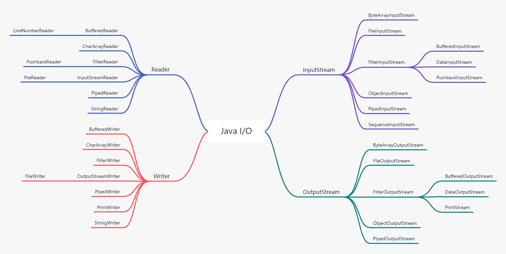
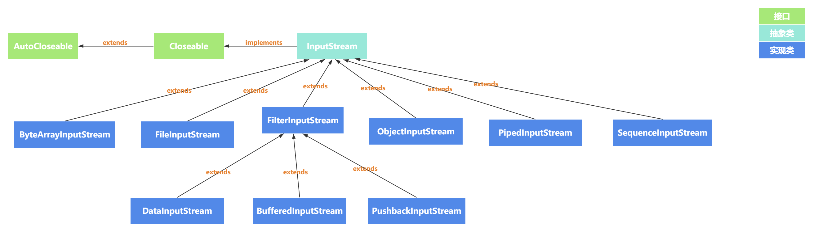
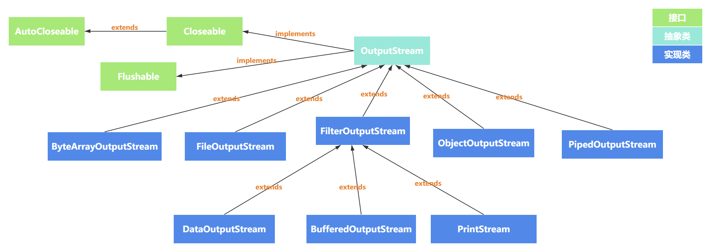
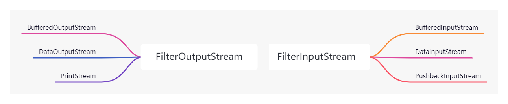
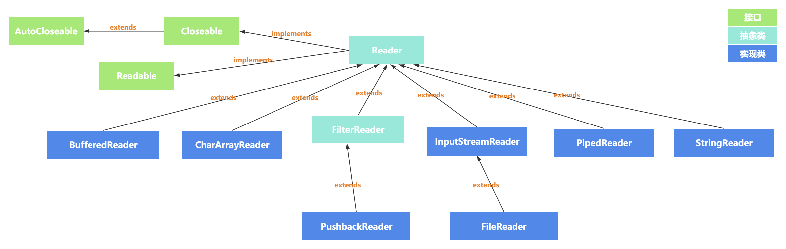
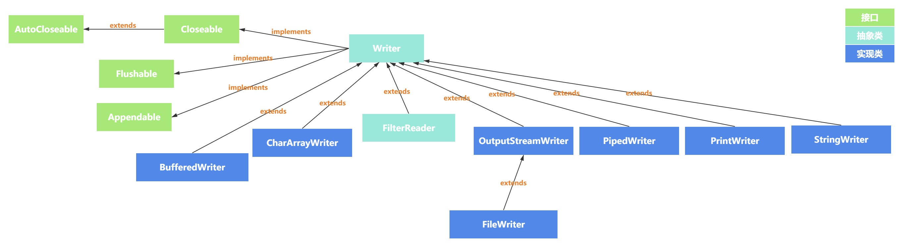
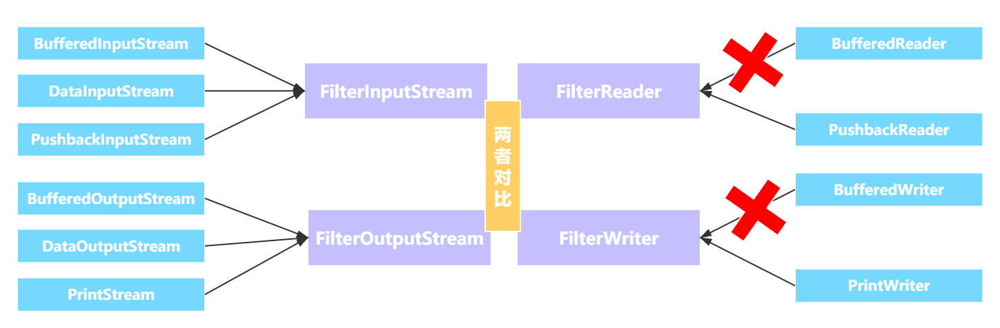
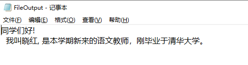
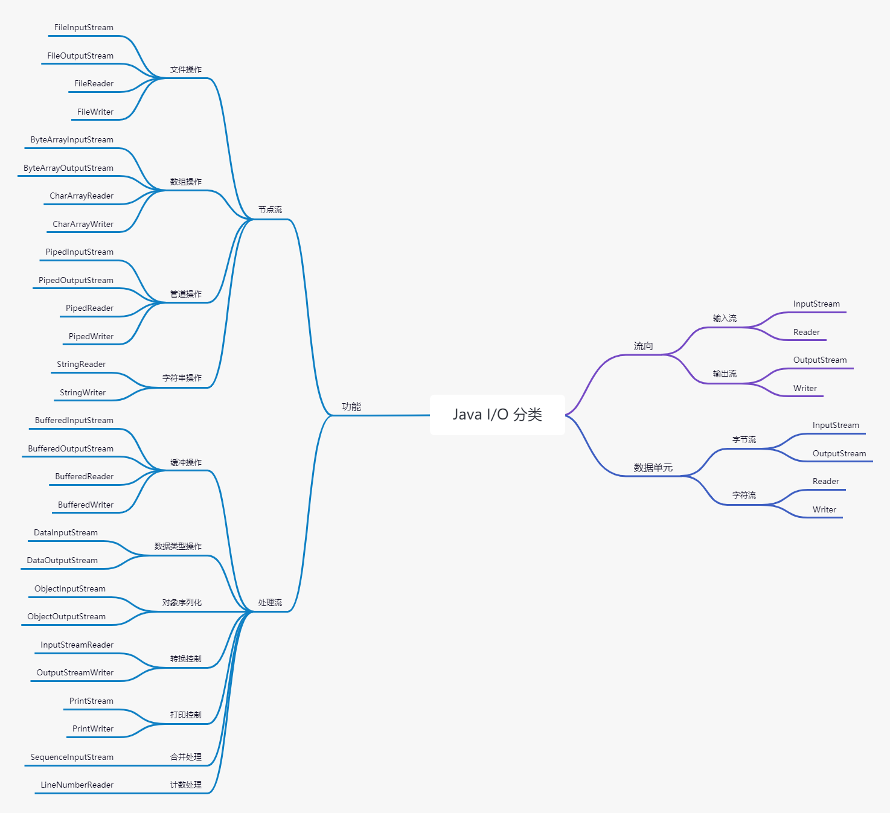

I/O 就是计算机的输入与输出操作，描述计算机中数据的流动过程。每一种编程语言都需要实现自己的 I/O API，用来读取磁盘、读写网络、访问文件等其他关于 I/O 的相关操作。



`java.io` 是 Java 提供的一套关于 I/O 的编程接口，里面包含了操作输入和输出所需要的类。在 `java.io` 中，I/O流分为两类：

- 字节流。面向字节的流，操作数据的字节。
- 字符流。面向字符的流，操作字符。

JDK 1.0 开始就提供了字节流来操作 I/O 流，JDK 1.1 才引入字符流，字符流通常是处理 `Unicode` 字符集的类层次结构。这些类的 I/O 操作都是基于两字节的 Char 值（即，`Unicode`码元），而不是基于 byte 值。

字节流和字符流操作的本质区别只有一个：字节流是原生的操作，字符流是经过处理后的操作。

字节流在操作时不会用到缓冲区，也就是不会用到内存，文件本身直接操作，而字符流在操作时使用了缓冲区，通过缓冲区操作文件。

# 输入/输出流

在 Java I/O中，能读取一个字节序列的对象称作输入流，能写入一个字节序列的对象称作输出流。而这些字节序列可能来自于文件、网络连接，或者是内存块。而构成 Java I/O 层次结构的基础是抽象类 `InputStream` 和 `OutputStream`。

## InputStream

`InputStream` 是一个抽象类，是输入字节流中的基类。

```java
public abstract class InputStream implements Closeable {
    ...
}
```

`InputStream` 抽象类实现了 `Closeable` 接口，该接口提供了一个方法：

```java
public void close() throws IOException;
```

`Closeable` 接口扩展了 `AutoCloseable` 接口， 且 `AutoCloseable` 接口中也提供了一个 `close()` 方法：

```java
void close() throws Exception;
```

该接口与 `Closeable` 接口中的方法相同，但抛出的异常不同，`Closeable` 接口的 `close()` 方法抛出 `IOException` 异常，而 `AutoCloseable` 接口的 `close()` 方法可以抛出任何异常。

<small>注意：凡是实现了 `AutoCloseable` 接口的类都可以使用 `try-with-resource`语句。因此，`Closeable` 接口也可以使用 `try-with-resource`语句。 </small>

`InputStream` 抽象类提供了一个抽象方法：

```java
public abstract int read() throws IOException;
```

这个方法作用是读取一个字节并返回读入的字节，当读到源结尾时返回 `-1`。在实现具体输入流类时，必须覆盖这个方法以提供适用的功能。

`InputStream` 抽象类中有两个具体的 `read()` 方法用于读取字节流，这两个方法都调用抽象的 `read()` 方法，因此，各个实现了 `InputStream` 的子类只需覆盖 `read()` 抽象方法即可。下面列出 `InputStream` 抽象类实现的方法，这些方法都会抛出 `IOException` 异常。

- `int read(byte b[])`：从输入流中读取一些字节数，并将它们存储到`byte` 数组中。`byte`数组相当于缓冲区。
- `int read(byte b[], int off, int len)`：从`off` 起始，读取`len`个字节的数据放入 `byte` 数组中。
- `long skip(long n)`：跳过并丢弃来自此输入流的`n`字节。
- `int available()`：返回从该输入流中可以读取（或跳过）的字节数的估计值，而不会被下一次调用此输入流的方法阻塞。
- `void close()`：关闭此输入流并释放与流相关联的任何系统资源。
- `synchronized void mark(int readlimit)`：标记此输入流中的当前位置。
- `synchronized void reset()`：将此流重新定位到上次在此输入流上调用mark方法时的位置。
- `boolean markSupported()`：测试这个输入流是否支持mark和reset方法。此方法不抛出异常。



`InputStream` 抽象类是从不同的数据源中读取数据，不同的数据源都有相应的 `InputStream` 子类。如下所示：

- `ByteArrayInputStream`：内部包含一个 `byte buf[]`用作缓冲区，其中包含可以从流中读取的字节。
- `FileInputStream`：从文件系统中的文件获取输入字节。什么文件可用取决于主机环境。
- `FilterInputStream`：作为“装饰器”的接口的子类。主要为其它的 `InputStream` 附加有用的功能。
- `ObjectInputStream`：将 `ObjectOutputStream` 类序列化的原始数据恢复为对象。用于反序列化。
- `PipedInputStream`：用于存储与 `PipedOutputStream` 相关的类传入的数据。实现“管道化”概念。
- `SequenceInputStream`：表示其他输入流的逻辑级联。对一个有序的 `InputStream` 集合读取成一个 `InputStream`。

其中，`FileInputStream` 也属于一种 `InputStream`，它的作用是为 “装饰器” 类提供基类。其中，“装饰器”类可以把属性或有用的接口与输入流连接在一起。

要使用 `InputStream` 的话，就要使用相对应的子类进行操作。如对文件的操作使用 `FileInputStream`，需要缓冲区可以使用 `ByteArrayInputStream` 等等。

## OutputStream

与输入流 `InputStream` 抽象类相似的是输出流 `OutputStream` 类也是一个抽象类，是输出字节流中的基类。

```java
public abstract class OutputStream implements Closeable, Flushable {
    ...
}
```

`OutputStream` 抽象类除了实现 `Closeable` 接口外，还实现了 `Flushable` 接口，该接口提供了一个方法：

```java
void flush() throws IOException;
```

该方法主要是刷新输出，也就是将所有缓冲的数据发送到目的地。

`OutputStream`类也定义了一个抽象方法：

```java
public abstract void write(int b) throws IOException;
```

该方法是将指定的字节写入输出流。`OutputStream` 提供了两个具体的 `write()` 方法用于输出字节，且都调用了抽象的 `write()` 方法，因此，继承了 `OutputStream` 的子类只需要实现抽象 `write()` 方法即可。下面列出 `OutputStream` 抽象类实现的方法，这些方法都会抛出 `IOException` 异常。

- `void write(byte b[])`：字节数组写入输出流。
- `void write(byte b[], int off, int len)`：将`b[]` 字节数组从`off`下标起始的长度为`len` 的子字节数组写入输出流。
- `void flush()`：刷新输出流。
- `void close()`：关闭流并释放与之相关联的系统资源。



`OutputStream` 抽象类决定数据要去往的目标，这些目标都有相应的 `OutputStream` 子类。如下所示：

- `ByteArrayOutputStream`：内部包含一个 `byte buf[]` 缓冲区，将数据写入时会先存储在缓冲区。
- `FileOutputStream`：将数据写入到文件系统中的文件。文件是否可用或可能被创建取决于底层平台。
- `FilterOutputStream`：作为“装饰器”的接口的子类。主要为其它的 `OutputStream` 类提供数据转换或提供附加功能。
- `ObjectOutputStream`：将 Java 对象的原始数据类型和图形写入到 `OutputStream`。用于对象序列化。
- `PipedOutputStream`：任何写入 `PipedOutputStream` 的数据都会自动存储在相关`PipedInputStream`类，实现“管道化”概念。

其中，`FilterOutputStream` 为 “装饰器” 类提供了一个基类；“装饰器” 类把属性或者有用的接口与输出流连接了起来，`FilterOutputStream` 也属于 `OutputStream` 的一种。

要使用 `OutputStream` 的话，就要使用相对应的子类进行操作。如对文件的操作使用 `FileOutputStream`，需要缓冲区可以使用 `ByteArrayOutputStream` 等等。

## Filter I/O

Java I/O 类库提供了 `Filter I/O` 作为所有装饰器类的基类。装饰器必须具有和它所装饰对象相同的接口，但它也可以扩展接口，不过这种情况只发生在个别 `Filter I/O` 类中。



`Filter IO` 是用来提供装饰器类接口，用以控制特定 `InputStream/OutputStream` 的两个类，这两个类是创建装饰器的必要条件。

### FilterInputStream

`FilterInputStream` 类是继承于 `InputStream` 抽象类的子类，它的作用是用来 “封装其它的输入流，并为它们提供额外的功能”。

```java
public class FilterInputStream extends InputStream {
    protected volatile InputStream in;
    
    protected FilterInputStream(InputStream in) {
        this.in = in;
    }
    ...
}
```

`FilterInputStream` 调用构造方法时，需传入 `InputStream` 对象，且本身继承与 `InputStream` 抽象类，简单地覆盖了所有 `InputStream` 的方法，因此 `FilterInputStream` 主要是给传入的 `InputStream` 对象提供附加的方法和为已有的方法在内部附加功能。

`FilterInputStream`类的常用子类有：

- `DataInputStream`：允许从数据流中读取原始的 Java 类型。一般与 `DataOutputStream` 搭配使用。
- `BufferedInputStream`：在读取字节时，在内部使用缓冲区提高读取性能。
- `PushbackInputStream`：创建单个字节输入缓冲区，允许输入流在被读取后回退一个字节。

### FilterOutputStream

`FilterOutputStream` 类是继承于`OutputStream` 抽象类的子类，它的作用是用来 “封装其它的输出流，并为它们提供额外的功能”。

```java
public class FilterOutputStream extends OutputStream {
    protected OutputStream out;

    public FilterOutputStream(OutputStream out) {
        this.out = out;
    }
    ...
}
```

使用 `FilterOutputStream` 创建对象时，需要传入一个 `OutputStream` 对象，对该 `OutputStream` 对象在 `FilterOutputStream` 内部转换数据或提供附加功能。如是否缓存、是否允许查询或设置行数等。

`FilterOutputStream` 类的常用子类有：

- `BufferedOutputStream`：提供了对`OutputStream` 的缓冲功能，内部提供缓冲区存储数据，这样避免数据直接写入流，从而提高性能。
- `DataOutputStream`：可以将原始Java数据类型写入到流中，然后应用可以使用 `DataInputStream` 来读取数据。
- `PrintStream`：以合适的格式打印任何数据类型值。


# 字符流

JDK 1.1 对原始的 `I/O` 流类库做了重大的修改。这里添加了与 `I/O` 流类相对应的 `Reader` 和 `Writer` 类库，但它们不是用来代替 `InputStream` 和 `OutputStream` 的，而是提供兼容 `Unicode` 和面向字符 `I/O` 的功能。

设计 `Reader` 和 `Writer` 继承体系主要是为了国际化。面向字节的 `I/O` 体系仅支持 8 bit 的字节流，并不能很好地处理 16 bit 的 `Unicode` 字符。而 `Unicode` 主要用于字符国际化，所以添加 `Reader` 和 `Writer` 继承体系就是为了让所有的 `I/O` 操作都支持 `Unicode`。`Reader/Writer` 的设计比面向字节的 `I/O` 体系操作快。

但是 `I/O` 流体系在面向字节 `I/O` 这方面仍然发挥着重要的作用，且有时候与 `Reader/Writer` 体系结合起来使用，这时就需要用到适配器：

- `InputStreamReader`：把 `InputStream` 转换为 `Reader`。
- `OutputStreamWriter`：把 `OutputStream` 转换为 `Writer`。

总的来说，这两个不同的继承体系中的接口即便不能说完全相同，但也是非常相似的。

## Reader

`Reader` 是抽象类，是读取字符流的基类。

```java
public abstract class Reader implements Readable, Closeable {
    ...
}
```

`Reader` 抽象类除了实现 `Closeable` 接口外，还实现了 `Readable` 接口，该接口提供了一个方法：

```java
public int read(java.nio.CharBuffer cb) throws IOException;
```

`CharBuffer` 类拥有按顺序和随机地进行读写访问的方法，它表示一个内存中的缓冲区或者一个内存映像的文件。该方法尝试向着 `cb` 读入其可持有数量的 `char` 值。返回读入的 `char` 值的数量，或者当从这个 `Readable` 中无法再获得更多的值时返回 `-1`。

`Reader` 抽象类有一个 `read()` 抽象方法：

```java
public abstract int read(char cbuf[], int off, int len) throws IOException;
```

该方法读取输入流并将字符以`off`为起始，`len` 个字节数存储在 `cbuf` 字符数组中。`Reader` 类中有三个具体的 `read()` 方法用于读取字符，这三个方法都调用了 `read()` 抽象方法。因此，继承 `Reader` 类的子类只要实现此方法即可。下面简单介绍一下 `Reader` 类具有的方法，这些方法都会抛出 `IOException` 异常。

- `int read(char cbuf[])`：将字符读入数组，返回实际成功读取的字符数。遇到文件尾时返回 `-1`。
- `int read()`：读取一个字符。
- `int read(CharBuffer target)`：将字符读入指定的字符缓冲区。
- `long skip(long n)`：跳过 n 个输入字符，返回跳过的字符数。
- `boolean ready()`：判断流是否准备好被读取。
- `boolean markSupported()`：判断当前流是否支持标记流。该方法不会抛出异常。
- `void mark(int readAheadLimit)`：标记流中的当前位置。
- `void reset()`：重置流的读取位置为 `mark` 的标记位置。
- `abstract void close()`：关闭流并释放与之相关联的系统资源。



`Reader` 抽象类提供的子类有：

- `BufferedReader`：从字符输入流中读取文本并缓冲字符，以提供字符，数组和行的高效读取。
- `CharArrayReader`：实现了一个字符缓冲区，用作字符输入流。
- `FilterReader`：用于读取过滤后的字符流的抽象类。
- `InputStreamReader`：用于将字节流转换到字符流，转换时可以设置字符集。
- `PipedReader`：用于存储与 `PipedWriter` 相关的类传入的数据。实现“管道化”概念管道。
- `StringReader`：将 `String` 当作数据源读取的字符流。

## Writer

`Writer` 是抽象类，是写出字符流的基类。

```java
public abstract class Writer implements Appendable, Closeable, Flushable {
    ...
}
```

`Writer` 抽象类除了实现了 `Closeable` 和 `Flushable` 接口，还有一个 `Appendable` 接口，这个接口有两个用于添加单个字符和字符序列的方法：

```java
Appendable append(char c)
Appendable append(CharSequence s)
```

向这个 `Appendable` 追加给定的字符或者给定的字符序列，返回 `this`。

`CharSequence` 接口描述了一个 char 值序列的基本属性，`String`、`CharBuffer`、`StringBuilder` 和 `StringBuffer` 都实现了它。

在流类的家族中，只有 `Writer` 实现了 `Appendable` 。

`Writer` 抽象类有一个 `write()` 抽象方法：

```java
public abstract void write(char cbuf[], int off, int len) throws IOException;
```

该方法是将 `cbuf[]` 字符数组以 `off` 为起点，长度为 `len` 的字符数组写入，而不是全部。`Writer` 也有四个具体的 `write()` 方法，调用了 `write()` 抽象方法。因此，每个继承了 `Writer` 的子类，只要实现这个抽象方法即可。下面给出 `Writer` 抽象类给的具体方法，这些方法会抛出 `IOException` 异常。

- `void write(int c)`：写入一个字符。
- `void write(char cbuf[])`：写入字符数组。
- `void write(String str)`：写入字符串。
- `void write(String str, int off, int len)`：写入字符串从`off` 起始，长度为`len`子字符串。
- `Writer append(CharSequence csq)`：将指定的字符序列追加到`Writer`。
- `Writer append(CharSequence csq, int start, int end)`：将指定的字符序列的子序列追加到`Writer`，子序列是字符序列从 `start` 起始到 `end` 结束的字符序列。
- `Writer append(char c)`：将指定的字符追加到`Writer`。
- `abstract void flush()`：刷新缓冲区。
- `abstract void close()`：关闭流并释放与之相关联的系统资源。



`Writer` 抽象类提供的子类有：

- `BufferedWriter`： 将文本写入字符输出流，该字符流具有缓冲区，用以缓冲字符，以提供单个字符，数组和字符串的高效写入。
- `CharArrayWriter`：以数组作为目标的输出流，实现了动态增长的字符缓冲区。
- `FilterWriter`：用于编写过滤后的字符流的抽象类。
- `OutputStreamWriter`：用于将字符流转换到字节流，转换时可以设置字符集。
- `PipedWriter`：任何写入 `PipedWriter` 的数据都会自动存储在相关`PipedReader`类，实现“管道化”概念。
- `PrintWriter`：`PrintWriter` 本质上是 `PrintStream` 的字符形式的版本。
- `StringWriter`：将数据写入到 `String` 的字符流。


## Filter Reader/Writer

`Reader` 与 `Writer` 的类继承层次结构沿用了 `Filter I/O` 体系的思想，使用装饰器设计模式进行灵活的搭配，但也有不同的地方，如 `BufferedWriter` 并不是 `FilterWriter` 的子类，而 `BufferedOutputStream` 是 `FilterOutputStream` 的子类。



### FilterReader

`FilterReader` 抽象类继承于`Reader`抽象类，是用于读取过滤后的字符流的抽象类。

```java
public abstract class FilterReader extends Reader {
    protected Reader in;

    protected FilterReader(Reader in) {
        super(in);
        this.in = in;
    }
    ....
}
```

`FilterReader` 调用构造方法时，需要传入一个 `Reader` 对象，而 `FilterReader` 本身也是继承了 `Reader` 抽象类，因此，`FilterReader` 抽象类只是重写这些方法，并在这些方法中调用传入的 `Reader` 对象，给 `Reader` 对象在 `FilterReader` 内部提供数据转换或附加一些功能等。

`FilterInputStream`抽象类只有一个子类，即 `PushbackReader`。该类主要是一个字符流读取器，允许将字符推回到流中。

### FilterWriter

`FilterWriter` 抽象类继承于 `Writer` 抽象类，是用于编写过滤后的字符流的抽象类。

```java
public abstract class FilterWriter extends Writer {
    protected Writer out;

    protected FilterWriter(Writer out) {
        super(out);
        this.out = out;
    }
    ...
}
```

`FilterWriter` 与 `FilterReader` 功能相同，都是对传入的 `Writer` 对象进行包装，在内部附加功能等。`FilterWriter` 抽象类没有提供子类。

# 用途

尽管可以用不同的方式来组合 `I/O` 流类，但常用的也就其中几种。如下例子所示，给出几种 `I/O` 的用法参照。

## 访问文件

在 Java I/O 中，使用 `FileInputStream` 从文件中读取并使用 `FileOutputStream` 将数据写入另一个文件，当然，也可以在内存中使用 `FileInputStream` 读取出来的字节：

```java
public class AccessFileExample {
    public static void main(String[] args) {
        File file = new File("se/io/src/iotest.txt");
        if (!file.exists()) {
            throw new RuntimeException("读取的文件不存在！");
        }
        InputStream in = null;
        OutputStream os = null;
        try {
            // 创建文件字节读取流对象时，必须明确与之关联的数据源
            in = new FileInputStream(file);
            os = new FileOutputStream("se/io/src/iotemp.txt");
            // 调用读取流对象的读取方法
            int len = 0;
            byte[] buf = new byte[4096];
            while ((len = in.read(buf)) != -1) {
                os.write(buf, 0, len);
            }
        } catch (IOException ex) {
            ex.printStackTrace();
        } finally {
            try {
                Objects.requireNonNull(in).close();
                Objects.requireNonNull(os).close();
            } catch (IOException e) {
                e.printStackTrace();
            }
        }
    }
}
```

这里在使用 `FileReader` 与 `FileWriter` 的方式访问文件：

```java
public class AccessFileExample {
    public static void main(String[] args) {
        File file = new File("se/io/src/iotest.txt");
        if (!file.exists()) {
            throw new RuntimeException("读取的文件不存在！");
        }
        try (
                Reader r = new FileReader(file);
                Writer w = new FileWriter("se/io/src/iotemp.txt")
                ) {
            // 调用读取流对象的读取方法
            int len = 0;
            char[] buf = new char[4096];
            while ((len = r.read(buf)) != -1) {
                w.write(buf, 0, len);
            }
        } catch (IOException e) {
            e.printStackTrace();
        }
    }
}
```

`FileReader` 和 `FileWriter` 操作纯文本字符的文件最为合适。

## 缓存

在访问文件时，可以使用 Java 提供的 `Buffered I/O` 将其包装起来增加缓存的功能。如下所示：

```java
public class AccessFile {
    public static void main(String[] args) {
        File file = new File("se/io/src/iotest.txt");
        if (!file.exists()) {
            throw new RuntimeException("读取的文件不存在！");
        }
        InputStream in = null;
        OutputStream os = null;
        try {
            // 创建文件字节读取流对象时，必须明确与之关联的数据源
            in = new BufferedInputStream(new FileInputStream(file));
            os = new BufferedOutputStream(new FileOutputStream("se/io/src/iotemp.txt"));
            // 调用读取流对象的读取方法
            int len = 0;
            byte[] buf = new byte[4096];
            while ((len = in.read(buf)) != -1) {
                os.write(buf, 0, len);
            }
        } catch (IOException ex) {
            ex.printStackTrace();
        } finally {
            try {
                Objects.requireNonNull(in).close();
                Objects.requireNonNull(os).close();
            } catch (IOException e) {
                e.printStackTrace();
            }
        }
    }
}
```

`Reader/Writer` 体系的使用 `BufferedReader` 和 `BufferedWriter` 两个类来增加缓存功能。

```java
public class AccessFile {
    public static void main(String[] args) {
        File file = new File("se/io/src/iotest.txt");
        if (!file.exists()) {
            throw new RuntimeException("读取的文件不存在！");
        }
        try (
                Reader r = new BufferedReader(new FileReader(file));
                Writer w = new BufferedWriter(new FileWriter("se/io/src/iotemp.txt", true))
        ) {
            // 调用读取流对象的读取方法
            int len = 0;
            char[] buf = new char[4096];
            while ((len = r.read(buf)) != -1) {
                w.write(buf, 0, len);
            }
        } catch (IOException e) {
            e.printStackTrace();
        }
    }
}

```

在这里，创建 `FileWriter` 对象时，使用了 `FileWriter(String fileName, boolean append)` 构造方法，该构造方法的第二个为 `true` 时，是追加写入，而不是覆盖写入。

## 文件合并

有时需要使用 `SequenceInputStream` 流将多个文件合并在一起。如下所示：

```java
public class MergeFiles {
    public static void main(String[] args) {
        try (
                InputStream in1 = new FileInputStream("se/io/src/FileOutput.txt");
                InputStream in2 = new FileInputStream("se/io/src/iotest.txt");
                InputStream in3 = new FileInputStream("se/io/src/FileWriter.txt");
                OutputStream os = new FileOutputStream("se/io/src/MergeFile.txt", true);
                SequenceInputStream sis = new SequenceInputStream(list(in1, in2, in3))
                ) {
            byte[] buf = new byte[4096];
            int len = 0;
            while ((len = sis.read(buf)) != -1) {
                os.write(buf, 0, len);
            }
        } catch (IOException e) {
            e.printStackTrace();
        }
    }

    public static Enumeration<InputStream> list(InputStream... ins) {
        List<InputStream> list = Arrays.asList(ins);

        Iterator<InputStream> it = list.iterator();

        return new Enumeration<>() {

            @Override
            public boolean hasMoreElements() {
                return it.hasNext();
            }

            @Override
            public InputStream nextElement() {
                return it.next();
            }
        };
    }
}
```


## 转换

有时候也需要在 `InputStream/OutputStream` 和 `Reader/Writer` 之间进行转换，在 Java I/O 中提供了 `InputStreamReader/OutputStreamWriter` 两个类用于转换。


```java
public class StreamTransition {
    public static void main(String[] args) {
        try (
                Reader reader = new BufferedReader(
                        new InputStreamReader(
                                new FileInputStream("se/io/src/FileWriter.txt")));
                Writer writer = new BufferedWriter(
                        new OutputStreamWriter(
                                new FileOutputStream("se/io/src/FileWriter2.txt")))
                ) {
            int c = 0;
            while ((c = reader.read()) != -1) {
                writer.write(c);
            }
        } catch (IOException e) {
            e.printStackTrace();
        }
    }
}
```

## 序列化

Java I/O 提供了 `ObjectOutputStream` 和 `ObjectInputStream` 实现序列化与反序列化操作。但要注意，序列化的类需实现 `java.io.Serializable` 接口，且需要序列化的类中的属性又不需要序列化的，使用 `transient` 关键字修饰。如下所示：

```java
public class Student implements Serializable {
    private static final long serialVersionUID = -4496225960550340595L;
    private String name;
    private Integer age;
    ...省略getter与setter...
}
public class JdkSerializer {
    public static void main(String[] args) {
        Student s1 = new Student();
        s1.setName("小赵");
        s1.setAge(24);

        try (
                // 序列化对象到文件中
                ObjectOutputStream oos = new ObjectOutputStream(new FileOutputStream("serializer"))
                ) {
            oos.writeObject(s1);
        } catch (IOException e) {
            e.printStackTrace();
        }

        try (
                ObjectInputStream ois = new ObjectInputStream(new FileInputStream("serializer"));
                ) {
            Student s2 = (Student) ois.readObject();
        } catch (IOException | ClassNotFoundException e) {
            e.printStackTrace();
        }
    }
}
```

## 格式输出

`PrintStream` 继承于 `FilterOutputStream`，主要是将各种输出流以各种格式进行打印，可以将打印的数据打印在文件中，也可以是控制台等。

```java
public class FileOutput {
    public static void main(String[] args) {
        try (
                PrintStream ps = new PrintStream(new FileOutputStream("se/io/src/FileOutput.txt"))
                ) {
            ps.println("同学们好!");
            ps.printf("  我叫%s, 是本学期新来的%s教师，刚毕业于%s。", "晓红", "语文", "清华大学");
        } catch (FileNotFoundException e) {
            e.printStackTrace();
        }
    }
}
```

效果如下：



`PrintWriter` 的用法与 `PrintStream` 基本相同。`PrintWriter` 类实现了在 `PrintStream` 类中的所有 `print` 方法，而 `PrintWriter` 构造方法接受的对象比 `PrintStream` 要更全，一般情况下选择 `PrintWriter` ，灵活性更强，且 `PrintWriter` 解决了 `PrintStream` 中的国际化问题。

# 总结

Java I/O 类库在执行期间都将阻塞，直至确实被读入或写出。因此，如果不能被立即访问，就会将当前线程阻塞。

在使用 Java I/O 类库时，调用 `close()` 会释放有限的操作系统资源。因此，过多的打开 `I/O` 流而没有关闭，系统资源就会被耗尽。关闭一个输出流的同时还会冲刷用于该输出流的缓冲区：所有被临时置于缓冲区中，以便用更大的包的形式传递的字节在关闭输出流时都将被送出。特别是，如果不关闭文件，那么写出字节的最后一个包可能将永远也得不到传递。当然，我们还可以用 `flush()` 方法来人为地冲刷这些输出。

Java I/O 流类库中，可以为其划分以下分类：

- 按流的流向，可以分为输入流和输出流；
- 按流的数据单元，可以分为字节流和字符流；
- 按流的功能，可以分为节点流和处理流。



Java I/O 流类库能够满足基本需求：通过控制台、文件、内存块甚至因特网进行读写。基本覆盖了常用的功能点，使用装饰器模式灵活的搭配，而且还具有可移植性。但也增加了代码的复杂性，必须创建许多类才能得到所希望的单个 `I/O` 对象，如果没有理解装饰器模式，那 Java I/O 的设计使得学习的成本相对较高。一旦理解了装饰器模式，并且开始在某些需要这种灵活性的场景中使用，那就能从中受益。