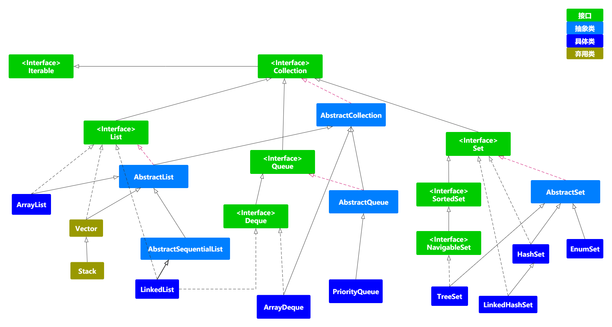
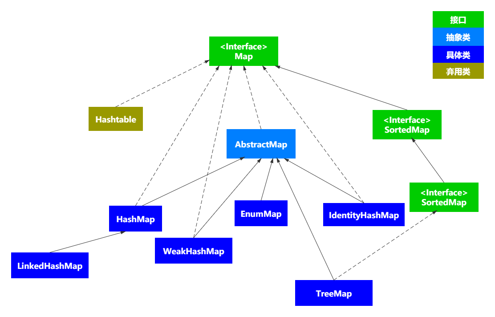

# 前言

大部分编程语言都提供了数组来保存对象，数组是非常重要的数据结构之一。但是数组在初始化时就已经定义了数组长度，不可变，使用起来颇为麻烦。因此，Java 在 `JDK 1.2` 版本中添加了集合框架，用来保存和操纵对象。

Java中的容器采用的是 "持有对象"（holding objects）的思想，主要由继承 `Collection` 与 `Map` 两个接口来实现的。下面我们来看一下这两种容器：

1. 集合（Collection）：它主要是存放着对象的集合。主要是存放单一元素。
2. 映射（Map）：它主要是存放着关于 "键值对" 的关系映射表，主要是存放 `key-value` 键值对的。


# Collection

`Collection` 接口为主接口，下面还细分为 `List`、`Set` 与 `Queue` 这三个接口，这三个接口都是继承于 `Collection`，但要实现的功能却不一样。`List` 主要是存储元素时，要保持插入的顺序；`Set` 主要是不包含重复元素；`Queue` 按照排序规则来确定对象产生的顺序（通常与它们被插入的顺序相同）。



但因为它们继承于 `Collection` 接口，因此，它们都具有一些相同的操作：

```java
public interface Collection<E> extends Iterable<E> {
	int size();	// 集合的大小
	boolean isEmpty();	// 判断集合是否为空
	boolean contains(Object o);	// 判断集合中是否存在该元素
	Iterator<E> iterator();	// 迭代器，用于遍历集合使用
	Object[] toArray();	// 将集合转换成数组
	<T> T[] toArray(T[] a);	// 将集合转换成指定类型的数组
	boolean add(E e);	// 将元素添加到集合中
	boolean remove(Object o);	// 将元素从集合中删除
	boolean containsAll(Collection<?> c);	// 该集合是否包含了集合c
	boolean addAll(Collection<? extends E> c);	// 将集合c的元素都加到该集合中
	boolean removeAll(Collection<?> c);	// 将集合c与该集合相同的元素都删除
	boolean retainAll(Collection<?> c);	// 去两个集合的交集并保存在该集合中，如果不存在相同元素，则该集合为空
	void clear();	// 清除该集合中元素
	boolean equals(Object o);	// 用于判断两集合是否相等
	int hashCode();	// 获取hash值
}
```

在 Java 8 中，接口还添加了默认方法：

```java
// Java 8 新添加的默认方法
default boolean removeIf(Predicate<? super E> filter) {
	Objects.requireNonNull(filter);
	boolean removed = false;
	final Iterator<E> each = iterator();
	while (each.hasNext()) {
		if (filter.test(each.next())) {
			each.remove();
			removed = true;
		}
	}
	return removed;
}
// 将集合转换为流
default Stream<E> stream() {
	return StreamSupport.stream(spliterator(), false);
}
// 将集合转换为并行流
default Stream<E> parallelStream() {
	return StreamSupport.stream(spliterator(), true);
}
```

以上就是 `Collection` 的 API 了。子类继承后，这些方法也都继承了，但是子类可以用不同的数据结构来实现。

## Iterator & Iterable

`Iterator` 是 Java 中的迭代器，能够让实现了该接口的类进行迭代遍历，我们来看一下 `Iterator` 接口：

```java
public interface Iterator<E> {
    boolean hasNext();	// 判断是否还存在下一个对象
    E next();	// 返回集合中的下一个对象，并将访问指针向前移动一位
    default void remove() {	// 删除操作
        throw new UnsupportedOperationException("remove");
    }
    // JDK 1.8
    default void forEachRemaining(Consumer<? super E> action) {
        Objects.requireNonNull(action);
        while (hasNext())
            action.accept(next());
    }
}
```

而我们接下来要学习的 `Collection` 接口继承了 `Iterable` 接口，该接口中的 `iterator()` 方法能够产生 `Iterator`  对象，来对集合进行迭代遍历：

```java
public interface Iterable<T> {
    Iterator<T> iterator();
    // JDK 1.8
    default void forEach(Consumer<? super T> action) {
        Objects.requireNonNull(action);
        for (T t : this) {
            action.accept(t);
        }
    }
    default Spliterator<T> spliterator() {
        return Spliterators.spliteratorUnknownSize(iterator(), 0);
    }
}
```

`Iterable` 接口提供了一个获取 `Iterator` 对象的方法，所以实现了 `Iterable` 接口的集合依旧可以使用 迭代器 遍历和操作集合中的对象。

我们使用一下实现了`Iterable` 接口的集合使用 `Iterator` 迭代器进行遍历：

```java
LinkedList<String> list = new LinkedList<>();
list.add("Feb");
list.add(null);
list.add("Jan");
list.add("Mar");
System.out.println(Arrays.toString(list.toArray()));
Iterator<String> iterator = list.iterator();
while (iterator.hasNext()) {
	String it = iterator.next();
	if (it == null) iterator.remove();
}
System.out.println(Arrays.toString(list.toArray()));
/**
 * 输出结果：
 * [Feb, null, Jan, Mar]
 * [Feb, Jan, Mar]
 */
```

而这样子比较麻烦，在 JDK 1.8 之后，就提供了 `for-each` 方法来遍历实现了 `Iterable` 接口的对象，它是 Java 中的一种 `语法糖`。如下所示：

```java
for (String s : list) {
	System.out.println(s);
}
```

`ListIterator` 存在于 `List` 集合之中，是一个功能比 `Iterator` 更强大的迭代器。

```java
public interface ListIterator<E> extends Iterator<E> {
    boolean hasNext();
    E next();
    boolean hasPrevious();
    E previous();
    int nextIndex();
    int previousIndex();	// 
    void remove();	// 移除当前索引位置的元素
    void set(E e);	// 设置当前索引的元素
    void add(E e);	// 在当前索引位置添加元素
}
```

从上面的方法中就可以了解到，`ListIterator` 是一个双向移动，并根据迭代器中指向当前位置的元素产生指向前一个和后一个元素的索引 `index`。

```java
public static void main(String[] args) {
	List<String> list = new ArrayList<>();
	list.add("Jan");
	list.add(null);
	list.add("Feb");
	list.add("Mar");
	System.out.println("迭代之前的集合=" + Arrays.toString(list.toArray()));
	System.out.println("向后遍历");
	ListIterator<String> iterator = list.listIterator();
	while (iterator.hasNext()) {
		System.out.println("当前元素：" + iterator.next() + " 的后一个索引：" + iterator.nextIndex());
	}
	System.out.println("向前遍历");
	while (iterator.hasPrevious()) {
		String pre = iterator.previous();
		System.out.println("当前元素：" + pre + " 的前一个索引“);
		if (null == pre) iterator.set("Aug");
	}
	System.out.println("迭代之后的元素=" + Arrays.toString(list.toArray()));
}
/**
 * 输出结果：
 * 迭代之前的集合=[Jan, null, Feb, Mar]
 * 向后遍历
 * 当前元素：Jan 的后一个索引：1
 * 当前元素：null 的后一个索引：2
 * 当前元素：Feb 的后一个索引：3
 * 当前元素：Mar 的后一个索引：4
 * 向前遍历
 * 当前元素：Mar 的前一个索引：2
 * 当前元素：Feb 的前一个索引：1
 * 当前元素：null 的前一个索引：0
 * 当前元素：Jan 的前一个索引：-1
 * 迭代之后的元素=[Jan, Aug, Feb, Mar]
 */
```

## fail-fast

`fail-fast` 是Java集合中的一种错误检测机制，当多个线程对部分集合进行结构上的改变的操作时，有何能会产生 `fail-fast` 机制，这个时候会抛出 `ConcurrentModificationException` 异常。

最简单的例子就是在使用 `for-each` 语法进行遍历时进行删除操作：

```java
List<String> list = new ArrayList<>();
list.add("Jan");
list.add(null);
list.add("Feb");
list.add("Mar");
System.out.println(Arrays.toString(list.toArray()));
for (String s : list) {
	if (s == null) list.remove(s);
}
System.out.println(Arrays.toString(list.toArray()));
```

这样在运行时会报错：

```java
Exception in thread "main" java.util.ConcurrentModificationException
	at java.base/java.util.ArrayList$Itr.checkForComodification(ArrayList.java:1042)
	at java.base/java.util.ArrayList$Itr.next(ArrayList.java:996)
	at xxx.xxx.Xxxx.java:22)
```

我们都知道 `for-each` 只是一种 `语法糖`，本身还是 `Iterator` 操作，我们看上面报错中的源码：

```java
public E next() {
	checkForComodification();
	...省略...
}
```

在 `Iterator` 的 `next` 操作时，会对该操作进行检查：

```java
final void checkForComodification() {
	if (modCount != expectedModCount)
		throw new ConcurrentModificationException();
}
```

而 `modCount` 的值，会在我们调用 `remove` 操作时进行修改：

```java
public E remove(int index) {
	Objects.checkIndex(index, size);
	final Object[] es = elementData;
	@SuppressWarnings("unchecked") E oldValue = (E) es[index];
	fastRemove(es, index);
	return oldValue;
}
private void fastRemove(Object[] es, int i) {
	modCount++;	// 在进行删除是会对 modCount进行++操作
	final int newSize;
	if ((newSize = size - 1) > i)
		System.arraycopy(es, i + 1, es, i, newSize - i);
	es[size = newSize] = null;
}
```

使得 `modCount` 与 `expectedModCount` 的值不能相等，因此抛出 `java.util.ConcurrentModificationException` 异常，终止遍历。

而如果想要解决上述的问题，我们给出两个方案：

使用 `Iterator` 操作进行删除或者 JDK 1.8 新增的 `removeIf` 默认方法。

```java
Iterator<String> iterator = list.iterator();
	while (iterator.hasNext()) {
		String s = iterator.next();
		if (s == null) iterator.remove();
}
// 或者
list.removeIf(Objects::isNull);
```

还可以使用 `CopyOnWriteArrayList` 并发容器来替换 `ArrayList`。

下面我们看一下继承了 `Collection` 接口的三大子接口。

## List

`List` 接口扩展自 `Collection` 接口，其特点是有序、可以重复。

`List` 主要新增了以下方法：

```java
// 在某个位置上将集合c添加到该集合中
boolean addAll(int index, Collection<? extends E> c);
// 通过下标获取元素
E get(int index);
// 通过下标设置元素
E set(int index, E element);
// 通过下标添加元素
void add(int index, E element);
// 通过下标移除元素
E remove(int index);
// 返回该元素的下标位置
int indexOf(Object o);
// 返回该元素的最后遇到的位置
int lastIndexOf(Object o);
ListIterator<E> listIterator();
ListIterator<E> listIterator(int index);
List<E> subList(int fromIndex, int toIndex);
```

我们常用的 `List` 类主要是 `ArrayList` 和 `LinkedList`。

### ArrayList

`ArrayList` 的底层采用数组来进行对象的存储：

```java
transient Object[] elementData;
```

又由于实现 `RandomAccess` 接口，因此在查找的时候非常快。

而在添加一个元素的时候由于是添加在尾部 `elementData[size++] = e`，因此顺序添加时非常的快。

而 `ArrayList` 在删除元素的时候，会使用 `System.arraycopy`进行一次复制操作。

```java
System.arraycopy(elementData, index+1, elementData, index, numMoved)
```

如果复制的元素过多，则会非常损耗性能。

### LinkedList

`LinkedList` 的底层使用双向链表实现对象的存储。顺序存取，允许存储任何对象（包括null）。`LinkedList` 同时还实现了 `Deque` 接口，该接口是继承于 `Queue`，因此该类可以当做队列使用。

```java
public class LinkedList<E>
    extends AbstractSequentialList<E>
    implements List<E>, Deque<E>, Cloneable, java.io.Serializable
{
    // 指向第一个结点的指针
    transient Node<E> first;
    // 指向最后一个结点的指针
    transient Node<E> last;
    ...省略...
}
```

因为 `LinkedList` 实现了 `Deque` 接口，因此它的操作是双向的，例如如下方法，可以选择添加头部还是尾部的操作。

```java
public void addFirst(E e) {
	linkFirst(e);
}
public void addLast(E e) {
	linkLast(e);
}
```

`LinkedList` 中以 `Node` 表示双向链表中的每个结点，如下：

```java
private static class Node<E> {
	// 存储数据
	E item;
	// 指向前一个结点的指针
	Node<E> next;
	// 指向下一个结点的指针
	Node<E> prev;

	Node(Node<E> prev, E element, Node<E> next) {
		this.item = element;
		this.next = next;
		this.prev = prev;
	}
}
```

我们由上源码中，知道了 `LinkedList` 的数据结构，因此，要使用 `LinkedList` 进行增删改查，都会从头开始遍历进行查找，不像 `ArrayList` 可以随机访问。但是，在进行插入和删除的操作时，比 `ArrayList` 快，只需要将指针指向你所需要的元素即可。

### Vector

`Vector` 的数据结构与 `ArrayList` 相似，都是使用数组 `Object[] elementData` 来进行数据的存储，但会使用 `synchronized` 关键字加锁进行同步：

```java
 public synchronized boolean add(E e) {
	modCount++;
	ensureCapacityHelper(elementCount + 1);
	elementData[elementCount++] = e;
	return true;
}
```

`add` 方法就是用 `synchronized` 关键字加锁，其它如 `get`、`remove` 等方法都有加锁。因此，`Vector` 使用 `synchronized` 关键字来保证线程安全，但这样的效率较低，已经不太建议使用。

我们一般推荐使用 `ArrayList` 来替代 `Vector` 来实现功能。

### Stack

`Stack` 继承于 `Vector`，它是一个后入先出的容器，就是不断将元素压入（push）`Stack`中，而弹出（pop）元素必定是最后压入`Stack` 中的元素。

`Stack` 实现的有这几种方法：

```java
// 将元素键入栈中
public E push(E item) {}
// 将元素从栈顶中弹出
public synchronized E pop() {}
// 去除栈顶的元素但不弹出
public synchronized E peek() {}
// 判断栈是否为空
public boolean empty() {}
// 返回对象离栈顶的距离
public synchronized int search(Object o) {}
```

但因为 `Stack` 继承于 `Vector`，因此它也包含 `Vector` 中的全部 API。也因此不推荐使用它，我们可以使用 `Deque` 接口来自己实现栈的功能。

### 线程安全

因为线程安全的 `Vector` 类已经不推荐使用，但 `ArrayList` 或者 `LinkedList` 没有线程安全机制，我们需要实现线程安全的话，就要使用 `Collections` 类的静态方法 `synchronizedList()` 获取线程安全的 `List` 或者使用 `CopyOnWriteArrayList` 实现线程安全的操作。

### 怎么确保一个集合不能被修改？

可以使用 `Collections.unmodifiableCollection(Collection c)` 方法来创建一个只读集合，这样改变集合的任何操作都会抛出 `java.lang.UnsupportedOperationException` 异常。

示例代码：

```java
List<String> list = new ArrayList<>();
list.add("Jan");
Collection<String> clist = Collections.unmodifiableCollection(list);
clist.add("Feb");	// 运行时此处报错
```

## Queue

`Queue`队列是先进先出的线性数据结构；我们看一下 `Queue` 的接口：

```java
public interface Queue<E> extends Collection<E> {
	boolean add(E e);	// 添加元素，失败会抛异常
	boolean offer(E e);	// 同上，返回值(会返回false)
	E remove();	// 删除元素，失败会抛异常
	E poll();	// 同上，返回值(会返回null)
	E element();	// 获取元素，失败会抛异常
	E peek();	// 同上，返回值(会返回null)
}
```

我们由上可知，`Queue` 接口是继承 `Collection` 的子接口，主要是添加了六个方法，可以分为两组，用于增删查。`add/remove/element` 为一组，它的情况是失败后抛出异常；`offer/poll/peek` 为一组，它的情况是失败后返回特殊的值（null或false）。在队列有界且无空闲空间时才会使添加操作抛出异常或返回`false`。这种情况我们使用 `offer` 这种来代替 `add` 这组操作。

在 JDK 中没有一个队列的实现仅仅实现了 `Queue` 接口。因为 `Queue` 只有基本的队列功能。因此，要扩展 `Queue` 接口。

### PriorityQueue

`PriorityQueue` 是基于二叉堆实现的优先级队列，而堆是采用数组实现的，并且可以指定 `Comparator` 比较器，如果不传入 `Comparator`，则自然排序 ：

```java
public class PriorityQueue<E> extends AbstractQueue<E>
    implements java.io.Serializable {
    /**
     * Priority queue represented as a balanced binary heap: the two
     * children of queue[n] are queue[2*n+1] and queue[2*(n+1)].  The
     * priority queue is ordered by comparator, or by the elements'
     * natural ordering, if comparator is null: For each node n in the
     * heap and each descendant d of n, n <= d.  The element with the
     * lowest value is in queue[0], assuming the queue is nonempty.
     */
    transient Object[] queue; // 队列
    private final Comparator<? super E> comparator;	// 比较器，用于确定优先级高低
    ...省略...
}
```

上述的注释介绍的是 `transient Object[] queue` 存储的优先队列表示为一个平衡的二叉树并且队列与其子队列的位置。如果不传入 `comparator`，则会按照自然顺序排序。

```java
public boolean offer(E e) {
	if (e == null)
		throw new NullPointerException();
	modCount++;
	int i = size;
	if (i >= queue.length)
		grow(i + 1);
	size = i + 1;
	if (i == 0)
		queue[0] = e;
	else
		siftUp(i, e);
	return true;
}
```

我们看一下它的添加元素的方法可以知道，`PriorityQueue` 不是线程安全的，并且不支持 `null`。而如果想要线程安全，可以使用并发包下的 `java.util.concurrent.PriorityBlockingQueue` 类。

### Deque

`Deque` 接口就是对 `Queue` 的扩展， `Deque` 是继承于 `Queue` 实现两端都能进出的双端队列。它的API中就有对 `First` 端和 `Last` 端的操作，`add/remove/get` 是一组操作，会抛异常；`offer/poll/peek` 是一组操作，它会在失败时返回值。

```java
public interface Deque<E> extends Queue<E> {
    void addFirst(E e);	// 添加到头部，异常报错
    void addLast(E e);	// 添加到尾部，异常报错
    boolean offerFirst(E e);	// 添加到头部，失败返回false。
    boolean offerLast(E e);		// 添加到尾部，失败返回false。
    E removeFirst();	// 移除头部元素，异常报错
    E removeLast();		// 移除尾部元素，异常报错
    E pollFirst();		// 移除头部元素，失败返回null。
    E pollLast();		// 移除尾部元素，失败返回null。
    E getFirst();		// 获取头部元素，异常报错
    E getLast();		// 获取尾部元素，异常报错
    E peekFirst();		// 获取头部元素，失败返回null。
    E peekLast();		// 获取尾部元素，失败返回null。
    boolean add(E e);	// 添加元素，异常报错
    boolean offer(E e);	// 添加元素，失败返回false。
    E remove();			// 移除元素，异常报错
    E poll();			// 移除元素，失败返回false。
    E element();		// 获取元素，异常报错
    E peek();			// 获取元素，失败返回null。
    void push(E e);		// 入栈
    E pop();			// 出栈
    boolean remove(Object o);	// 移除指定对象
    boolean contains(Object o);	// 判断元素是否存在
}
```

而在使用时，请选择同一组进行使用。

实现 `Deque` 接口的主要有 `ArrayDeque`、`LinkedList`、`PriorityQueue` 和其它一些并发容器 `ConcurrentLinkedDeque`、`LinkedBlockingDeque` 等。

这里我们只介绍 `ArrayDeque` 和 `PriorityQueue`。`LinkedList` 已经在上面介绍过了。

### ArrayDeque

`ArrayDeque` 是实现 `Deque` 接口的双端队列，它继承于 `AbstractCollection`，其底层还是基于 `Collection` 接口实现的集合框架：

```java
public class ArrayDeque<E> extends AbstractCollection<E>
	implements Deque<E>, Cloneable, Serializable {
	
    transient Object[] elements;	// 用于元素存储的队列是数组实现的
    transient int head;	// 头部索引
    transient int tail;	// 下一步要添加到尾部的索引(当前索引为tail-1)
    ...省略...
}
```

我们看一下 `ArrayDeque` 实现的 `addFirst` 方法：

```java
public void addFirst(E e) {
	if (e == null)
		throw new NullPointerException();
	elements[head = (head - 1) & (elements.length - 1)] = e;
	if (head == tail)
		doubleCapacity();
}
```

从 `addFirst` 中可以看出，它的操作不是线程安全的，且不能插入 `null`，而如果 `head == tail` ，就会进行扩容。

而 `LinkedList` 也是实现了 `Deque`，不可避免的与 `ArrayDeque` 进行比较。

`ArrayDeque` 底层是由数组进行实现的，而 `LinkedList` 底层是由循环链表来进行实现，链表在添加、删除方法的性能要高于数组结构，但查询方法数组结构要高于链表结构。但数组中元素不进行移动，只在后面添加，效率也不差。

`ArrayDeque` 可以作为队列使用，也可以作为栈来使用。因此，我们可以使用它来替代 `Stack` 实现栈功能。


## Set

`Set` 接口扩展自 `Collection` 接口，其特点是不重复。

```java
public interface Set<E> extends Collection<E> {
    int size();
    boolean isEmpty();
    boolean contains(Object o);
    Iterator<E> iterator();
    Object[] toArray();
    <T> T[] toArray(T[] a);
    boolean add(E e);
    boolean remove(Object o);
    boolean containsAll(Collection<?> c);
    boolean addAll(Collection<? extends E> c);
    boolean retainAll(Collection<?> c);
    boolean removeAll(Collection<?> c);
    void clear();
    boolean equals(Object o);
    int hashCode();
    @Override
    default Spliterator<E> spliterator() {
        return Spliterators.spliterator(this, Spliterator.DISTINCT);
    }
}
```

由 `Set` 接口与 `Collection` 进行对比，`Set` 具有与 `Collection` 完全一样的接口，没有额外的功能。

`Set`的常用的实现类有 `HashSet`、`LinkedHashSet` 与 `TreeSet` 。

### HashSet

从`HashSet` 的源码中可知，它的底层使用 `HashMap` 的 `key` 来存储元素，主要特点是无序的。

```java
public class HashSet<E>
    extends AbstractSet<E>
    implements Set<E>, Cloneable, java.io.Serializable
{
	// 用于存储元素的映射表
    private transient HashMap<E,Object> map;
    // 用来存放在映射表中的伪值
    private static final Object PRESENT = new Object();
    public HashSet() {
        map = new HashMap<>();
    }
    ...省略...
    public boolean add(E e) {
    	// 将值当作映射表的键来存储
        return map.put(e, PRESENT)==null;
    }
    ...省略...
}
```

而从 `add` 方法可知，`HashSet` 是否线程安全由 `HashMap` 决定，而 `HashMap` 本身就不是线程安全的，因此 `HashSet` 也是线程不安全的。

### LinkedHashSet

`LinkedHashSet` 本身继承 `HashSet` 

```java
public class LinkedHashSet<E>
    extends HashSet<E>
    implements Set<E>, Cloneable, java.io.Serializable {
    public LinkedHashSet() {
        super(16, .75f, true);
    }
}
```

它会调用父类 `HashSet` 的构造方法：

```java
HashSet(int initialCapacity, float loadFactor, boolean dummy) {
	map = new LinkedHashMap<>(initialCapacity, loadFactor);
}
```

有父类中的构造方法可知，`HashMap` 是由 `LinkedHashMap` 来实现的，而 `LinkedHashMap` 的底层使用的是 `HashMap` +  双向链表来实现，这样能够保留插入的顺序。`LinkedHashSet` 也不是线程安全的。

### TreeSet

`TreeSet` 底层是使用 `TreeMap` 来实现，数据结构是数组+红黑树，因此它存储的元素有序，可以自定义比较器或使用本身比较器实现自然排序。

```java
public class TreeSet<E> extends AbstractSet<E>
    implements NavigableSet<E>, Cloneable, java.io.Serializable
{
    private transient NavigableMap<E,Object> m;	// 用来存储元素的映射表
    
    // 用来存放在Map的伪值与key构建成键值对
    private static final Object PRESENT = new Object();

    TreeSet(NavigableMap<E,Object> m) {
        this.m = m;
    }
    public TreeSet() {
        this(new TreeMap<E,Object>());
    }
    ...省略...
}
```

如果需要自定义排序，使用如下构造方法来传入一个 `Comparator` 比较器：

```java
public TreeSet(Comparator<? super E> comparator) {
	this(new TreeMap<>(comparator));
}
```

`TreeSet` 不可以存储 `null`，并且也不是线程安全的。由于 `TreeSet` 无重复且有序的特点，可以使用 `TreeSet` 实现学校的成绩榜单功能。

```java
class Student implements Comparable<Student> {
	String name;
	double totalScore;
	public Student(String name, double totalScore) {
		this.name = name;
		this.totalScore = totalScore;
 	}
	@Override
	public int compareTo(Student o) {
		return Double.compare(o.totalScore, this.totalScore);
	}
	@Override
	public String toString() {
		return "Student{" + "姓名='" + name + '\'' + ", 总分=" + totalScore + '}';
	}
}
public static void main(String[] args) {
	Set<Student> students = new TreeSet<>();
	students.add(new Student("小赵", 561.5));
	students.add(new Student("小钱", 342.5));
	students.add(new Student("小孙", 720));
	students.add(new Student("小李", 480));
	System.out.println(Arrays.toString(students.toArray()));
}
/**
 * 输出结果：
 * [Student{姓名='小孙', 总分=720.0}, Student{姓名='小赵', 总分=561.5}, Student{姓名='小李', 总分=480.0}, Student{姓名='小钱', 总分=342.5}]
 */
```

上面就是对 `Collection` 集合的大体介绍，下面让我们来了解 `Map` 。

# Map

`Map`是存储着由 `key-value`组成的对象的映射表，`key` 具有唯一性，我们可以使用 `key` 来查找对应的 `value` 。



下面看一下 `Map` 接口的定义：

```java
public interface Map<K,V> {
	// 映射表大小(用于判断映射表中键值对的数量)
    int size();
	// 判断映射表是否为空
    boolean isEmpty();
	// 判断该映射表中是否包含指定的键key
    boolean containsKey(Object key);
	// 判断该映射表中是否包含指定的值value
    boolean containsValue(Object value);
	// 通过键key，获取该映射表中对应的值
    V get(Object key);
	// 将 key-value 对应关系存放在该映射表中
    V put(K key, V value);
	// 删除该映射表中对应的键key的映射关系
    V remove(Object key);
	// 将m映射表中的键值关系全部存入该映射表中
    void putAll(Map<? extends K, ? extends V> m);
	// 移除当前映射表中所有的映射关系
    void clear();
	// 将该映射表中所有的键组成集合，并返回
    Set<K> keySet();
	// 将该映射表中所有的值组成集合，并返回
    Collection<V> values();
	// 将该映射表中所有键值对组成集合，并返回
    Set<Map.Entry<K, V>> entrySet();
	// Entry接口代表Map中存储的键值关系
    interface Entry<K,V> {
    	// 返回当前entry对应的键
        K getKey();
        // 返回当前entry对应的值
        V getValue();
        // 设置当前entry对应键的值
        V setValue(V value);
        // 判断当前entry与另一个是否相等
        boolean equals(Object o);
        // 获取当前entry的hash码
        int hashCode();
    }
    // 用于判断两个映射表是否相等
    boolean equals(Object o);
    // 获取映射表的hash码
    int hashCode();
}
```

有以上的方法可以知道一些 `Map` 提供的功能。而对于 `Map` 的实现会有两种不同的方向：

- `AbstractMap` ：使用抽象类来实现 `Map` 的一些通用功能，基本上实现的 `Map` 都要继承它，例如 `HashMap`。
- `SortedMap`：这是对 `Map` 接口进行扩展的可排序的接口类，该接口中定义了 `Comparator` 对象，会按照它进行排序，例如 `TreeMap`。

下面介绍几个最常用的实现类  `HashMap`、`TreeMap`、`LinkedHashMap` 和 `ConcurrentHashMap`。

## HashMap

`HashMap` 是最常用的一个 `Map`，它实现了 `AbstractMap` 类

```java
public class HashMap<K,V> extends AbstractMap<K,V>
    implements Map<K,V>, Cloneable, Serializable
```

它通过计算 `key` 对象的 `hash` 值来决定在`Map`中的存储位置，不能保证插入的顺序。

```java
public V put(K key, V value) {
	return putVal(hash(key), key, value, false, true);
}
static final int hash(Object key) {
	int h;
	return (key == null) ? 0 : (h = key.hashCode()) ^ (h >>> 16);
}
```

在 JDK 1.8 之前，底层采用`数组+单链表`实现；JDK 1.8 之后使用`数组+单链表+红黑树`实现。发生 `hash` 冲突时，`HashMap` 会将具有相同映射地址的元素连成一条链表，当链表长度大于8且数组长度大于64时，会将单链表转换成红黑树。


## TreeMap

`TreeMap` 是具有排序功能的 `Map`，它实现了 `NavigableMap` 接口：

```java
public interface NavigableMap<K,V> extends SortedMap<K,V> {
	...省略...
}
```

而 `NavigableMap` 是继承于 `SortedMap` 接口的扩展接口，可以接收一个 `Comparator` 进行自定义排序：

```java
public TreeSet(Comparator<? super E> comparator) {
	this(new TreeMap<>(comparator));
}
```

而如果不传入 `Comparator`，默认会按照 `key` 自然排序，因此，`key` 是要实现了 `Comparable` 接口的对象，否则会在运行时抛出 `java.lang.CassCastException` 异常。

`TreeMap` 底层是采用`数组+红黑树` 来实现的数据结构，整个数据结构都保持着有序的状态，并且不可以插入`null`键，但可以有`null`值。

下面来举一个小例子：

```java
class Student {
	String name;
	double totalScore;
	public Student(String name, double totalScore) {
            this.name = name;
            this.totalScore = totalScore;
        }
	@Override
	public String toString() {
	return "Student{" + "姓名='" + name + '\'' + ", 总分=" + totalScore + '}';
	}
}
public static void main(String[] args) {
	TreeMap<Integer, Student> students = new TreeMap<>();
	students.put(2, new Student("小赵", 561.5));
	students.put(4, new Student("小钱", 342.5));
	students.put(1, new Student("小孙", 720));
	students.put(3, new Student("小李", 480));
	System.out.println(students);
}
/**
 * 输出结果：
 * {1=Student{姓名='小孙', 总分=720.0}, 2=Student{姓名='小赵', 总分=561.5}, 3=Student{姓名='小李', 总分=480.0}, 4=Student{姓名='小钱', 总分=342.5}}
 */
```

## LinkedHashMap

`LinkedHashMap` 是在 `HashMap` 的基础上加上双向链表，用于保证元素的有序性。

```java
public class LinkedHashMap<K,V>
    extends HashMap<K,V>
    implements Map<K,V>
{
	// 用于访问链表的头部
    transient LinkedHashMap.Entry<K,V> head;
	// 用于访问链表的尾部
    transient LinkedHashMap.Entry<K,V> tail;
    ...省略...
}
```

来个小例子：

```java
LinkedHashMap<String, Integer> map = new LinkedHashMap<>();
map.put("八月", 8);
map.put("十二月", 12);
map.put("二月", 2);
map.put("七月", 7);
System.out.println(map);
/**
 * 输出结果：
 * {八月=8, 十二月=12, 二月=2, 七月=7}
 */
```

可以看出，它输出结果与插入顺序一致，是有序的。

## IdentityHashMap

`IdentityHashMap` 继承于 `AbstractMap` 抽象类并实现了 `Map` 接口，它与 `HashMap` 的继承类与实现接口基本相同。

```java
public class IdentityHashMap<K,V>
    extends AbstractMap<K,V>
    implements Map<K,V>, java.io.Serializable, Cloneable
```

但是 `IdentityHashMap` 使用 `Object[] table` 数组来存储元素，并且可以存储重复的 `key`，因为在 `IdentityHashMap` 中使用的是 `item == k`，要相同的引用才能判断它俩相同。

我们看下面的例子：

```java
IdentityHashMap<String, Integer> identityHashMap = new IdentityHashMap<>();
String jan1 = "Jan";
String jan2 = "Jan";
identityHashMap.put(jan1, 1);
identityHashMap.put(jan2, 1);
System.out.println(identityHashMap.get("Jan"));
System.out.println(identityHashMap);
/**
 * 输出结果：
 * 1
 * {Jan=1}
 */
```

这是因为 `jan1` 和 `jan2` 都只想常量池中的 `Jan`。而如果使用如下方式：

```java
IdentityHashMap<String, Integer> identityHashMap = new IdentityHashMap<>();
String jan1 = "Jan";
String jan2 = new String("Jan");
identityHashMap.put(jan1, 1);
identityHashMap.put(jan2, 1);
System.out.println(identityHashMap.get("Jan"));
System.out.println(identityHashMap);
/**
 * 输出结果：
 * 1
 * {Jan=1, Jan=1}
 */
```

这说明 `jan2` 是指向堆中的空间，`new` 出来的字符串对象。而如果使用 `identityHashMap.get(new String("Jan"))` 来获取值，就会输出 `null`，原理也是在堆中创建的新的字符串对象。

`IdentityHashMap` 也是 `hash` 存储，因此它无序，而且还不是线程安全的。

## WeakHashMap

`WeakHashMap` 继承于 `AbstractMap` 抽象类并实现了 `Map` 接口，它也是基于 `hash` 实现的 `Map`， 因此它与 `HashMap` 的大多数功能都相同。

```java
public class WeakHashMap<K,V>
    extends AbstractMap<K,V>
    implements Map<K,V>
```

但是在 `WeakHashMap` 中实现的 `Entry` 却不相同：

```java
private static class Entry<K,V> extends WeakReference<Object> implements Map.Entry<K,V> {
	V value;
	final int hash;
	Entry<K,V> next;
	Entry(Object key, V value,
		ReferenceQueue<Object> queue,
		int hash, Entry<K,V> next) {
		super(key, queue);
		this.value = value;
		this.hash  = hash;
		this.next  = next;
	}
	...省略...
}
```

`Entry` 继承了 `WeakReference` ，利用 `WeakReference` 的机制来实现不阻止GC回收`Key`，即每次GC，都会将这个对象清除。

而`WeakHashMap` 中维护的 `ReferenceQueue` 的作用就是用来存储那些 `key` 已被清除。

```java
private final ReferenceQueue<Object> queue = new ReferenceQueue<>();
```

在每次 `put/size` 等操作时，都会调用 `expungeStaleEntries` 方法，用来删除表中已经被删除的 `key` 对应的 `Entry`，来达到同步的效果。

```java
private void expungeStaleEntries() {
	for (Object x; (x = queue.poll()) != null; ) {
		synchronized (queue) {
			@SuppressWarnings("unchecked")
			Entry<K,V> e = (Entry<K,V>) x;	// 队列中已被删除的entry
			// 获取元素在table的索引
			int i = indexFor(e.hash, table.length);
			Entry<K,V> prev = table[i];
			Entry<K,V> p = prev;
			while (p != null) {	// 偏移链表
				Entry<K,V> next = p.next;
				if (p == e) {	// 如果链表中存在过期的entry，我们就要删除它
					if (prev == e)
						table[i] = next;
					else
						prev.next = next;
					// 我们这里将置null，来帮助GC
					e.value = null; // Help GC
					size--;	// 容器数量减一
					break;
				}
				prev = p;
				p = next;
			}
		}
	}
}
```

`WeakHashMap` 通常作为缓存使用，适用于存储只需保存短暂时间的键值对，它也是非线程安全的集合。

## Hashtable

`Hashtable` 也是实现了 `Map` 接口的类。底层使用 `数组+链表` 来实现。

```java
public class Hashtable<K,V>
    extends Dictionary<K,V>
    implements Map<K,V>, Cloneable, java.io.Serializable {
    private transient Entry<?,?>[] table;
    ...省略...
}
```

在进行 `put/remove` 等操作时，都会在方法上添加 `synchronized` 关键字来实现同步，比较简单粗暴。

```java
public synchronized V put(K key, V value) {
	if (value == null) {
		throw new NullPointerException();
	}
	Entry<?,?> tab[] = table;
	int hash = key.hashCode();
	int index = (hash & 0x7FFFFFFF) % tab.length;
	@SuppressWarnings("unchecked")
	Entry<K,V> entry = (Entry<K,V>)tab[index];
	for(; entry != null ; entry = entry.next) {
		if ((entry.hash == hash) && entry.key.equals(key)) {
			V old = entry.value;
			entry.value = value;
			return old;
		}
	}
	addEntry(hash, key, value, index);
	return null;
}
```

这样的操作使得 `Hashtable` 是一个线程安全的 `Map`，但这样也使 `Hashtable` 的性能较差，与 `Vector` 差不多，因此会被淘汰。

而我们想要使用线程安全的 `Map`，就可以使用 `java.util.concurrent` 包下的 `ConcurrentHashMap` 类。


# 总结

此文是对 Java 容器做一个较为整体的介绍，了解了每个容器的特性。我们做一下总结：

1. 以对象方式存储，使用的是实现 `Collection` 接口的实现类；以键值对方式存储，使用的是实现 `Map` 接口的实现类。
2. 实现 `List` 接口的类都是有序并可重复存储的集合，常见的有 `ArrayList`、`LinkedList` 和 `Vector`。
3. 实现 `Set` 接口的类都存储的元素不可重复，常见的有 `HashSet`、`LinkedHashSet`和`TreeSet`。
4. `Queue` 接口实现了队列的基本操作，而 `Deque` 定义双端队列的操作。
5. 实现了 `Map` 接口的类有基于 `hash` 存储的 `HashMap`，可以排序的 `TreeMap` 和弱引用的 `WeakHashMap`。

而在选择容器时，我们通常都会将它们实现的数据结构，线程安全性，是否重复，有序，应用场景等进行对比，来选择我们要使用的容器。