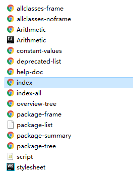

与大多数程序设计语言一样，Java中的注释也不会出现在可执行程序中。因此，可以在源程序中根据需要添加任意多的注释，而不必担心可执行代码会膨胀。在 Java 中，有 3 中标记注释的方式。

第一种方式  `//`，其注释内容要放到 `//` 的后面且到本行末尾结束。

```java
System.out.println("Hello, World!"); // 'Hello, World!' output 
```

第二种方式 `/**/`，当注释比较长时，可以使用 `/*` 和 `*/` 将注释括起来。

```java
/*
    多行注释。
*/
```

第三种方式 `/***/`，这种注释是文档注释。从 `/**` 开始，以 `*/` 结束。

```java
/**
    文档注释。
*/
```

文档注释主要负责描述类、域、方法、构造器等，并能够被  `javadoc` 工具抽取生成 HTML 文档并与源文件保存在一个地方。当修改源代码后，重新运行 `javadoc` 就可以保持源文件与文档的一致性。

文档注释中出现以 `@` 开头的标记称为 `Javadoc` 文档标记。如下所示：

| 标记        | 描述                                                         |
| ----------- | ------------------------------------------------------------ |
| @author     | 标记作者，多个作者使用多个 @author。例如，`@author Mony`     |
| @version    | 标记当前版本的描述。例如，`@version 1.0`                     |
| @since      | 标记引入特性的版本描述。例如，`@since version 1.7.1`。       |
| @deprecated | 标记类、方法或变量不再使用。                                 |
| @see        | 在该标记后添加与之关联项。可用在类、方法上。                 |
| @param      | 标记参数描述。泛型类中对泛型的类型进行描述；方法中后跟参数名，在对参数进行描述。 |
| @return     | 该标记在方法中跟返回值描述。                                 |
| @throws     | 标记抛出的异常类型，并对异常进行描述。                       |
| @exception  | 与 @throws 标签用法一样。                                    |
| @link       | 标记为链接，用于指向其它类或方法。                           |
| @value      | 标记常量的值，而且该常量必须具有 static 属性。               |
| @code       | 标记文本为代码样式。                                         |

而除了标记外，还可以使用 HTML 标签如 `<p>` 分隔段落，`<ul>` 标记列表和 `<li>`标记列表选项，但不要使用 `<h1>` 或 `<hr>` 等与文档格式起冲突的标签。

```java
/**
 * Arithmetic
 *
 * <p>
 *     This is a class that describes four operations
 * </p>
 *
 *
 * @author hireny
 * @version 1.0
 */
public class Arithmetic {

    /**
     * This is a method to do addition
     *
     * @param a summand
     * @param b addend
     * @return Value after operation
     */
    public static int add(int a, int b) {
        return a + b;
    }

    /**
     * This is a method to do subtraction
     * @param a minuend
     * @param b subtraction
     * @return Value after operation
     */
    public static int sub(int a, int b) {
        return a - b;
    }

    /**
     * This is a method to do multiplication
     *
     * @param a multiplicand
     * @param b multiplier
     * @return Value after operation
     */
    public static int mult(int a, int b) {
        return a * b;
    }

    /**
     * This is a method to do division
     *
     * @param a divisor
     * @param b divisor
     * @return Value after operation
     */
    public static int div(int a, int b) {
        return a / b;
    }

    /**
     * This is a method of division and remainder
     *
     * @param a divisor
     * @param b divisor
     * @return Value after operation
     */
    public static int rem(int a, int b) {
        return a % b;
    }
}
```

定义完一个类中的文档注释后，可以在该源文件的目录下运行 `javadoc Arithmetic.java`  生成该源文件的 HTML 文档，如果与系统默认的 GBK 编码冲突，可以使用其它编码集如 `javadoc Arithmetic.java -encoding UTF-8 -charset UTF-8`。下面是运行后生成的文件。



而如果想要对一个包生成注释，就需要在每个包下添加 `package.html` 或者 `package-info.java`；也可以对包中源文件做一个概述性的注释。如下所示：


但这样生成的文档会放在当前目录下，造成包下文件的混乱，因此，在生成文档时，要使用 `-d` 选项增加文档目录 `javadoc -d docDirectory *.java`。

`javadoc` 命令还有很多功能，并且生成文档也可以使用 IDE 提供好的工具来生成 `Javadoc` 文档。