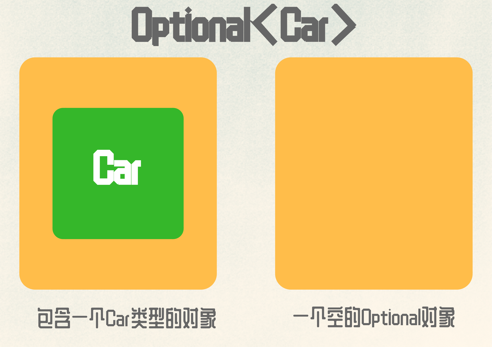

# 前言

Java 8中引入了 `Optional` 类来解决 `NullPointerException` 与繁琐的 `null` 检查，该类首次出现在 `Guava`。Java 8 才成为类库中的一部分。

# 入门

`Optional` 是一个封装值的类，用于保存类型为 `T` 的值；本质上，`Optional` 就是一个容器。 

举例来说，一个人可能有车也可能没有，那么 `Person` 类内部 `car` 变量就不应该声明为 `Car`，当变量存在时，`Optional` 类只是对 `Car` 的简单封装。变量不存在时，会使用 `Optional.empty()` 方法返回空的 `Optional` 对象。如下所示：



但是 `null` 引用和 `Optional.empty()` 有什么本质区别？从语义上，它们可以当成一回事儿，但实际上差别非常大：如果尝试解引用一个 `null`，一定会触发 `NullPointerException`，不过使用 `Optional.empty()` 是一个有效的对象。

下面我们来看一下 `Optional` 提供的功能。

# 创建

说到 `Optional` 的功能，我们首先要了解 `Optional` 实例的创建。

## 空Optional

正如前文提到，你可以通过静态工厂方法 `Optional.empty`，创建一个空的 `Optional` 对象：

```java
Optional<Car> option = Optional.empty();
```

因为 `empty()` 本身代表的就是空对象，所以调用 `get` 方法会抛出 `NoSuchElementException` 异常。

## 非空Optional

你还可以使用静态工厂方法 `Optional.of` ，依据一个非空值创建一个 `Optional` 对象：

```java
Optional<Car> optional = Optional.of(car);
```

如果 `car` 是一个 `null`，这段代码会立即抛出一个 `NullPointerException`，而不是等到你试图访问 `car` 的属性值时才返回一个错误。

## 可为null的Optional

最后，使用静态工厂方法 `Optional.ofNullable`，你可以创建一个允许 `null` 值的 `Optional` 对象：

```java
Optional<Car> optional = Optional.ofNullable(car);
```

如果 `car` 是 `null`，那么得到的 `Optional` 对象就是个空对象。我们可以查看一下它的实现原理：

```java
public static <T> Optional<T> ofNullable(T value) {
	return value == null ? empty() : of(value);
}
```

根据它的实现方式，我们可知，传入的值是空值时，会返回 `Optional.empty()`  空对象。这有利于我们封装那些可能为 `null` 的值。例如，有一个 `Map<String, Object>` 实例，访问 `key` 索引时，如果没有与 `key` 关联的值，则会返回一个 `null`。因此，我们可以使用 `Optional.ofNullable` 方法封装返回值：

```java
Optional<Object> value = Optional.ofNullable(map.get("key"));
// 可以由上代码代替 Object value = map.get("key");
```

这样可以将潜在的 `null` 隐患替换为空的 `Optional` 对象。

# 操作

我们创建了 `Optional` 实例后，需要对该实例进行操作。

## isPresent & get

在 `Optional` 类中，`isPresent` 方法对 `Optional` 实例进行判断，是否包含值，如果存在值，就返回 `true`，否则返回 `false`；与之相对的是 `isEmpty` 方法`Optional` 类中还有 `get` 方法，它是用来获取 `Optional` 实例中的值。

```java
Optional<String> optional = Optional.of("is present");
if (optional.isPresent()) {
	System.out.println("the value is " + optional.get());
}
```

`isPresent` 与 `get` 一般组合使用来避免 `NullPointerException`：

```java
public boolean isPresent() {
	return value != null;
}
public T get() {
	if (value == null) {
		throw new NoSuchElementException("No value present");
	}
	return value;
}
```

从源码中可看出，`get` 方法在取值时，要进行判空操作，如果不使用 `isPresent` 方法，可能会出现空指针异常。但是这种方式和在代码中`if(null != value)` 没有区别，因此我们要尽量避免使用该组合。

## ifPresent

除了 `isPresent` 的简洁方法，`Optional` 还提供了接收函数式参数的接口 `ifPresent`：

```java
public void ifPresent(Consumer<? super T> action) {
	if (value != null) {
		action.accept(value);
	}
}
```

该方法会接收一个消费型函数。如果 `Optional` 实例中的值不为空，则调用 `Consumer` 的 `accept` 方法对 `value` 进行消费，若为空则不做处理。上面的例子可以使用 `ifPresent` 重写：

```java
Optional<String> optional = Optional.of("is present");
optional.isPresent((val) -> System.out.println("the value is " + val));
```

## orElse

我们还可以使用 `orElse` 方法读取 `Optional` 中的值。

```java
public T orElse(T other) {
	return value != null ? value : other;
}
```

使用这种方式可以定义一个默认值，这种方式当遭遇 `Optional` 中的变量为空时，默认值会作为该方法的返回值。

```java
String optGet = null;
String orElse = Optional.ofNullable(optGet).orElse("Default");
/**
 * 输出结果：
 * Default
 */
```

## orElseGet 

如果该方法不够，我们可以使用另一种方式 `orElseGet`：

```java
public T orElseGet(Supplier<? extends T> supplier) {
	return value != null ? value : supplier.get();
}
```

该方法与 `orElse` 的区别就是值不存在时，调用实现 `Supplier` 接口的方法或Lambda表达式来返回默认值。

```java
String optGet = null;
String orElse = Optional.ofNullable(optGet).orElse(() -> "Default");
/**
 * 输出结果：
 * Default
 */
```

## orElseThrow

`orElseThrow`方法是在有值时返回其值，无值的时候会抛出由 `Supplier` 创建的异常。我们看一下它的实现原理：

```java
public <X extends Throwable> T orElseThrow(Supplier<? extends X> exceptionSupplier) throws X {
	if (value != null) {
		return value;
	} else {
		throw exceptionSupplier.get();
	}
}
```

在 `orElseThrow` 原理中，会传入一个Lambda表达式或方法，如果值不存在来抛出异常：

```java
class NoValueException extends RuntimeException {
    public NoValueException() {
        super();
    }
    @Override
    public String getMessage() {
        return "No value present in the Optional instance";
    }
}
public static Integer orElseThrow() {
	return (Integer) Optional.empty().orElseThrow(NoValueException::new);
}
public static void main(String[] args) {
	orElseThrow();
}
/**
 * 控制台会抛出异常：
 * Exception in thread "main" xx.NoValueException: No value present in the Optional instance
 */
```

`orElseThrow` 与 `orElseGet` 的区别就是一个在无值的时候抛出异常，一个在无值的时候使用Lambda表达式来实现默认值。

`orElseThrow` 只是在无值的时候抛出异常，那本身会抛出异常的方法呢？

现在，我们拿 `Integer.parseInt(String)` 做个例子：

```java
public static Integer toInt(String s) {
	try {
		// 如果String能转换为对应的Integer，将其封装在Optional对象中返回
		return Integer.parseInt(s);
	} catch (NumberFormatException e) {
		return null;	// 返回null 或者抛出异常
	}
}
```

在将 `String` 转换为 `int` 时，如果无法解析到对应的整型，该方法会抛出 `NumberFormatException` 异常。我们在该方法中使用 `try/catch` 语句捕获了该异常，不能使用 `if` 条件判断来控制一个变量的值是否为空。

这时，我们可以使用 `Optional` 类，来对无法转换的 `String` 时返回的非法值进行建模，因此，我们可以对上述方法进行改进：

```java
public static Optional<Integer> toInt(String s) {
	try {
		// 如果String能转换为对应的Integer，将其封装在Optional对象中返回
		return Optional.of(Integer.parseInt(s));
	} catch (NumberFormatException e) {
		return Optional.empty();	// 否则返回一个空的 Optional 对象
	}
}
```

这种返回 `Optional` 的方式适用很多方法，我们只需要获取被 `Optional` 包装的值的实例即可。


## map

`Optional` 提供了 `map` 方法用于从对象中提取信息，它的工作原理如下：

```java
public<U> Optional<U> map(Function<? super T, ? extends U> mapper) {
	Objects.requireNonNull(mapper);
	if (!isPresent())
		return empty();
	else {
		return Optional.ofNullable(mapper.apply(value));
	}
}
```

`map` 操作会将提供的函数应用于流的每个元素。我们可以把 `Optional` 对象看成一种特殊的集合数据，它至多包含一个元素。如果 `Optional` 包含一个值，那通过实现了 `Function` 接口的 Lambda 表达式对值进行转换。如果不熟悉 `Function` 接口，可以参考这篇文章。`map` 方法示例如下：

```java
class Car {
	private String name;
	private String type;
	...省略getter与setter...
}
Optional<Car> optional = Optional.ofNullable(car);
Optional<String> name = optional.map(Car::getName);
```

## flatMap

我们可以使用 `map` 方法来从被 `Optional` 类包装的 `Person` 类中获取 `Car` 的名称：

```java
class Person {
	private Optional<Car> car;
	public Person(Car car) {
		this.car = Optional.of(car);
	}
	...省略getter与setter...
}
Person person = new Person(new Car());
Optional<Person> optPerson = Optional.of(person);
Optional<String> name = optPerson.map(Person::getCar)
	.map(Car::getName);
```

不幸的是，这段代码无法通过编译。为什么呢？`optPerson` 是 `Optional<Person>` 类型的变量，调用 `map` 方法应该没有问题。但 `getCar` 返回的是一个 `Optional<Car>` 类型的对象，这意味着 `map` 操作的结果是一个 `Optional<Optional<Car>>` 类型的对象。因此，它对 `getName` 的调用是非法的，因为最外层的 `optional` 对象包含了另一个 `optional` 对象的值，而它当然不会支持 `getName` 方法。


所以，我们使用 `flatMap` 方法。该方法接受一个函数作为参数，这个函数的返回值是另一个流。

```java
public <U> Optional<U> flatMap(Function<? super T, ? extends Optional<? extends U>> mapper) {
	Objects.requireNonNull(mapper);
	if (!isPresent()) {
		return empty();
	} else {
		@SuppressWarnings("unchecked")
		Optional<U> r = (Optional<U>) mapper.apply(value);
		return Objects.requireNonNull(r);
	}
}
```

参照 `map` 函数，使用 `flatMap` 重写上述的示例：

```java
Optional<String> name = optPerson.flatMap(Person::getCar).map(Car::getName);
```

## filter

有时候我们需要对 `Optional` 中的值进行过滤，获得我们需要的结果，我们就可以使用 `filter` 方法：

```java
public Optional<T> filter(Predicate<? super T> predicate) {
	Objects.requireNonNull(predicate);
	if (!isPresent())
		return this;
	else
		return predicate.test(value) ? this : empty();
}
```

该方法接受 `Predicate` 谓词作为参数。如果 `Optional` 对象的值存在，并且符合谓词的条件，即操作结果为`true`，`filter` 方法不做任何改变并返回其值；否则就将该值过滤掉并返回一个空的 `Optional` 对象。

```java
Optional<String> optionalS = Optional.of("13846901234");
optionalS = optionalS.filter(s -> s.contains("138"));
/**
 * 上述 `filter` 方法满足条件可以返回同一个Optional，否则返回空Optional
 */
```

# 总结

Java 8引入的 `java.util.Optional<T>` 让我们以函数式编程的方式处理 `null`，防止空指针异常；并支持多种方式用于操作值，比如：`map`、`flatMap` 和 `filter`，这样可以抛弃嵌套的 `if-else` 代码块，设计更好的 API，代码的可读性也大大提高，但是如果在域模型中使用 `Optional`，由于没有实现 `Serializable` 接口，不能进行实例化，也不能作为类的字段。 