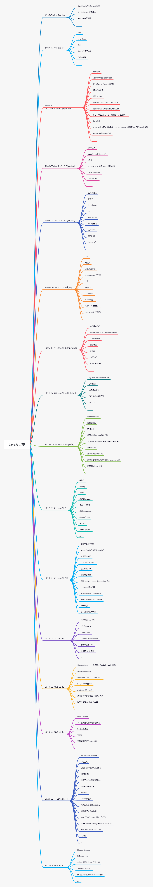
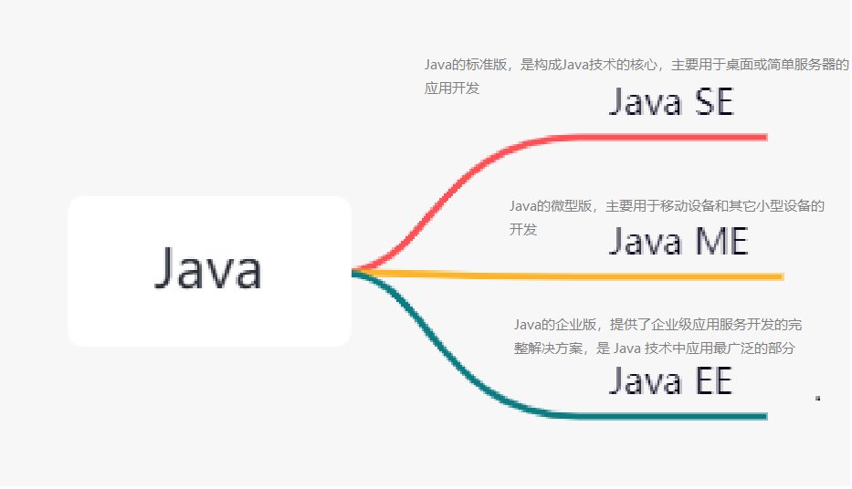
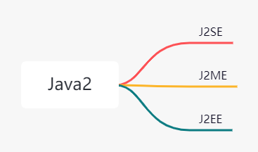
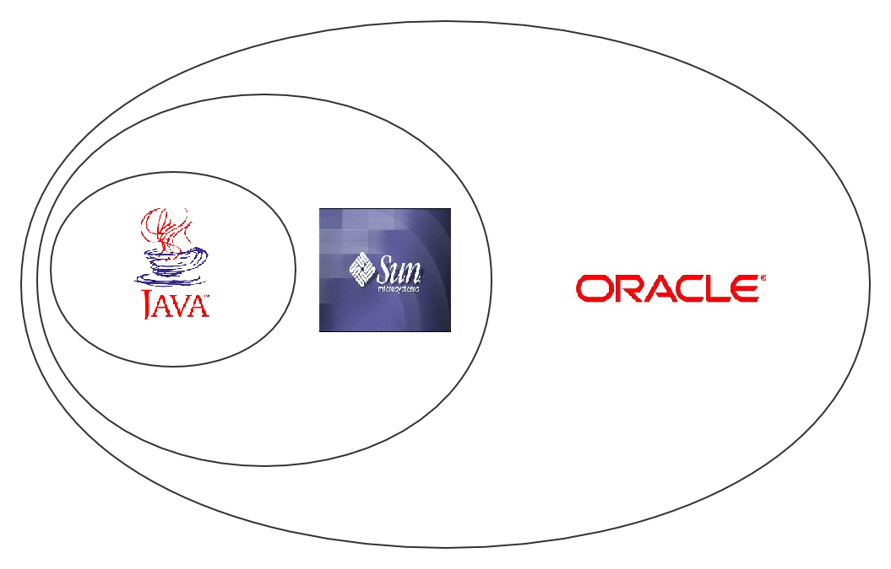
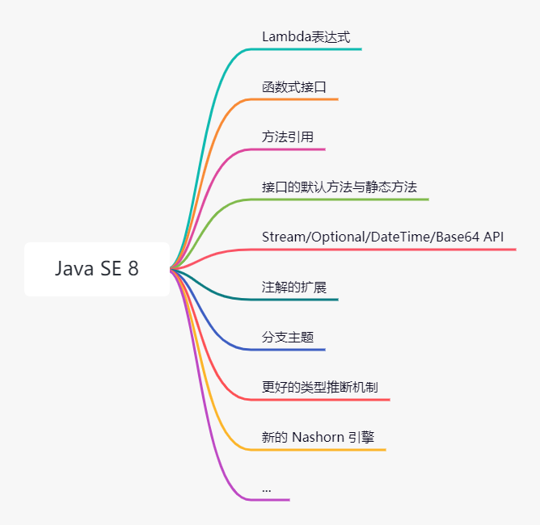

Java语言在Web开发中常用的语言，使用范围广，开发人员多、且是跨平台的面向对象语言，因此企业通常会选择Java进行开发。如果想要学习这门语言，应该先从它的历史、发展来看，这样才能很好的对Java有一个大概的了解。

## 发明Java

在 1991 年 4 月，James Gosling 所在的 Sun 公司技术小组创建了 Oak 项目，运行在虚拟机上的语言，同时允许运行在电视机顶盒等多平台上。然而，当注册 Oak 时，被发现其他公司已经注册，不可再用。因此改名 Java（当时他们正在咖啡馆喝着印尼瓜娃(Java)岛出产的咖啡），并在 SunWorld 大会上正式发布 Java 1.0 版本，提出了 “Write Once，Run Anywhere” 的口号。

## Java 的发展

Java 已经经过了20多年的发展，已经是一个成熟的编程语言了，下面介绍主要的版本。

首先是 Java 语言正式诞生的日子，是在 1995 年 05 月 23 日，学习 Java 语言的各位不要记错了。而直到 1996 年 01 月 23 日，才发布了第一个 JDK 1.0 版本。

而在 1998 年 12 月 08 日，正式发布的 JDK 1.2 版本，是一个比较重要的版本。在该版本中，将 Java 体系分成了 J2SE、J2ME 和 J2EE 三个版本。

三个版本分别标志着 Java 向桌面、移动和企业三个领域进军，也是Java的飞速发展时期。同时在 JDK 1.2 中以附加程序提供 HotSpot（开发该虚拟机的“Longview Technologies” 公司在1997年被Sun收购） ，在后来，成为 JDK 1.3 及之后版本的默认虚拟机。在 2000 年发布的 JDK 1.3 及之后发布的版本会每两年发布一个主版本，并以动物命名，而修改版使用昆虫命名。

2002 年 02 月 26 日，发布的 J2SE 1.4 版本是一个走向成熟的版本，首次在 JCP 下发行。同年，微软发布了 .NET Framework 技术，与 Java 平台开始了比较和竞争。

自从 2004 年 09 月 30 日，发布的 J2SE 5 在语法易用性上做了很大的改进。添加了泛型、元数据、枚举，提供了 java.util.concurrent 并发包等许多新特性。而且 JDK 1.5 是官方声明的支持 Windows 9x 的最后一个版本。

而在 2006 年 11 月 13 日，Sun 在 JavaOne 大会上将 Java 开源了，随后，陆续将 JDK 各部分使用 GPL v2 协议开源，并建立 OpenJDK 组织对源码进行管理，但也有少量具有产权的代码没开源。同年 12 月 11 日，发布的 JDK 1.6 终结了从 JDK 1.2 开始已有 8 年历史的 J2(SE/ME/EE)的命名方式。启用了 Java SE/ME/EE + 数字的命名方式。

而且在 Java SE 7 中，OpenJDK 与 Sun JDK 基本上都一样，OpenJDK是主开发版本，Sun JDK 只是在 OpenJDK 之上，添加了版权注释和少部分源码被替换掉。自从 JDK 1.6 之后，Sun 由于经济危机和收购案等原因并没有保持两年发布一个版本的速度。因此 JDK 1.6 一直到 12 年 才完全截止。

2009 年 02 月 19 日，本来的计划中是在 2010 年 09 月 09 日发布一个具有里程碑的  JDk 1.7 版本，但由于在开发 JDk 1.7 中，Sun 陷入技术竞争和商业竞争的泥潭中，无力按照计划研发完成。因此，Oracle 在 2009 年 04 月 20 日，以 74 亿美元收购了 Sun 的不久后，执行 “B计划” 来裁剪 JDK 1.7 预期目标，保证 2011 年 07 月 28 日准时发布，防止再次 “跳票”。且 Java SE 7 Update 4 开始支持 Mac OS X，且在 Update 6 达到完全支持并支持 ARM 指令集架构。因此，Oracle JDK 完全支持常见的操作系统（Windows、Linux、Solaris和Mac OS）和指令集架构（ARM、x86、x64和Sparc）。由于 Oracle 已收购 BEA 公司，具有目前三大商业虚拟机的两个：JRockit与 HotSpot，因此，Oracle向在接下来的1~2年内，将这两个虚拟机取长补短，合二为一。

而在 2014 年 03 月 18 日，Oracle 发布的 Java SE 8，将 JDK 1.7 中裁掉的功能在该版本中实现了，其中最具代表的就是在Java中使用函数式编程的语法糖。并且这个版本还是一个长期支持的版本。

2017 年 09 月 21 日，发布的 Java SE 9 版本中，个人觉得最主要的功能就是模块系统。该功能根据模块的需要加载程序运行需要的`class` 文件，而不是将整个Jar 都加载进JVM 内存中，用来减少内存开销。而 2018 年 09 月 26 日，发布的 Java SE 11 版本是大版本周期变化的第一个长期支持版本，这是一个非常值得关注的版本。

而在之后更新的 12/13/14/15 版本中，基本上只是对新功能的测试和发布，还没有长期支持的版本，但也有一些值得关注的特性，可以关注一下。

## 总结

以上就是Java发展史的简单总结，而一种语言如果想要长久的发展，就要不断的进行更新，保持行业领先，并且Java使用前景也比较广阔，许多企业都在使用，而如果要学习的同学们，可以选择长期支持版本进行学习，而 Java SE 8 在现在使用的比较多的版本，而如果进行微服务开发和公司有需求，学习 Java SE 11 也是可以的。