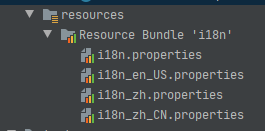

每个面向国际的语言都需要有自己的国际化解决方案，Java 从一开始就是用 `Unicode` 来处理所有的字符串，这让 Java 具备了国际化的一个重要特性。除了提供 `Unicode` 之外，Java 还需要解决不同区域的表示形式。

## Locale

`java.util` 包中提供了 `Locale` 类用来处理不同的语言和区域上的国际化问题。使用 `Locale` 类可以定制一个区域的信息，而 `Locale` 类提供了如下构造方法来构造 `Locale` 对象。

```java
public final class Locale implements Cloneable, Serializable {
    // 从语言，国家和变体构造语言环境
    public Locale(String language, String country, String variant) {
        ···
    }
    // 从语言和国家构造语言环境
    public Locale(String language, String country) {
        ···
    }
    // 从语言代码构造语言环境
    public Locale(String language) {
        ···
    }
}
```

由构造方法可知，构造一个 `Locale`，可以设置语言、国家或地区、和变体。语言是由 2 个或 3 个小写字母表示，例如 `zh`、`en` 或 `de`。这里可以查看 `ISO-639-1` 语言代码标识。

 `Locale` 中预定义了大量的 `Locale` 语言，他们只设定了语言而没有设定国家，如下所示。

```java
// 英语
public static final Locale ENGLISH = createConstant("en", "");
// 法语
public static final Locale FRENCH = createConstant("fr", "");
// 德语
public static final Locale GERMAN = createConstant("de", "");
// 意大利语
public static final Locale ITALIAN = createConstant("it", "");
// 日语
public static final Locale JAPANESE = createConstant("ja", "");
// 韩语
public static final Locale KOREAN = createConstant("ko", "");
// 汉语
public static final Locale CHINESE = createConstant("zh", "");
// 简体中文
public static final Locale SIMPLIFIED_CHINESE = createConstant("zh", "CN");
// 繁体中文
public static final Locale TRADITIONAL_CHINESE = createConstant("zh", "TW");
```

国家和地区也是由 2 个大小字母或 3 个数字表示，例如 `CN`、`US` 或 `DE`。这里可以查看 `ISO-3166-1` 中的国家或地区标识。

`Locale` 中也为各个国家预定义了 `Locale` 对象，如下所示。

```java
// 法国
public static final Locale FRANCE = createConstant("fr", "FR");
// 德国
public static final Locale GERMANY = createConstant("de", "DE");
// 意大利
public static final Locale ITALY = createConstant("it", "IT");
// 日本
public static final Locale JAPAN = createConstant("ja", "JP");
// 韩国
public static final Locale KOREA = createConstant("ko", "KR");
// 中国
    public static final Locale CHINA = SIMPLIFIED_CHINESE;
// 中华人名共和国
public static final Locale PRC = SIMPLIFIED_CHINESE;
// 台湾
public static final Locale TAIWAN = TRADITIONAL_CHINESE;
// 英国
public static final Locale UK = createConstant("en", "GB");
// 美国
public static final Locale US = createConstant("en", "US");
// 加拿大
public static final Locale CANADA = createConstant("en", "CA");
// 法国裔加拿大
public static final Locale CANADA_FRENCH = createConstant("fr", "CA");
// 表示根语言环境的常量
public static final Locale ROOT = createConstant("", "");
```

变体，用于指定各种杂项特性，如果有多个变量值，每个变量值都指示其自己的语义，则这些值应按重要性排序，并用下划线分隔。变体字段区分大小写。

`Locale` 除了构造方法可以构造 `Locale` 对象，Java SE 7 还提供了 `forLanguageTag` 静态方法来构建 `Locale` 对象，如下所示：

```java
Locale zhChinese = Locale.forLanguageTag("zh-CN");
Locale twChinese = Locale.forLanguageTag("zh-TW");
System.out.println(zhChinese.getDisplayName());
System.out.println(twChinese.getDisplayName());
// 中文（中国）
// 中文（台湾）
```

`Locale` 中 `setDefault` 方法可以将更改默认地区，并使用 `getDefault` 方法获取当前的 `Locale` 对象，如下所示：

```java
System.out.println(Locale.getDefault());
Locale.setDefault(Locale.US);
System.out.println(Locale.getDefault());
// zh_CN
// en-US
```

`Locale` 中提供的 `getAvailableLocale` 静态方法会返回由 JVM 所能够识别的所有 `Locale` 构成的数组。

## ResourceBundle

使用 `Locale` 设置具体的语言和区域后，就可以使用 `ResourceBundle` 根据不同的 `Locale` 对资源进行加载。资源需要放在 `resources` 资源包中，并根据不同 `Locale`  设置对应的资源文件。如下所示，通过 `ResourceBundle` 类提供的 `getBundle` 静态方法，来根据 `locale` 自动绑定对应的资源文件。

```java
Locale locale = Locale.CHINA;
ResourceBundle bundle = ResourceBundle.getBundle("i18n", locale);
```

查找一个具体的字符串，可以调用

```java
String language = bundle.getString("language");
```

这里的资源文件的名称使用统一的命名规则，然后根据不同的区域，要标识其本地信息的附加部分。例如，一个资源包的命名是 `i18n`，则与中文、英文环境相对应的资源如下图所示。



这里可以把默认资源放在一个没有后缀 `i18n` 文件中，然后 `getBundle` 方法定位 `i18n_zh_CN` 时，还会继续查找文件 `i18n_zh` 和默认文件 `i18n` 这两个文件，如果这些文件存在，它们在资源层次中会成为 `i18n_zh_CN` 的父文件。以后，当查找一个资源时，如果当前资源文件中没有找到，就会去查找其父资源文件。

后缀名为 `.properties` 的文件中，属性是采用 `=` 分隔的键值对的形式，如下所示：

```properties
language=中文
color=红色
```

`ResourceBundle` 是一个抽象类，如下所示。

```java
public abstract class ResourceBundle {
    ...
}
```

继承了 `ResourceBundle` 的类有具体的实现类 `PropertyResourceBundle` 和抽象类 `ListResourceBundle`。而 `PropertyResourceBundle` 是用来支持 `ResourceBundle` 读取 `properties` 资源文件的具体子类，但不需要直接使用 `PropertyResourceBundle`，`ResourceBundle.getBundle` 会自动查找相应的属性文件，并创建一个引用它的 `PropertyResourceBundle`。但是 `properties` 资源文件提供的值只能是字符串。

如果想提供以外的资源，需要继承 `ListResourceBundle` 抽象类并把所有资源放到一个对象数组中并提供查找功能，如下所示。

```java
public class I18N extends ListResourceBundle {
    @Override
    protected Object[][] getContents() {
        return new Object[][]{
                {"color", "yellow" }
        };
    }
}
public class I18N_zh extends ListResourceBundle {
    @Override
    protected Object[][] getContents() {
        return new Object[][]{
                {"language", new String[]{"简体中文", "繁体中文"}}
        };
    }
}
public class I18N_zh_CN extends ListResourceBundle {
    @Override
    protected Object[][] getContents() {
        return new Object[][]{
                {"language", "简体中文"},
                {"color", new String[]{"红色", "黄色", "黑色"} }
        };
    }
}
```

这里的类的命名规则也使用标准命名规则来命名。然后使用 `getBundle` 方法来加载对应的类：

```java
ResourceBundle bundle = ResourceBundle.getBundle("I18N", Locale.forLanguageTag("zh-CN"));
System.out.println(bundle.getString("language"));
System.out.println(Arrays.toString(bundle.getStringArray("color")));
```

除此之外，资源包类也可以继承 `ResourceBundle` 类进行扩展，但是需要实现两个方法，一是枚举所有键，二是用给定的键查找相应的值：

```java
Enumeration<String> getKeys();
Object handleGetObject(String key);
```

`ResourceBundle` 类的 `getObject` 方法会调用你提供的 `handleGetObject` 方法。

## NumberFormat

`java.text` 包中的 `NumberFormat` 可以根据不同的 `Locale` 对数值进行格式化和解析。

使用 `getNumberInstance` 静态方法获取对数字进行格式化和解析的实例，然后将对应的数字进行格式化，看相应的 `Locale` 实例对应的格式化如何不同。

```java
NumberFormat numberFormat = NumberFormat.getNumberInstance(Locale.SIMPLIFIED_CHINESE);
String result = numberFormat.format(2021.0731);
System.out.println(result);
```

结果是 `2,021.073`，更换成美国、德国等的结果分别是 `2,021.073` 和 `2.021,073`。当数字值为货币的时候，使用 `getCurrencyInstance` 静态方法，如下所示。

```java
NumberFormat currencyFormat = NumberFormat.getCurrencyInstance(Locale.SIMPLIFIED_CHINESE);
String result = currencyFormat.format(2021.0731);
System.out.println(result);
```

结果是 `￥2,021.07`，更换成美国、德国等的结果分别是 `$2,021.07` 和 `2.021,07 €`。

处理货币时，可以使用 `Currency` 类来控制货币，可以通过 `Currency.getInstance` 静态方法传入一个货币标识并返回 `Currency` 对象，然后调用 `NumberFormat` 中的 `setCurrency` 方法。下面的例子是给德国用户设置人民币的格式，如下所示。

```java
NumberFormat currencyFormat = NumberFormat.getCurrencyInstance(Locale.SIMPLIFIED_CHINESE);
currencyFormat.setCurrency(Currency.getInstance("CNY"));
String result = currencyFormat.format(2021.0731);
System.out.println(result);    // 2.021,07 CN¥
```

货币标识符由 `ISO-4217` 定义，下面就简单的介绍几种货币标识符。

|货币值|标识符|货币值|标识符|
|:---:|:---:|:---:|:---:|
|U.S.Dollar|USD|Chinese Renminbi(Yuan)|CNY|
|Euro|EUR|Indian Rupee|INR|
|British Pound|GBP|Russian Ruble|RUB|
|Japanese Yen|JPY|||

## DateTimeFormatter

每个国家和地区对日期和时间的显示都不可能相同，Java SE 8 提供了 `java.time.DateTimeFormatter` 类来处理与 `Locale` 相关的日期和时间，格式化和解析出符合本地日期和时间的表示方法。如下所示，使用 `DateTimeFormatter` 中的 `withLocale` 设置不同的 `Locale`。

```java
DateTimeFormatter dateFormatter = DateTimeFormatter.ofLocalizedDate(FormatStyle.FULL).withLocale(Locale.SIMPLIFIED_CHINESE);
```

之后，就可以格式化 `LocaleDate`、`LocaleDateTime`、`LocaleTime` 和 `ZonedDateTime` 了。

```java
ZonedDateTime appointment = ZonedDateTime.now();
String formatted = formatter.format(appointment);
```

输出的结果是 `2021年7月31日星期六`，更换成美国、德国的结果分别是 `Saturday, July 31, 2021` 和 `Samstag, 31. Juli 2021`。输出一个地区的第一天时，可以通过 `Locale` 设置，如下所示。

```java
DayOfWeek first = WeekFields.of(locale).getFirstDayOfWeek();
```

## MessageFormat 需修改

一段消息中也会根据不同的 `Locale` 进行变更的可变数据，Java 提供了 `java.text.MessageFormat` 来对消息进行格式化。如下一段话：

```Java
String msg = "On {2}, {0} destroyed {1} houses and caused {3} of damage."
```

括号中的数字是占位符，可以通过 `MessageFormat.format` 静态方法使用实际的值来替换占位符。它是一个 `varargs` 方法，所以可以通过下面的方法提供参数：

```java
String result = MessageFormat.format(msg, "a hurricane", 99, new GregorianCalendar(1999, 0, 1).getTime(), 10.0E8);
```

输出结果是：

```shell
On 1/1/99 12:00 AM, a hurricane destroyed 99 houses and caused 100,000,000 of damage.
```

上面的例子还可以为占位符提供可选的格式，将打印的内容变得更为精细。

```java
On {2, date, long}, {0} destroyed {1} houses and caused {3, number, currency} of damage.
```

输出结果是：

```shell
On January 1, 1999, a hurricane destroyed 99 houses and caused $100,000,000 of damage.
```

一般来说，占位符索引后面可以跟一个 `type` 和一个 `style`，它们之间用逗号隔开。

`MessageFormat.format` 静态方法使用当前的 `Locale` 对值进行格式化。要想用任意的 `Locale` 进行格式化，需要为这个类提供可以使用的 `varargs` 方法。你需要把将要格式化的值置于 `Object[]` 数组中，如下所示。

```java
MessageFormat mf = new MessageFormat(pattern, locale);
String msg = mf.format(new Object[] {values});
```