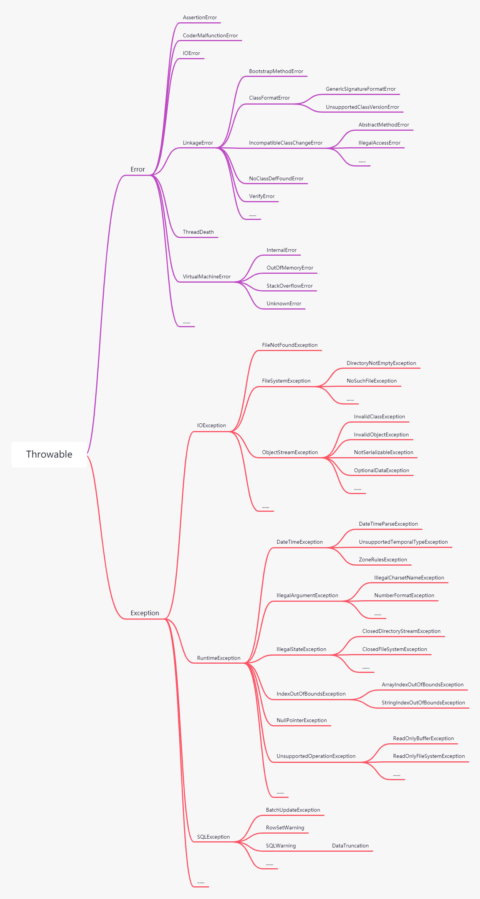
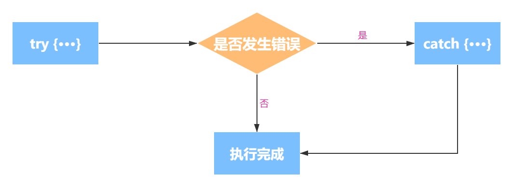
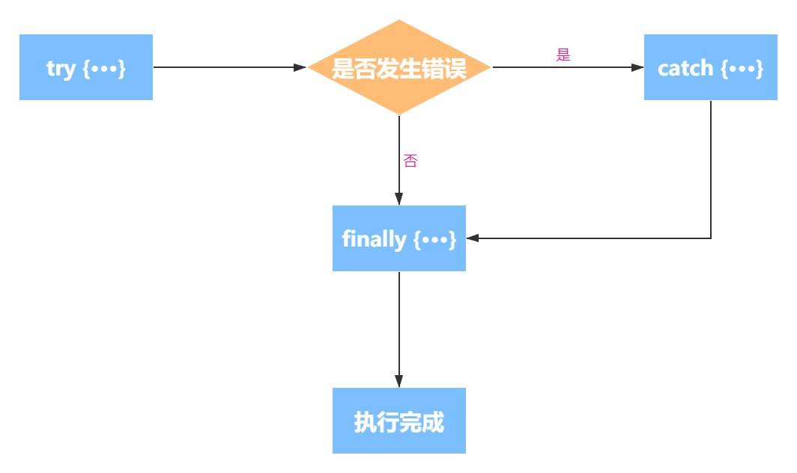

在开发应用的过程中，理想的状态就是不要有错误发生，就算要发生错误，也要在编译期间检测出来。然而在现实中，程序在运行时出现错误都会时有发生，并不会被预料到，置之不理的话，会导致程序崩溃。

在 C 语言中，程序会通过返回一个非正常值表示错误，而程序员通过使用如 `if-else` 等操作检测可能发生异常的情况并处理，这样会使得代码变得非常麻烦臃肿。而 Java 提供一种异常处理的错误捕获机制处理程序中的异常，减少错误检查，提供可靠的应用程序。

假设在一个 Java 程序运行期间出现了一个错误。这个错误可能是由于文件包含了错误信息，或者网络连接出现问题造成的，也有可能是因为使用无效的数组下标，或者试图使用一个没有被赋值的对象引用而造成的。

## 异常体系

Java 提供了以面向对象的思想为基础的一系列描述错误类型的对象，本身带有类型信息。它是以 `Throwable` 作为异常的基类来表示的异常体系，而 `java.lang.Throwable` 类作为基类，可以代替所有异常类抛出，但并不推荐这样做。



Java 语言提供了三种 `throwable`：`run-time exception`、`checked exception` 和 `error`。

- `error`：用来描述 Java 运行时系统的内部错误和资源耗尽错误，程序不应该抛出这种类型的对象。
- `run-time exception`：运行时异常，`RuntimeException` 类及其子类在运行期间可能出现的错误。编译器不会检查此类异常。此类异常属于不可查异常，一般是由程序逻辑错误引起的，在程序中可以选择捕获处理，也可以不处理。
- `checked exception`：受检异常，`Exception`中除`RuntimeException`及其子类之外，编译器会检查此类异常，如果出现程序中此类异常，必须声明异常或捕获异常，否则编译无法通过。

`checked exception` 和 `run-time exception` 都是 `Exception` 类层次结构的分支。

对于使用异常的原则是：如果期望调用者能够适当地恢复，对于这种情况就应该使用受检异常。

但声明要抛出的每个受检异常，都是强迫程序员处理异常的条件，以此增强可靠性。但这种方式会增加程序员的负担。当程序员无法对受检异常正确的处理，那么未受检的异常可能会更合适。

因此，如果调用者无法恢复错误，就应该抛出未受检异常。如果可以恢复，并且想要迫使调用者处理异常的条件，返回一个 `Optional` 值。万一失败且无法提供足够的信息时，才应该抛出受检异常。

<small>注意：`Exception`和 `Error` 的区别：`Exception`  能被程序本身处理， `Error` 是无法处理的。<small>

## 声明异常

如果在方法中不想处理异常情况，可以使用 `throws` 关键字在方法中声明要抛出的异常。如下例子：

```java
public int read(File file) throws IOException {
    ...
}
```

在读取文件内容时，不管是文件不存在，还是内容为空，都会向外抛出 `IOException` 异常。

不是什么情况都需要使用 `throws` 声明要抛出的异常，需记住，遇到以下 4 种情况时应该抛出异常：

1. 调用一个抛出受检异常的方法，例如，`FileInputStream` 构造器。
2. 程序运行过程中发现错误，并且利用 `throw` 语句抛出一个受检异常。
3. 程序出现错误，例如，`a[-1]=0`会抛出一个 `ArrayIndexOutOfBoundsException`这样的非受检异常。
4. Java虚拟机和运行时库出现的内部错误。

对于可能被他人使用的 Java 方法，应该根据异常规范，在方法的首部声明这个方法可能抛出的异常。

声明异常时，不要声明 Java 中的 `Error` 及其子类错误，也不需要声明从 `RuntimeException` 继承的哪些非受检异常。

```java
public static void get(int index) throws ArrayIndexOutOfBoundsException { ··· }
```

这些运行时异常完全在控制之下。

总之，一个方法必须声明所有可能抛出的受检异常，而非受检异常要么不可控制（Error），要门就应该避免发生（RuntimeException）。如果方法没有声明可能发生的受检异常，编译器就会发出一个错误消息。

## 抛出异常

上面只是介绍了声明异常，但是异常是如何产生的呢？下面给出一个例子：

```java
public File getFile(String path) throws FileNotFoundException {
    File file = new File(path);
    if (file.exists()) {
        return file;
    }
    throw new FileNotFoundException(path + " File Not Found!");
}
```

从上面的例子中，会了解到声明异常的产生是因为使用 `throw` 关键字抛出一个异常，表示文件没有找到。上面抛出异常的 `throw new FileNotFoundException()` 写法也可以换成如下写法：

```java
FileNotFoundException ex = new FileNotFoundException();
throw e;
```

一旦方法抛出了异常，这个方法就不可能返回到调用者。也就是说，不必为返回的默认值或错误代码担忧。

## 自定义异常

当 Java 异常体系中没有任何标准异常类能够充分地描述问题的时候，可以自定义一个异常类来描述。Java 自定义异常只需要派生于 `Exception` 类及其子类即可。如下所示：

```java
public class ErrorDetail {
    public ErrorDetail(ErrorCode errorCode, String errorMsg) {
        this.errorCode = errorCode;
        this.errorMsg = errorMsg;
    }
    private final ErrorCode errorCode;
    private final String errorMsg;
    @Override
    public String toString() {
        return "code:" + errorCode + ", msg:" + errorMsg;
    }
}
public class CustomException extends Exception {
    private ErrorDetail detail;
    public CustomException(ErrorDetail detail) { this.detail = detail; }
    @Override
    public String toString() { return "CustomException [" + detail + "]"; }
}
```

可以在自定义的异常类中定义自己的变量和方法来传递额外的异常信息。虽然可以自己定义异常类，但还是优先使用标准库中提供的异常类。使用标准的异常有许多好处：

1. 使得 API 更易于学习和使用。
2. 使得 API 可读性会更好。
3. 异常类越少，意味着内存占用就越小，装载这些类的时间开销也越少。

当所抛出的错误与标准库中的异常类的语义相当，就可以使用标准的异常。但是也不要直接重用 `Exception`、`RuntimeException`、`Throwable` 或者 `Error`。因为这些异常类是其他异常类的基类，相当于抽象类，无法可靠地测试这些异常。


## 捕获异常

声明异常和抛出异常的过程非常简单，只要将其抛出就不用理睬，因为声明异常的方法已经控制异常的权限交给了调用的方法。当然，有时不需要声明异常，而是对异常进行处理。

### 捕获异常

在 Java 中，需要使用 `try-catch` 语句块捕获异常。如下是 `try-catch` 语句块的执行方式：



1. 当 `try` 语句块没有抛出异常时，执行完`try`语句块后执行步骤3；而 `try` 语句块中抛出异常时，跳过 `try` 语句其余代码执行步骤 2；`try` 语句块抛出 `catch` 子句中没有声明的异常类型，`try-catch`语句块所在的方法会立刻退出。
2. 执行 `catch` 子句中的处理器代码。
3. `try-catch`语句块执行完成。

下面给出一个读取数据的例子：

```java
public void read(File file) {
    try {
        InputStream in = new FileInputStream(file);
        int len;
        byte[] buf = new byte[4096];
        while ((len = in.read(buf)) != -1) {
            System.out.println(new String(buf, 0, len));
        }
    } catch (IOException ex) {
        // Process IOException
    } 
}
```

如上所示，当 `in.read()` 方法会抛出一个 `IOException` 异常时，会跳出 `while` 循环，进入 `catch` 子句，并生成一个栈轨迹。

### 捕获多个异常

当 `try` 语句块中抛出多个异常时，就需要使用 `catch` 子句对不同类型的异常做不同的处理。`catch` 子句会按照顺序执行，且只有一个被执行。下面给出一个例子：

```java
public Object readObject(InputStream in) {
    try {
        ObjectInputStream ois = new ObjectInputStream(in);
        return ois.readObject();
    } catch (IOException e) {
        e.printStackTrace();
    } catch (ClassNotFoundException e) {
        e.printStackTrace();
    }
}
```

上面多个 `catch` 子句中的异常类型彼此之间不存在子类关系时，可以使用 Java SE 7 推出的同一个 `catch` 子句捕获多个异常类型的功能。如下所示：

```java
public Object readObject(InputStream in) {
    try {
        ObjectInputStream ois = new ObjectInputStream(in);
        return ois.readObject();
    } catch (IOException | ClassNotFoundException e) {
        e.printStackTrace();
    }
}
```

也可以将上面 `catch` 子句处理的多个异常，使用异常类型的基类 `Exception` 代替。如下所示：

```java
public Object readObject(InputStream in) {
    try {
        ObjectInputStream ois = new ObjectInputStream(in);
        return ois.readObject();
    } catch (Exception e) {
        e.printStackTrace();
    }
    return null;
}
```

当捕获异常后，不要通过空的 `catch` 子句忽略它。如下所示:

```java
try {
    ...
} catch (CustomException e) {
    // Ignore
}
```

忽略异常后，程序在出现错误的情况下会悄然地执行下去，而不是提示错误。也许会在将来的程序埋下隐患。最好是正确地处理异常，避免失败，或者将异常抛出，导致程序失败，从而保留以后调试该失败的有用信息。

### 异常转译

如果抛出的异常与执行的任务没有明显的联系时，会令人困惑，也会 “污染” 具有实现细节的更高层的 API。因此，高层实现应该捕获低层的异常，并抛出按照高层抽象实现的异常。这种做法称为 **异常转译** 。下面的例子是使用 `catch` 子句将捕获到的异常包装为需要的异常并重新抛出：

```java
try {
    ObjectInputStream ois = new ObjectInputStream(in);
    return ois.readObject();
} catch (IOException | ClassNotFoundException e) {
    throw new SerializationException(e);
} 
```

#### 异常链

异常链就是一种特殊的异常转译。如果低层的异常对高层的异常调试有帮助，就可以使用异常链。所有实现 `Throwable` 的子类都可以使用 `getCause()` 方法获取原始异常并当成参数构造新的异常。

```java
public class CustomException extends Exception {
    public CustomException(Throwable cause) {
        super(cause);
    }
}
```

大多数标准的异常都有支持链的构造器。对于没有支持链的异常，可以利用 `Throwable` 的 `initCause(Throwable cause)` 方法设置`cause`。异常链不仅让你可以通过程序访问原因，还可以将原因的堆栈轨迹集成到更高层的异常中。

异常转译与直接抛出异常相比有所改进，但也不能滥用。最好是确保低层方法能成功执行，避免抛出异常。如果不能阻止或者处理来自更底层的异常，一般使用异常转译；其次，低层方法抛出的异常符合更高层的话，将异常传播到更高层，中间可以使用异常转译抛出适当的高层异常。

### 堆栈轨迹

当程序因为异常未被捕获而失败时，系统会自动打印该异常的堆栈轨迹。在堆栈轨迹中包含该异常的描述信息，即异常的`toString()`方法。通常包含异常的类名，以及紧随其后的细节消息（`detail message`）。

可以使用 `Throwable` 类提供的 `printStackTrace()` 方法访问堆栈轨迹的信息。

```java
Throwable t = new Throwable();
StringWriter out = new StringWriter();
t.printStackTrace(new PrintWriter(out));
String desc = out.toString();
```

也可以通过 `getStackTrace()` 方法获取一个描述堆栈轨迹的 `StackTraceElement` 数组对象。如下所示：

```java
public class PrintStackTrace {
    static void first() throws CustomException {
        second();
    }
    static void second() throws CustomException {
        third();
    }
    static void third() throws CustomException {
        throw new CustomException(new ErrorDetail(ErrorDetail.ErrorCode.PASSWORDERROR, "密码错误"));
    }
    public static void main(String[] args) {
        try {
            first();
        } catch (CustomException e) {
            for (StackTraceElement stackTraceElement : e.getStackTrace()) {
                System.out.println(stackTraceElement);
            }
        }
    }
}
```

输出结果如下：

```shell
xxx.xxx.xxx.PrintStackTrace.third(PrintStackTrace.java:23)
xxx.xxx.xxx.PrintStackTrace.second(PrintStackTrace.java:18)
xxx.xxx.xxx.PrintStackTrace.first(PrintStackTrace.java:13)
xxx.xxx.xxx.PrintStackTrace.main(PrintStackTrace.java:30)
```

因为堆栈信息是调查程序失败原因时必须检查的信息。失败的情形不容易重现的话，想获得更多的信息会非常困难，甚至不可能。因此，要在 `toString()` 方法中尽可能多地返回有关失败原因的信息，以便进行分析。但 **千万不要在堆栈消息中包含密码、密钥以及类似的信息** ！

### finally 子句

当执行一个 `try-catch` 语句块时，代码抛出异常会执行相应的 `catch` 子句中的异常处理，并退出这个方法的执行。然而，我们希望一些有些代码会在处理完 `try-catch` 语句块后被调用。Java 提供了 `finally` 子句来解决这个问题。`try-catch-finally` 语句块无论是否有异常发生， `finally` 子句中的代码都会执行。

`try-catch-finally` 语句块的执行顺序如下：



1. 正常执行 `try` 语句块，当 `try` 语句块中代码执行完，执行步骤 3；如果 `try` 抛出异常，执行步骤 2。
2. 执行与步骤 1 抛出的异常相匹配的 `catch` 子句，异常处理完，执行步骤 3。
3. 执行 `finally` 子句的代码。

下面给出 `try-catch-finally` 的例子：

```java
public void read(File file) {
    InputStream in = null;
    try {
        in = new FileInputStream(file);
        int len;
        byte[] buf = new byte[4096];
        while ((len = in.read(buf)) != -1) {
            System.out.println(new String(buf, 0, len));
        }
    } catch (IOException ex) {
        // Exception Handler
    } finally {
        try {
            Objects.requireNonNull(in).close();
        } catch (IOException e) {
            // Exception Handler
        }
    }
}
```

在上面的代码中，无论是否会调用 `catch` 子句处理异常，最后都会调用 `finally` 子句将 `InputStream` 资源关闭。也有特殊情况，会使 `finally` 子句不会被执行：

1. `finally` 子句中发生异常。
2. 在前面代码中使用 `System.exit(int status)` 退出程序。
3. 程序所在线程死亡。
4. 关闭`cpu`。


因此，使用 `try-catch-finally` 语句块时，将可能会抛出异常类型的代码块放在 `try` 语句块中执行；将无论 `try` 语句块怎么退出，始终能被执行的代码放在 `finally` 子句中。

事实上，使用 `try-finally` 语句确保资源会被适时关闭是比较不错的选择，但还是建议将上面的例子解耦合 `try-catch` 和 `try-finally` 语句块，用于提高代码的清晰度。

```java
public void read(File file) {
    InputStream in = null;
    try {
        try {
            in = new FileInputStream(file);
            int len;
            byte[] buf = new byte[4096];
            while ((len = in.read(buf)) != -1) {
                System.out.println(new String(buf, 0, len));
            }
        } finally {
            in.close();
        }
    } catch (IOException ex) {
        ex.printStackTrace();
    } 
}
```

当 `try` 子句和 `finally` 子句中都有 `return` 语句时，会执行 `finally` 子句中的代码段，并且 `finally` 子句的返回值会覆盖 `try` 子句中的返回值。如下所示：

```java
public static int process(int value) {
	try {
		return value * value;
	} finally {
		if (value == 2) {
			return 0;
		}
	}
}
```

<small>注意：`try`、`catch`、`finally` 三个子句不能单独使用，三者可以组成`try-catch`、`try-finally` 和 `try-catch-finally` 三种语句块。</small>

### try-with-resources

上面的例子使用 `try-finally` 语句块用来关闭资源，将需要关闭的资源放在 `finally` 子句中确保资源关闭，但这种语法会显得太繁琐，但这种情况在 Java SE 7 中被改进。

Java SE 7 引入了 `try-with-resources` 语法用来关闭资源，使用这种语法需要实现 `java.lang.AutoCloseable` 接口：

```java
public interface AutoCloseable {
    void close() throws Exception;
}
```

Java 5 中的 `Closeable` 已经被修改，修改之后的接口继承了 `AutoCloseable` 接口。所有实现了 `Closeable` 接口的对象，都支持 `try-with-resources` 特性。

另外，Java SE 5 中的 `Closeable` 接口也继承了 `AutoCloseable` 接口，与 `AutoCloseable` 的差异处就是抛出的异常类型不同：

```java
public interface Closeable extends AutoCloseable {
    public void close() throws IOException;
}
```

如果编写一个类，它代表的是必须被关闭的资源，那么也需要实现 `AutoCloseable` 接口。

下面是使用 `try-with-resources` 语法来简化上面的代码：

```java
public void read(File file) {
    InputStream in = null;
    try (InputStream in = new FileInputStream()) {
        in = new FileInputStream(file);
        int len;
        byte[] buf = new byte[4096];
        while ((len = in.read(buf)) != -1) {
            System.out.println(new String(buf, 0, len));
        }
    } catch (IOException ex) {
        // Exception Handler
    } 
}
```

使用 `try-with-resources` 使得代码变得更简洁易懂，因此，优先考虑用 `try-with-resources`，而不是 `try-finally` 。


## 总结

异常是 Java 不可分割的一部分，因此要学习如何正确的使用异常，好的异常处理机制会确保程序的健壮性及提高系统的可用率。但是过多且不正确的异常处理也会拖累程序的运行效率。因此，只有在错误不可避免的情况下使用异常，尽量避免对异常进行处理。

## 参考资料

- Java核心技术 卷 I 基础知识（原书第10版）
- Thinking in Java （原书第5版）
- Effective Java 中文版（原书第3版）