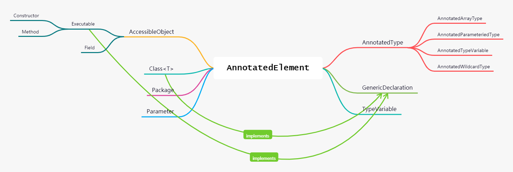

Java SE 5 引入了许多的语言变化，注解（元数据）就是其中之一，主要是在代码中附加补充信息。注解不会影响代码的逻辑，只是在编译、运行时，为代码加入配置与描述等功能。

注解使用 `@interface` 来定义注解。如下所示：

```java
@interface Mapping {
    String name();
    String[] path() default {};
    Type type() default Type.GET;
}
```

注解不能包含 `extends` 子句。但是，所有的注解类型都隐式地直接扩展自 `java.lang.annotation.Annotation` 接口。

当 `Mapping` 注解中只需要一个注解元素时，可以将名称设成 `value`，这样指定值时就不需要指定注解元素的名称了。如 `@Mapping("get")`。

注解中的元素类型可以使用基本类型、`String`、`Class`、`enum`、注解类型以及前面所述类型组成的数组。而且可以使用 `default` 为注解元素提供默认值。如上所示的 `String[] path() default {}` 就是设置了默认值的注解元素。

## 注解声明

定义完的注解需要在代码中使用，声明注解可以出现在包、类、接口、方法、构造器、实例域、局部变量、参数变量以及参数类型上。下面给出一个例子：

```java
@Mapping("example") public class Sample {
    ...
}
```

注意：对局部变量的注解只能在源码级别上进行处理。类文件并不描述局部变量。因此，所有的局部变量注解在编译完一个类的时候就会被遗弃掉。同样地，对包的注解不能在源码级别之外存在。

## 内置注解

Java SE 提供了许多注解，但其中大部分是专用注解。其中有规则注解和元注解。

- `@Deprecated`    该注解用于标记不想被使用的项上。当使用 `@Deprecated` 标记时，编译器就会发出警告。这个注解与 `Javadoc` 标签 `@deprecated` 具有同等功效。
- `@SuppressWarnings`    该注解会告知编译器阻止特定类型的警告信息。如 `@SuppressWarnings("unchecked")`。
- `@Override`    该注解只能应用于方法上， 表示当前的方法定义将覆盖基类的方法。假如你的类中重写 `equals(Object obj)` 方法时，就可以使用 `@Override` 注解标记。不是被覆盖的方法就不要用 `@Override`，那样编译器会报错。
- `@SafeVarargs`    该注解用于对具有泛型 `varargs` 参数可安全使用。作用于方法或构造器上。该注解为 Java SE 7 新增注解。
- `@FunctionalInterface`   该注解用于标记只有一个抽象方法的接口，声明为函数式接口。该注解为 Java SE 8 新增注解。

其中，不包含注解元素的特殊类型的注解被称为标记注解，它唯一的目的就是标记声明。确定标记注解是否存在的最好方式是使用 `isAnnotationPresent()` 方法，该方法是由 `AnnotatedElement` 接口定义的。

### 元注解

还有一些注解用以描述注解接口的行为属性，这种注解称为元注解（meta annotation）。Java 以提供了一些元注解。如下所示：

#### @Retention

`@Retention` 定义注解的保留策略，用以决定注解在什么位置被丢弃。而保留策略被封装在 `java.lang.annotation.RetentionPolicy` 枚举中。如下所示：

- `RetentionPolicy.SOURCE`    只在源文件中保留，在编译期间会被抛弃。
- `RetentionPolicy.CLASS`    在编译期间被存储到 `.class` 文件中。但是会在运行时通过 JVM 不能得到这些注解。
- `RetentionPolicy.RUNTIME`    在编译期间被存储到 `.class` 文件中，并且在运行时可以通过 JVM 获取这些注解。因此，可以通过反射机制读取注解的信息。

注意：局部变量声明的注解不能存储在 `.class` 文件中。

如果`@Retention`不存在，则该`Annotation`默认为`CLASS`。因为通常我们自定义的`Annotation`都是`RUNTIME`，所以，务必要加上`@Retention(RetentionPolicy.RUNTIME)`这个元注解：

```java
@Retention(RetentionPolicy.RUNTIME)
public @interface Mapping {
    String name();
    String[] path() default {};
    Type type() default Type.GET;
}
```

在程序执行期间通过 JVM 可以获取 `Mapping` 注解。

#### @Target

`@Target` 定义注解的声明类型，用来决定注解应用的位置，如类、方法、变量、参数以及包等。而定义的类型封装在 `java.lang.annotation.ElementType` 枚举中。如下所示：

- `ElementType.ANNOTATION_TYPE`    注解类型声明。
- `ElementType.CONSTRUCTOR`    构造器声明。
- `ElementTyoe.FIELD`    域变量声明。
- `ElementType.LOCAL_VARIABLE`    局部变量声明。
- `ElementType.METHOD`    方法声明。
- `ElementType.PACKAGE`    包声明。
- `ElementType.PARAMETER`    参数声明。
- `ElementType.TYPE`    类、接口或者枚举声明。
- `ElementType.TYPE_PARAMETER`    类型参数。
- `ElementType.TYPE_USE`    类型使用。

如下所示，定义的注解 `@Mapping` 可用在方法上：

```java
@Target(ElementType.METHOD)
public @interface Mapping {
    String name();
    String[] path() default {};
    Type type() default Type.GET;
}
```

在 `@Target` 注解中也可以指定多个值，并用 `{}` 包围起来。如下所示：

```java
@Target({
    ElementType.METHOD, 
    ElementType.FIELD})
public @interface Mapping {
    String name();
    String[] path() default {};
    Type type() default Type.GET;
}
```

如果不使用 `@Target`，可以应用于任何声明上。因此，一般来说，显式指定目标是个好主意，可以明确说明注解的用途。

`TYPE_PARAMETER` 和 `TYPE_USE` 枚举常量都是 Java SE 8 新增加的枚举常量。类型注解必须包含 `ElementType_USE`，这样就可以注解方法的返回类型、方法内 `this` 的类型、强制转换、数组级别、被继承的类以及 `throws` 子句。还可以注解泛型，包括泛型类型参数边界和泛型类型参数。

#### @Documented

`@Documented` 注解是一个标记接口，用于告知某个工具注解将被文档化。`@Documented` 被设计为只能注解其他注解。

默认情况下，`javadoc` 不处理注解，但在注解上标记 `@Documented`，就会被像 `javadoc` 这样的归档工具处理，以实现归档。

```java
@Documented
@Target(ElementType.METHOD)
public @interface Mapping {
    String name();
    String[] path() default {};
    Type type() default Type.GET;
}
```

#### @Inherited

`@Inherited` 是一个标记注解，用于另外一个注解声明。`@Inherited` 标记的注解可以被子类继承，而且只能用于被 `@Target(ElementType.TYPE)` 类型标注的注解。

因此，当查询子类的特定注解时，如果那种注解在子类中不存在，就会检查基类。如果那种注解存在于超类中，并且如果使用 `@Inherited` 进行了注解，就将返回那种注解。

定义一个标记了 `@Inherited` 的注解 `@Persistent` 。

```java
@Inherited @interface Persistent {
}
```

这里使用 `@Persistent` 注解来指明一个类的对象可以存储到数据库中。

```java
@Persistent public class Person {}
```

那么继承自 `Person` 的子类也会自动被注解为持久化。

```java
public class Student extends Person {}
```

#### @Repeatable

Java SE 8 可以使用 `@Repeatable` 注解将同种类型的注解多次应用于某一项。为保持向后兼容，可重复注解的实现者需要提供一个容器注解，它可以将这些重复注解存储到一个数组中。

```java
@Repeatable(Mappings.class)
@Target(ElementType.METHOD)
public @interface Mapping {
    String name();
    String path() default “”;
    Type type() default Type.GET;
}
@Target(ElementType.Type)
public @interface Mappings {
    Mapping[] value();
}
```

经过 `@Repeatable` 修饰后，只要用户提供两个或更多 `@Mapping` 注解，那就会自动地被包装到 `@Mappings` 注解中。

```java
@Mapping(name="GET Mapping", path="/profile")
@Mapping(name="POST Mapping", path="/profile", type=Type.POST)
public class AnnotationTest {
}
```

这里，使用 `getAnnotation()` 方法获取重复注解的话，需要传入的是容器注解的类，而不是重复注解本身。`AnnotatedElement` 接口还提供了 `getAnnotationsByType()` 和 `getDeclaredAnnotationsByType()` 这两个方法来直接操作重复注解。

#### @Native

使用 `@Native` 注解修饰成员变量，表示这个变量可以被本地代码引用，常常被代码生成工具使用。 `@Native` 注解不常使用。

## 注解处理

当注解指定 `RUNTIME` 保留策略时，运行时就可以通过反射API 来查询注解。反射API用到的类如 `Class`、`Field`、`Method` 以及 `Constructor` 都实现了 `AnnotatedElement` 注解接口。



该接口提供了几个方法来获取注解。其中 `getAnnotationsByType()`、`getDeclaredAnnotation()`以及`getDelaredAnnotationsByType()`方法都是 Java SE 8 新增方法。

### getAnnotation()

`AnnotatedElement` 注解接口提供的 `getAnnotation()` 方法可以获得与对象关联的注解。该方法的一般形式如下：

```java
<T extends Annotation> T getAnnotation(Class<T> annotationClass)
```

这里的 `annotationClass` 表示你要查找的注解类型。该方法返回对注解的一个引用，使用这个引用可以获取与注解元素关联的值。如果没有找到注解，该方法会返回 `null`。下面使用该方法获取 `@Mapping` 注解。

```java
Class<?> cls = AnnotationTest.class;
cls.getAnnotation(Mapping.class);    // 获取Mapping注解
```

### getAnnotations()

`AnnotatedElement` 注解接口提供的 `getAnnotations()` 方法会返回 `Class`、`Method`、`Constructor` 以及 `Field` 等类型的对象中的所有注解的一个注解数组。该方法的一般形式如下：

```java
Annotation[] getAnnotations()
```

下面使用该方法获取所有注解。

```java
Class<?> cls = AnnotationTest.class;
cls.getAnnotations();    // 获取cls对象中的所有注解
```

### getDeclaredAnnotations()

`AnnotatedElement` 注解接口提供的 `getDeclaredAnnotations()` 方法返回的是调用对象中存在的所有非继承注解。该方法的一般形式如下：

```java
Annotation[] getDeclaredAnnotations()
```

### isAnnotationPresent()

`AnnotatedElement` 注解接口提供的 `isAnnotationPresent()` 方法用于判断调用对象是否存在指定的注解。该方法的一般形式如下：


```java
default boolean isAnnotationPresent(Class<? extends Annotation> annotationClass)`
```

如果 `annotationClass` 指定的注解与调用对象相关联，返回 `true`，否则返回 `false`。下面使用该方法判断 `@Mapping` 注解是否存在。

```java
Class<?> cls = AnnotationTest.class;
if (cls.isAnnotationPresent(Mapping.class)) {
    ...
}
```

### getDeclaredAnnotation()

`AnnotatedElement` 注解接口提供的 `getDeclaredAnnotation()` 方法返回与对象关联的注解。该方法会忽略继承注解，一般形式如下：

```java
default <T extends Annotation> T getDeclaredAnnotation(Class<T> annotationClass) {...}
```

这里的 `annotationClass` 与 `getAnnotation()` 的参数一样，都是表示要查找的注解类型。

### getAnnotationsByType()

`AnnotatedElement` 注解接口提供的 `getAnnotationsByType()` 方法用以获取与对象关联的注解。如果没有与此元素关联的注解，则返回值是长度为0的数组。该方法的一般形式如下：

```java
default <T extends Annotation> T[] getAnnotationsByType(Class<T> annotationClass) {...}
```

该方法与 `getAnnotation(Class<T> annotationClass)` 的区别在于，检测其注解对应的重复注解容器。

### getDeclaredAnnotationsByType()

`AnnotatedElement` 注解接口提供了 `getDeclaredAnnotationsByType()` 方法。如果注解直接存在或间接存在，则返回该元素的注解，如果没有，则返回值为长度为0的数组。该方法的一般形式如下：

```java
default <T extends Annotation> T[] getDeclaredAnnotationsByType(Class<T> annotationClass) {...}
```

此方法忽略继承的注解，而且与 `getDeclaredAnnotation(Class<T> annotationClass)` 的区别在于，检测其参数是否为可重复的注解类型，如果是，尝试查看重复注解容器来查找该类型的一个或多个注解。

## 总结

通过注解，可以在不影响代码语义的情况下，提供了其描述信息，这些信息能够被外部工具自动处理。可以通过反射API获取注解，并进行操作。文档生成、编译检查、动态处理等方面都可以使用注解。