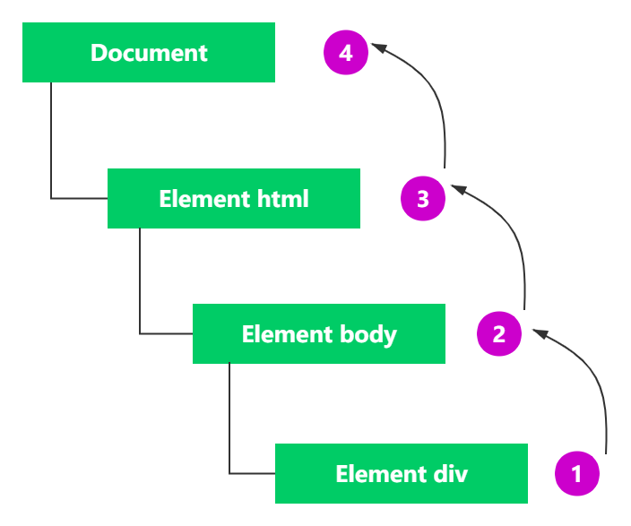
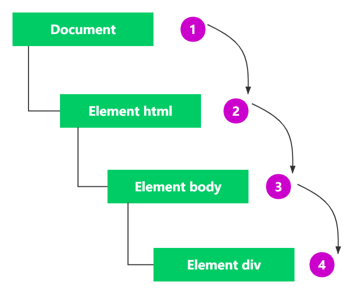
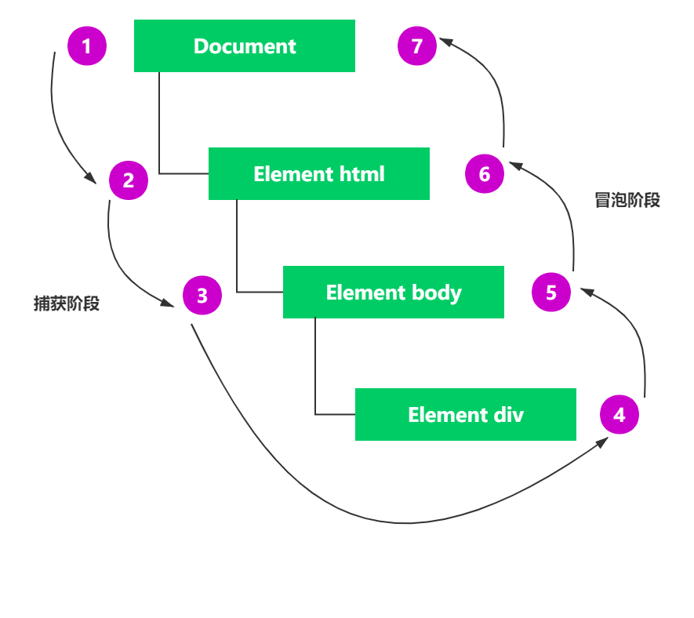

# 概述

JavaScript 与 HTML 之间的交互是通过事件实现的。事件，就是文档或浏览器窗口中发生的一些特定的交互瞬间。可以使用侦听器（或处理程序）来预定事件，以便事件发生时执行相应的代码。这种在传统软件工程中被称为观察员模式的模型，支持页面的行为（JavaScript 代码）与页面的外观（HTML 和 CSS 代码）之间的松耦合。

# 事件流

**事件流** 描述的是从页面中接收事件的顺序。IE 和 Netscape 开发团队提出了两种实现事件流的方案，事件冒泡流和事件捕获流。

IE 提出的方案为事件冒泡流，从最具体的元素开始触发，然后向上传播至文档节点。



Netscape 团队提出的方案为事件捕获流，事件捕获由文档节点开始传播至最具体的元素。事件捕获实际上是为在事件到达最终目标前拦截事件。



## DOM 事件流

`DOM2 Events` 规范规定事件流分为 3 个阶段：事件捕获、到达目标和事件冒泡。

1. 事件捕获阶段：事件从上往下查找对应元素，直到捕获到事件。
2. 到达目标阶段：到达目标元素后执行事件对应的处理函数。
3. 事件冒泡阶段：事件从目标元素开始冒泡。



在 DOM 事件流中，实际的目标（`<div>`元素）在捕获阶段不会收到事件。这是因为捕获阶段从`document`到`<html>`再到`<body>`就结束了。下一阶段，即会在`<div>`元素上触发事件的"到达目标"阶段，通常在事件处理时被认为是冒泡阶段的一部分。然后，冒泡阶段开始，事件反向传播至文档。

# 事件处理

事件就是在浏览器上执行的某种动作。如`click`、`load`等。事件处理程序（或事件监听器）就是响应事件而调用的函数。

## HTML事件处理程序

可以在支持事件的`HTML`元素上通过属性来指定能够执行的JavaScript代码的值。如下所示：

```html
<input type="button" value="HTML Event Handler" onclick="alert('Click HTML Event')" />
```

在 HTML 中定义的事件处理程序可以包含精确的动作指令，也可以调用在页面其他地方定义的脚本：

```html
<input type="button" value="HTML Event Handler" onclick="handleHTMLEvent()" />
<script>
    function handleHTMLEvent() {
        alert("Click HTML Event");
    }
</script>
```

在调用`handleHTMLEvent()`函数之前点击了按钮，会发生错误。可以将HTML事件处理程序封装在`try/catch`块中：

```html
<input type="button" value="HTML Event Handler 2" onclick="try{handleHTMLEvent()} catch (e) {}" />
```

这种事件处理程序会使HTML与JavaScript强耦合，不利于维护。

## DOM0事件处理程序

通过JavaScript获取事件处理程序并将一个函数赋值给该事件处理程序属性。

```html
<input id="btn" type="button" value="DOM Event Handler" />
<script>
    var btn = document.getElementById('btn');
    btn.onclick = function () {
        alert("Click DOM Event");
    }
</script>
```

使用`DOM0`方式为事件处理程序赋值的函数被认为是元素的方法。此时获取的`this`等于事件处理程序所在的元素。以这种方式添加事件处理程序注册在事件流的冒泡阶段。

## DOM2事件处理程序

`DOM2 Events` 定义`addEventListener()` 和 `removeEventListener()` 两个方法，用于事件处理程序的赋值和移除。所有`DOM`节点都含这两个方法，它们接收 3 个参数：事件名、事件处理函数和一个布尔值，布尔值表示调用事件处理程序的事件流阶段，true在捕获阶段，false（默认）在冒泡阶段。

```html
<input id="btn" type="button" value="DOM Event Handler" />
<script>
    var btn = document.getElementById('btn');
    btn.addEventListener("click", () => {
        alert("DOM2 Event Handler");
    }, false);
</script>
```

使用`addEventListener()`可以为同一个事件添加多个事件处理程序。

```javascript
var btn = document.getElementById('btn');
btn.addEventListener("click", () => {
    alert("DOM2 Event Handler");
}, false);
btn.addEventListener("click", () => {
    alert("Rep DOM2 Event Handler");
}, false);
```

使用`removeEventListener()`并传入与`addEventListener()`同样的参数来移除。

```javascript
var btn = document.getElementById('btn');
btn.addEventListener("click", () => {
    alert("DOM2 Event Handler");
}, false);
btn.removeEventListener("click", function () {    // 无效果
    alert("Remove DOM2 Event Handler");
}, false);
```

但这种传入匿名函数的事件处理程序无法移除。`removeEventListener()`必须和`addEventListener()`传入的事件处理函数必须是同一个。

```javascript
var btn = document.getElementById('btn');
var handler = function() {
    alert("DOM2 Event Handler");
}
btn.addEventListener("click", handler, false);
btn.removeEventListener("click", handler, false);    // 有效果
```

大多数情况下，事件处理程序会被添加到事件流的冒泡阶段，主要原因是跨浏览器兼容性好。把事件处理程序注册到捕获阶段通常用于在事件到达其指定目标之前拦截事件。如果不需要拦截，则不要使用事件捕获。

## IE事件处理程序

IE 实现了 `attachEvent()` 和 `detachEvent()` 方法用于事件处理程序的赋值和移除。接收两个同样的参数：事件处理程序的名字和事件处理函数。IE8以前只支持事件冒泡，使用`attachEvent()`会添加到冒泡阶段。

```javascript
var btn = document.getElementById("btn");
btn.attachEvent("onclick", function() {
    alert("IE Event Handler");
});
```

此时的事件处理程序是在全局作用域中运行。`this`等于`window`。也可以给一个元素添加多个事件处理程序，但事件处理程序会以添加的顺序的反向触发。

# 事件对象

`DOM`发生事件时会将相关信息收集并存储在`event`对象中。该对象会包含一些事件的元素、类型等基本信息。

在浏览器中，`event`对象是传给事件处理程序的唯一参数。在添加事件处理程序时可以使用事件对象：

```html
<input id="btn" type="button" value="DOM Event Object" onclick="alert(event.type)">
<script>
    var btn = document.getElementById("btn");
    btn.onclick = function(event) {
        alert(event.type);
    };
    btn.addEventListener("click", (event) => {
        alert(event.type);
    }, false);
</script>
```

下表列出全部属性和方法：

|属性/方法|类型|读/写|说明|
|:---:|:---:|:---:|:---:|
|bubbles|布尔值|只读|表示事件是否冒泡|
|cancelable|布尔值|只读|表示事件是否可以被取消|
|currentTarget|元素|只读|当前事件处理程序所在的元素|
|defaultPrevented|布尔值|只读|true表示已经调用preventDefault()方法（`DOM3 Events`中新增）|
|detail|整数|只读|只有UIEvent（用户界面）事件才具有。返回一个数值，表示事件的某种信息。如click事件，detail返回的是鼠标按下的次数。|
|eventPhase|整数|只读|表示事件流正被处理到了哪个阶段：1代表捕获阶段，2代表到达目标，3代表冒泡阶段|
|target|元素|只读|事件目标|
|isTrusted|布尔值|只读|true表示事件是由浏览器发起的。false表示事件是由脚本创建、修改、通过EventTarget.dispatchEvent()派发|
|type|字符串|只读|被触发的事件类型|
|preventDefault()|函数|只读|用于取消事件的默认行为。只有cancelable为true才可以调用这个方法|
|stopImmediatePropagation()|函数|只读|用于取消后续事件捕获或事件冒泡，并阻止调用任何后续事件处理程序（`DOM3 Events`中新增）|
|stopPropagation()|函数|只读|阻止捕获和冒泡阶段中当前事件的进一步传播|

事件处理程序内部，对于`currentTarget`和`target`两个属性，将事件处理程序直接添加在目标上时，`this`和它们是相等的。

```html
<body>
    <input id="btn" type="button" value="DOM Event Object" />
</body>
<script>
    let btn = document.getElementById("btn");
    btn.onclick = function(event) {
        alert(event.currentTarget === this);
        alert(event.target === this);
    };
</script>
```

如果将事件处理程序添加到按钮的父结点上，结果就是`currentTarget`和`document.body`和`this`相等，因为它是注册事件处理程序的元素。而`target`属性等于按钮本身，因为`click`事件才是真正的目标。但按钮本身没注册事件处理程序，`click`事件冒泡到`document.body`，触发注册的处理程序。

```javascript
document.body.onclick = function (event) {
    alert(event.currentTarget === document.body);    // true
    alert(this === document.body);    // true
    alert(event.target === this);    // false
    alert(event.target === document.getElementById("btn"));    // true
    }
```

`preventDefault()`方法用于阻止特定事件的默认动作。比如，链接的默认行为就是在被单机时导航到`href`属性指定的URL。如果想阻止这个导航行为，可以在`onclick`事件处理程序中取消，如下面的例子所示：

```javascript
let link = document.getElementById('link');
link.onclick = function (event) {
    event.preventDefault();
}
```

任何可以通过`preventDefault()`取消默认行为的事件，其事件对象的`cancelable`属性都会设置为`true`。

`stopPropagation()`方法用于立即阻止事件流在DOM结构中传播，取消后续的事件捕获或冒泡。例如，直接添加到按钮的事件处理程序中调用`stopPropagation()`，可以阻止`document.body`上注册事件处理程序执行。比如：

```javascript
let btn = document.getElementById("btn");
btn.onclick = function(event) {
    console.log("Clicked");
    event.stopPropagation();
};
document.body.onclick = function(event) {
    console.log("Body clicked");
};
```

IE事件对象也包含与导致其创建的特定事件相关的属性和方法，很多都与`DOM`属性和方法对应。如`srcElement`对应`DOM`中的`target`，`returnValue`属性对应`DOM`中的`preventDefault()`方法等等。

# 事件类型

`DOM3 Events`在 `DOM2 Events` 基础上重新定义了并增加了新的事件类型：

- `UI Event`：用户界面事件，涉及与 `BOM` 交互的通用浏览器事件。
- `Focus Event`：焦点事件，在元素获得和失去焦点时触发。
- `Mouse Event`：鼠标事件，使用鼠标在页面上执行某些操作时触发。
- `Wheel Event`：滚轮事件，使用鼠标滚轮或类似设备时触发。
- `Input Event`：输入事件，向文档中输入文本时触发。
- `Keyboard Event`：键盘事件，使用键盘在页面上执行某些操作时触发。
- `Composition Event`：合成事件，在使用某种 IME（Input Method Editor，输入法编辑器）输入字符时触发。

### 用户界面事件

用户界面事件或 UI 事件不一定跟用户操作有关。这类事件在 DOM 规范出现之前就已经以某种形式存在了，保留它们是为了向后兼容。UI 事件主要有以下几种。

- `load`：在 `window` 上当页面加载完成后触发，在`<frameset>`上当所有`<frame>`都加载完成后触发，在``元素上当图片加载完成后触发，在`<object>`元素上当相应对象加载完成后触发。
- `unload`：在 `window` 上当页面完全卸载后触发，在`<frameset>`上当所有`<frame>`都卸载完成后触发，在`<object>`元素上当相应对象卸载完成后触发。
- `abort`：在`<object>`元素上当相应对象加载完成前被用户提前终止下载时触发。
- `error`：在 `window` 上当 JavaScript 报错时触发，在 `` 元素上当无法加载指定图片时触发，在 `<object>` 元素上当无法加载相应对象时触发，在`<frameset>`上当一个或多个`<frame>`无法完成加载时触发。
- `select`：在文本框（`<input>`或`<textarea>`）上当用户选择了一个或多个字符时触发。
- `resize`：在 `window` 或`<frame>`上当窗口或窗口被缩放时触发。
- `scroll`：当用户滚动包含滚动条的元素时在元素上触发。`<body>`元素包含已加载页面的滚动条。

大多数HTML事件与window对象和表单控件有关。

除了`DOMActivate`，这些事件在`DOM2 Events`中都被归为HTML Events。

### 焦点事件

当页面中的某元素获得（用户选中）或失去焦点时触发焦点事件。焦点事件有以下几种：

- `blur`：当元素失去焦点时触发。事件不冒泡。
- `focus`：当元素获得焦点时触发。事件不冒泡。
- `focusin`：当元素获得焦点时触发。是`focus`的冒泡版事件。
- `focusout`：当元素失去焦点时触发。是`blur`的通用版。

`DOMFocusIn`  和 `DOMFocusOut` 是 `focus` 与 `blur` 的冒泡版，这两个事件是Opera新增的，但已被弃用，可能还有一些浏览器在支持。`focusin` 和 `focusout`，这两个事件是IE浏览器新增的，已被`DOM3 Events`标准化。

焦点从页面中一个元素转移到另一个元素时，会依次发生如下事件：①`focusout`在失去焦点的元素上触发；②`focusin`在获得焦点的元素上触发；③`blur`在失去焦点的元素上触发；④`DOMFocusOut`在失去焦点的元素上触发；⑤`focus`在获得焦点的元素上触发；⑥`DOMFocusIn`在获得焦点的元素上触发。

### 鼠标事件

鼠标事件是较常用的事件类型，继承 `MouseEvent` 接口。`DOM Events` 定义了 9 中鼠标事件。

- `click`：用户单击鼠标主键时触发。
- `dblclick`：用户双击鼠标主键时触发。`DOM3 Event`将其标准化。
- `mousedown`：用户按下任意鼠标键时触发。
- `mousemove`： 用户将鼠标在元素上移动时反复触发。不能通过键盘触发事件。
- `mouseout`：用户将鼠标从元素上移出时触发。移动的元素可以是原始元素的外部元素，也可以是原始元素的子元素。不能通过键盘触发事件。
- `mouseover`：用户将鼠标光标从元素外部移到元素内部时触发。不能通过键盘触发。
- `mouseup`：用户释放鼠标时触发。不能通过键盘触发。
- `mouseenter`：用户把鼠标悬停在某些元素之上时触发。不是冒泡事件，也不会悬停在后代元素之上时触发。`DOM3 Events`新增的事件。
- `mouseleave`：用户把鼠标从悬停的元素上移出时触发。不是冒泡事件，也不会在经过后代元素时触发。`DOM3 Events`新增的事件。
- `mousewheel`：滚轮事件，鼠标事件的子类别。反映鼠标滚轮或类似设备时交互。

事件之间存在关系，取消鼠标事件的默认行为会影响其它事件。

### 键盘事件

键盘事件由用户操作键盘时触发。`DOM2 Events`最终没有定义键盘事件，都是基于`DOM0`实现的。

`DOM3 Events` 为键盘事件提供了规范，包含 3 个事件：

- `keydown`：用户按下键盘时触发。
- `keypress`：用户按下键盘上某个键并产生字符时触发。`DOM3 Events` 废弃了 `keypress` 事件，推荐 `textInput` 事件。
- `keyup`：用户释放键盘上按键时触发。

虽然所有元素都支持这些事件，但当用户在文本框中输入内容时最容易看到。

用户按下键盘上的某个字符键触发事件的正确顺序如下：①`keydown`；②`keypress`；③`keyup`。`keydown`和`keypress`事件会在文本框出现变化之前触发，`keyup`事件在文本框出现变化之后触发。非字符键会省略`keypress`事件。

但当用户在按下键足够长的时间时，它会开始“自动重复事件”：`keydown`和`keypress`不断被重复，直到按键释放时，才会触发`keyup`事件。非字符键会省略`keypress`事件步骤，不断触发`keydown`事件，直到释放才会触发`keyup`事件。

### 输入事件

`DOM3 Events` 引入 `textInput` 输入事件，是对 `keypress` 事件的扩展，用于在文本显示给用户之前更方便地截获文本输入。`textInput`会在文本被插入到文本框之前触发。

只有可编辑区域才支持 `textInput` 事件，如文本域，并且只有当插入字符时才触发。该事件为 `Event` 对象添加了 `event.data` 属性，该属性包含新插入的字符。

### 合成事件

`DOM3 Events`新增合成事件，用于处理使用IME输入时的复杂输入序列。IME可以让用户输入物理键盘上没有的字符。如使用拉丁字母键盘的用户可以使用IME输入日文。IME通常需要按下多个键才能输入一个字符。合成事件用于检测和控制这种输入。合成事件有以下 3 中：

- `compositionstart`：在IME文本合成系统打开时触发，表示输入即将开始。
- `compositionupdate`：在新字符插入输入字段时触发。
- `compositionend`：在IME文本合成系统关闭时触发，表示恢复正常键盘输入。

合成事件在很多方面与输入事件很类似。在合成事件触发时，事件目标是接收文本的输入字段。唯一增加的事件属性是 `data`，其中包含的值视情况而异：

- 在 `compositionstart` 事件中，包含正在编辑的文本（例如，已经选择了文本但还没替换）；
- 在 `compositionupdate` 事件中，包含要插入的新字符；
- 在 `compositionend` 事件中，包含本次合成过程中输入的全部内容。

与文本事件类似，合成事件可以用来在必要时过滤输入内容。可以像下面这样使用合成事件：

```javascript
let textbox = document.getElementById("text");
textbox.addEventListener("compositionstart", (event) => {
    console.log(event.data);
});
textbox.addEventListener("compositionupdate", (event) => {
    console.log(event.data);
});
textbox.addEventListener("compositionend", (event) => {
    console.log(event.data);
})
```

除了上述事件类型外，`DOM2`的变化事件（`Mutation Events`）被`Mutation Observers`取代。还有用于定义设备及设备相关的设备事件、用于触摸设备的触摸事件，还有资源事件等等，就不一一列举了。

### 自定义事件

`DOM3`增加了自定义事件的类型。自定义事件不会触发原生`DOM`事件，但可以创建全新的事件类型，使用`document.createEvent(type)`创建事件类型，`type`是一个字符串，表示创建的事件类型。如`"UIEvents"`、`"MouseEvents"`等。创建自定义事件，就需要传入`"CustomEvent"`。

创建事件后，需要调用`initCustomEvent()`对事件进行初始化，该方法接收 4 个参数。

- `type`：表示要触发的事件类型，返回字符串，如 `"customEvent"`。
- `bubbles`：表示事件是否冒泡，返回布尔值。
- `cancelable`：表示事件是否可以取消，返回布尔值。
- `detail`：表示任意值，作为`event`对象的`detail`属性。返回对象。

自定义事件可以像其它事件一样在`DOM`中派发。如：

```html
<div id="div" value="Dom Custom Event Handler">DOM Custom Event Handler</div>
<script>
    let div = document.getElementById("div");
    div.addEventListener("cusEvent", (event) => {
        console.log("DIV: " + event.detail);
    });
    document.addEventListener("cusEvent", (event) => {
        console.log("DOCUMENT: " + event.detail);
    });
    let event = document.createEvent("CustomEvent");
    event.initCustomEvent("cusEvent", true, false, "Custom Event");
    div.dispatchEvent(event);
</script>
```

在`initCustomEvent`第二个参数设置了可以冒泡，因此浏览器会负责把事件冒泡到`document`。

`DOM4`添加了对`CustomEvent`构造函数的支持，可以使用`new CustomEvent(type, eventInitDict)`来创建自定义事件。它有以下参数。

- `type`：事件的类型，是一个字符串。
- `eventInitDict`：一个对象，提供了事件的配置信息。

而 `eventInitDict`参数的类型是`CustomEventInit`，它有几个参数。

- `bubbles`：一个布尔值，表示该事件是否会冒泡。
- `cancelable`：一个布尔值，表示该事件是否可以被取消。
- `detail`：当事件初始化时传递的数据。

举一个例子：

```html
<div id="div" value="Dom Custom Event Handler">DOM Custom Event Handler</div>
<script>
    let div = document.getElementById("div");
    div.addEventListener("cusEvent", (event) => {
        console.log("DIV: " + event.detail);
    });
    document.addEventListener("cusEvent", (event) => {
        console.log("DOCUMENT: " + event.detail);
    });
    let event = new CustomEvent("cusEvent", {detail: {name: "大卫"}, bubbles: true});
    div.dispatchEvent(event);
</script>
```

# 事件委托

事件委托利用事件冒泡，使用一个事件处理程序来管理同一类型的事件。

```html
<ul id="links">
    <li id="red">Red</li>
    <li id="green">Green</li>
    <li id="blue">Blue</li>
</ul>
```

通常给`<li>`元素添加点击事件，通常给三个`<li>`元素分配三个`onclick`处理程序。与其如此，我们可以在`<ul>`元素上添加一个事件处理程序捕获所有的`<li>`元素的点击事件：

```javascript
let list = document.getElementById('links');
list.addEventListener("click", (event) => {
    let target = event.target;

    switch (target.id) {
        case "red":
            document.title = "大红大紫";
            break;

        case "green":
            location.href = "http://www.sample.com";
            break;

        case "blue":
            alert("Hi, Blue");
            break;
    }
});
```

这样，点击每个`<li>`元素，都会将事件向上冒泡，交给父节点`<ul>`的事件处理程序来处理，在`<ul>`的事件中，通过`event.target`的`id`属性可以确定哪个元素被点击，然后执行相应操作。

事件委托具有如下优点：

- `document`对象随时可用，任何时候都可以给它添加事件处理程序。这意味着只要页面渲染出可点击的元素，就可以无延迟地起作用。
- 节省花在设置页面事件处理程序上的时间。只指定一个事件处理程序既可以节省`DOM`引用，也可以节省时间。
- 减少整个页面所需的内存，提升整体性能。

可以先将事件处理程序删除，在通过`innerHTML`属性来对DOM进行删除操作，来删除不用的事件处理程序，来提高Web应用性能。

```html
<div id="div">
    <input id="btn" type="button" value="Del Event Handler">
</div>
<script>
    let btn = document.getElementById("btn");
    btn.onclick = function () {
        // 执行操作
        ...
        btn.onclick = null;  // 删除事件处理程序
        document.getElementById("div").innerHTML = "Processing...";
    }
</script>
```

# 小结

事件是JavaScript与网页交互的主要方式。、本文主要介绍了事件的接收顺序，事件对象和常见的事件类型，还有一些事件类型如HTML5事件、设备事件等没有介绍，还有一些浏览器也会实现自己专有的事件，方便扩展满足用户的需求的功能。事件在JavaScript中非常重要，理解事件的原理对其性能也非常重要。