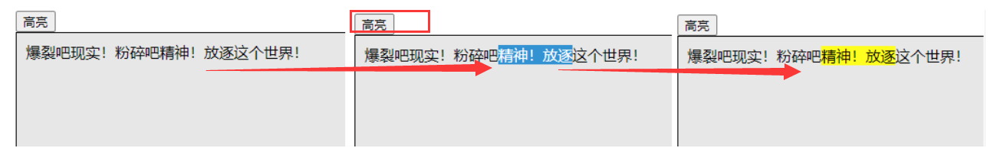

富文本编辑器（Rich Text Editor）是在网页上使用的一种所见即所得的文本编辑器，是 Web 应用开发中很常见的需求。

# 富文本实现

在 HTML 文档上共有 2 中方式实现富文本编辑器。一种是使用 `iframe`，另一种是使用 `contenteditable` 属性指定 HTML 文档元素。

### iframe

第一种方式是使用 `iframe` 标签。

在空白的 HTML 文档中嵌入一个 `iframe`，并将 `designMode` 属性设置为 `"on"`，文档就会变成可编辑的，实际编辑的则是 `<body>` 元素的 HTML，默认值是 `"off"`。文档变成可编辑后，就可以像使用文字处理程序一样编辑文本，通过键盘将文本标记为粗体、斜体等等。

作为 `iframe` 源的是一个非常简单的空白 HTML 页面。下面是一个例子：

```html
<!DOCTYPE html>
<html>
<head>
    <title>Blank Page for Rich Text Editing</title>
</head>
<body>
</body>
</html>
```

这个页面会像其他任何页面一样加载到 `iframe` 里。为了可以编辑，必须将文档的 `designMode` 属性设置为 `"on"`。不过，只有在文档完全加载之后可以设置。在这个包含页面内，需要使用 `onload` 事件处理程序在适当时机设置 `designMode`，如下面的例子所示：

```html
<iframe name="editor" style="height: 100px; width: 100px"></iframe>
<script>
    window.addEventListener("load", () => {
        frames["editor"].document.designMode = "on";
    });
</script>
```

以上代码加载之后，可以在页面上看到一个类似文本框的区域。这个框的样式具有网页默认样式，不过可以通过 `CSS` 调整。

### contenteditable

第二种方式是使用 `contenteditable` 属性指定 HTML 文档中的元素。该方式是 IE 最早实现的。使用方式是在一个元素上添加 `contenteditable` 属性并设置为 `true` 或者空字符串`""`，然后该元素会立即被用户编辑。如下所示：

```html
<div class="editor" id="editorId" contenteditable="true"></div>
```

元素中包含的任何文本都会自动被编辑， 元素本身类似于`<textarea>` 元素。通过设置`contentEditable` 属性，也可以随时切换元素的可编辑状态：

```javascript
let div = document.getElementById("editorId");
richedit.contentEditable = "true";
```

`contentEditable` 属性有3 个可能的值：`"true"` 表示开启，`"false"` 表示关闭，`"inherit"` 表示继承父元素的设置。主流浏览器都支持 `contentEditable` 属性。

<small>注意：`contenteditable` 是一个非常多才多艺的属性。比如，访问伪 URL `data:text/html`, `<html contenteditable>`可以把浏览器窗口转换为一个记事本。这是因为这样会临时创建 `DOM` 树并将整个文档变成可编辑区域。<small>

# 与富文本交互

上面讲到了如何在 HTML 文档中实现富文本编辑器，而现在需要了解要使用什么方式与富文本编辑器交互。`document` 提供了 `execCommand()` 方法，该方法会影响使用 `contentEditable` 属性实现可编辑区域的元素。方法说明如下所示：

```javascript
execCommand(commandId: string, showUI?: boolean, value?: string): boolean;
```

- `commandId`：参数是 `string` 值，表示要执行的命令。下面会列出可用命令。
- `showUI`：参数是 `boolean` 的可选值，表示浏览器是否为命令提供用户界面，一般为 `false`。为兼容的话，该参数需要始终为 `false`，因为 Mozilla 没有实现，会在其为 `true` 时抛出错误。
- `value`：参数是 `string` 的可选值，是一些命令需要额外的参数，默认为 `null`。

该方法执行后，会返回 `boolean` 值，如果是 `false`，表示操作不被支持或未被启用。

<small>注意：在调用一个命令前，不要尝试使用返回值去校验浏览器的兼容性</small>

不同浏览器支持的命令也不一样。下标列出了最常用的命令。

|命令|作用|可选值|
|:---|:---|:---|
|backColor|设置文档背景颜色。在`styleWithCss`模式下，则只影响容器元素的背景颜色。|颜色值`<color>`字符串（IE使用这个命令设置文本背景色）|
|bold|切换选中文本的粗体样式|null|
|copy|将选中内容复制到剪贴板|null|
|createLink|将选中内容转换为指向给定URL的链接|URL链接值，至少包含一个字符|
|cut|将选中内容剪切到剪贴板|null|
|delete|删除选中的内容|null|
|fontName|将选中文本改为使用指定字体|字体名(例如："Arial")|
|fontSize|将选中文本改为指定字体大小|提供HTML字体尺寸(1-7)|
|foreColor|将选中文本改为指定颜色|颜色值`<color>`字符串|
|formatBlock|将选中文本包含在指定的HTML标签中|提供HTML标签，如`<h1>`|
|indent|缩进文本|null|
|insertHorizontalRule|在光标位置插入`<hr>`元素|null|
|insertImage|在光标位置插入图片|图片的URL链接|
|insertOrderedList|在光标位置插入`<ol>`元素|null|
|insertunorderedlist|在光标位置插入`<ul>`元素|null|
|insertParagraph|在光标位置插入`<p>`元素|null|
|italic|切换选中文本的斜体样式|null|
|justifyCenter|在光标位置或者所选内容进行文字居中|null|
|justifyFull|在光标位置或者所选内容进行文本对齐|null|
|justifyLeft|在光标位置或者所选内容进行左对齐|null|
|justifyRight|在光标位置或者所选内容进行右对齐|null|
|outdent|减小缩进|null|
|paste|在光标位置粘贴剪贴板内容，如果有被选中的内容，会被替换|null|
|redo|重做被撤销的操作|null|
|removeFormat|对所选内容去除HTML格式。这是formatBlock的反操作|null|
|selectAll|选中编辑区里的全部内容|null|
|strikeThrough|切换删除线|null|
|subscript|切换下角标|null|
|superscript|切换上角标|null|
|underline|切换下划线|null|
|undo|撤销最近执行的命令|null|
|unlink|取出所选链接的`<a>`标签|null|
|styleWithCSS|用这个取代useCSS命令。切换使用HTML tags还是CSS来生成标记。|`Boolean`值，false使用CSS，true使用HTML|

剪贴板相关的命令与浏览器关系密切。虽然这些命令并不都可以通过 `document.execCommand()` 使用，但相应的键盘快捷键都是可以用的。

这些命令可以用于修改 `iframe` 中富文本区域的外观，如下面的例子所示：

```javascript
// 在内嵌窗格中切换粗体文本样式
frames["editor"].document.execCommand("bold", false, null);
// 在内嵌窗格中切换斜体文本样式
frames["editor"].document.execCommand("italic", false, null);
// 在内嵌窗格中创建指向www.wrox.com 的链接
frames["editor"].document.execCommand("createlink", false, "http://www.wrox.com");
// 在内嵌窗格中为内容添加<h1>标签
frames["editor"].document.execCommand("formatblock", false, "<h1>");
```

同样的方法也可以用于页面中添加了 `contenteditable` 属性的元素，只不过要使用当前窗口而不是内嵌窗格中的 `document` 对象：

```javascript
// 切换粗体文本样式
document.execCommand("bold", false, null);
// 切换斜体文本样式
document.execCommand("italic", false, null);
// 创建指向www.wrox.com 的链接
document.execCommand("createlink", false, "http://www.wrox.com");
// 为内容添加<h1>标签
document.execCommand("formatblock", false, "<h1>");
```

<small>注意：使用`bold`的命令在浏览器中生成的 HTML 差别很大。如在 IE 和 Opera 中使用`<strong>`标签，在 Safari 和 Chrome 中使用`<b>`标签，在 Firefox 中使用 `<span>` 标签。</small>

`document` 中提供了 `queryCommandEnabled()` 方法：

```javascript
queryCommandEnabled(commandId: string): boolean;
```

- `commandId`：接收 `string` 类型参数，是待查询是否可用的命令。

该方法用于确定对当前选中文本或光标所在位置是否可以执行相关命令。`true` 指令可用，`false` 不可用。如下所示：

```javascript
let result = document.queryCommandEnabled("selectAll");
```

但要注意，返回 `true` 并不代表允许执行相关命令，只代表当前选区适合执行相关命令。在 Firefox 中，`queryCommandEnabled("cut")` 即使默认不允许剪切也会返回 `true`。

`document` 还提供 `queryCommandState()` 方法：

```javascript
queryCommandState(commandId: string): boolean;
```

- `commandId`：参数是要确定的命令。

该方法用于确定相关命令是否应用到了当前文本选区。如下所示：

```javascript
let isBold = document.queryCommandState("selectAll");
```

富文本编辑器可以利用这个方法更新粗体、斜体等按钮。

在介绍一下 `queryCommandValue()` 方法：

```javascript
queryCommandValue(commandId: string): string;
```

这个方法用于返回执行命令时使用的值，参考 `execCommand()` 方法使用的第三个参数。如下所示，如果一段选中文本应用了值为 5 的 `"fontsize"` 命令，使用该方法会返回 5：

```javascript
let fontSize = document.queryCommandValue("fontsize");
```

这个方法可用于确定如何将命令应用于文本选区，从而进一步决定是否需要执行下一个命令。

# 富文件选区

`Selection` 对象表示用户选中的文本范围或光标的位置，它代表页面中的文本选区。可以使用 `window` 或 `document` 对象调用 `getSelection()` 方法获取文本选区。`Selection` 对象拥有以下属性。

- `anchorNode`：只读属性，描述选区起点所在的节点。
- `anchorOffset`：只读属性，返回的是选区起点在 `anchorNode` 中的位置偏移量 。
- `focusNode`：只读属性，返回选区终点所在的节点。
- `focusOffset`：只读属性，返回的是选区终点在 `focusNode` 中的位置偏移量。
- `isCollapsed`：只读属性，返回`boolean`值，用来表示选区起点和终点是否在同一个位置。
- `rangeCount`：只读属性，返回选区所包含的 `DOM` 范围数量。

`Selection` 的属性并没有包含很多有用的信息。好在它的以下方法提供了更多信息，并允许操作选区。

- `addRange(range)`：把给定的 `DOM` 范围添加到选区。
- `collapse(node, offset)`：将选区折叠到给定节点中给定的文本偏移处。
- `collapseToEnd()`：将选区折叠到终点。
- `collapseToStart()`：将选区折叠到起点。
- `containsNode(node)`：判断给定节点是否包含在选区中。
- `deleteFromDocument()`：从文档中删除选区内容。与执行 `execCommand("delete", false, null)` 命令结果相同。
- `extend(node, offset)`：通过将 `focusNode` 和 `focusOffset` 移动到指定值来扩展选区。
- `getRangeAt(index)`：返回选区中指定索引处的 `DOM` 范围。
- `removeAllRanges()`：将所有的区域都从选区中移除。
- `removeRange(range)`：从选区中移除指定的 `DOM` 范围。
- `selectAllChildren(node)`：清除选区并选择给定节点的所有子节点。
- `toString()`：返回选区中的纯文本内容。

下面介绍一个例子，是使用 `Selection` 对象实现选中文本高亮：

```javascript
function highlight() {
    let selection = document.getSelection();
    // 取得表示选区的范围
    let range = selection.getRangeAt(0);
    // 高亮选中的文本
    let span = document.createElement("span");
    span.style.backgroundColor = "yellow";
    // 给选中文本添加背景为黄色的<span>标签
    range.surroundContents(span);
}
```

效果如下：



# 通过表单提交富文本

因为富文本编辑不是在表单控件中实现，这意味着要将富文本编辑结果提交给服务器，就要手动进行。我们会在表单中添加一个 `type="hidden"` 的字段，在提交表单时，通过监听器，从元素中提取出 HTML 并插入隐藏字段中。如下所示：

```javascript
// form 实例是`<form>` 元素，可以使用DOM获取
form.addEventListener("submit", (event) => {
    let target = event.target;
    target.elements["content"].value = frames["editor"].document.body.innerHTML;
});
```

上述从编辑器中获取了 HTML 后，将其插入名为 `content` 的字段中。下面是对于 `contenteditable` 元素实现的方式：

这里，代码使用文档主体的 `innerHTML` 属性取得了 `iframe` 的 HTML，然后将其插入名为 `"comments"` 的表单字段中。这样做可以确保在提交表单之前给表单字段赋值。如果使用 `submit()` 方法手工提交表单，那么要注意在提交前先执行上述操作。对于 `contenteditable` 元素，执行这一操作的代码是类似的：

```javascript
// form 实例是`<form>` 元素，可以使用DOM获取
form.addEventListener("submit", (event) => {
    let target = event.target;
    target.elements["content"].value = document.getElementsByClassName("editor")[0].innerHTML;
});
```

# 总结

本文介绍了实现富文本编辑器有两种方式：使用 `iframe` 和 `contenteditable` 属性。介绍了使用 `document.execCommand()` 方法来实现加粗、斜体样式等功能，还有一些相应的功能。而且富文本编辑的内容要上传到服务器，还要将内容先复制到表单中的一个字段上，然后在提交。