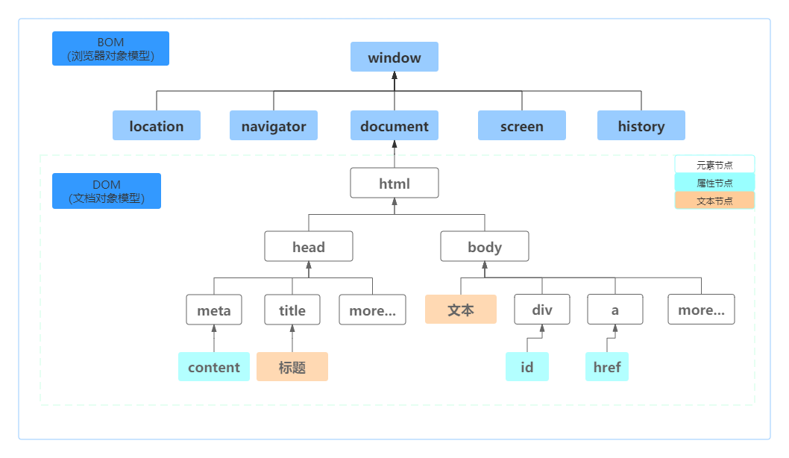
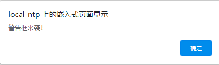
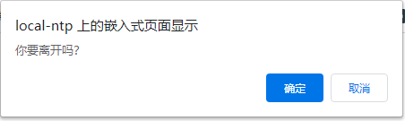
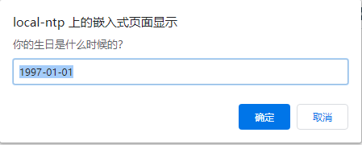

ECMAScript是JavaScript的核心，而`BOM`（浏览器对象模型，Browser Object Model）是在Web中使用JavaScript的核心。

在`BOM`对象中，`window`对象是最顶层对象，在浏览器环境中它是一个`Global`全局对象，其它对象是`window`对象的子对象（属性）。`BOM`主要用于管理浏览器窗口及窗口之间的通讯。下面是`BOM`对象的组成结构。



# window对象

`window`是`BOM`的核心对象，表示浏览器的一个实例。有双重角色，即是通过JavaScript访问浏览器窗口的一个接口，又是`ES`规定的`Global`对象。这意味着在网页中定义的任何一个对象、变量和函数，都以`window`作为其`Global`对象。

```javascript
var age = 29;
function sayAge() {
    console.log(this.age);
}
console.log(window.age);	// 29
sayAge();					// 29
window.sayAge();			// 29
```

如上所示，在全局作用域中定义的变量和函数都被自动归在了`window`对象名下。而`sayAge()`存在于全局作用域中，方法中的`this.age`被映射到`window.age`，因此显示的仍然是正确的结果。

然而，定义的全局变量不能通过`delete`操作符删除，定义在`window`对象上的属性却可以。

`window`除了`location`、`navigator`、`screen`、`history`和`document`外，还有一些属性。

- `window.console`：返回`Console`对象的引用，可以向浏览器控制台输出日志信息。仅用于调试，不应该给用户呈现。（只读）
- `window.frames`：数组对象，列出当前窗口的所有直接子窗口。（只读）
- `window.frameElement`：当前窗口嵌入另一个窗口（嵌入`<object>、<iframe>`），如果当前窗口是顶层，返回`null`。（只读）
- `window.innerHeight`：窗口的视图可见高度（单位：像素），也包括滚动条高度。（只读）
- `window.innerWidth`：窗口的视图可见宽度（单位：像素），也包括滚动条的宽度。（只读）
- `window.length`：当前窗口中包含框架数量。框架为`<frame>`与`<iframe>`。（只读）
- `window.locationbar`：检查`visibility`属性的地址栏对象，用来表示是否可见。（只读）
- `window.localStorage`：访问`Document`源的对象`Storage`；将数据存储在浏览器会话中。类似`sessionStorage`，但数据可长期保留；而页面会话结束时，`sessionStorage`数据会清除。（只读）
- `window.menubar`：检查`visibility`属性的菜单栏对象，用来表示是否可见。（只读）
- `window.outerHeight`：整个浏览器窗口的高度（单位：像素）。（只读）
- `window.outerWidth`：整个浏览器窗口的宽度（单位：像素）。（只读）
- `window.parent`：当前窗口或子窗口的父窗口的引用。（只读）
- `window.personalbar`：检查`visibility`属性的个人工具栏对象，用来表示是否可见。（只读）
- `window.scrollX`：页面水平方向滚动距离（单位：像素），`window.pageXOffset`是别名。（只读）
- `window.scrollY`：页面垂直方向已滚动距离（单位：像素），`window.pageYOffset`是别名。（只读）
- `window.scrollbars`：检查`visibility`属性的滚动条对象，用来表示是否可见。（只读）
- `window.self`：指向当前`window`对象的引用。
- `window.sessionStorage`：允许访问当前源的session`Storage`对象。与`localStorage`相似，不同在于`sessionStorage`在页面会话结束时清除，而`localStorage`没有过期时间。
- `window.top`：窗口层级最顶层窗口的引用。
- `window.window`：`window`对象本身。

介绍了一些`window`的属性，下面我们看一下关于`window`的方法。

### 消息框

`window`有三种消息框：警告框 `alert`、确认框`confirm`和提示框`prompt`。

`window.alert(message)`会显示一个警告对话框，上面显示有指定的文本内容以及一个确定按钮。例如`window.alert("警告框来袭");`的显示如下：



`window.confirm(message)`是一个具有可选消息的模态框。用于验证是否接受用户操作的确认框。

```javascript
var result = window.confirm("你要离开吗？");
if (result) {
	// 按下确定后执行的操作
	console.log("确定");
} else {
	// 按下取消后执行的操作
	console.log("取消");
}
```

运行结果：



`window.prompt(text, value)` 是用于显示文字信息提示用户输入文字的提示框。

- `text`参数为提示用户输入信息的提示内容，可省略。
- `value`参数为文本输入框中的默认值，可省略。

```javascript
var result = window.prompt("你的生日是什么时候的？", "1997-01-01");
if (result == "2011-10-23") {
	alert("你和我生日一样耶！");
}
```

效果如下：



点击确定后，文本输入框中文字被返回。如果为空，则返回一个空字符串。点击取消后，返回`null`。

三个方法都具有堵塞效应，一旦弹出对话框，整个页面就暂停执行，等待用户做出反应。

`window`还有几种方法控制窗口。例如`open()`、`close()`、`stop()`、`moveBy()/moveTo()`、`resizeBy()/resizeTo()`。下面介绍一下他们的功能。

### 窗口打开 & 关闭

`window.open(url, target, features, replace)`方法用于创建新的窗口。

- `url`参数为新窗口加载的`URL`。
- `target`参数为新窗口的名字。每个窗口都有一个`window.name`，这里可以指定窗口用于弹窗，如果不存在，新建窗口。这个名字可用作`<a>`或`<form>`的属性`target`的值。字符串中不能含有空白字符。注意：`target`不是新窗口标题。
- `features`参数为字符串值，内容用逗号分隔，参数不能有空格，例如`width=200,height=100`。

```javascript
var params = 'scrollbars=no,resizable=no,status=no,location=no,toolbar=no,menubar=no,width=0,height=0,left=-1000,top=-1000';
window.open('/', 'test', params);
```

`features`可以设置的值有：

- `left/top`：新窗口的最左边（`left`）与最顶部（`top`）的距离（单位：像素）。新窗口可见，不能设置在屏幕以外。
- `width/height`：新窗口的宽度和高度（单位：像素）。宽高不得小于`100`。
- `outerWidth/outerHeight`：整个浏览器窗口的宽高。（单位：像素）。宽高不得小于`100`。
- `menubar`：是否显示菜单栏。
- `toolbar`：是否显示工具栏。
- `location`是否显示地址栏。
- `personalbar`：是否显示用户安装的工具栏。
- `status`：是否显示状态栏。
- `resizable`：新窗口是否可调整大小。
- `scrollbars`：是否出现滚动条。
- `titlebar`：是否显示标题栏。
- `close`：是否显示关闭按钮。

同源策略，窗口只可访问相同协议下的内容（相同协议:`//domain:port`）。

`window.close()`方法用于关闭当前窗口，一般只用来关闭`window.open()`方法新建的窗口。使用`window.closed`属性来判断窗口是否被关闭。

在当前窗口中关闭窗口：

```javascript
window.close();
```

`window.stop()`方法等同于单击浏览器的停止按钮。由于脚本加载顺序，该方法不能阻止已经包含在加载中的文档，但能阻止图片、新窗口和延迟加载的对象的加载。

```javascript
window.stop();
```

### 窗口移动

`window.moveBy(deltaX, deltaY)`方法根据指定的值，移动当前窗口。

- `deltaX`：窗口在水平方向移动的像素值。
- `deltaY`：窗口在垂直方向移动的像素值。

`window.moveTo(x, y)`方法将当前窗口移动到指定的坐标位置。

- `x`：水平方向移动的横坐标
- `y`：竖直方向移动的纵坐标

`moveBy()`产生的是相对移动，`moveTo()`产生的是绝对移动。

当符合下列情况时，普通网页中的JavaScript无法通过调用该函数来移动浏览器窗口：

1. 当前窗口或标签页不是由`window.open`方法创建的；
2. 当前标签页所在的窗口包含有多个标签页。

`window.resizeBy(xDelta, yDelta)`方法用于调整窗口的大小。

- `xDelta`：窗口水平方向变化的像素值。
- `yDelta`：窗口垂直方向变化的像素值。

`window.resizeTo(aWidth, aHeight)`方法用于调整窗口的大小。

- `aWidth`：整数，表示新的`outerWidth`（单位：像素）。
- `aHeight`：整数，表示新的`outerHeight`（单位：像素）。

`resizeBy()`相对大小方式调整窗口大小，`resizeTo()`绝对大小方式调整窗口大小。

依据下面的规则，普通网页中的JavaScript无法通过调用该函数来调整浏览器窗口大小：

1. 不能设置哪些不是通过`window.open`创建的窗口或`Tab`的大小；
2. 当一个窗口里面包含有一个以上`Tab`时，无法设置窗口的大小。

### 窗口滚动

`window.scroll()`滚动窗口至文档中的特定位置，  
`window.scrollBy()`按窗口指定偏移量滚动文档，  
`window.scrollTo()`滚动窗口至文档中的特定位置。

上面的三个方法的参数都可以是`x-coord`和`y-coord`两个参数，或者`options`一个参数。

- `x-coord`：水平方向像素点横坐标。
- `y-coord`：垂直方向像素点纵坐标。

或者

- `options`：一个`ScrollToOptions`字典。

```javascript
// 在横轴上移动到第100个像素置于窗口左边，在纵轴上移动到第100个像素置于窗口顶部
window.scroll(100, 100);
// 或者
window.scroll({
    top: 100,
    left: 100,
    behavior: 'smooth'
});
```

`options`有三个属性：

- `top`：垂直方向滚动的像素值
- `left`：水平方向滚动的像素值
- `behavior`：滚动方式，`smooth`、`instant`和`auto`，默认值`auto`。

写法也一样，但是功能不一样。`window.scrollBy()`滚动指定的距离，`window.scroll()`滚动至文档中的绝对位置，`window.scrollTo()`实际上和`window.scroll()`方法是相同的。

### 打印

`window.print()`方法打开打印对话框打印当前文档。

在开发项目中，有网页提供打印服务的话，我们可以在页面中设置一个按钮，调用打印功能；但在之前，我们需要判断是否支持打印功能。

```javascript
if (typeof window.print === 'function') {
	// 支持打印功能
	    document.getElementById('printLink').onclick = function () {
        window.print();
    }
}
```

### 弹窗的聚焦/失焦

使用`window.focus()`和`window.blur()`方法可以是窗口获得或失去焦点。

还有一些方法，这里就不介绍了。

# location

`location`对象提供当前窗口中加载的文档有关信息，还提供了一些导航功能。即是`window`对象的属性，也是`document`对象的属性。还可以解析`URL`。下面列出一些`location`的属性。

- `location.href`：完整的`URL`值，允许更新。
- `location.origin`：域名标准形式。包含协议、域名、端口号。
- `location.protocol`：当前`URL`的协议，包括冒号（`:`）。
- `location.host`：域名，包含`:`后面的端口号。
- `location.hostname`：域名，不包括端口号。
- `location.port`：端口号。
- `location.pathname`：`URL`中路径的部分，从`/`开始。
- `location.search`：`URL`参数部分，从问号`?`开始。
- `location.hash`：块标识符部分，从`#`开始。
- `location.username`：`URL`域名前的用户名。
- `location.password`：`URL`域名前的密码。

只有`origin`属性是只读的，其它属性都可写。

我们给出一个网址`http://localhost:8088/mall/?page=1&userid=2#part=top`，使用上面的属性来获取它。

```javascript
location.href;		// http://localhost:8088/mall/?page=1&userid=2#part=top
location.origin;	// http://localhost:8088
location.protocol;	// http:
location.host;		// localhost:8080
location.hostname;	// localhost
location.port;		// 8088
location.pathname;	// /mall/
location.search;	// ?page=1&userid=2
location.hash;		// #part=top
```

然而`location.search`获取的是所有内容，没办法逐个获取每个查询字符串参数。我们可以创建一个函数用以解析并返回包含所有参数的对象。

```javascript
function getQueryArgs() {
    // 取的查询字符串并去掉开头问号
    var qa = (location.search.length > 0 ? location.search.substring(1) : ""),
    // 保存数据的对象
    args = {},
    // 取的每一项
    items = qa.length ? qa.split("&") : [],
    // 每一项和该项的键值
    item = null,name = null,value = null,
    len = items.length;
    // 逐个将每一项添加到args对象中
    for (let i = 0; i < len; i++) {
        item = items[i].split("=");
        name = decodeURIComponent(item[0]);
        value = decodeURIComponent(item[1]);
        if (name.length) {
            args[name] = value;
        }
    }
    return args;
}
```

注意，如果对`location.href`写入新的`URL`地址，浏览器会立刻跳转到这个新地址。

除了上述的属性外，`location`还有几个方法。

### assign

`location.assign(url)`方法接收`URL`字符串来使浏览器立即跳转。而参数无效时会报错。

```javascript
location.assign('http://www.sample.com');
```

而给`window.location`和`location.href`两个属性赋值与调用`assign()`方法效果一样。 

### replace

`location.replace()`与`location.assign()`方法类似，都是跳转到新的`URL`，但不会在浏览历史`History`里面生成新的记录，后退按钮无法回到当前页面。当脚本发现当前是移动设备时，可以使用`replace`跳转到移动版网页。

```javascript
// 跳转到新的网址
location.replace('http://www.sample.com');
```

### reload

`location.reload(boolean)`方法用于重新加载当前页面。当参数为`false`或为空时，浏览器将该网页从本地缓存重新加载并定位到当前位置。参数为`true`时，浏览器向服务器重新请求，并定位到顶部（即`scroillTop===0`）。

```javascript
location.reload();			// 重新加载（有可能从缓存中加载）
location.reload(true);		// 重新加载（从服务器重新加载）
```

在`reload()`之后的代码有可能不会执行，取决于网络延迟或系统资源等因素。最好将`reload()`放在代码最后一行。

`location.toString()`方法返回整个URL字符串，相当于读取`location.href`属性。

# navigator对象

`navigator`用于获取当前浏览器信息。可以使用`window.navigator`属性检索`navigator`对象。

- `appCodeName`：浏览器的代号名称。Mozilla，Netscape 6和IE5的内部名称都是`Mozilla`。（只读）
- `appName`：浏览器的名称。由于兼容性问题，HTML5规范允许该属性返回`Netscape`。（只读）
- `appVersion`：浏览器版本号。一般不与实际版本对应。（只读）
- `connection`：提供`NetworkInformation`对象来获取设备的网络连接信息。（只读）
- `cookieEnabled`：浏览器当前页面是否启用`cookie`。（只读）
- `geolocation`：返回`Geolocation`对象，可访问设备的位置信息。安全考虑会提示授权。（只读）
- `hardwareConcurrency`：浏览器环境拥有的CPU核心数。（只读）
- `keyboard`：返回`Keyboard`对象，提供检索键盘布局图和切换从物理键盘捕获按键的功能。（只读）
- `language`：浏览器主语言。（只读）
- `languages`：访客所使用的语言数组，按优先顺序排列。第一个元素赋给`language`，当值改变时，`window`触发`languagechange`事件。（只读）
- `mimeTypes`：返回`MimeTypeArray`对象，包含可被识别的`MimeType`对象的数组。（只读）
- `maxTouchPoints`：返回当前设备同时支持触摸接触点的最大数量。（只读）
- `onLine`：表示浏览器当前是否联网。（只读）
- `oscpu`：返回客户端计算机的操作系统或使用的CPU。在`Firefox`中可以获取此值。
- `permissions`：返回一个可用于查询或更新某些APIs的权限状态的对象。（只读）
- `platform`：浏览器所在系统平台类型。不确定此值是否有效。（只读）
- `plugins`：返回`PluginArray`对象，包含浏览器安装的所有插件。（只读）
- `product`：当前浏览器产品名称。以兼容为目的，返回`"Gecko"`值。（只读）
- `serviceWorker`：返回`ServiceWorkerContainer`对象，提供对`ServiceWorker`的注册、删除、升级和通信的访问。（只读）
- `storage`：返回单例`StorageManager`对象，用于维护数据的持久化存储，大致确定存储数据的空间。（只读）
- `userAgent`：返回当前浏览器的用户代理。（只读）
- `vendor`：浏览器的供应商。例如`Chrome`中显示`Google Inc.`。
- `vendorSub`：有关供应商的次要信息。

在介绍一下`navigator`对象中的一些方法。

### javaEnabled

`javaEnabled()`表明浏览器是否启用Java。是当前配置文件是否允许使用Java，而不是浏览器是否支持Java。

```javascript
if (window.navigator.javaEnabled()) {
    // 浏览器中Java可用
}
```

### sendBeacon

`sendBeacon(url, data)`是用于通过HTTP将少量数据异步传输到Web服务器。当传输成功时会返回`true`。

- `url`为发送的地址；
- `data`是`ArrayBufferView`、`Blob`、`DOMString`或者`FormData`类型的数据。

下面的例子展示了一个理论的统计代码——卸载事件处理器中尝试通过一个同步的`XMLHttpRequest`向服务器发送数据。这导致了页面卸载被延迟。

```javascript
window.addEventListener('unload', logData, false);
func logData() {
	var client = new XMLHttpRequest();
	client.open("POST", "/log", flase);	// 第三个参数表明是同步的xhr
	client.setRequestHeader("Content-Type", "text/plain;charset=UTF-8");
	client.send(analyticsData);
}
```

这就是`sendBeacon()`方法存在的意义。使用`sendBeacon()`方法会使用户代理在有机会时异步地向服务器发送数据，同时不会延迟页面的卸载或影响下一导航的载入性能。这就解决了提交分析数据时的所有的问题：数据可靠，传输异步并且不会影响下一页面的加载。此外，代码实际上还要比其它技术简单许多！

下面的例子展示了一个理论上的统计代码模式——通过使用`sendBeacon()`方法向服务器发送数据。

```javascript
window.addEventListener('unload', logData, false);
function logData() {
	navigator.sendBeacon("/log", analyticsData);
}
```

### registerProtocolHandler

`registerProtocolHandler(scheme, url, title)`可以让Web站点为自身注册能用于打开或处理特定协议的功能。

- `scheme`：包含站点处理协议的字符串。例如，传入`"sms"`来注册处理`SMS`文本信息链接。
- `url`：处理器的`URL`字符串。应该包含一个`"%"`占位符，会被将要受理的文档的`escaped`链接所替换。这个链接可能是一个真实`URL`，或者是一个电话号码，邮件地址之类的。
- `title`：处理器标题。展示给用户，例如弹出"允许站点处理[scheme]链接吗？"或者在浏览器设置中列出注册的处理器时。

> 处理器的`URL`必须以`http`或者`https`协议标记开头，最好是`https`，以满足一些浏览器出于安全考虑的要求。
> 

# screen对象

`screen`对象表示当前屏幕窗口，往往指当前正被渲染的`window`对象，提供显示设备的信息。用处不大。主要介绍几种属性。

- `availTop`：返回浏览器可用空间在屏幕上边的像素值。
- `availLeft`：返回浏览器可用空间在屏幕左边的像素值。
- `availWidth`：返回浏览器可用空间的水平宽度。
- `availHeight`：返回浏览器可用空间的垂直高度。
- `colorDepth`：返回屏幕的颜色深度（color depth）。根据CSSOM（CSS对象模型）视图，为兼容起见，该值总为24。
- `height`：返回屏幕的高度（单位：像素）。
- `orientation`：返回一个`ScreenOrientation`实例，表示当前屏幕的方向。
- `pixelDepth`：返回屏幕的位深度/色彩深度（bit depth）。根据CSSOM（CSS对象模型）视图，为兼容起见，该值总为24。
- `width`：返回屏幕的宽度（单位：像素）。


# history对象

`history`对象保存着浏览器的历史记录。出于安全考虑，开发人员无法得知用户浏览器的URL。但能通过历史列表实现后退和前进。下面是`history`对象主要的属性。

- `length`：返回当前窗口历史列表中的`URL`数量。
- `scrollRestoration`：允许Web应用程序在历史列表上显示地设置默认滚动恢复行为。
- `state`：`history`堆栈最上层的状态值。

```javascript
const scrollRestoration = history.scrollRestoration;
if (scrollRestoration) {
	// 防止自动恢复页面位置
	history.scrollRestoration = 'manual';
} else {
	// 查看当前页面滚动恢复行为
	console.log('The location on the page is not restored, user will need to scroll manually.');
}
```

还可以通过`history`提供的方法来访问历史记录。

### go

`go()`方法可以在用户的历史记录中任意跳转。传递数值为跳转的页数。

```javascript
history.go(-1);		// 返回一页
history.go(2);		// 前进两页
```

也可以传递历史记录中存在的字符串参数，如果历史记录中不包含传递的字符串，那什么也不做。

```javascript
history.go("sample.com");
```

还可以使用 `back()` 方法后退和使用`forward()`方法前进来代替`go()`方法的功能。

注意，移动到以前访问过的页面时，页面通常是从浏览器缓存之中加载，而不是重新要求服务器发送新的网页。

### pushState

`pushState(state, title, url)`方法能够在不加载页面的情况下在历史中添加一条记录。这个方法接收三个参数：

- `state`参数是状态对象，与`pushState`添加的记录相关联。表示浏览器的`state`属性。
- `title`参数是`document.title`的值，一般设定为`null`。浏览器大多会忽略。
- `url`参数指定新历史记录，用以改变当前`url`。这个参数不能跨域，即协议，域名，端口必须是相同的，如果出现跨域的情况，即会提示。

```javascript
history.pushState({id:1}, null, '?page=1');
```

### replaceState

`replaceState(stateObj, title, url)`方法用来修改`history`对象的当前记录，它是替换当前页面在浏览器的历史记录。假设当前网页是`sample.com/index.html`

```javascript
history.pushState({id:1}, 'title1', '?page=1');	// URL显示为http://sample.com/index.html?page=1
history.pushState({id:2}, 'title2', '?page=2');	// URL显示为http://sample.com/index.html?page=2
history.replaceState({id:3}, 'title3', '?page=3');	// URL显示为http://sample.com/index.html?page=3
history.back();	// URL显示为http://sample.com/index.html?page=1
history.back();	// URL显示为http://sample.com/index.html
history.go(2);	// URL显示为http://sample.com/index.html?page=3
```

### postate事件

当添加或更改历史记录时，会触发`popstate`事件。如果被激活的历史记录条目是通过对`history.pushState()`的调用创建的，或者受到对`history.replaceState()`的调用的影响，`popstate`事件的`state`属性包含历史条目的状态的副本。

需要注意的是调用`history.pushState()`或`history.replaceState()`不会触发`popstate`事件。只有在做出浏览器动作时，才会触发该事件，如用户点击浏览器返回按钮（或者在JavaScript代码中调用`history.back()`或者`history.forward()`方法）。

# 总结

`BOM`是以`window`对象为依托的浏览器对象模型，它将浏览器当作一个对象，用于与浏览器窗口进行交互。`window`对象还是`Global`对象，全局变量和函数都是它的属性和方法，且所有原生的构造函数及其它函数也在它的命名空间下。但每个浏览器厂商都有自己的`BOM`实现，因此兼容性较差。