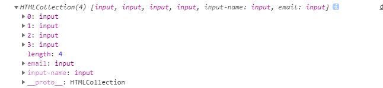
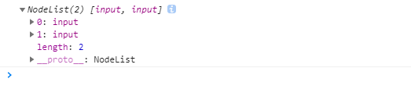
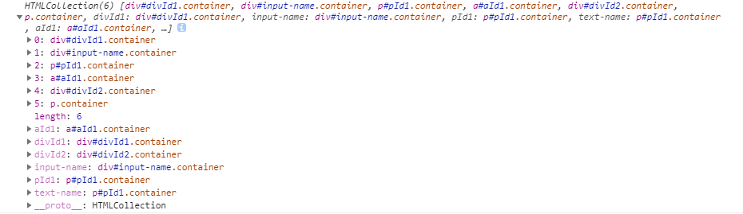
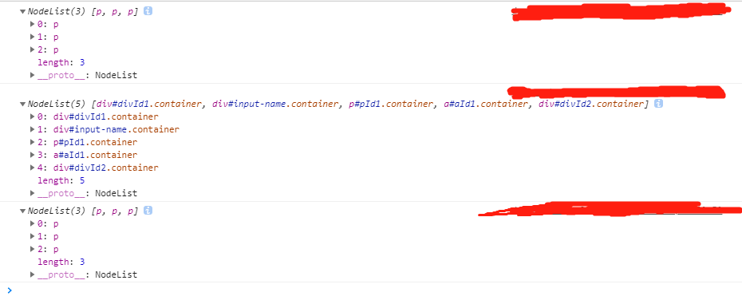

# 概述

DOM全称Document Object Model，即文档对象模型。是HTML和XML文档的编程接口，DOM将文档（HTML或XML）描绘成一个多节点构成的结构。使用JavaScript可以改变文档的结构、样式和内容。

`W3C DOM`由以下三部分组成：

- `核心DOM` - 针对任何结构化文档的标准模型。
- `XML DOM` - 针对`XML`文档的标准模型。
- `HTML DOM` - 针对`HTML`文档的标准模型。

# 分类

DOM目前有三种级别：

- **DOM Level 1**：1998年10月成为W3C的推荐标准，主要定义HTML和XML文档的底层结构。
- **DOM Level 2**： 在DOM1基础上扩充了方法和属性，引入了与文档更多的交互能力。主要包括DOM视图、DOM样式、DOM事件、DOM遍历和范围等。 
- **DOM Level 3**：引入了将XML文档加载和序列化的方法。提供了验证文档有效性的能力。


# 节点树

以下面的HTML为例：

```html
<html>
<head>
    <meta charset="UTF-8">
    <title>节点树</title>
</head>
<body>
    <div>测试块</div>
    <a href="/about">链接</a>
</body>
</html>
```

浏览器会将HTML文档解析成节点并组成节点树。


HTML DOM中通过不同类型节点来表示， `Document`是每个文档的根节点。这里的`document`只有一个`<html>`子节点，称之为文档元素(`Element`)。`Element`表示元素类型的节点，`Text`表示文本类型的节点。

# 节点类型

DOM 的最小组成单位叫做节点（node）。上面的节点树中，每一段都由不同类型的节点组成。节点的类型有如下几种：

- `Node`：浏览器提供的原生节点，下面的节点都继承它。
- `Document`：整个文档树的顶层节点
- `DocumentType`：`doctype`标签（比如`<!DOCTYPE html>`）。
- `Element`：网页的各种HTML标签（比如`<body>`、`<a>`等）。
- `Attr`：网页元素的属性（比如`class="right"`）。
- `Text`：标签之间或标签包含的文本。
- `Comment`：注释。
- `CDATASection`：`CDATA`区域，与`Comment`类型类似。
- `DocumentFragment`：文档的片段。

## Node

DOM1中定义了一个`Node`接口，JavaScript中所有节点类型都继承自`Node`类型，因此属性和方法都相同。

在`Node`类型中定义了`nodeType`属性来表明节点的类型，由12个常量表示。任何节点必居其一：

- `Node.ELEMENT_NODE`：数值1，对应元素节点`Element`。
- `Node.ATTRIBUTE_NODE`：数值2，对应属性节点`Attr`。
- `Node.TEXT_NODE`：数值3，对应文本节点`Text`。
- `Node.CDATA_SECTION_NODE`：数值4，对应文档中CDATA部（不会由解析器解析的文本）。
- `Node.ENTITY_REFERENCE_NODE`：数值5，对应实体引用。
- `Node.ENTITY_NODE`：数值6，对应实体类型`Entity`。
- `Node.PROCESSING_INSTRUCTION_NODE`：数值7，对应处理指令。
- `Node.COMMENT_NODE`：数值8，对应注释节点`Comment`。
- `Node.DOCUMENT_NODE`：数值9，对应文档节点`Document`。
- `Node.DOCUMENT_TYPE_NODE`：数值10，对应文档类型节点`DocumentType`。
- `Node.DOCUMENT_FRAGMENT_NODE`：数值11，对应文档片段节点`DocumentFragment`。
- `Node.NOTATION_NODE`：数值12，对应DTD中声明的符号。

使用`nodeType`可以很容易确定节点类型，`IE`中没有公开`Node`类型的构造函数，使用`Node.ELEMENT_NODE`比较会导致错误。为了兼容`IE`，可以使用数值进行比较：

```javascript
if (onenode.nodeType == Node.ELEMENT_NODE) {    // 在IE中无效
    console.log("The Node is an Element.");
}
// 或者
if (oneNode.nodeType == 1) {    // 适用所有浏览器
    console.log("The Node is an Element.");
}
```

`nodeName`返回节点的标签名

```javascript
var div = document.getElementByTagName('div')[0];
console.log(onenode.nodeName);    // DIV
```

`nodeValue`返回字符串，表示节点的文本值，可读写。

```javascript
var div = document.getElementByTagName('div')[0];
console.log(onenode.nodeValue);    // null
```

### 节点关系

文档中节点都存在着一定的关系，节点之间的关系可以使用类似人类家族关系的形式描述。如，在HTML文档中，可以把`<html>`看作是`<body>`的父元素；相对的，`<body>`也就是`<html>`的子元素；而作为`<body>`同级的`<head>`两者之间的关系为兄弟（姐妹）关系。

`Node`中提供了几种节点遍历的属性：`parentNode`、`childNodes`、`firstNode/lastNode`、`previousSibling/nextSibling`、`ownerDocument`。

## Document

JavaScript通过`Document`类型表示文档。浏览器中的`document`对象是`HTMLDocument`的一个实例，表示整个HTML页面。`Document`节点具有以下特征：

- `nodeType`为`Node.DOCUMENT_NODE`，值为9。
- `nodeName`的值为`#document`。
- `nodeValue`的值为`null`。
- `parentNode`的值为`null`。
- `ownerDocument`的值为`null`。
- 其子结点可能是一个`DocumentType`、`Element`、`ProcessingInstruction`或`Comment`。

`document`对象还有一些属性来表示网页的一些信息：

- `title`：取得当前页面的标题，也可以修改当前页面的标题并反映在浏览器的标题栏中。但不会改变`<title>`元素。
- `URL`：包含页面完整的`URL`。
- `domain`：只包含页面的域名。
- `referrer`：保存着链接到当前页面的那个页面的`URL`。没有来源页面的情况下，可能包含空字符串。

`URL`与`domain`属性是相互关联的。

## Element

Element类型用于表现XML或HTML元素，提供对元素标签名、子节点及特性的访问。例如`<body>`和`<div>`等。`Element`节点具有以下特征：

- `nodeType`为`Node.ELEMENT_NODE`，值为1。
- `nodeName`的值为元素的标签名。
- `nodeValue`的值为`null`。
- `parentNode`可能是`Document`或`Element`。
- 其子节点可能是`Element`、`Text`、`Comment`、`ProcessingInstruction`、`CDATASection`或`EntityReference`。

要访问元素的标签名，可以使用`nodeName`属性，也可以使用`tagName`属性；这两个属性会返回相同值。

获取`<div id="divId"></div>`的标签名：

```javascript
var div = document.getElementById("divId");
console.log(div.tagName);    // DIV
console.log(div.tagName == div.nodeName);    // true
```

### 特性和属性

所有HTML元素都由`HTMLElement`类型表示，不能直接通过这个类型，也是通过它的子类型来表示。`HTMLElement`类型直接继承自`Element`并添加了一些属性。每个HTML元素中的特性（例如`<div id="d1" title="附加信息" lang="en" class="container">`中的`id`、`class`等）会自动变成DOM对象的属性（`class`特性与`className`属性对应）。这些都可以通过`div.id`等获取并赋值。

一个元素中的`id`等是标准的特性，但也有非标准的特性不能使用`div.id`方式获取。那么要用什么方法来访问非特性。

`DOM`主要提供了几个方法用于对任何特性进行操作，分别是：

- `hasAttribute(qualifiedName: string)`，检查`qualifiedName`这个特性是否存在。
- `getAttribute(qualifiedName: string)`，获取`qualifiedName`这个特性值，如果不存在，则返回`null`。
- `setAttribute(qualifiedName: string, value: string)`，设置`qualifiedName`这个特性的值为`value`。设置的特性名会被同意转换为小写形式。
- `removeAttribute(qualifiedName: string)`，移除`qualifiedName`这个特性。

```html
<div id="d1" title="附加信息" lang="en" class="container main" plug-add="添加的非标准的特性">
```

以上面的HTML为例，使用这几种方法。

```javascript
var div = document.getElementById('d1');
div.getAttribute('title');    // 附加信息
div.hasAttribute('plug-add'); // true
div.setAttribute('title', '修改附加信息');
div.removeAttribute('plug-add');
```

有两类特殊的特性，虽有对应的属性名，但属性的值与`getAttribute()`返回的值并不相同。

第一类特性就是`style`，用于通过CSS为元素指定样式。通过`getAttribute()`返回的`style`中包含的是CSS文本，而通过属性返回的是一个对象。

第二类特性是`onclick`这样的事件处理。如果通过`getAttribute()`返回的是相应代码的字符串。而访问`onclick`属性返回的是JavaScript函数（如果未指定相应特性，返回的是`null`）。

### attributes属性

`Element`类型的`attributes`属性返回该元素所有属性节点的一个集合，该集合是一个"动态"的`NamedNodeMap`对象。`NamedNodeMap`对象拥有下列方法。

- `getNamedItem(name)`：返回`nodeName`属性等于`name`的节点。
- `removeNamedItem(name)`：从列表中移除`nodeName`属性等于`name`的节点。
- `setNamedItem(node)`：向列表中添加节点，以节点的`nodeName`属性为索引。
- `item(pos)`：返回位于数字`pos`位置处的节点。

`attributes`属性包含一系列节点，在节点中`节点名称-nodeName 节点值-nodeValue`。

```javascript
var id = element.attributes.getNamedItem('id').nodeValue;
// 方括号语法
var id = element.attributes['id'].nodeValue;
// 属性名引用
var id = element.attributes.id;
// 如果知道特性名所在的下标，也可以使用下标引用，假设id特性名所在下标为0.
var id = element.attributes[0];
```

而`removeNamedItem()`方法与`removeAttribute()`方法都是将给定名称的特性删除，唯一区别就是`removeAttribute()`没有返回值，`removeNamedItem()`返回被删除特性的`Attr`节点。

```javascript
var oldAttr = element.attributes.removeNamedItem('id');
```

`setNamedItem()`方法为`Element`添加一个新特性：

```javascript
element.attributes.setNamedItem(newAttr);
```

一般情况下`getAttribute()`、`removeAttribute()`和`setAttribute()`方法就够使用了，但想要遍历元素的特性，`attributes`属性倒是比较方便。下面展示如果迭代元素中每一个特性并将它们以`name="value" name="value"`这样的字符串格式。

```javascript
function listAttributes(element) {
    var pairs = new Array(),
        attrName,
        attrValue,
        i,
        len;
    if (element.hasAttributes()) {
        var attrs = element.attributes;
        for (i = 0, len = element.attributes.length; i < len; i++) {
            attrName = attrs[i].nodeName;
            attrValue = attrs[i].nodeValue;
            pairs.push(attrName + "=\"" + attrValue + "\"");
        }
    }
    return pairs.join(" ");
}
```

### classList

`className`属性用于操作类名，但`className`是一个字符串，修改后要设置整个字符串的值。

HTML5扩展了`classList`属性实现类名的操作。该属性返回`DOMTokenList`集合。定义了几个方法：

- `add(value)`：添加字符串到列表中。如果存在就不添加。
- `contains(value)`：指定值是否存在于列表中，存在则为`true`，否则为`false`。
- `remove(value)`：从列表中删除指定值。
- `toggle(value)`：列表中存在指定值，删除它；没有给定值，添加它。

## Attr

`Attr`类型在`DOM`表示元素特性。特性是位于元素`attributes`属性中的节点。具有下列特征：

- `nodeType`为`Node.TEXT_NODE`，值为3。
- `nodeName`的值是特性的名称。
- `nodeValue`的值是特性的名称。
- `parentNode`的值为`null`。
- 在HTML中不支持子节点（没有子节点）。
- 在XML中子节点可以是`Text`或`EntityReference`。

特性节点不被认为是`DOM`文档树的一部分。最常使用`getAttrubute()`、`setAttribute()`和`removeAttribute()`方法，很少直接引用特性节点。

`Attr`对象有3个属性：

- `name`，特性名称，与`nodeName`的值相同。
- `value`，特性值，与`nodeValue`的值相同。
- `specified`，布尔值，用于区分特性在代码中是指定的还是默认的。

如果要为元素添加特性，可以使用`document.createAttribute(localName)`方法，创建名为`localName`的特性节点。例如，要为元素添加`align`特性，可以使用下列代码：

```javascript
var attr = document.createAttribute("align");
attr.value = "left";
element.setAttributeNode(attr);
alert(element.attributes["align"].value); //"left"
alert(element.getAttributeNode("align").value); //"left"
alert(element.getAttribute("align")); //"left"
```

## Text

文本节点由`Text`类型表示，包含的是可以照字面解释的纯文本内容。纯文本中可以包含转义后的HTML字符，但不能包含HTML代码。`Text`节点具有以下特征：

- `nodeType`为`Node.TEXT_NODE`，值为3。
- `nodeName`的值为`#text`。
- `nodeValue`的值为节点所包含的文本。
- `parentNode`是一个`Element`。
- 不支持子节点（没有子节点）。

可以通过`nodeValue`属性或`data`属性访问`Text`节点中包含的文本，这两个属性中包含的值相同。对`nodeValue`的修改也会通过`data`反映出来，反之亦然。使用下列方法可以操作节点中的文本。

- `appendData(text)`：将`text`添加到节点的末尾。
- `deleteData(offset, count)`：从`offset`指定位置开始删除`count`个字符。
- `insertData(offset, text)`：在`offset`指定位置插入`text`。
- `replaceData(offset, count, text)`：用`text`替换从`offset`指定的位置开始到`offset`+`count`位置处的文本。
- `splitText(offset)`：从`offset`指定的位置将当前文本节点分成两个文本节点。
- `substringData(offset, count)`：提取从`offset`指定的位置开始到`offset`+`count`为止处的字符串。

除了这些方法外，文本节点还有一个`length`属性，保存着节点中字符的数目。而且，`nodeValue.length`和`data.length`中也保存着同样的值。

修改文本节点的结果会立即得到反映。因此字符串会经过HTML（或XML，取决于文档类型）编码。

使用`document.createTextNode()`可以创建文本节点，在`DOM创建`中会讲述它。

## Comment

注释在DOM中是通过`Comment`类型来表示的。`Comment`节点具有下列特征：

- `nodeType`为Node.COMMENT_NODE，数值为8。
- `nodeName`的值为`#comment`。
- `nodeValue`的值是注释的内容。
- `parentNode`可能是`Document`或`Element`。
- 不支持子节点（没有子节点）。

`Comment`类型与`Text`类型继承自相同的基类，因此它拥有除`splitText()`之外的所有字符串操作方法。与`Text`类型相似，也可以通过`nodeValue`或`data`属性取得注释的内容。

获取`<div id="divId"><!--A comment--></div>`代码中的注释：

```javascript
var div = document.getElementById("divId");
var comment = div.firstChild;
console.log(comment.data);    // A comment
```

如果想创建注释节点，可以使用`document.createComment(data)`方法创建。

```javascript
var comment = document.createComment("Create a comment node");
```

浏览器不会识别位于`</html>`标签后面的注释。一定保证访问的注释节点位于`<html></html>`之间。

## CDATASection

`CDATASection`类型只针对基于XML文档，表示的是`CDATA`区域。与`Comment`类似，`CDATASection`类型继承自`Text`类型，因此拥有除`splitText()`之外的所有字符串操作方法。`CDATASection`节点具有以下特征：

- `nodeType`为`CDATA_SECTION_NODE`，值为4。
- `nodeName`的值为`#cdata-section`。
- `nodeValue`的值是`CDATA`区域中的内容。
- `parentNode`可能是`Document`或`Element`。
- 不支持子节点（没有子节点）。

`CDATA`区域只会出现在XML文档中，因此多数浏览器都会把`CDATA`区域错误地解析为`Comment`或`Element`。以下面的代码为例：

```html
<div id="divId"><![CDATA[This is content.]]></div>
```

这个例子中的`<div>`元素应该包含一个`CDATASection`节点。可是，四大主流浏览器无一能够这样解析它。即使对于有效的XHTML页面，浏览器也没有正确地支持嵌入的`CDATA`区域。

在真正的XML文档中，可以使用`document.createCDataSection()`来创建`CDATA`区域，只需为其传入节点的内容即可。

## DocumentType

`DocumentType`类型在Web浏览器中并不常用。`DocumentType`包含着与文档有关的`doctype`有关的所有信息，它具有下列特征：

- `nodeType`为`Node.DOCUMENT_TYPE_NODE`，值为10。
- `nodeName`的值为`doctype`的名称。
- `nodeValue`的值为`null`。
- `parentNode`是`Document`类型。
- 没有子节点。

`DOM 1级`规定的`DocumentType`对象不能动态创建，只通过解析文档代码的方式来创建。支持`DocumentType`的浏览器会把它保存在`document.doctype`中。

`DocumentType`对象在`DOM 1级`中有3个属性：

- `DocumentType.name`，文档类型的名称。
- `DocumentType.entities`，文档类型描述的实体`NamedNodeMap`对象。
- `DocumentType.notations`，文档类型描述的符号`NamedNodeMap`对象。

浏览器中一般是`HTML`或`XHTML`类型的文档。所以`entities`和`notations`都是空列表。只有`name`属性有用。

```html
<!DOCTYPE HTML PUBLIC "-//W3C//DTD HTML 4.01//EN"
"http://www.w3.org/TR/html4/strict.dtd">
```

在这里，`DocumentType`中的`name`属性保存的就是`HTML`。

```javascript
console.log(document.doctype.name);    // HTML
```

## DocumentFragment

`DocumentFragment`是文档片段，一种"轻量级"文档，可以包含和控制节点，但不像完整文档那样占用额外资源。可以将它作为"仓库"使用。具有下列特征：

- `nodeType`为`Node.DOCUMENT_FRAGMENT_NODE`，值为11。
- `nodeName`的值为`#document-fragment`。
- `nodeValue`的值为`null`。
- `parentNode`的值为`null`。
- 子节点可以是`Element`、`ProcessingInstruction`、`Comment`、`Text`、`CDATASection`或`EntityReference`。

使用`document.createDocumentFragment()`方法创建文档片段，如下所示：

```javascript
var fragment = document.createDocumentFragment();
```

继承了`Node`的所有方法，用于执行针对文档的`DOM`操作。可以通过`appendChild()`或`insertBefore()`添加到文档中相应位置，但本身不会成为文档树的一部分。来看下面的HTML 示例代码：

```html
<ul id="ulId"></ul>
```

我们给`<ul id=ulId></ul>`添加3个列表项。可以使用文档片段来保存创建的列表项，一次性将它们添加到文档中，避免浏览器反复渲染。

```javascript
var fragment = document.createDocumentFragment();
var ul = document.getElementById("myList");
var li = null;
for (var i=0; i < 3; i++){
    li = document.createElement("li");
    li.appendChild(document.createTextNode("Item" + (i+1)));
    fragment.appendChild(li);
}
ul.appendChild(fragment);
```

# DOM查找

现在有一段`html`页面模板

```html
...
<style>
    .container {
        background-color: blue;
        width: 55%;
        height: 55%;
    }
</style>
...

<div class="container" id="divId1">Div Text One</div>
<p class="container" id="pId1">P Text One</p>
<a class="container" id="aId1">A Text One</a>
<div class="container" id="divId2">Div Text Two</div>
<form id="primary-form" action="#" method="get">
    <p>UserName: <input type="text" name="input-name"></p>
    <p class="container">NickName: <input type="text" name="input-name"></p>
    <p>Email: <input type="text" name="input-email"></p>
    <input type="submit" value="Submit">
</form>
...
```

在该模板中，我们想要获取这些标签元素，可以使用`document`对象获取的几种方法：

### id选择器

`getElementById(elementId: string): HTMLElement | null;`

该方法返回匹配指定`id`属性的元素节点，如果不存在，则返回`null`。

下面通过`id`选择器来获取`id`为`aId1`的元素：

```javascript
let div = document.getElementById("aId1");
console.log(div);    // <a class="container" id="aId1">A Text One</a>
```

注意：严格匹配，包括大小写。如果写成`document.getElementById("aid1")`，输出为`null`。

### 标签选择器

`getElementsByTagName(qualifiedName: string): HTMLCollectionOf<Element>;`

该方法返回匹配指定HTML标签名的元素列表。返回的是一个类似数组对象（`HTMLCollection`实例），可以实时反映HTML文档的变化，如果不存在，则返回`null`。

```javascript
let inputs = document.getElementsByTagName('input');
console.log(inputs);    /* HTMLCollection(4) [input, input, input, input, input-name: input, email: input]*/
```



这个对象可以使用`length`属性获取元素数量，使用数组语法或`item()`方法来访问HTMLCollection对象中的项。

```javascript
inputs.length;                // 输出p标签的数量
inputs[0].id;                  // 输出p标签集合中第一个元素的id特性的名称
inputs.item(0).className;      // 输出p标签接种中第一个元素的class特性的名称
```

还可以通过`namedItem()`方法根据元素的`name`特性获取集合中的项。

```javascript
var nameOfInput = inputs.namedItem("input-name");
```

也可以使用方括号语法来访问：

```javascript
var nameOfInput = inputs["input-name"];
```

要想取得文档中的所有元素，可以向getElementsByTagName()中传入`"*"`，表示"全部"。

```javascript
var allElements = document.getElementsByTagName("*");
```

### name选择器

`getElementsByName(elementName: string): NodeListOf<HTMLElement>;`

该方法返回匹配`name`属性的所有元素，返回值是`NodeList`，如果不存在，则返回`null`。

```javascript
var names = document.getElementsByName("input-name");
console.log(names);
```



注意，这个选择器在不同浏览器的效果是不同的，比如在IE和Opera浏览器下，这个方法也会返回`id`属性为这个值的元素。在使用的时候，应该小心使用，尽量保证`name`不和其它元素的`id`一致。

### 类选择器

`getElementsByClassName(classNames: string): HTMLCollectionOf<Element>;`是HTML5中添加的方法。

该方法返回匹配`class`属性的所有元素，返回值是`HTMLCollection`，如果不存在，则返回`null`。

```javascript
// 获取所有class中同时包含'red'和'test'的元素
var classes = document.getElementsByClassName("container");
console.log(classes);
```



可以接收包含一个或多个类名的字符串，传入的多个类名的先后顺序不重要。

## Selectors API

W3C发起指定的标准，可使浏览器支持CSS查询。Selectors API的核心是两个方法：`querySelector()`和`querySelectorAll()`。兼容的浏览器中通过`Document`及`Element`节点类型的实例进行调用。

### querySelector()方法

`querySelector<E extends Element = Element>(selectors: string): E | null;`

该方法返回匹配指定选择符的第一个`HTMLElement`元素，如果不存在，则返回`null`。传入的`selectors`必须是有效的CSS选择器；如果选择器不合法，会引发`SYNTAX_ERR`异常。

```javascript
document.querySelector("#aId1");    // 取得Id为"aId1"的元素
document.querySelector("p");    // 取得p元素
document.querySelector(".container");    // 取得类为"container"的第一个元素
document.querySelector("..selector");    // 引发'SYNTAX_ERR'异常(Uncaught DOMException:Failed to execute 'querySelector on 'Document': '..selector' is not a valid selector. 意思是'..selector'不是一个有效的选择。)
```

`Document`和`Element`都可以调用`querySelector()`方法，只是`Document`会在文档元素的范围内查找匹配的元素；`Element`只会在该元素后代元素的范围内查找匹配的元素。

### querySelectorAll()方法

`querySelectorAll<E extends Element = Element>(selectors: string): NodeListOf<E>;`

该方法返回匹配指定选择符的元素列表，返回的对象是`NodeList`，如果不存在，则返回空的`NodeList`。传入的`selectors`必须是有效的CSS选择器；如果选择器不合法，会引发`SYNTAX_ERR`异常。

```javascript
// 获取id为"primary-form"中所有<p>元素
document.getElementById("primary-form").querySelectorAll("p");
// 获取类为"container"的所有元素
document.querySelectorAll(".container");
// 获取所有<form>元素中的所有<p>元素
document.querySelectorAll("form p");
```



### matches()方法

Selectors API Level 2规范为`Element`类型新增了一个方法：

`matches(selectors: string): boolean;`

该方法判断当前DOM节点是否能完全匹配指定选择符，如果匹配成功，返回`true`；匹配失败，返回`false`。

```javascript
var elems = document.getElementsByTagName('p');
for (var i = 0; i < elems.length; i++) {
    // 获取匹配'container'类选择符的dom节点 
    if (elems.item(i).matches('.container')) {
        console.log('The ' + elems.item(i).textContent + ' is container');
    }
}
/*The P Text One is container
The NickName:  is container*/
```

注意，有些供应商会有自己实验性方法在`matchesSelector()`方法之前加些前缀。如果想使用这种方法，可以编写一个包装函数。

```javascript
function matchesSelector(element, selector){
    if (element.matches) {
        // 标准方法
        return element.matches(selector);
    } else if (element.matchesSelector){
        return element.matchesSelector(selector);
    } else if (element.msMatchesSelector){      // IE 9+支持
        return element.msMatchesSelector(selector);
    } else if (element.mozMatchesSelector){     // Firefox 3.6+支持 
        return element.mozMatchesSelector(selector);
    } else if (element.webkitMatchesSelector){  // Safari 5+和Chrome支持
        return element.webkitMatchesSelector(selector);
    } else {
        throw new Error("Not supported.");
    }
}
if (matchesSelector(document.body, ".container")){
    //执行操作
}
```

当有的浏览器不支持`Element.matches()`或`Element.matchesSelector()`，但支持`document.querySelectorAll()`方法，可以有替代方案：

```javascript
if (!Element.prototype.matches) {
    Element.prototype.matches = 
        Element.prototype.matchesSelector || 
        Element.prototype.mozMatchesSelector ||
        Element.prototype.msMatchesSelector || 
        Element.prototype.oMatchesSelector || 
        Element.prototype.webkitMatchesSelector ||
        function(s) {
            var matches = (this.document || this.ownerDocument).querySelectorAll(s),
                i = matches.length;
            while (--i >= 0 && matches.item(i) !== this) {}
            return i > -1;            
        };
}
```

# DOM遍历

`Node`节点提供了几种属性，用于访问DOM节点。

### parentNode

`node.parentNode`属性用于返回指定节点的父节点。除`document`外，所有节点都有父节点，`document`对象的父节点为`null`。示例如下：

```javascript
document.getElementById('divId2').parentNode;
```

### childNodes

`node.childNodes`属性用于返回指定节点的子结点的`Node`对象集合。示例如下：

```javascript
document.getElementById('primary-form').childNodes;
```

### firstChild/lastChild

`node.firstChild`属性用于访问第一个子节点；`node.lastChild`属性用于访问最后一个子节点。如果要访问的节点不存在，则返回`null`。示例如下：

```javascript
document.getElementById('primary-form').firstChild
document.getElementById('primary-form').lastChild;
```

### previousSibling/nextSibling

`node.previousSibling`属性用于访问之前的同级节点；`node.nextSibling`属性用于访问之后的同级节点。具有相同父节点为同级节点，之前或之后表示它们在文档中出现的顺序。实例如下：

```javascript
document.getElementById('divId2').previousSibling;
document.getElementById('divId2').nextSibling;
```

### ownerDocument

`node.ownerDocument`属性用于返回元素的根节点，即：文档对象（`Document`）。通过这个属性，我们能够直接访问根节点而不必层层遍历。实例如下：

```javascript
document.getElementById('divId2').ownerDocument;
```

## Element Traversal

Element Traversal API 为DOM元素添加了以下5个属性。

- `childElementCount`：返回子元素（不包括文本节点和注释）的格式。
- `firstElementChild`：指向第一个子元素；`firstChild`的元素版。
- `lastElementChild`：指向最后一个子元素；`lastChild`的元素版。
- `previousElementSibling`：指向前一个同辈元素；`previousSibling`的元素版。
- `nextElementSibling`：指向后一个同辈元素；`nextSibling`的元素版。

支持的浏览器为DOM元素添加了这些属性，利用这些元素不必担心空白文档节点，从而可以更方便地查找DOM元素。

# DOM操作

因为关系节点都是只读的，所以DOM提供了一些操作节点的方法。

### appendChild()

`node.appendChild(newChild)`方法用于向`childNodes`列表的末尾添加一个节点并返回新增的节点。

```javascript
var returnedNode = div.appendChild(newNode);
```

### insertBefore()

`node.insertBefore(newChild, refChild)`方法会在指定的参照节点`refChild`之前插入新节点`newChild`。插入节点后，被插入的节点会变成参照节点的前一个同胞节点（`previousSibling`），同时被方法返回。如果`refChild`是`null`，则`insertBefore()`与`appendChild()`执行相同的操作。

```javascript
var returnedNode = div.insertBefore(newNode, div.lastChild);
```

### replaceChild()

`node.replaceChild(newChild,  oldChild)`方法将要替换的节点`oldChild`移除，并将要插入的节点`newChild`插入并占据其位置。实例如下：

```javascript
document.getElementById('divId2').replaceChild(newnode, oldnode);
```

在使用`replaceChild()`插入一个节点时，该节点的所有关系指针都会从被它替换的节点复制过来。被替换的节点仍然还在文档中，但它在文档中已经没有自己的位置了。

### removeChild()

而如果只想移除而非替换节点，可以使用`node.removeChild(oldChild)`方法，该方法将要移除的节点`oldChild`移除，并返回移除的节点。

```javascript
var removedNode = node.removeChild(node.firstChild);
```

与使用`replaceChild()`方法一样，通过`removeChild()`移除的节点仍然为文档所有，只不过在文档中已经没有了自己的位置。

上面介绍的四种方法操作的都是某个节点的子节点，要使用这几个方法必须先取得父节点。另外，并不是所有类型的节点都有子节点，如果在不支持子节点的节点上调用这些方法，将会导致错误发生。

# DOM创建

DOM节点创建最常用的便是`document.createElement()`和`document.createTextNode()`方法。

### createElement()

`document.createElement(tagName)`方法根据指定`tagName`标签名创建新元素节点，返回一个`HTMLElement`对象。标签名在HTML文档中不区分大小写，在XML（包括XHTML）文档中区分大小写。例如，创建一个`<p>`元素。

```javascript
var p = document.createElement('p');
```

在使用`createElement()`方法创建新元素的同时，也为新元素设置了`ownerDocument`属性。

### createTextNode()

`document.createTextNode(data: string)`方法根据指定`data`文本创建新文本节点。作为参数的文本按照HTML或XML的格式进行编码。

```javascript
var textNode = document.createTextNode("<h4>Hello </h4> world!");
```

在创建新文本节点的同时，也会为其设置`ownerDocument`属性。

### cloneNode()

`node.cloneNode(deep)`方法用于对调用这个方法的节点创建一个完全相同的副本。`deep`是布尔值，设置是否执行深复制。默认为`false`，执行浅复制（只复制节点本身）；当为`true`时，执行深复制（复制节点及其整个子节点树）。

```javascript
var node = document.getElementById('divId2').lastChild.cloneNode(true);
```

这些用于创建节点和复制节点的方法，创建或复制的节点并不会出现在文档中，需要通过`appendChild()`、`insertBefore()`或`replaceChild()`将它添加到文档中。

```javascript
document.getElementById('divId2').appendChild(node);
```

不管是`createElement()`、`createTextNode()`或者`cloneNode()`三种的哪种方法，创建新的节点都未被添加到文档树中。可以使用上面介绍的`appendChild()`、`insertBefore()`或`replaceChild()`方法将新节点添加到文档树中。

一旦将节点添加到文档树中，浏览器就会立即呈现。

一旦使用`appendChild()`等方法插入相邻的同胞文本节点时，会导致相邻文本节点混乱。

而在一个包含两个或多个文本节点的父元素上调用`normalize()`方法，就会将所有文本节点合并成一个节点。

```javascript
var element = document.createElement("div");
element.className = "message";
var textNode1 = document.createTextNode("Hello, ");
element.appendChild(textNode1);
var textNode2 = document.createTextNode("Pandora!");
element.appendChild(textNode2);
document.body.appendChild(element);
console.log(element.childNodes.length);  // 2
element.normalize();
console.log(element.childNodes.length);  // 1
console.log(element.firstChild.nodeValue);  // "Hello, Pandora!"
```

浏览器在解析文档时永远不会创建相邻的文本节点。这种情况只会作为执行DOM操作的结果出现。

还有一个与`normalize()`相反的方法` splitText(offset)`：将一个文本节点分成两个文本节点。

```javascript
var element = document.createElement("div");
element.className = "message";
var textNode = document.createTextNode("Hello, Pandora!");
element.appendChild(textNode);
document.body.appendChild(element);
var newNode = element.firstChild.splitText(6);
console.log(element.firstChild.nodeValue);  // "Hello,"
console.log(newNode.nodeValue);  // " Pandora!"
console.log(element.childNodes.length);  // 2
```